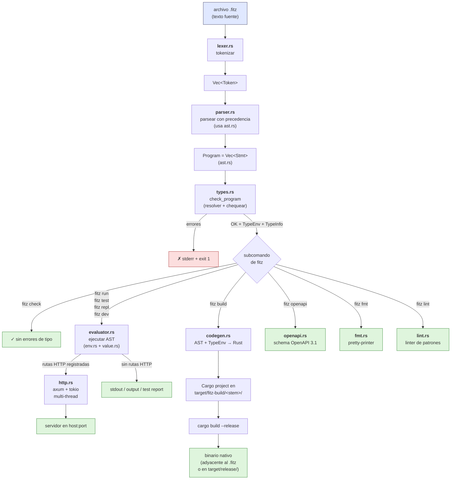

# Arquitectura del compilador

Este documento describe cómo está organizado el código en [src/](../src/) y
qué le pasa a un programa Fitz desde que es texto en un archivo `.fitz`
hasta que produce output (un `print`, una respuesta HTTP, un binario
nativo, o un test reportado). Es la referencia para entender el
compilador desde adentro; para aprender el lenguaje desde afuera, ver
[docs/guide.md](guide.md).

> **Estado**: este doc cubre hasta el cierre de **Fase 9.z entera**
> (formatter + test + dev + repl + lint, mayo 2026). Refresh
> sincronizado con el estado del repo. Cuando avancemos en Fase 9.w
> (stack web first-class) o las features de Fase 10+, este doc se
> actualiza junto.

## Pipeline en una imagen



ASCII fallback (mismo diagrama, sin colores, para terminales y editores
que no rendericen mermaid):

```
                    archivo .fitz
                          │
                          ▼
                    ┌──────────┐
                    │ lexer.rs │   tokenizar
                    └────┬─────┘
                         ▼
                    Vec<Token>
                         │
                         ▼
                    ┌───────────┐
                    │ parser.rs │  precedencia + estructura
                    │  (ast.rs) │  (Program = Vec<Stmt>)
                    └────┬──────┘
                         ▼
                       Program
                         │
                         ▼
                    ┌──────────┐
                    │ types.rs │  resolver + check
                    └────┬─────┘
                         │
       ┌─────────┬───────┼───────┬──────────┬─────────┬───────┐
       ▼         ▼       ▼       ▼          ▼         ▼       ▼
   fitz check  run/  build   openapi      fmt       lint    (errors)
              test/         (openapi.rs) (fmt.rs)  (lint.rs)
              dev/                                            │
              repl                                            ▼
                                                            exit 1
              │            │
              ▼            ▼
       evaluator.rs   codegen.rs
       env.rs+value   target/fitz-build/
              │            ▼
       ┌──────┴───┐    cargo build --release
       ▼          ▼          │
    CLI puro  http.rs        ▼
    (stdout)  axum+tokio   binario
              multi-thread adyacente al
              (1 runtime)  .fitz o en
              │            target/release/
              ▼
           servidor
```

## Los flujos del CLI

El CLI ([main.rs](../src/main.rs)) tiene **15 sub-comandos** agrupados
en 5 familias. Todos comparten el front-end (lexer → parser → checker)
cuando trabajan con código Fitz; después se bifurcan:

**Familia 1 — Pipeline core del lenguaje**:
- **`fitz run [archivo]`** — Chequea tipos en modo strict (flag
  `--no-typecheck` lo baja a warning) y ejecuta el AST con el
  evaluator. Sin args, busca `fitz.toml` y corre `[bin].main`.
  Si el programa registró rutas HTTP, arranca el servidor.
- **`fitz build [archivo]`** — Chequea strict (sin escape), genera
  Cargo project, invoca `cargo build --release`, copia binario.
  Sin args, manifest mode + output a `target/release/<pkg-name>`.
- **`fitz check [archivo]`** — Lexea + parsea + chequea tipos.
  Reporta errores y termina (útil para editores / CI).
- **`fitz openapi <archivo>`** — Emite schema OpenAPI 3.1 a stdout
  (handlers HTTP descubiertos en el AST).

**Familia 2 — Package manager (Fase 9.y)**:
- **`fitz new <nombre>`** — Crea proyecto nuevo (`<nombre>/fitz.toml`
  + `src/main.fitz` + `git init`).
- **`fitz init`** — Convierte el cwd actual en un proyecto.
- **`fitz add <name> --path/--git`** — Suma dep al `fitz.toml` +
  sincroniza `fitz.lock`.
- **`fitz remove <name>`** — Quita dep + sincroniza lockfile.
- **`fitz update [name]`** — Re-resuelve deps (re-clone git deps).

**Familia 3 — DX (Fase 9.z)**:
- **`fitz fmt [archivos] [--check]`** — Pretty-printer cero config
  (preserva comments + blank lines del usuario).
- **`fitz test [filter] [--file]`** — Test runner built-in (descubre
  `@test` fns, output estilo cargo).
- **`fitz dev [--file]`** — Hot reload con file watcher (kill+respawn
  del child al cambio).
- **`fitz repl`** — REPL interactivo con env compartido entre líneas.
- **`fitz lint [archivos] [--deny <name>]`** — Linter de patrones
  (4 lints: unused_variable, unused_import, useless_match,
  string_concat).

**Familia 4 — Interop Python (Fase 8, feature `python`)**:
- **`fitz py-types <archivo.py>`** — Genera `type` Fitz desde modelos
  SQLAlchemy.

**Familia 5 — Editor support (Fase 9.x, feature `lsp`)**:
- **`fitz-lsp`** (bin separado, no sub-comando) — Language server sobre
  tower-lsp. Consumido por la extensión VSCode.

## Módulos en src/

### main.rs — entry point y CLI

Parsea argumentos con [clap](https://docs.rs/clap), enruta al
subcomando correspondiente, orquesta los pasos del pipeline. Cada
error termina con `exit(1)` y mensaje a `stderr`. Deliberadamente
delgado: no contiene lógica del lenguaje, solo coordinación. Los
sub-comandos `dev`, `repl`, `lint`, `fmt`, `test`, `add`, `remove`,
`update`, `new`, `init` tienen sus `*_cmd` adentro.

### lib.rs — crate library

Expone los módulos como `pub mod` para que los bins (`fitz` en
`src/main.rs`, `fitz-lsp` en `src/bin/fitz-lsp.rs`) los consuman vía
`use fitz::...`. Refactor introducido en Fase 9.x.1.b cuando aterrizó
el LSP — antes Fitz era bin-only. La lib también facilita tests
unitarios y futura integración con otras herramientas (por ejemplo,
un linter o formatter externo que reuse `parser` y `types`).

### lexer.rs — tokenización

Convierte el texto fuente en un `Vec<Token>`. Reconoce literales (Int,
Float, Str, Bool, Null), identificadores, palabras clave (`fn`, `if`,
`while`, `for`, `type`, `match`, `return`, `import`, `async`, `await`,
`as`, etc.), operadores, delimitadores, y decoradores (`@nombre`).
Maneja strings con interpolación a nivel léxico (detecta `{` adentro
del string); el ensamblado del `Expr::StrInterp` se completa en el
parser. Anota cada token con su posición (línea, columna).

Fase 9.z.1.b sumó **`Trivia` side-stream**: una segunda salida del
lexer con `Vec<Comment>` (line + block) y `Vec<usize>` (líneas blank).
La función `tokenize_with_trivia` la expone para el formatter; el
`tokenize` normal (parser/checker/eval) la ignora — overhead cero
para el resto.

### ast.rs — definición del AST

Tipos puros, sin lógica. Define `Program = Vec<Stmt>`, donde `Stmt`
cubre `FnDef`, `TypeDef`, `Assign`, `If`, `While`, `For`, `Loop`,
`Return`, `ReturnStatus` (HTTP status custom), `Import`, `FromImport`,
`Expr` (statement-expression), `Break`, `Continue`, `Error`
(recovery, Fase 9.0). `Expr` cubre literales, `Ident`, `BinOp`,
`UnaryOp`, `Call`, `FnExpr`, `Field`, `Index`, `Match`, `Try`
(`expr?`), `Await`, `Range`, `List`, `Map`, `StructLit`, `Ok`,
`Err`, `StrInterp`, `Error`. Aparte: `TypeExpr` (`Named`, `Generic`,
`Nullable`, `Function`) para anotaciones, `Pattern` para `match`, y
`Decorator` (`@get`/`@server`/`@middleware`/`@header`/`@test`) con
`args` + `kwargs`. `Expr` y `Stmt` llevan `span` para errores
posicionados (S1.2 + S1.codegen, post-5b).

### parser.rs — construcción del AST

Recursive descent con escalera de precedencia. Toma `Vec<Token>` y
devuelve `Result<Program, FitzError>`. Maneja todas las construcciones
del lenguaje, incluyendo anotaciones de tipo con generics anidados
(`Map<Str, List<Int>>`), sufijo nullable (`Str?`), tipo función
(`Fn(Int) -> Int`), patrones de `match`, paréntesis opcionales en
decoradores (post-9.z.2.a, necesario para `@test fn ...`), método
chain multi-línea (post-PreF8.2), aliases en imports (`from foo
import bar as b`).

Tiene también `parse_with_recovery` (Fase 9.0 / F15): variante
tolerante a errores que produce `(Program, Vec<FitzError>)` —
sintetiza nodos `Stmt::Error` / `Expr::Error` donde el parse falló y
sigue con el siguiente stmt. Usada por el LSP para que `did_change`
emita diagnostics sobre buffers en construcción.

### value.rs — valores en runtime

El enum `Value` que vive durante `fitz run`/`test`/`dev`/`repl`:
`Int`, `Float`, `Str`, `Bool`, `Null`, `List`, `Map`, `Instance`,
`Result`, `Function` (built-in o user), `Module`, `Type`, `Future`
(post-Fase 6), `HttpResponse`, `CorsConfig`, `PyObject` (feature
`python`).

`List`, `Map` e `Instance` están envueltos en
`Arc<parking_lot::Mutex<...>>` (alias `Shared<T>`) para modelar
semántica de referencia compartida y para que `Value` sea `Send` —
lo que destrabó F17.5 (eliminación del bridge HTTP) y el runtime
tokio multi-thread del server. Incluye `impl Display` que produce
el formato canónico (strings con comillas dobles adentro de
colecciones, `Float` con `.0`, etc.) que el codegen replica
bit-a-bit.

### env.rs — entornos / scopes

`Environment` con stack de scopes (`Arc<Mutex<...>>` después de F17).
Métodos `define`, `get` (busca recursivo subiendo a padres),
`assign` (sobreescribe en el scope donde fue definida), `has`,
`local_names` (para `:env` del REPL, sin recursar). Las closures
(`Value::Function { closure }`) capturan un handle del env de
definición; el evaluator agrega un child para los params al
invocar.

### types.rs — sistema de tipos y checker estático

Dos responsabilidades:

1. **Resolución**: convierte `TypeExpr` (sintáctico) a `Type`
   (resuelto, con identidad nominal). `Type` cubre primitivos,
   generics built-in (`List<T>`, `Map<K,V>`, `Result<T>`,
   `Nullable<T>`, `Future<T>`), `Nominal(TypeId)` para tipos custom,
   `Function { params, ret }`, `PyAny` (Fase 8.4) y `Any` como
   escape gradual.
2. **Checker**: `check_program(&Program)` recorre el AST con un
   `CheckCtx` (scopes, `return_stack` para `?` y `return`,
   `inferred_returns` para `FnExpr.ret`, `def_info` para `go-to-def`
   del LSP). Sintetiza tipos, valida llamadas (aridad + tipos),
   chequea exhaustividad de `match` sobre `Result`, valida métodos
   built-in con templates paramétricos. Devuelve `(TypeEnv,
   TypeInfo, DefinitionInfo, Vec<FitzError>)`.

`TypeInfo` (F16) registra el tipo sintetizado de cada `Expr`
indexado por span — consumido por el LSP `textDocument/hover` y
por `:type` del REPL. `DefinitionInfo` registra `(use_span,
def_span)` para `textDocument/definition`.

### evaluator.rs — ejecución del AST

El intérprete. Toma `Program` + `Environment` y produce efectos.
Maneja control flow (`return`, `break`, `continue`) con señales
internas. Resuelve `import` cargando archivo canonicalizado,
parseándolo recursivamente, con cache por path y detección de
ciclos por stack. Despacha métodos built-in (`xs.map`, `m.get`,
`s.upper`, etc.) por tipo del receptor. Decoradores HTTP
(`@get`/`@post`/etc.) registran rutas en el `HttpRegistry` activo;
`@test` registra en el `TestRegistry` activo (Fase 9.z.2);
`@server` configura `ServerConfig`.

Post-Fase 6.4 (Async nativo) las funciones del evaluator son
`async fn` y usan `#[async_recursion]` para que `eval_expr`/
`eval_stmt`/`eval_call` puedan recursarse a través del `.await`.
Post-F17 todas las firmas son `Send` — un solo runtime tokio
maneja tanto el evaluator como axum, los handlers HTTP corren
en paralelo entre workers.

APIs públicas que consumen los sub-comandos:
- `eval_with_base_and_deps` para `fitz run` y `fitz test`.
- `eval_program_with_env` (Fase 9.z.4) para el REPL: env
  compartido entre invocaciones + devuelve el `Value` del último
  stmt para pretty-print Python-style.
- `run_test_handler` (Fase 9.z.2) para invocar un `@test fn`
  (sync o async) y traducir el resultado a ok/FAILED.
- `build_runtime` para construir el tokio current_thread runtime
  compartido por todos los sub-comandos async.

### http.rs — runtime HTTP

Activa la capa HTTP nativa. Post-F17.5 ya no hay bridge
`mpsc/oneshot` ni `std::thread` separado para tokio — un solo
runtime tokio `rt-multi-thread` corre tanto el evaluator como
axum, y los handlers axum invocan al evaluator directamente sobre
`Arc<HttpRegistry>` compartido. Paralelismo real entre requests.

Componentes:
- `HttpRegistry`: tabla de rutas (`method`, `path_template`,
  `handler`, `RouteMeta`, `middlewares`, `cors`). Thread-local
  + `parking_lot::Mutex` para registry activo.
- `serve(registry, program, addr)`: construye `Arc<HttpRegistry>`
  + `axum::Router` + `TcpListener`, llama `axum::serve` con
  graceful shutdown. Precomputa el schema OpenAPI eager (Fase 7)
  y lo sirve en `/openapi.json` + Scalar UI en `/docs`.
- `build_router(metas, registry, openapi_schema)`: arma el
  `Router` con un closure por ruta + CORS preflight (mini-fase
  MW) + middleware chain.
- `MiddlewareKind::{Pre, Post}` + `MiddlewareSpec.kind`: mini-tanda
  Mw.next clasifica middlewares por aridad. Pre (1 arg) corre antes
  del handler con semántica gate-only; Post (2 args
  `(Request, Response)`) corre después del handler en reverse order
  para modificar la response. `run_middleware_chain` filtra Pre;
  `run_post_middlewares` corre los Post tras el handler.
- `parse_urlencoded_body`: mini-tanda MP parsea
  `application/x-www-form-urlencoded` body como `Value::Map<Str, Str>`.
  Soporte de Content-Type 415 estricto para no-JSON/no-urlencoded.
- `value_to_json` / `json_to_value` / `json_to_instance`:
  traducen entre `Value` y `serde_json::Value`. Con schema (`type`
  declarado), `json_to_instance` valida campos / aplica defaults /
  rechaza extras (→ 400).
- `parse_path_template` / `coerce_path_param`: extraen path params
  + query params (post-F7) tipados.
- `ServerConfig`: `@server(port, host, docs=Bool,
  api_version="X")`. Default `127.0.0.1:3000`.

### codegen.rs — transpile a Rust

Genera un Cargo project completo a partir del AST + `TypeEnv` +
`TypeInfo` (mini-tanda Hpx.2 — el codegen consulta el side-table
para inferir return types de fns sin anotar).
`generate_project(path, program, type_env, type_info, dep_registry)`
devuelve `Cargo.toml` + `src/main.rs` + módulos auxiliares.

**Helpers para inferencia** (mini-tandas Hpx.2 + 5b.1 + P2):
- `infer_return_type_from_body(body, type_info)`: walkea
  `Stmt::Return(e)` en el body, consulta `e.span()` en `TypeInfo`,
  unifica con `lub`.
- `infer_param_type_from_call_sites(program, fn_name, idx, type_info)`:
  scanea el programa por calls a `fn_name`, extrae el tipo del arg
  `idx`-ésimo.
- `has_unannotated_fn_params(program)` + `fill_inferred_param_types(program, type_info)`:
  el `build_file` usa estos para mutar el AST in-place tras la
  primera pasada del checker, llenando params inferidos. Se re-corre
  el checker para refinar `TypeInfo` y soportar la cadena 5b.1+Hpx.2
  (ambos param y return inferidos cuando el return depende del param).

**Mw.next codegen** (mini-tanda P1 + RP): `HandlerSig.mw_user_fns_post`
guarda nombres de post mws. `CodegenCtx.middleware_post_fn_names`
tracks fns marcadas como Post (clasificadas por aridad en post-scan
de `pre_register_fns`). `gen_top_fn` emite Post mws con return
`__FitzResponse` (no Option). `emit_handler_dispatch_and_response`
construye un `__FitzResponse` intermedio, corre la chain de Post mws
en reverse, y convierte a axum Response al final. Cubre handlers
con return plain T, returns_response (ReturnStatus), y Result<T>.

Mapping de tipos (post-F17.4b):
- `Int → i64`, `Float → f64`, `Str → String`, `Bool → bool`,
  `Null → ()`.
- `List<T> → Arc<Mutex<Vec<T>>>` (`std::sync::Mutex`, sin deps
  extras en el `Cargo.toml` generado).
- `Map<K,V> → Arc<Mutex<Vec<(K,V)>>>`.
- `Result<T> → Result<T, String>` (Err pinned a String).
- `type Foo { ... } → struct FooData { ... } + type Foo =
  Arc<Mutex<FooData>>`. `PartialEq` emitido manual (Mutex no impl
  PartialEq) con helper recursivo `field_eq_expr`.

State HTTP compartido pasa de `thread_local!` (pre-F17) a
`static X: LazyLock<Arc<Mutex<T>>>` + materialización
`(*X).clone()` en cada handler. Field access se emite como bloque
acotado `{ let __obj = ...; let __g = __obj.lock().unwrap();
__g.<f>.clone() }` para evitar deadlock por re-lock.

`fitz build` con HTTP emite `#[tokio::main]` default multi-thread
+ `axum::Router` + handler wrappers async. Cargo.toml condicional:
`axum`/`tokio`/`serde` solo si hay decoradores HTTP, `pyo3` solo
con feature `python`. La regla de oro: output del binario bit-a-bit
idéntico a `fitz run` para programas en el subset soportado.

Tiene su propio `ModuleLoader` que replica el del evaluator pero
AOT, y un guard `check_no_python_imports` que aborta builds con
`from python import` salvo que la feature `python` esté activa
(Fase 8.7 = deuda F19 cerrada — el binario lincado con PyO3 ahora
sí soporta interop).

### openapi.rs — generador OpenAPI 3.1

`generate_openapi(routes, program)` produce un `Value::Map` con la
estructura OpenAPI 3.1 (`openapi`, `info`, `paths`, `components`).
Recibe rutas de dos fuentes:
- `routes_from_registry`: rutas resueltas en runtime (consumido por
  `fitz run`).
- `pseudo_routes_from_ast`: rutas inferidas del AST sin evaluar
  (consumido por `fitz openapi` standalone + por el codegen para
  embeber el schema bit-a-bit en el binario).

Soporta status codes custom (post-F7), query params, headers via
`@header(name="X")`, opt-out con `@server(docs=false)`,
`api_version` configurable. Renderiza la UI Scalar via
`templates/scalar.html` cuando se sirve `/docs`.

### manifest.rs — `fitz.toml` del package manager (Fase 9.y.1)

Define `Manifest { package, bin, lib, dependencies }` + `Package`
+ `Bin` + `Lib` + `Dependency` (Detailed con `path`/`git`/`tag`/
`rev`) + `DepRegistry = HashMap<String, PathBuf>`. APIs:
- `find_manifest(start)`: walk-up cargo-style.
- `Manifest::parse(text)`: TOML → struct con `serde`.
- `resolve_dependencies(manifest, base_dir)`: resuelve cada dep a
  un `ResolvedDep` (path absoluto al `lib.entry`). Path deps
  resuelven inmediato; git deps delegan a `git_dep.rs`.
- `build_dep_registry(resolved)`: del `Vec<ResolvedDep>` al
  `DepRegistry` que consume el loader del evaluator.
- `write_manifest_with_edit` (Fase 9.y.4): preserva comments via
  `toml_edit` cuando `fitz add`/`remove` modifica el archivo.

Validación de nombre: `^[a-z][a-z0-9_-]{0,63}$` (crates.io style).

### lockfile.rs — `fitz.lock` (Fase 9.y.3.a)

`Lockfile { version: 1, packages: Vec<LockedPackage> }`. Cada
`LockedPackage` lleva `name`, `version`, y `source` opcional (para
git deps: `git+<url>#<commit>`). Path deps no llevan source.

`from_resolved(resolved)` construye el lockfile desde el resultado
de la resolución; `write_lockfile_if_changed(path, lock)` hace
short-circuit byte-a-byte para evitar tocar mtime cuando el
contenido no cambió. `fitz run`/`build`/`check` lo sincronizan
automático en cada invocación.

### git_dep.rs — git deps + cache (Fase 9.y.3.c)

Maneja `[dependencies] foo = { git = "<url>", tag = "v1" }`. Clona
a `<cache_dir>/git/<sanitized-url>@<ref>/` (default
`~/.fitz/cache/`, override con `FITZ_CACHE_DIR`). Estrategia split:
`--depth 1 --branch <tag>` para tags, full clone + checkout para
revs. Detección de commit hash exacto para el lockfile via
`git rev-parse HEAD`. Cache reuse sin re-clone automático;
`fitz update <name>` invalida el cache.

### testing.rs — testing built-in (Fase 9.z.2.a)

`TestRegistry { tests: Vec<TestSpec> }` con `TestSpec { name,
handler, is_async, span, source_file }`. Thread-local activo
seteado por `with_active_test_registry` (sync/async) durante el
discovery del runner.

`with_test_source` agrega un nivel: el loader de módulos lo setea
con el filename del módulo importado antes de eval, así los `@test`
declarados en módulos quedan etiquetados con su archivo real (no
con el del importer). `current_test_source` lo lee el branch
`@test` de `process_decorator` al construir el `TestSpec`.

### fmt.rs — formatter (Fase 9.z.1)

Pretty-printer cero config sobre el AST. `format_source(text)`
tokeniza con `tokenize_with_trivia` (Fase 9.z.1.b), parsea, recorre
el AST emitiendo cada nodo en su forma canónica (4 espacios indent,
comillas dobles, paréntesis obligatorios en condiciones, type defs
multi-línea, etc.), y intercala los comments del `Trivia` stream
en su posición original.

Reglas de blank lines: máximo 1 consecutiva (las múltiples se
colapsan), obligatoria entre `fn`/`type` top-level. Comments
normalizados (`//foo` → `// foo`); trailing comments con 2 espacios
de separación. Ver [docs/fmt-style.md](fmt-style.md) para la
referencia completa.

Deuda residual: bug conocido cuando un body de fn termina con
trailing comment seguido de otro bloque — inserta blank spurious
adentro del segundo body. Variante del caso edge ya documentado en
`fmt-style.md`. Tracked en `docs/deudas-post-5b.md`.

### lint.rs — linter (Fase 9.z.5)

Linter de patrones más allá de tipos. `lint_source(source,
program) -> Vec<LintFinding>` walkea el AST recolectando findings
+ aplica supresiones leyendo el source raw (busca
`// @allow(<lint>)` en la línea inmediatamente anterior).

4 lints implementados:
- `unused_variable`: `let x = ...` cuyo nombre no aparece en uses,
  skipea prefijo `_`.
- `unused_import`: `import X` / `from X import Y` con binding no
  referenciado.
- `useless_match`: `match expr { _ => body }` con un solo arm
  catch-all.
- `string_concat`: `BinOp Add` con ambos operandos `Str` literales.

Walkers `collect_uses_in_*` y `walk_exprs_in_stmt` recorren stmts
y exprs recursivos. Catálogo cerrado (sin plugins en el MVP).

### lsp.rs — Language Server (Fase 9.x, feature `lsp`)

Feature-gated detrás de `cargo build --features lsp`. Implementa
los handlers de tower-lsp:
- `textDocument/didOpen`/`didChange`/`didClose`: parsea con
  `parse_with_recovery`, corre `check_program`, emite
  `Diagnostic`s.
- `textDocument/hover`: lee el tipo del nodo bajo el cursor del
  `TypeInfo` (F16) y lo renderiza como markdown `fitz` block.
- `textDocument/definition`: lee `DefinitionInfo` y devuelve la
  `Location` del use → def_span.
- `textDocument/completion`: enumera símbolos del scope-level +
  fields/métodos after-dot.

Pipeline pure-function en `check_source_with_types(text) ->
(TypeEnv, TypeInfo, DefinitionInfo, Vec<FitzError>)`. El bin vive
en `src/bin/fitz-lsp.rs` (también feature-gated). El cliente VSCode
en `editors/vscode/` lo invoca como subprocess.

### py_interop.rs / py_types.rs — Interop Python (Fase 8, feature `python`)

Feature-gated detrás de `cargo build --features python`. Linkea
contra CPython 3.10+ via [PyO3](https://pyo3.rs) (`abi3-py310`,
`auto-initialize`).

`py_interop.rs` (Fase 8.1-8.6) expone `import_module`,
`get_attr`, `call`, `value_to_py`/`py_to_value` (Fase 8.2 marshaling
bidireccional de tipos compuestos). Las excepciones Python se
envuelven en `Value::Result(Err)` con formato
`"<ClassName>: <message>"` (Fase 8.3). Detección automática de
corutinas + bridge tokio↔asyncio via `tokio::spawn_blocking` +
`asyncio.run_until_complete` (Fase 8.6).

`py_types.rs` (Fase 8.5) implementa `fitz py-types`:
introspección de modelos SQLAlchemy via duck typing sobre
`__table__.columns`, emite `type` Fitz correspondientes.

### error.rs — manejo de errores

`FitzError` común a todas las fases, con `kind`, `line`, `column`,
`message`, `hint` opcional. `ErrorKind` enum cubre errores de
lexer/parser/evaluator/checker. `impl Display` formatea con la
posición cuando es distinta de `0:0`. Cada fase del compilador
devuelve `Result<T, FitzError>` y `main.rs` decide cómo mostrarlos
según el sub-comando.

## Por qué este orden y no otro

**Separar lexer / parser / AST / checker / eval / codegen** es la
estructura clásica de un compilador, pero hay decisiones específicas
del proyecto que vale aclarar:

- **El checker corre antes del eval y antes del codegen, no como una
  capa opcional.** Modo strict por default en `fitz run` (y siempre en
  `fitz build`) atrapa errores temprano. La flag `--no-typecheck` está
  para diagnosticar bugs del checker, no para usuarios finales.

- **El evaluator usa el AST directamente, sin IR tipado.** Es más
  simple y suficientemente rápido para el caso de uso (servidor de
  desarrollo, scripts). El codegen también consume el AST + TypeEnv
  directamente. Cuando hizo falta info tipada por nodo (LSP hover,
  REPL `:type`), se sumó como **side-table indexado por span**
  (`TypeInfo` de F16) en lugar de un IR formal — más barato.

- **`http.rs` está separado del evaluator** porque la interacción
  tokio/axum es lo suficientemente compleja para vivir aparte y
  porque permite que el evaluator no dependa de `tokio` para sus
  paths sync. Post-F17 ya no hay bridge entre intérprete y server;
  todo corre en un solo runtime tokio multi-thread.

- **El codegen produce un Cargo project, no un solo `.rs` + invocación
  de `rustc`.** Los imports cross-archivo necesitan `mod`, los
  decoradores HTTP necesitan dependencias externas, y cargo cachea
  builds incrementales. Trade-off conocido: la primera compilación
  cuesta ~1-2 s extra vs `rustc` directo.

- **Features opcionales (`python`, `lsp`) son cargo features**, no
  binarios separados ni crates aparte. La razón: el cuerpo del
  evaluator y el codegen mantienen branches `#[cfg(feature =
  "python")]` para registrar/serializar `Value::PyObject`. Splitting
  a crates separadas implicaría re-exponer demasiada API interna. Sí
  hay un bin separado para `fitz-lsp` (`required-features = ["lsp"]`)
  para que `cargo build` default sin features no arrastre tower-lsp.

- **Package manager y DX (Fase 9.y/9.z) son módulos hermanos, no
  capas del compilador**. `manifest.rs`, `lockfile.rs`, `git_dep.rs`,
  `fmt.rs`, `testing.rs`, `lint.rs` operan sobre el filesystem y el
  AST, pero no son parte del pipeline core lexer→parser→checker→
  eval/codegen. `main.rs` los invoca según sub-comando; no hay
  acoplamiento profundo entre ellos.
