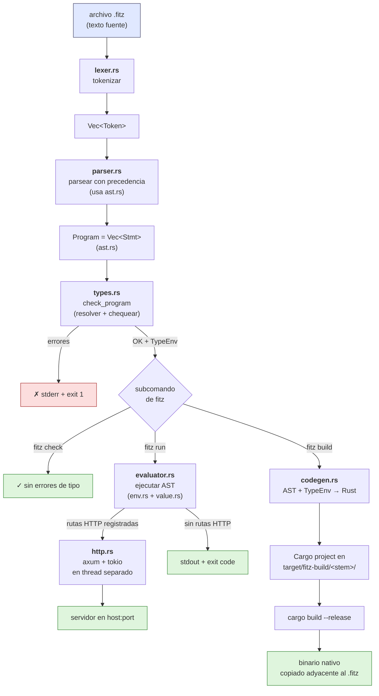

# Arquitectura del compilador

Este documento describe cómo está organizado el código en [src/](../src/) y
qué le pasa a un programa Fitz desde que es texto en un archivo `.fitz`
hasta que produce output (un `print`, una respuesta HTTP, o un binario
nativo). Es la referencia para entender el compilador desde adentro;
para aprender el lenguaje desde afuera, ver [docs/guide.md](guide.md).

## Pipeline en una imagen



ASCII fallback (mismo diagrama, sin colores, para terminales y editores
que no rendericen mermaid):

```
                    archivo .fitz
                          │
                          ▼
                    ┌──────────┐
                    │ lexer.rs │   tokenizar
                    └────┬─────┘
                         ▼
                    Vec<Token>
                         │
                         ▼
                    ┌───────────┐
                    │ parser.rs │  precedencia + estructura
                    │  (ast.rs) │  (Program = Vec<Stmt>)
                    └────┬──────┘
                         ▼
                       Program
                         │
                         ▼
                    ┌──────────┐
                    │ types.rs │  resolver tipos + chequear
                    └────┬─────┘
                         │
              ┌──────────┼──────────┬───────────────┐
              ▼          ▼          ▼               ▼
         fitz check  fitz run   fitz build     (errores)
              │          │          │               │
              ▼          ▼          ▼               ▼
            ✓ OK   evaluator.rs  codegen.rs    ✗ exit 1
                       │             │
                env.rs + value.rs    ▼
                       │       target/fitz-build/
                       ▼             │
               ┌───────┴───┐         ▼
               ▼           ▼    cargo build
            CLI puro   http.rs       │
            (stdout)   axum+tokio    ▼
                       (thread)   binario
                          │       adyacente
                          ▼       al .fitz
                       servidor
                       en host:port
```

## Los tres flujos

El CLI ([main.rs](../src/main.rs)) tiene tres subcomandos y todos
comparten el front-end (lexer → parser → checker). Después se bifurcan:

- **`fitz check <archivo>`** — Solo lexea, parsea y chequea tipos.
  Reporta errores y termina. Útil para integrarse con editores o CI.
- **`fitz run <archivo>`** — Chequea tipos en modo strict (la flag
  `--no-typecheck` lo baja a warning), después ejecuta el AST con el
  evaluador. Si el programa registró rutas HTTP durante la evaluación,
  arranca el servidor; si no, termina como un programa CLI normal.
- **`fitz build <archivo>`** — Chequea tipos en strict (no hay escape
  hatch), genera código Rust, lo escribe como Cargo project en
  `target/fitz-build/<stem>/`, invoca `cargo build --release`, y copia
  el binario producido adyacente al archivo fuente.

## Módulos en src/

### main.rs — entry point y CLI

Parsea argumentos con [clap](https://docs.rs/clap), enruta al
subcomando correspondiente, lee el archivo `.fitz`, y orquesta los
pasos del pipeline. Cada error a lo largo del flujo termina con
`exit(1)` y mensaje a `stderr`. Es deliberadamente delgado: no contiene
lógica del lenguaje, solo coordinación.

### lexer.rs — tokenización

Convierte el texto fuente en un `Vec<Token>`. Reconoce literales (Int,
Float, Str, Bool, Null), identificadores, palabras clave (`fn`, `if`,
`while`, `for`, `type`, `match`, `return`, `import`, etc.), operadores
(`+`, `-`, `*`, `/`, `==`, `!=`, `<`, `>`, `<=`, `>=`, `&&`, `||`, `!`,
`?`, `=>`, `..`), delimitadores, y decoradores (`@nombre`). Maneja
strings con interpolación a nivel léxico (detecta `{` adentro del
string); el ensamblado del `Expr::StrInterp` se completa en el parser.
Anota cada token con su posición (línea, columna) para que los errores
posteriores puedan apuntar al fuente.

### ast.rs — definición del AST

Tipos puros, sin lógica. Define `Program = Vec<Stmt>`, donde `Stmt`
cubre `FnDef`, `TypeDecl`, `Assign`, `If`, `While`, `For`, `Return`,
`Import`, `FromImport`, `Expr` (statement-expression), etc. `Expr`
cubre literales, `Ident`, `BinOp`, `UnaryOp`, `Call`, `FnExpr`,
`Field`, `Index`, `Match`, `Try` (`expr?`), `Range`, `List`, `Map`,
`StructLit`, `StrInterp`. Aparte: `TypeExpr` (`Named`, `Generic`,
`Nullable`) para anotaciones, `Pattern` para `match`, y `Decorator`
para `@get` / `@server` / etc. `Expr` lleva `span` para errores
posicionados (sub-paso S1.2 de post-5b).

### parser.rs — construcción del AST

Recursive descent con escalera de precedencia. Toma `Vec<Token>` y
devuelve `Result<Program, FitzError>`. Maneja todas las construcciones
del lenguaje: declaraciones, expresiones, anotaciones de tipo con
generics anidados (`Map<Str, List<Int>>`) y sufijo nullable (`Str?`),
patrones de `match` (incluido `Ok(_)` / `Err(_)` como wildcards
dedicados), y apila decoradores antes de `fn` para que el evaluator /
codegen los pueda procesar.

### value.rs — valores en runtime

El enum `Value` que vive durante `fitz run`: `Int`, `Float`, `Str`,
`Bool`, `Null`, `List`, `Map`, `Instance` (de un `type`), `Result`,
`Function` (built-in o user), `FnValue` (closure), `Module`, `Type`.
`List`, `Map` e `Instance` están envueltos en `Rc<RefCell<...>>` para
modelar semántica de referencia compartida (mutar a través de cualquier
alias afecta a todos). Incluye los `impl Display` que producen el
formato canónico de Fitz (strings con comillas dobles dentro de
colecciones, `Float` con `.0`, etc.) — formato que el codegen replica
bit-a-bit en el binario.

### env.rs — entornos / scopes

`Environment` con stack de scopes (`Vec<HashMap<String, Value>>`).
Métodos para `push_scope`, `pop_scope`, `define`, `assign` (busca en
todos los scopes), `lookup`. El evaluator y el loader de módulos lo
usan. Las closures (`FnValue`) capturan un snapshot de su env de
definición.

### types.rs — sistema de tipos y checker estático

Dos responsabilidades:

1. **Resolución**: convierte `TypeExpr` (sintáctico, del parser) a
   `Type` (resuelto, con identidad nominal). `Type` cubre primitivos,
   generics built-in (`List<T>`, `Map<K,V>`, `Result<T>`, `Nullable<T>`),
   `Nominal(TypeId)` para tipos custom, `Function { params, ret }`, y
   `Any` como escape gradual.
2. **Checker**: `check_program(&Program)` recorre el AST con un
   `CheckCtx` (scopes, `return_stack` para `?` y `return`,
   `inferred_returns` para inferir el ret de `FnExpr`). Sintetiza tipos
   de expresiones, valida llamadas (aridad + tipos), chequea
   exhaustividad de `match` sobre `Result`, y valida métodos built-in
   con templates paramétricos. Devuelve `(TypeEnv, Vec<FitzError>)`.

### evaluator.rs — ejecución del AST

El intérprete. Toma `Program` + `Environment` y produce efectos
(prints, asignaciones, etc.). Maneja control flow (`return`, `break`,
`continue`) con señales internas. Resuelve `import` cargando el archivo
canonicalizado, parseándolo recursivamente, con cache por path y
detección de ciclos por stack. Despacha métodos built-in (`xs.map`,
`m.get`, `s.upper`, etc.) por tipo del receptor. Si encuentra
decoradores HTTP, los registra en el `HttpRegistry` activo en lugar de
ejecutar la fn.

### http.rs — runtime HTTP

Activa la capa HTTP nativa del lenguaje. Componentes:

- `HttpRegistry`: tabla de rutas (`method`, `path_template`, `handler`,
  `RouteMeta`). Hay un registry "activo" (thread-local + global
  `RwLock`) que el evaluator usa para registrar rutas cuando ve `@get`,
  `@post`, etc.
- `serve(registry, addr)`: spawnea un thread con
  [tokio](https://tokio.rs) + [axum](https://docs.rs/axum), construye
  el `Router`, y entra al `run_interpreter_loop` en el thread main.
  Bridging via `mpsc::UnboundedSender<InterpTask>` +
  `oneshot::Sender<HandlerOutcome>`. Cada request HTTP se serializa
  como un `InterpTask` que el evaluator ejecuta sync (porque `Value`
  no es `Send` por los `Rc`).
- `value_to_json` / `json_to_value` / `json_to_instance`: traducen
  entre `Value` y `serde_json::Value`. Con schema (`type` declarado en
  el handler), `json_to_instance` valida campos, aplica defaults,
  rechaza extras (→ 400).
- `parse_path_template` / `coerce_path_param`: extraen parámetros
  tipados de la URL (Int, Float, Str, Bool).
- `ServerConfig`: lee `@server(port, host)` y resuelve la addr. Default
  `127.0.0.1:3000`.

### codegen.rs — transpile a Rust

Genera un Cargo project completo a partir del AST tipado.
`generate_project(path, program, type_env) -> Result<Project>` devuelve
`Cargo.toml` + `src/main.rs` + módulos auxiliares. Decisiones de
mapping de tipos: `Int → i64`, `Float → f64`, `Str → String`,
`Bool → bool`, `List<T> → Rc<RefCell<Vec<T>>>`,
`Map<K,V> → Rc<RefCell<Vec<(K,V)>>>`, `Result<T> → Result<T, String>`,
`type Foo { ... } → struct FooData { ... } + type Foo = Rc<RefCell<FooData>>`.
Tiene su propio `ModuleLoader` que replica el del evaluator pero AOT
(carga + parsea + chequea + transpila cada módulo importado). Cuando
detecta decoradores HTTP, suma `axum`/`tokio`/`serde` al `Cargo.toml`
generado y emite `#[tokio::main] async fn main()` con `Router` y
handler wrappers. La regla de oro: el output del binario tiene que ser
bit-a-bit idéntico al de `fitz run` para los programas dentro del
subset soportado.

### error.rs — manejo de errores

`FitzError` común a todas las fases, con `message` y `span` (línea,
columna). `impl Display` formatea con la posición cuando es distinta de
`0:0`, omitiéndola cuando no aplica. Cada fase del compilador devuelve
`Result<T, FitzError>` y `main.rs` decide cómo mostrarlos según el
subcomando.

## Por qué este orden y no otro

**Separar lexer / parser / AST / checker / eval / codegen** es la
estructura clásica de un compilador, pero hay decisiones específicas
del proyecto que vale aclarar:

- **El checker corre antes del eval y antes del codegen, no como una
  capa opcional.** Modo strict por default en `fitz run` (y siempre en
  `fitz build`) atrapa errores temprano. La flag `--no-typecheck` está
  para diagnosticar bugs del checker, no para usuarios finales.
- **El evaluator usa el AST directamente, sin IR tipado.** Es más
  simple y suficientemente rápido para el caso de uso (servidor de
  desarrollo, scripts). El codegen también consume el AST + TypeEnv
  directamente. Si en algún momento el checker o el codegen necesitan
  un IR formal (por ejemplo, para optimizaciones), se agrega como
  capa intermedia.
- **`http.rs` está separado del evaluator** porque la interacción
  tokio/axum es lo suficientemente compleja para vivir aparte y
  porque permite que el evaluator no dependa de `tokio` (importante
  para que `fitz check` y `fitz build` no arrastren ese peso).
- **El codegen produce un Cargo project, no un solo `.rs` + invocación
  de `rustc`.** Los imports cross-archivo necesitan `mod`, los
  decoradores HTTP necesitan dependencias externas, y cargo cachea
  builds incrementales. Trade-off conocido: la primera compilación
  cuesta ~1–2 s extra vs `rustc` directo.
