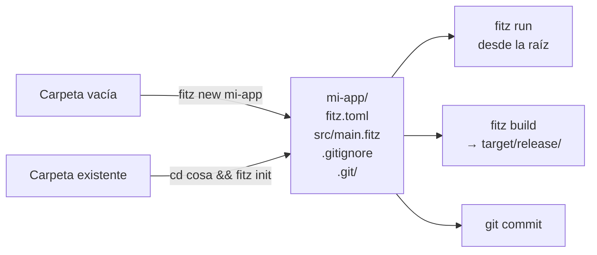

# C2 — `fitz new` (proyecto skeleton)

**Pre-requisitos**: [C1 — Instalación](c1-instalacion.md) terminado.

**Objetivo**: dominar `fitz new` y `fitz init` con **todos sus
flags**, entender la anatomía completa de un `fitz.toml`
(`[package]`, `[bin]`, `[lib]`, `[dependencies]`), y conocer la
convención de carpetas estándar (`src/`, `tests/`, `examples/`).

**Por qué importa**: a partir de este cap dejamos los archivos
sueltos y trabajamos con **proyectos**. Toda app Fitz real (un
CLI, un server HTTP, una lib publicada) arranca con la misma
estructura — saberla de memoria te ahorra fricción durante todo
el curso.

---

## Mapa del cap



---

## Paso 1 — `fitz new` — sintaxis completa

```
fitz new [OPTIONS] <NAME>
```

| Argumento / flag | Qué hace |
|---|---|
| `<NAME>` (requerido) | Nombre del proyecto. **También nombre de la carpeta** que se crea. |
| `--http` | Template HTTP server en vez del default CLI hello-world. |
| `--no-git` | NO correr `git init`. Default: `git init` automático. |
| `-h`, `--help` | Mostrar help. |

### Reglas del nombre — regex `^[a-z][a-z0-9_-]{0,63}$`

| Regla | Válidos | Inválidos |
|---|---|---|
| Solo lowercase | `mi-app`, `users` | `Mi-App`, `USERS` |
| Empieza por letra (no dígito) | `app2`, `v3-server` | `2cosa`, `7names` |
| Solo letras / dígitos / `-` / `_` | `my_lib`, `web-api-v2` | `mi.app`, `cosa@dos`, `con espacios` |
| Máximo 64 caracteres | (regla rara de hit) | strings de >64 chars |

Errores típicos del lexer del nombre:

```bash
fitz new "Bad-Name"
```

```
✗ nombre inválido: `Bad-Name`. Debe matchear `^[a-z][a-z0-9_-]{0,63}$`
  (lowercase, empezar con letra, contener solo letras/dígitos/`-`/`_`,
  máx 64 caracteres).
```

```bash
fitz new "2cosa"
```

```
✗ nombre inválido: `2cosa`. Debe matchear ...
```

### Demo: crear con `--no-git`

```bash
fitz new mi-saludos --no-git
```

```
✓ proyecto Fitz creado en `mi-saludos`

Para probarlo:
  cd mi-saludos
  fitz run src/main.fitz
```

```bash
cd mi-saludos && ls -la
```

```
.gitignore
fitz.toml
src/
```

Notá: **no hay `.git/`** porque pasamos `--no-git`. Útil cuando
querés gestionar la inicialización del repo después (por ejemplo,
en un monorepo).

---

## Paso 2 — `fitz init` — inicializar en carpeta existente

```
fitz init [OPTIONS]
```

| Flag | Qué hace |
|---|---|
| `--name <NAME>` | Sobreescribe el nombre del paquete (default: nombre del directorio). |
| `--http` | Template HTTP server. |
| `--no-git` | NO correr `git init`. |
| `-h`, `--help` | Mostrar help. |

### Cuándo usar `init` vs `new`

| Escenario | Comando |
|---|---|
| Empezás de cero | `fitz new <name>` |
| Cloneaste un repo y querés agregar Fitz | `cd repo && fitz init` |
| Convertís un script `hola.fitz` suelto a proyecto | `mkdir mi-app && mv hola.fitz mi-app/src/main.fitz && cd mi-app && fitz init` |
| El nombre del directorio no respeta las reglas | `cd "Mi Proyecto" && fitz init --name mi_proyecto` |

### Demo: `fitz init --name`

```bash
mkdir "Mi Cosa"
cd "Mi Cosa"
fitz init --name mi-cosa
```

```
✓ proyecto Fitz `mi-cosa` inicializado en `/ruta/.../Mi Cosa`

Para probarlo:
  fitz run src/main.fitz
```

### Edge case: `fitz.toml` ya existe

```bash
cd un-proyecto-ya-creado
fitz init
```

```
✗ ya existe un fitz.toml en este directorio.
```

`fitz init` **nunca sobreescribe** un manifest existente. Si
querés re-arrancar, borralo a mano (con cuidado — perdés deps y
config).

---

## Paso 3 — Anatomía del proyecto generado

```
mi-saludos/
├── .git/                ← repo de git (si no pasaste --no-git)
├── .gitignore           ← qué NO commitear
├── fitz.toml            ← manifest del proyecto
└── src/
    └── main.fitz        ← entry point (lo que ejecuta `fitz run`)
```

Cuatro cosas. Veamos cada una.

### `fitz.toml` — el manifest

```toml
[package]
name = "mi-saludos"
version = "0.1.0"
edition = "2026"

[bin]
main = "src/main.fitz"
```

Tres secciones por default:

#### `[package]` — metadata del paquete

| Campo | Tipo | Para qué |
|---|---|---|
| `name` | Str | Nombre del paquete. Debe respetar el regex. |
| `version` | Str | SemVer (`MAJOR.MINOR.PATCH`). Lo bumpeás vos en cada release. |
| `edition` | Str | Versión del lenguaje (`"2026"` por ahora). |

#### `[bin]` — entry point del binario

| Campo | Tipo | Default | Para qué |
|---|---|---|---|
| `main` | Str (path) | `"src/main.fitz"` | Archivo `.fitz` que `fitz run`/`build` ejecuta cuando no pasás archivo. |

#### `[lib]` — entry point de la lib (opcional)

Sección opcional. Útil cuando tu paquete **expone fns/types
para que otros los importen** (por ejemplo, una utility lib).

```toml
[lib]
entry = "src/lib.fitz"
```

| Campo | Tipo | Para qué |
|---|---|---|
| `entry` | Str (path) | Archivo `.fitz` que otros paquetes importan con `from <paquete> import ...`. |

Coexiste con `[bin]` — un paquete puede tener AMBOS:
- `[bin]` para correr standalone (`fitz run`).
- `[lib]` para ser importado por otros (M3.C? cuando lleguemos).

#### `[dependencies]` — deps externas (M3)

Aún sin deps (lo cubrimos en M3), pero la sintaxis aceptada:

```toml
[dependencies]
# Dep por path local (relativo al fitz.toml):
util = { path = "../util" }

# Dep por git con tag:
shared = { git = "https://github.com/usuario/shared.git", tag = "v1.0.0" }

# Dep por git con rev específico:
shared = { git = "https://github.com/usuario/shared.git", rev = "a3f8b21" }
```

> Versiones sueltas (`foo = "1.0.0"`) parsean pero el resolver
> las rechaza — el registry público todavía no existe. Fase
> futura del lenguaje.

### `.gitignore` — qué NO commitear

```gitignore
# Artefactos de compilación
target/

# Binarios generados por `fitz build` adyacentes al fuente.
# Si publicás un paquete, ajustá esto a tus necesidades.
*.exe
*.pdb
```

Tres reglas:

| Patrón | Por qué |
|---|---|
| `target/` | Carpeta donde `fitz build` deja artefactos intermedios. Equivalente a `target/` de Cargo o `dist/` de npm. |
| `*.exe` | Binarios generados en single-file mode (`fitz build hola.fitz` → `hola.exe`). |
| `*.pdb` | Symbols de debug de Windows. |

Si publicás una lib, **no querés** que `*.exe` ignore exes
intencionales (raro pero pasa) — ajustá a `*.exe` solo en `src/`.

### `src/main.fitz` — entry point

```fitz
// main.fitz — generado por `fitz new`
//
// Tu primer programa Fitz. Corrélo con `fitz run src/main.fitz`.
// Cuando 9.y.2 aterrice, también vas a poder simplemente `fitz run`
// desde la raíz del proyecto (lee `fitz.toml` automáticamente).

print("Hola desde mi-saludos 🏔️")
```

> **Nota**: el comentario menciona "9.y.2 aterrice" como
> futuro, pero **9.y.2 ya está cerrada** (manifest mode). El
> template del scaffolder está desactualizado — `fitz run`
> sin args ya funciona desde la raíz del proyecto.

---

## Paso 4 — Layout extendido (convención del lenguaje)

Aunque `fitz new` solo crea lo mínimo, **la convención del
ecosistema** para proyectos serios es:

```
mi-paquete/
├── .git/
├── .gitignore
├── README.md            ← README del proyecto (recomendado)
├── CHANGELOG.md         ← historial de cambios (recomendado)
├── fitz.toml            ← manifest
├── fitz.lock            ← lockfile de deps (auto-generado al usar deps)
├── src/
│   ├── main.fitz        ← entry [bin].main
│   ├── lib.fitz         ← entry [lib].entry (si exporta)
│   ├── users.fitz       ← módulos adicionales
│   └── orders.fitz
├── tests/               ← @test fns en archivos separados
│   ├── users_test.fitz
│   └── integration_test.fitz
├── examples/            ← ejemplos runnable de la lib (opcional)
│   ├── basic.fitz
│   └── advanced.fitz
├── docs/                ← documentación adicional (opcional)
│   └── arquitectura.md
└── target/              ← (ignorado por git)
```

### Tabla de roles

| Carpeta / archivo | Rol |
|---|---|
| `src/main.fitz` | Entry de binario CLI. `[bin].main` apunta acá. |
| `src/lib.fitz` | Entry de lib. `[lib].entry` apunta acá. |
| `src/<modulo>.fitz` | Submódulos del paquete (M3). |
| `tests/<x>_test.fitz` | Tests de integración. Descubiertos auto por `fitz test`. |
| `examples/*.fitz` | Demos del paquete (no entran al binario ni a `fitz test`). |
| `docs/` | Markdown adicional (arquitectura, guías). |
| `target/` | Output del codegen (Cargo project + binarios). Ignorado por git. |
| `fitz.lock` | Lockfile de deps (Cargo-style). **Commiteá** este para apps; **NO commitees** para libs. |

---

## Paso 5 — Variante `--http` (template HTTP)

Para arrancar con un server HTTP en vez del CLI hello-world:

```bash
fitz new mi-api --http
```

`src/main.fitz` generado:

```fitz
@get("/")
fn index() -> Str {
    return "Hola desde mi-api 🏔️"
}

@server(3000)
fn main() => 0
```

Probalo:

```bash
cd mi-api
fitz run
```

```
🟢 servidor HTTP en 127.0.0.1:3000 (Ctrl+C para salir)
```

En otra terminal:

```bash
curl http://127.0.0.1:3000/
```

```
Hola desde mi-api 🏔️
```

> El template `--http` lo profundizamos en M4 (HTTP first-class)
> — auth, middleware, OpenAPI auto, WebSockets, etc. Por ahora
> es solo el sneak peek.

`fitz init --http` funciona idéntico (template HTTP en una
carpeta existente).

---

## Paso 6 — `fitz run` desde la raíz (manifest mode)

Lo vimos en C1 pero formalicemos. Dos modos:

```mermaid
flowchart TD
    A[fitz run] --> B{¿Pasaste FILE?}
    B -->|Sí: fitz run hola.fitz| C[Single-file mode<br/>ejecuta el archivo directo]
    B -->|No: fitz run sin args| D{¿Hay fitz.toml en cwd o ancestros?}
    D -->|Sí| E[Manifest mode<br/>lee fitz.toml<br/>ejecuta [bin].main]
    D -->|No| F[Error:<br/>'no se encontró fitz.toml']
```

### Manifest mode — desde cualquier subcarpeta

```bash
fitz run                   # desde la raíz: ejecuta src/main.fitz
cd src
fitz run                   # desde adentro: encuentra fitz.toml en padre
```

El walk sube por ancestros hasta encontrar `fitz.toml` o llegar
al root del filesystem. Igual que `cargo run` o `npm run`.

### Single-file mode — archivo explícito

```bash
fitz run src/main.fitz     # OK
fitz run otro/archivo.fitz # también OK
fitz run /tmp/scratch.fitz # absoluto OK
```

Sin `fitz.toml` requerido. Útil para experimentos y scripts.

---

## Paso 7 — Modificar y volver a correr

```fitz
let lugar = "Patagonia"
let altitud_m = 350

print("📍 {lugar}")
print("   altitud: {altitud_m} m")
```

```bash
fitz run
```

```
📍 Patagonia
   altitud: 350 m
```

Si abriste VSCode con el proyecto (`code .`), deberías estar
viendo:

- **Highlighting**: keywords (`let`) en un color, strings en
  otro, interpolación `{lugar}` resaltada.
- **Hover**: pasá el mouse sobre `altitud_m` → `altitud_m: Int`
  inferido.
- **Errores live**: cambiá `altitud_m += "x"` y aparece el
  subrayado rojo al instante.

(Todo esto se cubre en detalle en C3.)

---

## Paso 8 — Exit codes y errores

### Exit codes de `fitz new` / `fitz init`

| Exit code | Causa |
|---|---|
| 0 | Proyecto creado/inicializado OK. |
| 1 | Nombre inválido (regex). |
| 1 | (init) `fitz.toml` ya existe. |
| 1 | (new) Carpeta con ese nombre ya existe. |
| 1 | Error de filesystem (permisos, disco lleno). |
| 1 | `git init` falló (si NO pasaste `--no-git`). |

### Tabla de errores típicos

| Error | Causa probable | Fix |
|---|---|---|
| `nombre inválido: 'X'` | Nombre no respeta regex | Usá `lowercase-con-guiones` o `lower_snake_case` |
| `fitz.toml ya existe` | Ya inicializaste el proyecto | Borralo a mano si querés re-arrancar |
| `el directorio 'X' ya existe` | (new) Conflicto con carpeta existente | Elegí otro nombre o borrá la carpeta |
| `git: command not found` | git no instalado | Instalá git, o pasá `--no-git` para skip |

---

## Paso 9 — Aplicarlo: nuestro proyecto del curso

Si todavía no creaste `mi-saludos`, crealo ahora — **este es el
proyecto que vamos a usar todo el curso**:

```bash
cd ~/proyectos        # o donde guardes tus proyectos
fitz new mi-saludos
cd mi-saludos
fitz run
```

```
Hola desde mi-saludos 🏔️
```

Abrilo en VSCode:

```bash
code .
```

---

## Validación

- [ ] `fitz new mi-saludos` creó la carpeta con `fitz.toml`,
      `src/main.fitz`, `.gitignore`, `.git/`.
- [ ] `fitz new "Bad-Name"` te da error de nombre inválido.
- [ ] `fitz run` desde la raíz del proyecto ejecuta sin pasar el
      archivo (manifest mode).
- [ ] `fitz run src/main.fitz` también funciona (single-file
      mode).
- [ ] `fitz run` desde una **subcarpeta** del proyecto (ej.
      `src/`) también encuentra el manifest.
- [ ] `fitz init` en una carpeta existente respeta el nombre de
      la carpeta (o `--name`).
- [ ] `fitz init` en una carpeta con `fitz.toml` previo te da
      error "ya existe un fitz.toml".

---

## Troubleshooting

### `fitz: command not found`

Volvé a C1, paso 3. El binario no está en el `PATH`.

### `error: el nombre 'X' no es válido`

Repasá la convención: minúscula + dígitos + `-`/`_`, empieza por
letra, máx 64 chars. Ejemplos OK: `mi-app`, `users_v2`,
`web-server-3`. Ejemplos KO: `MiApp`, `2cosas`, `mi.app`,
`con espacios`.

### `error: el directorio 'X' ya existe`

`fitz new` se rehúsa a sobrescribir. Opciones:
- Elegí otro nombre.
- Borrá la carpeta vieja a mano (con cuidado).
- O entrá a la carpeta existente y corré `fitz init` adentro
  (si no tiene `fitz.toml`).

### `error: no se encontró 'fitz.toml' en el directorio actual ni en ancestros`

(con `fitz run` sin args)

- Estás fuera del proyecto. `cd mi-saludos` y volvé a probar.
- O verificá que el `fitz.toml` se haya generado (`ls mi-saludos/`).

### `error: 'git init' falló`

`git` no está instalado o tiene problema. Soluciones:
- Instalá git ([git-scm.com](https://git-scm.com/)).
- O pasá `--no-git` y inicializás el repo después a mano.

### El template `src/main.fitz` no se ve correcto en VSCode

- ¿La extensión Fitz está instalada? (C1, Paso 4)
- Bottom-right de VSCode dice el lenguaje detectado. Tiene que
  decir "Fitz". Si dice "Plain Text", click ahí y elegí Fitz.

---

## Lo que viene en C3

Ya tenés el proyecto. En el próximo cap **lo abrimos en VSCode y
exprimimos el LSP** end-to-end: todos los settings de la
extensión, output panel del language server, hover con tipos,
autocomplete contextual (los 4 modos), errores subrayados live,
go-to-definition, panel Problems, y los atajos de teclado
clave.

Es la diferencia entre "escribir Fitz" y "escribir Fitz como
escribís TypeScript o Rust con su tooling moderno".
