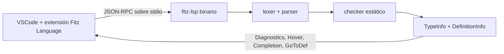
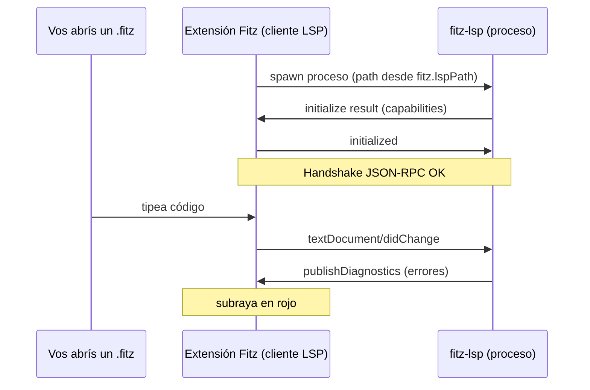
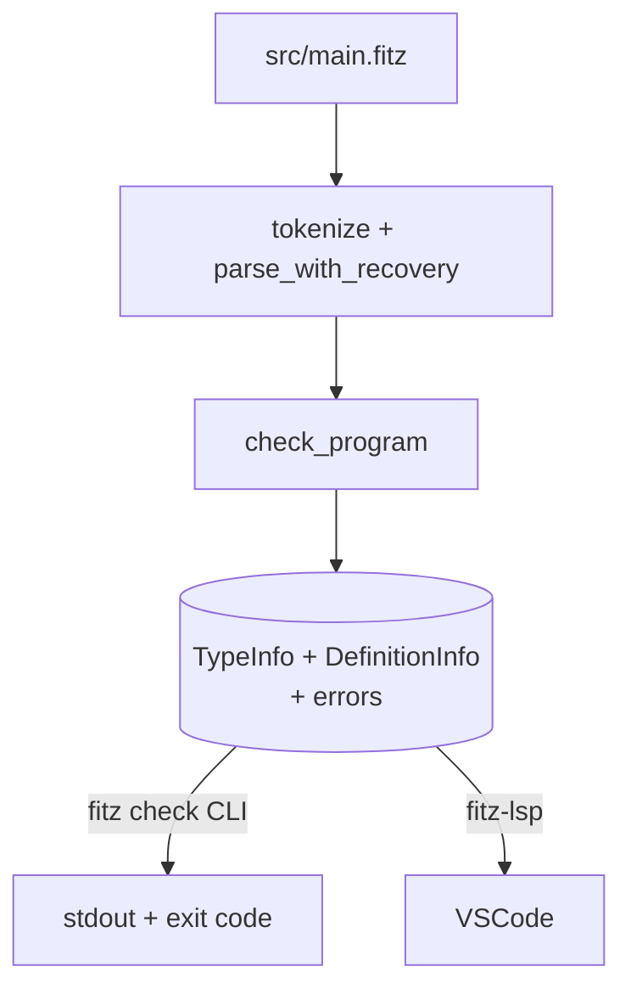

# C3 — Hola mundo + LSP visible

**Pre-requisitos**: [C2 — `fitz new`](c2-fitz-new.md) terminado.
Tenés `mi-saludos/` abierto con `code .`.

**Objetivo**: dominar el **LSP** de Fitz adentro de VSCode con
**todas las features y settings**. Hover con tipos, los 4 modos
de autocomplete, diagnostics en tiempo real, go-to-definition,
panel Problems, atajos de teclado, settings de la extensión, y
los limites conocidos.

**Por qué importa**: el editor con LSP es **la diferencia entre
escribir Fitz "a mano" y escribirlo como escribís TypeScript o
Rust con su tooling moderno**. El LSP es Fitz explicándote tu
propio código mientras lo tipeás — la herramienta más cercana a
tu día-a-día.

---

## Qué es el LSP — arquitectura cliente/servidor



**LSP** = **Language Server Protocol**, estándar de Microsoft
que **desacopla el editor de qué sabe el lenguaje**. El editor
(VSCode, Neovim, Helix, Sublime, IntelliJ con plugin...) habla
LSP; el lenguaje provee un **servidor** (`fitz-lsp`) que
responde preguntas:

| Pregunta LSP | Qué te muestra | Mensaje del protocolo |
|---|---|---|
| ¿Qué tipo tiene esto bajo el cursor? | Hover tooltip | `textDocument/hover` |
| ¿Qué símbolos hay para completar? | Dropdown de autocomplete | `textDocument/completion` |
| ¿Este programa compila? | Subrayados rojos + panel Problems | `textDocument/publishDiagnostics` |
| ¿Dónde se definió esto? | Salto con Ctrl+Click / F12 | `textDocument/definition` |

La extensión Fitz que instalaste en C1 **trae el `fitz-lsp`
adentro del .vsix**. VSCode lo levanta automático al abrir el
primer `.fitz`. No hay setup manual.

📚 **Capítulo dedicado en la guía**: [cap 22 — Soporte para editores](../../guide.md#22-soporte-para-editores).

---

## Paso 1 — Abrir el proyecto en VSCode

Desde la terminal, parado en la raíz del proyecto:

```bash
cd mi-saludos
code .
```

(El `.` significa "esta carpeta"). VSCode abre con el árbol del
proyecto en la sidebar.

Abrí `src/main.fitz` clickeándolo.

### Primer arranque del LSP — qué pasa



Hay **delay de 1-2 segundos** la primera vez. Las próximas son
instantáneas (el proceso queda vivo durante toda la sesión de
VSCode).

### ¿Cómo confirmo que el LSP arrancó?

`Ctrl+Shift+U` abre el **panel de Output**. En el dropdown
arriba a la derecha, elegí **"Fitz Language Server"**. Deberías
ver algo como:

```
[Info  - 18:22:01] Connection to server got closed. Server will restart.
[Info  - 18:22:01] Starting client
[Info  - 18:22:01] Connection to server got established.
```

Si **no hay líneas**, el LSP no arrancó. Ver troubleshooting.

---

## Paso 2 — Settings de la extensión

La extensión Fitz expone **2 settings**:

| Setting | Tipo | Default | Para qué |
|---|---|---|---|
| `fitz.lspPath` | string | `"fitz-lsp"` | Path al binario `fitz-lsp`. Default: lo busca en `PATH`. |
| `fitz.trace.server` | `"off"` / `"messages"` / `"verbose"` | `"off"` | Logging de la comunicación LSP. |

### Cómo editarlos

Dos vías:

#### Vía UI

`Ctrl+,` (Windows/Linux) o `Cmd+,` (macOS). Tipeá "fitz" en el
search. Aparecen los settings con descripción.

#### Vía `settings.json`

`Ctrl+Shift+P` → "Preferences: Open Settings (JSON)". Editás
directamente:

```json
{
  "fitz.lspPath": "C:\\Users\\me\\fitz\\target\\release\\fitz-lsp.exe",
  "fitz.trace.server": "messages"
}
```

### `fitz.lspPath` — cuándo cambiarlo

| Valor | Cuándo |
|---|---|
| `"fitz-lsp"` (default) | El `fitz-lsp` bundleado en el `.vsix`, o uno en `PATH`. **El 95% de los users no toca esto**. |
| `"/abs/path/fitz-lsp"` | Querés usar tu propio fitz-lsp (typical: estás desarrollando el LSP mismo). |
| `"./bin/fitz-lsp"` | Relativo al workspace. Útil en monorepos. |

### `fitz.trace.server` — cuándo cambiarlo

| Valor | Para qué |
|---|---|
| `"off"` (default) | Producción normal. Sin overhead. |
| `"messages"` | Ver qué requests / responses LSP están pasando. Útil cuando algo no funciona. |
| `"verbose"` | Lo anterior **+ los payloads JSON-RPC completos**. Útil para debuggear el LSP en sí (raro). |

Con `"messages"`, el panel "Fitz Language Server" muestra cada
intercambio:

```
[Trace - 18:25:14] Sending request 'textDocument/hover - (12)'.
[Trace - 18:25:14] Received response 'textDocument/hover - (12)' in 8ms.
```

### Workspace vs user settings

| Scope | Archivo | Cuándo |
|---|---|---|
| User (global) | `~/.config/Code/User/settings.json` | Quiero esto en todos mis proyectos |
| Workspace | `<proyecto>/.vscode/settings.json` | Solo para este proyecto (compartible con el equipo) |

Para un proyecto Fitz, **commiteás `.vscode/settings.json`** si
querés que todo el equipo tenga la misma config (ej. trace
verbose para debug compartido).

---

## Paso 3 — Hover con tipos

Reemplazá el contenido de `src/main.fitz` con:

```fitz
let nombre = "Patagonia"
let edad = 200
let activa = true
let latitud = -49.32
let datos: Int? = null

print("Saludos desde {nombre}")
```

**Pasá el mouse** sobre cada variable sin clickear (espera
~500ms).

| Pasás el mouse sobre | Hover muestra | Por qué |
|---|---|---|
| `nombre` | `nombre: Str` | Inferido del literal `"Patagonia"` |
| `edad` | `edad: Int` | Inferido del literal `200` |
| `activa` | `activa: Bool` | Inferido de `true` |
| `latitud` | `latitud: Float` | Inferido de `-49.32` |
| `datos` | `datos: Int?` | Explícito de la anotación |
| `"Patagonia"` (la string) | `Str` | Literal |
| `print(...)` | `print: fn(...) -> Null` | Built-in |

### Hover sobre expresiones

Hover funciona sobre **cualquier expresión**, no solo
identificadores:

| Expresión | Hover |
|---|---|
| `nombre.upper()` | `Str` (return type del método) |
| `[1, 2, 3].len()` | `Int` |
| `if (n > 0) { "pos" } else { "neg" }` | `Str` |

### Limitación: `T?` vs `T` en arms de match

Si refinaste el tipo con un `match` o `if (x != null)`, el
hover **no siempre refleja el refinement**. Es deuda residual
del LSP — el chequeo estático sí lo hace, pero el display del
hover puede mostrar el tipo declarado en vez del refinado.

📚 **Detalle**: [cap 22.2 — Hover](../../guide.md#22-soporte-para-editores) de la
guía.

---

## Paso 4 — Autocomplete contextual (los 4 modos)

```mermaid
flowchart TD
    A[Pediste autocomplete<br/>Ctrl+Space o tras .] --> B{¿Qué hay antes<br/>del cursor?}
    B -->|Tras &quot;.&quot; sobre un Str| C[After-dot Str<br/>upper, lower, len, etc.]
    B -->|Tras &quot;.&quot; sobre un List| D[After-dot List<br/>push, pop, map, filter, ...]
    B -->|Tras &quot;.&quot; sobre un Map| E[After-dot Map<br/>get, has, keys, values, len]
    B -->|Tras &quot;.&quot; sobre un Nominal| F[After-dot type custom<br/>fields del struct]
    B -->|Scope-level &#40;sin .&#41;| G[Top-level + builtins +<br/>tipos + keywords]
```



### Modo 1 — Scope-level (sin punto)

Apretá `Ctrl+Space` en cualquier lugar fuera de un access. El
dropdown lista:

- Variables y fns del scope visible (tu código).
- Built-ins: `print`, `len`, `sleep`, `cors`, `spawn`, `bytes`,
  ...
- Tipos built-in: `Int`, `Float`, `Str`, `Bool`, `Null`,
  `List`, `Map`, `Result`, ...
- Keywords: `let`, `fn`, `if`, `else`, `for`, `while`, `match`,
  `return`, `import`, `from`, `type`, ...

> **Limitación MVP**: el scope-level **no es scope-aware
> estricto** — siempre lista los top-level del programa, no
> filtra por cursor position. Para "var declarada después del
> cursor", VSCode filtra client-side por prefijo.

### Modo 2 — After-dot sobre primitivos (Str/List/Map)

Tipeá `"texto".` y aparece dropdown con métodos del tipo:

| Tipo receptor | Métodos sugeridos |
|---|---|
| `Str` | `upper`, `lower`, `len` |
| `List<T>` | `push`, `pop`, `len`, `map`, `filter`, `find` |
| `Map<K, V>` | `get`, `has`, `keys`, `values`, `len` |

Cada item del dropdown muestra **icono + signature**:

```
upper      fn() -> Str
lower      fn() -> Str
len        fn() -> Int
```

### Modo 3 — After-dot sobre `type` custom

Cuando llegamos a `type` en M2.C7, vas a ver:

```fitz
type User { id: Int, name: Str, email: Str? }
let u = User { id: 1, name: "Ada" }
u.    // ← autocomplete: id, name, email
```

El LSP descubre los fields del type y los sugiere.

### Modo 4 — After-dot que NO funciona (limitaciones)

| Caso | Funciona? |
|---|---|
| `obj.field.method()` (chain) | ⚠️ Heurística — funciona para el primer punto, no garantizado para los siguientes |
| `<expresión compleja>.` | ⚠️ Solo si el LSP puede inferir el tipo |
| `from <mod> import ` | ❌ No sugiere símbolos del módulo (deuda) |
| Después de `@` | ❌ No sugiere decoradores (deuda) |

### Trigger characters

| Trigger | Cuándo dispara auto el autocomplete |
|---|---|
| `.` (punto) | **Siempre** — abre dropdown after-dot |
| Cualquier letra | Solo si abriste manual con `Ctrl+Space` o si tu setting `editor.suggestOnTriggerCharacters` lo permite |

---

## Paso 5 — Diagnostics en tiempo real

Editá una línea con error a propósito:

```fitz
let edad: Int = "200"   // anotación Int, valor Str
```

En menos de un segundo deberías ver:

| Indicador | Dónde |
|---|---|
| **Subrayado rojo ondulado** | Debajo de `"200"` |
| **Punto rojo** | Al lado del número de línea (gutter) |
| **Marca en el minimap** | Lateral derecho |
| **Conteo en bottom bar** | Errores: 1, Warnings: 0 |
| **Hover sobre el error** | Mensaje completo del checker |

Hover sobre el subrayado:

```
`edad` declarado como `Int` recibió un valor `Str`
```

### Severity levels

Fitz emite dos niveles:

| Severity | Color | Cuándo |
|---|---|---|
| `Error` | Rojo | Error del checker (compilación rompe) |
| `Warning` | Amarillo | `fitz lint` findings (cuando se integre al LSP — futuro) |

Hoy todos los diagnostics LSP del checker son **errors**. El
linter no está integrado al LSP todavía — corré `fitz lint` a
mano.

### Diagnostics agregados — error recovery

Si tu archivo tiene **varios errores**, el LSP los muestra
**todos** (no se para en el primero):

```fitz
let edad: Int = "x"
let altura: Float = "y"
let nombre: Bool = 7
```

Vas a ver 3 subrayados, 3 errores en el panel Problems. Eso es
el **error recovery del parser** (Fase 9.0/F15) en acción.

### Live update sin guardar

Importante: **el LSP no necesita que guardes el archivo**.
Cualquier keystroke dispara el chequeo (con debounce ~300ms).
Es lo que hace al LSP útil — el editor te corrige mientras
pensás.

---

## Paso 6 — Panel "Problems" + navegación

`Ctrl+Shift+M` abre el **panel Problems**. Lista los
diagnostics de todos los archivos abiertos.

Cada entrada:
```
src/main.fitz
  ✗ `edad` declarado como `Int` recibió un valor `Str`     [Línea 1]
  ✗ `altura` declarado como `Float` recibió un valor `Str` [Línea 2]
```

**Clickeá una entrada** → el editor salta a esa posición.

Útil cuando:
- Refactorizás algo grande y querés ver toda la lista de
  roturas.
- Investigás un bug y querés saber qué archivos están rotos.

### Filtrar el panel

El panel Problems tiene un search bar arriba:

| Filtro | Sintaxis |
|---|---|
| Por mensaje | `tipo` (busca "tipo" en el mensaje) |
| Por archivo | `src/users` |
| Por severity | `severity:Error` |
| Negar | `!severity:Warning` |

---

## Paso 7 — Go-to-definition (Ctrl+Click)

Agregá una fn al archivo:

```fitz
fn saludar(quien: Str) -> Str {
    return "Hola, {quien}!"
}

print(saludar("Patagonia"))
```

`Ctrl+Click` sobre `saludar` en la última línea (Linux/Windows;
`Cmd+Click` en macOS). El cursor salta a la definición.

| Acción | Atajo Win/Linux | Atajo macOS |
|---|---|---|
| Ir a definición | `F12` o `Ctrl+Click` | `F12` o `Cmd+Click` |
| Peek (preview en floating window) | `Alt+F12` | `Opt+F12` |
| Volver atrás | `Ctrl+Alt+-` | `Ctrl+-` |
| Volver adelante | `Ctrl+Shift+-` | `Ctrl+Shift+-` |

### Qué resuelve

| Símbolo | Salta a |
|---|---|
| Variable (`let x = ...`) | El `let` correspondiente |
| Función (`fn foo()`) | El `fn` correspondiente |
| Tipo (`type Foo {}`) | El `type` correspondiente |
| Parámetro de fn | El binding del param |
| Import (`from foo import bar`) | El `Stmt::Import` local |

### Qué NO resuelve (limitaciones MVP)

| Caso | Estado |
|---|---|
| Cross-module (saltar al `.fitz` de origen) | ❌ Deuda. Salta al stmt `from X import Y` local, no al archivo remoto. |
| Method calls (`u.greet()` saltando a `fn greet`) | ⚠️ Heurística — funciona si el método es global |
| Field access (`u.name` saltando al field del type) | ❌ Deuda |

---

## Paso 8 — Otros atajos VSCode útiles para Fitz

### Navegación

| Acción | Atajo |
|---|---|
| Quick Open archivo | `Ctrl+P` |
| Buscar símbolo en archivo | `Ctrl+Shift+O` |
| Buscar símbolo en workspace | `Ctrl+T` |
| Ir a línea | `Ctrl+G` |

### Edición

| Acción | Atajo |
|---|---|
| Comentar/descomentar | `Ctrl+/` |
| Duplicar línea | `Alt+Shift+↑/↓` |
| Mover línea | `Alt+↑/↓` |
| Multi-cursor (agregar arriba/abajo) | `Ctrl+Alt+↑/↓` |
| Multi-cursor (todas las ocurrencias) | `Ctrl+Shift+L` |
| Selección rectangular | `Shift+Alt+drag mouse` |

### Search

| Acción | Atajo |
|---|---|
| Buscar en archivo | `Ctrl+F` |
| Buscar+reemplazar en archivo | `Ctrl+H` |
| Buscar en workspace | `Ctrl+Shift+F` |
| Buscar+reemplazar en workspace | `Ctrl+Shift+H` |

### Terminal integrada

| Acción | Atajo |
|---|---|
| Abrir/cerrar terminal | `` Ctrl+` `` (backtick) |
| Nueva terminal | `Ctrl+Shift+`` |

---

## Paso 9 — Multi-file workspace

Cuando agregás archivos al proyecto (M3 con módulos), VSCode
**los chequea todos**. El LSP arma un grafo de dependencias y
re-chequea los afectados cuando modificás uno.

Demo: agregá `src/util.fitz`:

```fitz
fn doblar(n: Int) -> Int => n * 2
```

Y desde `src/main.fitz`:

```fitz
from util import doblar
print(doblar(21))
```

(M3 cubre los detalles de los imports). Lo importante para C3:
**el LSP entiende cross-file**, hover y diagnostics funcionan
sobre símbolos importados.

---

## Paso 10 — Limitaciones MVP del LSP (honestas)

| Feature | Estado | Notas |
|---|---|---|
| Hover | ✅ | Funciona sobre expresiones, params, vars de loops, bindings de match (S1 desde v0.14.2) |
| Autocomplete scope-level | ✅ | NO es scope-aware estricto (deuda) |
| Autocomplete after-dot | ✅ | Solo primer nivel garantizado; chains heurísticas |
| Autocomplete tras `from X import ` | ✅ | Sugiere símbolos `pub` del módulo remoto (desde v0.9.47) |
| Diagnostics live | ✅ | Multi-error con recovery |
| Go-to-definition | ✅ | Local OK; cross-module limitado |
| Find references | ❌ | No implementado (deuda roadmap) |
| Rename symbol | ❌ | No implementado (deuda roadmap) |
| Signature help | ✅ | Fns user-defined + builtins (`print`/`len`/...) + métodos sobre `List<T>`/`Map<K,V>`/`Str` (desde v0.15.0) |
| Code actions / Quick fixes | ❌ | No implementado (deuda roadmap) |
| Formatting on save | ✅ | `editor.formatOnSave: true` dispara `fitz fmt` automático (desde v0.14.0) |
| **Debugging interactivo** (breakpoints, step, watch) | ❌ | **DAP** no implementado — workaround: `print`, REPL `:type`/`:env`, diagnostics LSP (deuda V6 roadmap, ~2 semanas estimadas) |
| Refactorings | ❌ | No implementado (deuda roadmap) |

> **El LSP está al nivel de "MVP fuerte"** — cubre toda la
> experiencia diaria de editing (escribir, ver errores, navegar,
> formatear, ver firmas mientras tipeás args). Las features
> avanzadas (find refs, rename, code actions, debugging interactivo)
> son deuda priorizada en el roadmap del lenguaje. El gap más
> visible vs Python/JS hoy es **debugging interactivo en VSCode**
> — la deuda **V6 (Debug Adapter Protocol)** del backlog cubre
> exactamente eso.

---

## Paso 11 — Paridad con `fitz check`

Lo que ves en VSCode (LSP) y lo que te dice `fitz check`
(CLI) **son el mismo motor**. El LSP es eso adentro de un
servidor que VSCode consulta; `fitz check` lo ejecuta de una.



Esto te garantiza:

- Lo que el LSP rojo subraya → `fitz check` te lo reporta
  también.
- Lo que `fitz check` reporta limpio → el LSP no muestra rojo.
- Hover muestra el mismo tipo que el checker calculó.

Cuando hay drift (raro), es bug — vale issue al repo.

---

## Validación

- [ ] Abrís `src/main.fitz` en VSCode y ves syntax highlighting
      (keywords, strings, interpolación coloreadas).
- [ ] Hover sobre una variable muestra `nombre: Tipo`.
- [ ] Tipeás `"texto".` y aparece dropdown con `upper`, `lower`,
      `len`.
- [ ] Ponés un error de tipo y aparece subrayado rojo + entrada
      en panel Problems **sin guardar**.
- [ ] `Ctrl+Click` sobre un símbolo salta a la definición.
- [ ] Panel Output → "Fitz Language Server" muestra líneas de
      arranque del LSP.

---

## Troubleshooting

### El LSP no arranca

**Verificación**: panel Output → "Fitz Language Server" debería
tener al menos un `Connection to server got established`.

- **Si el dropdown no tiene esa opción**: la extensión no se
  cargó. Verificá en Extensions (`Ctrl+Shift+X`) que "Fitz
  Language" aparezca y esté Enabled.
- **Si dice "command not found: fitz-lsp"**: el binario
  bundleado en el .vsix no se desempaquetó (raro) o el setting
  `fitz.lspPath` apunta a algo que no existe. Default debería
  ser `fitz-lsp` — verificá que no lo hayas modificado.
- **Workaround**: setear `fitz.lspPath` al binario que
  bajaste/buildeaste manualmente:
  ```json
  { "fitz.lspPath": "C:\\Users\\me\\.cargo\\bin\\fitz-lsp.exe" }
  ```

### Hover no muestra tipos

- Esperá 2 segundos al primer arranque (LSP lazy).
- Si pasa más tiempo: panel Output → "Fitz Language Server"
  por errores.
- Reload window: `Ctrl+Shift+P` → "Developer: Reload Window".

### El highlighting no funciona

El highlighting es de la **extensión** (grammar TextMate), no
del LSP. Si tu archivo no se ve coloreado:
- Verificá que termina en `.fitz` (la extensión asocia por
  extensión).
- Bottom-right de VSCode dice el lenguaje detectado. Debería
  decir **Fitz**. Si dice "Plain Text", click ahí y elegí Fitz.
- Reload window si recién instalaste la extensión.

### Autocomplete no sugiere

- ¿Tipeaste un `.`? Después del punto el dropdown debería
  aparecer automático. Si no, `Ctrl+Space` lo abre manual.
- Hover sobre el receptor del `.`: ¿tiene tipo concreto? Si es
  `Any`, el LSP no sabe qué sugerir.

### Errores live tardan mucho en aparecer

- Normal: el LSP debouncea ~300ms tras la última tecla para no
  re-chequear en cada keystroke.
- En proyectos grandes (>50 archivos) puede ser más lento.

### Hover muestra `Any` en vez del tipo concreto

Pasa con expresiones complejas o callbacks sin anotación. En
M2.C2 vemos cuándo el inference da `Any` y cómo guiarlo con
anotaciones explícitas.

### Quiero ver el JSON-RPC del LSP

Setting:
```json
{ "fitz.trace.server": "verbose" }
```

Panel Output → "Fitz Language Server" pasa a mostrar cada
request/response con el payload completo. **Quitalo cuando
termines** — genera mucho output.

---

## Lo que viene en C4

Vimos el LSP — el día-a-día de escribir adentro del editor. En
el próximo cap arrancamos con los **comandos CLI esenciales**
(`run`, `check`, `fmt`, `lint`, `dev`) con todos sus flags, exit
codes y workflows pre-commit/CI. Es lo que vas a correr en la
terminal cada vez que vayas a commitear o validar algo desde
afuera del editor.
