# C5 — REPL

**Pre-requisitos**: [C4 — CLI esencial](c4-cli-esencial.md)
terminado. Conocés `run`, `check`, `fmt`, `lint`, `dev`.

**Objetivo**: usar `fitz repl` como **laboratorio interactivo**
con dominio completo de: prompt + auto-print, multi-line por
balanced brackets, los 6 comandos especiales (`:help`, `:quit`,
`:env`, `:reset`, `:type`, `:load`), history persistente, todos
los atajos de teclado de `rustyline`, y los límites conocidos
del MVP.

**Por qué importa**: el REPL es **la herramienta exploratoria**.
Es donde aprendés sintaxis nueva sin commitear nada, donde
validás "¿qué devuelve esta expresión?" sin escribir un archivo
entero, y donde debuggeás fns de tu proyecto cargándolas vivas.
Análogo a `python` / `node` / `irb` / `iex` — si venís de
cualquiera de esos, ya sabés el patrón.

---

## Mapa del REPL

```mermaid
flowchart TD
    A[fitz repl] --> B[Prompt vacío<br/>esperando input]
    B --> C{¿Qué tipeás?}
    C -->|Expresión| D[Evaluar + auto-print<br/>= valor]
    C -->|Statement &#40;let, fn, etc.&#41;| E[Evaluar + persistir<br/>en el scope]
    C -->|:comando| F[Comando especial<br/>:help / :env / :type / ...]
    C -->|Bracket abierto sin cerrar| G[Prompt ... <br/>multi-line]
    D --> B
    E --> B
    F --> B
    G --> B
    B -->|Ctrl+D o :quit| H[👋 hasta luego!]
```



---

## Paso 1 — Arrancar el REPL

Desde cualquier carpeta (no necesita proyecto):

```bash
fitz repl
```

```
Fitz REPL
Tipos: `:help` para comandos disponibles. Ctrl+D para salir.

```

Sin args, no hay flags. Una sola variante:

| Comando | Qué hace |
|---|---|
| `fitz repl` | Arranca el REPL con scope limpio |
| `fitz repl --help` | Imprime ayuda |

> **No hay flag para precargar archivos** al arrancar. Para eso
> usá `:load <archivo>` adentro (Paso 7).

### Para salir

Tres formas equivalentes:

| Forma | Tecla / comando |
|---|---|
| Ctrl+D | Manda EOF al stdin (Linux/macOS estándar) |
| Ctrl+Z + Enter | Equivalente en Windows |
| `:quit` o `:q` | Comando especial |

Imprime `👋 hasta luego!` y termina.

---

## Paso 2 — Expresiones y "auto-print"

Tipeá un literal o expresión:

```
1 + 1
```

```
= 2
```

El `=` indica **valor de la expresión** (REPL convention). Si el
result es `Null` (statements o `print()`), no muestra nada.

### Tabla de qué imprime cada tipo

| Tipeás | Resultado | Por qué |
|---|---|---|
| `42` | `= 42` | Int literal |
| `3.14` | `= 3.14` | Float literal |
| `"hola"` | `= hola` | Str — Display sin comillas |
| `true` | `= true` | Bool |
| `null` | (nada) | `Null` no auto-prints |
| `[1, 2, 3]` | `= [1, 2, 3]` | List — Display estructurado |
| `{"k": 1}` | `= {"k": 1}` | Map — strings de keys CON comillas |
| `0..5` | `= 0..5` | Range |
| `Ok(42)` | `= Ok(42)` | Result variant |
| `nombre.upper()` | `= PATAGONIA` | Llama el método y muestra |
| `print("X")` | `X` (sin `=`) | `print()` es side-effect, devuelve `Null` |

> **Notá la asimetría**: el REPL imprime strings **sin
> comillas** porque usa Display (igual que `print(...)`). Pero
> ADENTRO de listas/mapas SÍ aparecen con comillas porque ahí
> el contexto es estructural.

### Múltiples expresiones por línea

```
1 + 1; 2 + 2
```

```
= 4
```

Cada `;` es separador de statements. **Solo el último valor
imprime** (el primero se calcula y se descarta).

---

## Paso 3 — Bindings persistentes en el scope

Cada `let` o `fn` **queda en el scope** hasta que cierres el
REPL o uses `:reset`:

```
let nombre = "Patagonia"
```

(sin output — `let` no es expresión)

```
nombre.upper()
```

```
= PATAGONIA
```

### Definir fns

```
fn double(n: Int) -> Int => n * 2
```

```
double(21)
```

```
= 42
```

Funciones persisten igual que vars. Las podés usar después,
redefinir (la nueva pisa la vieja), o combinar.

### Recursividad funciona

```
fn factorial(n: Int) -> Int {
    if (n <= 1) { return 1 }
    return n * factorial(n - 1)
}
factorial(5)
```

```
= 120
```

```
factorial(10)
```

```
= 3628800
```

### Reasignación

```
nombre = "Ushuaia"
```

```
nombre
```

```
= Ushuaia
```

---

## Paso 4 — Multi-line automático (balanced brackets)

Si abrís un `{`, `(` o `[` y no lo cerrás en la misma línea, el
prompt cambia a `... ` y el REPL **espera el cierre**:

```
fn greet(name: Str) -> Str {
...     return "hola {name}"
... }
```

Cuando cerrás el `}`, el REPL procesa todo el bloque:

```
greet("Ada")
```

```
= hola Ada
```

### Heurística

| Carácter | Abre / cierra | Notas |
|---|---|---|
| `{` ... `}` | Bloque o struct literal o map | Cuenta balanceada |
| `(` ... `)` | Args de fn o agrupación | Cuenta balanceada |
| `[` ... `]` | List literal o indexing | Cuenta balanceada |
| `"..."` | String | Brackets adentro de string NO cuentan |
| `// ...` | Comment | Brackets adentro de comment NO cuentan |

### Cancelar input multi-line

Si te equivocaste a mitad de multi-line y querés empezar de
nuevo:

| Acción | Tecla |
|---|---|
| Cancelar línea actual (sin salir) | `Ctrl+C` |
| Salir del REPL entero | `Ctrl+D` o `:quit` |

`Ctrl+C` te deja en un prompt limpio con el scope intacto.

### Limitaciones

| Caso | Funciona en REPL multi-line? |
|---|---|
| Bloque `fn { ... }` | ✅ |
| Struct literal multi-línea | ✅ |
| List literal multi-línea | ✅ |
| String interpolada con `{}` adentro | ⚠️ Cuenta brackets — strings raras pueden confundir |
| String multi-línea con `\n` literal | ✅ |
| Comentario multi-line | ❌ (Fitz no tiene `/* */`) |

---

## Paso 5 — `:help` y los 6 comandos especiales

`:help` o `:h` lista todo:

```
:help
```

```
Comandos del REPL:
  :help, :h       — esta ayuda
  :quit, :q       — salir (también Ctrl+D)
  :env            — listar variables y fns definidas en el scope
  :reset          — limpiar el scope (perdés todo)
  :type <expr>    — mostrar el tipo de una expresión
  :load <archivo> — evaluar un .fitz en el scope actual
```

Tabla detallada:

| Comando | Alias | Argumento | Qué hace |
|---|---|---|---|
| `:help` | `:h` | — | Lista comandos |
| `:quit` | `:q` | — | Sale del REPL |
| `:env` | — | — | Lista bindings del scope |
| `:reset` | — | — | Resetea scope (pierde user vars y fns) |
| `:type <expr>` | — | expresión | Muestra el tipo de `<expr>` sin evaluarla |
| `:load <archivo>` | — | path | Carga y evalúa un `.fitz` en el scope actual |

---

## Paso 6 — `:type <expr>` (inspeccionar tipo)

Quizás el comando más útil del REPL: mostrar el tipo de una
expresión **sin evaluarla**.

```
:type 1 + 1
```

```
:: Int
```

```
:type [1, 2, 3].map(fn(x: Int) => x * 10)
```

```
:: List<Int>
```

> **Nota**: el param `x: Int` es explícito porque Fitz no propaga
> el tipo del receptor `List<Int>` hacia el callback automáticamente
> todavía (eso requeriría inferencia bidireccional, ver `docs/deudas-post-5b.md`
> → L2). Sin la anotación, `fn(x) => x * 10` infiere `x: Any` y el
> resultado tipa como `List<Any>`. El runtime sí calcula `x * 10`
> correctamente — solo es una limitación del checker estático.

```
:type "hola"
```

```
:: Str
```

```
:type [1, 2, 3]
```

```
:: List<Int>
```

### Tipos compuestos

```
:type Ok(42)
```

```
:: Result<Int>
```

```
:type {"a": 1, "b": 2}
```

```
:: Map<Str, Int>
```

### Limitación conocida — `:type` sobre vars del REPL

`:type` corre el checker sobre un **programa sintético**
(no es 100% scope-aware con las vars del REPL):

```
let edad = 200
:type edad
```

```
:: Any
```

Esperabas `Int`. El checker dentro del REPL no sabe del binding
`edad`. **Workaround**: escribilo en un `.fitz`:

```fitz
let edad = 200
let _peek = edad   // hover sobre _peek en VSCode dice Any aún, pero hover sobre edad sí dice Int
```

O usá `fitz check archivo.fitz` y leé el output.

> Esta deuda está documentada — refinar `:type` scope-aware es
> mejora prevista del REPL.

---

## Paso 7 — `:env` (ver bindings actuales)

Listar todo lo que definiste:

```
let x = 21
fn double(n: Int) -> Int => n * 2
let nombre = "Patagonia"
:env
```

```
Definido en el scope:
  bytes = <builtin bytes>  // Function
  db = <module db>  // Module
  double = <function>  // Function
  nombre = "Patagonia"  // Str
  spawn = <builtin spawn>  // Function
  x = 21  // Int
```

### Qué incluye

| Tipo de binding | Aparece en `:env`? |
|---|---|
| Variables del usuario (`let x = ...`) | ✅ |
| Funciones del usuario (`fn foo()`) | ✅ |
| Built-ins de fn (`spawn`, `bytes`) | ✅ |
| Módulos built-in (`db`, `hash`, `jwt`) | ✅ |
| Tipos built-in (`Int`, `Str`, ...) | ❌ (no son bindings) |
| Keywords (`let`, `fn`, ...) | ❌ |

> El listado mezcla tus bindings con los built-ins. Ordenado
> alfabético. **No hay flag para filtrar solo lo del usuario**
> hoy — convención: prefijo `_` para vars "internas" si querés
> diferenciar.

---

## Paso 8 — `:load <archivo>` (cargar código del proyecto)

Esto es la diferencia entre el REPL como juguete y el REPL como
herramienta real. **`:load` evalúa un `.fitz` adentro del scope
actual** — vos podés cargar fns de tu proyecto y probarlas en
vivo.

### Demo

Crealo en `src/helpers.fitz` (dentro del proyecto donde arrancaste
`fitz repl`):

```fitz
// src/helpers.fitz
let pi = 3.14159
fn area(r: Float) -> Float => pi * r * r
fn perimetro(r: Float) -> Float => 2.0 * pi * r
```

Desde el REPL:

```
:load src/helpers.fitz
```

```
✓ cargado <ruta absoluta del archivo>
```

> **Tip cross-OS**: usar paths **relativos al directorio donde
> arrancaste el REPL** (`src/helpers.fitz`) es la forma más
> portable. Paths absolutos estilo Unix (`/tmp/...`) no funcionan
> en Windows — ahí resuelven a `D:/tmp/...` que casi nunca existe.

Notá que `:load` también **ejecuta los stmts top-level** (en
este caso, el `let pi` se evaluó). Las fns quedan disponibles:

```
area(5.0)
```

```
= 78.53975
```

```
perimetro(10.0)
```

```
= 62.8318
```

```
:env
```

```
Definido en el scope:
  area = <function>  // Function
  bytes = <builtin bytes>  // Function
  db = <module db>  // Module
  perimetro = <function>  // Function
  pi = 3.14159  // Float
  spawn = <builtin spawn>  // Function
```

### Reglas de path

| Path | Resuelve relativo a |
|---|---|
| `helpers.fitz` | Directorio donde **arrancaste** `fitz repl` |
| `./helpers.fitz` | Idem (relativo al cwd del arranque) |
| `/tmp/helpers.fitz` (Linux/macOS) | Absoluto |
| `D:/proyecto/helpers.fitz` o `D:\proyecto\helpers.fitz` (Windows) | Absoluto |
| `../otro/file.fitz` | Relativo (sube de carpeta) |

> **El REPL NO tiene cwd interno** — `cd` no funciona como
> comando. El path siempre se resuelve contra el directorio
> donde arrancaste `fitz repl`.

### Si el archivo tiene errores

```
:load src/broken.fitz
```

```
✗ Error en línea 3:1 — `x` declarado como `Int` recibió un valor `Str`
```

El scope **NO se modifica** si hubo error (load es atómica).

---

## Paso 9 — `:reset` (empezar de cero)

Si tu scope se ensució con experimentos y querés volver al
estado inicial sin salir del REPL:

```
:reset
```

```
✓ scope reseteado
```

Después:

```
:env
```

```
Definido en el scope:
  bytes = <builtin bytes>  // Function
  db = <module db>  // Module
  spawn = <builtin spawn>  // Function
```

Solo built-ins. Todas las vars y fns del usuario desaparecen.

Si intentás usar algo viejo:

```
xs
```

```
✗ Error en línea 1:1 — variable `xs` no definida
```

> `:reset` es **irrecuperable** — no hay undo. Si querés
> recuperar un script de experimentos, usá `history` (Paso 11)
> o lo más prolijo: escribilo en un `.fitz` y usá `:load`.

---

## Paso 10 — History persistente

El REPL guarda lo que tipeás:

| OS | Path del history |
|---|---|
| Linux | `~/.fitz/history` |
| macOS | `~/.fitz/history` |
| Windows | `%USERPROFILE%\.fitz\history` (típicamente `C:\Users\<tu-user>\.fitz\history`) |

**Persistente entre sesiones** — cuando volvés a arrancar
`fitz repl`, tenés todo lo del REPL anterior en el history.

### Atajos sobre el history

| Acción | Tecla |
|---|---|
| Línea anterior del history | ↑ (flecha arriba) |
| Línea siguiente del history | ↓ (flecha abajo) |
| Búsqueda incremental hacia atrás | `Ctrl+R` |
| Búsqueda incremental hacia adelante | `Ctrl+S` |
| Aceptar match y editar | Enter |
| Cancelar búsqueda | `Ctrl+G` |

### Editar líneas (atajos rustyline / Emacs-style)

| Acción | Tecla |
|---|---|
| Mover al inicio de línea | `Ctrl+A` o Home |
| Mover al fin de línea | `Ctrl+E` o End |
| Avanzar una palabra | `Alt+F` o `Ctrl+→` |
| Retroceder una palabra | `Alt+B` o `Ctrl+←` |
| Borrar hasta fin de línea | `Ctrl+K` |
| Borrar hasta inicio de línea | `Ctrl+U` |
| Borrar palabra hacia atrás | `Ctrl+W` |
| Limpiar pantalla (preserva scope) | `Ctrl+L` |
| Cancelar línea actual | `Ctrl+C` |

Los atajos vienen de `rustyline` (la lib que usa el REPL por
debajo). Si usaste `bash`/`zsh`/`psql`, son los mismos.

### Borrar el history

```bash
# Linux/macOS
rm ~/.fitz/history

# Windows
del %USERPROFILE%\.fitz\history
```

---

## Paso 11 — Async funciona en el REPL

Como el REPL corre sobre tokio, podés usar `.await` y `sleep`
directo:

```
sleep(500).await
```

(Hay pausa de 500ms, después prompt nuevo.)

```
let f = sleep(1000)
```

(Future pendiente bindeado a `f`.)

```
f.await
```

(Pausa de ~1s, después prompt.)

> Esto es útil para experimentar con async sin escribir un
> archivo `#[tokio::main]`. M5 cubre async en detalle.

---

## Paso 12 — Aplicarlo a `mi-saludos`

Volvé al proyecto y arrancá el REPL desde la raíz:

```bash
cd mi-saludos
fitz repl
```

Cargá tu `src/main.fitz`:

```
:load src/main.fitz
```

```
Saludos desde Patagonia
✓ cargado src/main.fitz
```

(Ejecuta los `print()` del archivo y deja las fns/vars en
scope.)

Probá cosas vivas:

```
let n = 7
n * n
```

```
= 49
```

```
:type [1, 2, 3].map(fn(x: Int) => x + 1)
```

```
:: List<Int>
```

Editás tu `src/main.fitz` afuera, recargás:

```
:load src/main.fitz
```

(Re-ejecuta el archivo entero, sobreescribiendo bindings con
mismo nombre.)

### Workflow típico


---

## Paso 13 — Limitaciones MVP del REPL (honestas)

| Feature | Estado |
|---|---|
| Auto-print de expresiones | ✅ |
| Multi-line por balanced brackets | ✅ |
| History persistente + búsqueda | ✅ |
| `:type` | ✅ (limitado en scope-awareness) |
| `:load` | ✅ |
| `:env` | ✅ |
| `:reset` | ✅ |
| Async | ✅ |
| Tab completion | ❌ |
| Highlighting (colores) en input | ❌ |
| Manifest mode (`:load` relativo al proyecto) | ⚠️ Manual con path absoluto |
| Importar deps desde adentro (`from foo import X`) | ❌ |
| `:reload` (re-ejecutar todo el history) | ❌ |
| `:save <archivo>` para guardar la sesión | ❌ |

Si una de estas te limita, la convención hoy es:
**escribilo en un `.fitz`** y combiná `fitz repl + :load` con
ese archivo.

---

## Validación

- [ ] `fitz repl` arranca y mostrás el prompt sin errores.
- [ ] Definís una var (`let x = 42`) y al pedirle `x` te
      devuelve `= 42`.
- [ ] `:type "hola"` te dice `:: Str`.
- [ ] `:load` sobre un `.fitz` con una fn cualquiera te deja
      esa fn disponible en el scope.
- [ ] `:reset` borra tus bindings (al re-pedir `x` da error).
- [ ] Multi-line: al abrir `{` el prompt cambia a `... ` y
      cuando cerrás procesa el bloque.

---

## Troubleshooting

### `:load` me dice "no se pudo leer el archivo"

- El path es relativo al directorio donde **arrancaste**
  `fitz repl`, no al cwd actual (no hay cwd actual en el REPL).
  Si tenés dudas, usá ruta absoluta.
- Verificá que el archivo exista con `ls` desde otra terminal.

### `:type` me devuelve `Any` y esperaba algo concreto

- Limitación documentada del MVP (Paso 6). Workaround: escribilo
  en un `.fitz` y `fitz check` ahí.

### Salir con `Ctrl+D` no funciona en Windows

- Usá `Ctrl+Z` y después Enter. O `:quit` / `:q`.

### El REPL no detecta una fn que cargué con `:load`

- Verificá que el `:load` haya impreso `✓ cargado X.fitz`. Si
  no, hubo un error de parse/check y el archivo no se evaluó.

### Multi-line se queda esperando y no procesa

- Probablemente hay un bracket sin cerrar que el REPL espera.
  Apretá `Ctrl+C` para cancelar y empezar de nuevo.

### History no se guarda entre sesiones

- Verificá permisos de escritura en `~/.fitz/` (o el equivalente
  Windows).
- Si la carpeta no existe, el REPL la crea — chequeá que tenga
  permiso para crearla.

### El REPL muestra rastros raros al tipear

- Algunos terminales emulados (typical: `git-bash` en Windows
  con configs raras) no manejan bien rawmode de rustyline.
  Probá un terminal nativo: PowerShell, Windows Terminal,
  alacritty.

---

## Lo que viene en C6

Para cerrar M1 nos falta una cosa: dejar de **interpretar**
nuestro programa y empezar a **compilarlo a binario nativo**.
Eso es `fitz build` — el diferencial de Fitz frente a
Python/JS/Ruby. Después del C6 tenés el M1 entero cerrado y un
binario standalone listo para distribuir.
