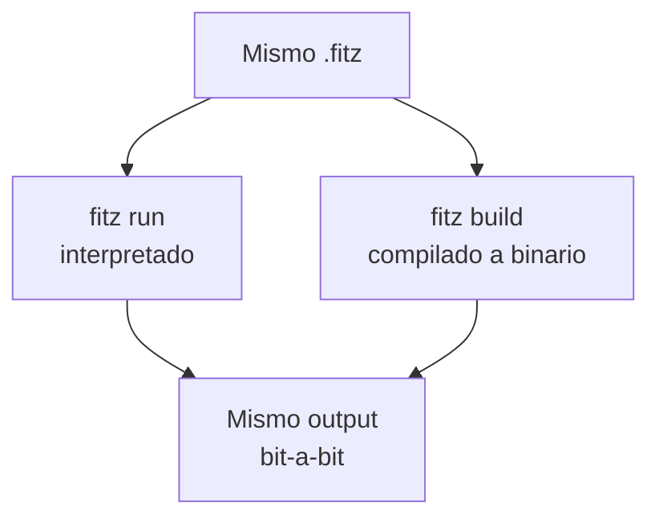
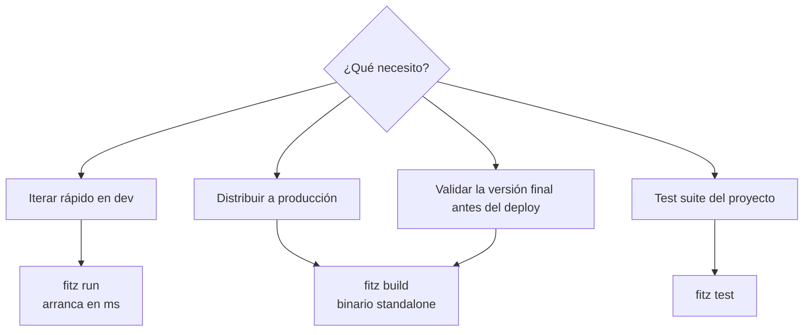

# C6 — `fitz build` (compilar a binario nativo)

**Pre-requisitos**: [C5 — REPL](c5-repl.md) terminado. Conocés
todo el ciclo de desarrollo interpretado.

**Objetivo**: dominar `fitz build` con **todos sus flags**
(`--bundle-python`, `--bundle-pip`, `--bundle-pip-requirements`),
entender el pipeline de compilación (Fitz → Rust → LLVM →
binario), saber la estructura del `target/` dir, comparar cold
vs warm builds, y conocer las limitaciones de
cross-compilation.

**Por qué importa**: esto es **el diferencial de Fitz frente a
Python/JS/Ruby**. Esos lenguajes te dan un script que necesita
el runtime del lenguaje en cada máquina donde corra. Fitz te da
un binario **standalone** — un solo archivo que copiás, corrés,
y listo. Sin instalar nada en el server, sin Docker base image
con Python, sin `pip install`.

---

## El pipeline `fitz build` end-to-end


Tres etapas distintas:

| Etapa | Herramienta | Output | Tiempo típico |
|---|---|---|---|
| 1. Fitz pipeline | `fitz` mismo | Rust source code en `target/fitz-build/` | <100ms |
| 2. Cargo project | `fitz` (orquesta) | `Cargo.toml` + `src/main.rs` | <50ms |
| 3. Compilación final | `cargo build --release` (rustc + LLVM) | Binario nativo | **3-30s primera vez, <3s incremental** |

> El paso 3 es **el costoso**. Es real compilación LLVM-grade,
> el mismo backend que usa `rustc`, `swift` y `clang`.

---

## Paso 1 — Sintaxis completa

```
fitz build [OPTIONS] [FILE]
```

| Posición / flag | Para qué |
|---|---|
| `FILE` | Archivo `.fitz` a compilar. **Sin él**, manifest mode (lee `fitz.toml`). |
| `--bundle-python` | Embebe CPython adentro del binario. Standalone hasta sin Python instalado en el destino. |
| `--bundle-pip <PACKAGE>` | Suma paquetes pip al bundle. **Repetible**. Implica `--bundle-python`. |
| `--bundle-pip-requirements <FILE>` | Suma paquetes desde un `requirements.txt`. **Repetible**. Implica `--bundle-python`. |
| `-h`, `--help` | Help. |

### Pre-requisito del sistema: `rustc`

`fitz build` **invoca `cargo` por debajo**. Aunque `fitz` viene
pre-compilado, **`fitz build` necesita Rust instalado**:

```bash
# Verificar
rustc --version
# rustc 1.85.0 (o más reciente)

# Instalar si no tenés
# Linux/macOS:
curl --proto '=https' --tlsv1.2 -sSf https://sh.rustup.rs | sh

# Windows: bajá de https://rustup.rs y corré rustup-init.exe
```

Es **la única dep externa** de `fitz build`. Sin `rustc`, el
comando aborta con error claro.

---

## Paso 2 — Single-file mode

El caso más simple: compilar un archivo suelto, sin proyecto.

```bash
mkdir build-demo && cd build-demo

cat > hello.fitz << 'EOF'
let nombre = "Patagonia"
print("Hola desde {nombre}")
EOF

fitz build hello.fitz
```

```
✓ binario: hello.exe
```

Lo generado en el cwd:

```
build-demo/
├── hello.fitz       ← tu fuente
├── hello.exe        ← binario producido (Windows; en Linux: hello)
└── target/          ← work dir del compilador
```

Probalo:

```bash
./hello.exe       # Windows
./hello           # Linux/macOS
```

```
Hola desde Patagonia
```

**El binario es standalone**. Copialo a una máquina que no tenga
Fitz y va a correr igual.

---

## Paso 3 — Manifest mode

Desde la raíz de un proyecto creado con `fitz new`:

```bash
cd mi-saludos
fitz build
```

```
✓ binario: D:\proyectos\mi-saludos\target\release\mi-saludos.exe
```

A diferencia del single-file mode, el binario **NO queda
adyacente al fuente** — va a `target/release/`, nombrado como
el paquete (`mi-saludos.exe`). Convención Cargo-style.

Probalo:

```bash
./target/release/mi-saludos.exe    # Windows
./target/release/mi-saludos         # Linux/macOS
```

```
Saludos desde Patagonia
```

### Tabla: diferencias entre los dos modos

| Aspecto | Single-file mode | Manifest mode |
|---|---|---|
| Comando | `fitz build hello.fitz` | `fitz build` (sin args, desde proyecto) |
| Output path | `./hello.exe` (adyacente al fuente) | `./target/release/<pkg-name>.exe` |
| Nombre del binario | Stem del archivo (`hello`) | `[package].name` del manifest |
| Workdir | `./target/fitz-build/<stem>/` | `./target/` |
| Útil para | Scripts sueltos, scratchpad | Proyectos serios, libs, deploys |

---

## Paso 4 — Estructura del `target/` dir

`fitz build` genera **un mini-proyecto Cargo** en `target/` y
delega la compilación a `cargo`. Layout:

```
target/
├── fitz-build/         ← intermedios de Fitz
│   └── <name>/
│       ├── Cargo.toml  ← deps del programa generado
│       └── src/
│           └── main.rs ← Rust generado (legible, inspeccionable)
└── release/            ← (manifest mode) output final
    └── <pkg-name>.exe
```

### El `main.rs` generado es legible

Para tu `hello.fitz`, el `main.rs` se ve así (resumido):

```rust
// Código generado por Fitz 5b — no editar a mano.
#![allow(unused_mut, unused_variables, ...)]

fn main() {
    let mut nombre: String = String::from("Patagonia");
    println!("{}", format!("Hola desde {}", nombre.clone()));
}
```

**Es Rust idiomático**. Podés inspeccionarlo si querés
entender qué hace el codegen. Útil para debug y para aprender
cómo Fitz mapea a Rust.

### `Cargo.toml` generado

Para un programa sin deps:

```toml
[package]
name = "hello"
version = "0.1.0"
edition = "2021"

[[bin]]
name = "hello"
path = "src/main.rs"
```

Para un programa con features (HTTP, Python interop, async),
suma deps automáticamente:

```toml
[dependencies]
axum = "0.8"
tokio = { version = "1", features = ["full"] }
serde = { version = "1", features = ["derive"] }
serde_json = { version = "1", features = ["preserve_order"] }
# ... más deps según features
```

---

## Paso 5 — Paridad bit-a-bit `run` ↔ `build`

**Tu programa se comporta exactamente igual interpretado y
compilado**. No hay "modo dev" vs "modo prod" con semánticas
distintas — Fitz garantiza paridad bit-a-bit.



```bash
fitz run src/main.fitz
# Saludos desde Patagonia

./target/release/mi-saludos.exe
# Saludos desde Patagonia
```

Igual output. Esto es **decisión de diseño fuerte**: lo que ves
en el LSP es lo que ves en `fitz run` es lo que ves en el
binario final.

### Por qué importa

- **CI**: si `fitz check` pasa, el `fitz build` también pasa
  (mismas reglas).
- **Debug**: si el binario tiene un bug, podés reproducirlo con
  `fitz run` y debuggearlo con menos overhead.
- **Confianza**: no hay "funciona en dev pero rompe en prod"
  por divergencia de runtime.

---

## Paso 6 — Tiempos de build (cold vs warm)

```bash
# Cold build (primer fitz build de un proyecto)
time fitz build hello.fitz
```

```
✓ binario: hello.exe

real    0m0.9s    # ← single-file simple, sin deps
```

```bash
# Cold build con deps (HTTP server)
time fitz build server.fitz
```

```
✓ binario: server.exe

real    1m20s     # ← primera vez, compila axum+tokio+serde+...
```

```bash
# Warm build (modificaste algo y re-build)
time fitz build server.fitz
```

```
✓ binario: server.exe

real    0m2.5s    # ← incremental, solo re-compila lo cambiado
```

### Tabla: tiempos esperados

| Caso | Cold | Warm |
|---|---|---|
| Hello-world (sin deps) | <1s | <500ms |
| CLI con tipos custom | <2s | <1s |
| HTTP server (axum+tokio) | 60-120s | 2-5s |
| HTTP + auth + WS + DB | 90-180s | 3-8s |
| Con `--bundle-python` | + 30-60s una vez | + 0s (cache) |

> **El cache vive en `target/`**. NO lo borres si querés warm
> builds. Si necesitás full rebuild: `rm -rf target/` (o
> `Remove-Item -Recurse target/` en Windows).

---

## Paso 7 — Cuándo `run` vs `build`



Tabla detallada:

| Caso | Comando | Por qué |
|---|---|---|
| Iterar mientras desarrollás | `fitz run` | Arranca en ms, sin compilación |
| Validar tipos sin ejecutar | `fitz check` | El más rápido |
| Hot reload tras cada save | `fitz dev` | Re-arranca solo |
| Correr tests | `fitz test` | Cubre `@test` fns |
| Probar la versión final antes de shippear | `fitz build` + run del binario | Ves exactamente lo que el deploy verá |
| Distribuir tu programa a otros | `fitz build` + copiar binario | Standalone, sin instalar nada |
| CI / artefactos del release | `fitz build` | Lo que vas a publicar |

**Regla simple**: usá `fitz run` para todo lo interactivo;
`fitz build` cuando vayas a shippear.

---

## Paso 8 — Cross-compilation

Como Fitz tira de `rustc` por debajo, **podés cross-compilar
gratis** a cualquier target Rust.

### Cómo

1. Instalar el target:

```bash
rustup target add x86_64-unknown-linux-gnu
rustup target add aarch64-apple-darwin
rustup target add x86_64-pc-windows-msvc
```

2. Configurar el target (por ahora, requiere editar el `Cargo.toml`
   generado o setear `CARGO_TARGET=<triple>`):

```bash
CARGO_BUILD_TARGET=x86_64-unknown-linux-gnu fitz build
```

> **Limitación actual**: `fitz build` no expone un flag
> `--target` directo. Es deuda del CLI — pasa por env vars de
> cargo. Esto se va a refinar.

### Tabla de targets típicos

| Target Rust | Plataforma |
|---|---|
| `x86_64-unknown-linux-gnu` | Linux x64 |
| `aarch64-unknown-linux-gnu` | Linux ARM64 (Raspberry Pi, AWS Graviton) |
| `x86_64-apple-darwin` | macOS Intel |
| `aarch64-apple-darwin` | macOS Apple Silicon (M1+) |
| `x86_64-pc-windows-msvc` | Windows x64 |

### Limitaciones de cross-compile

| Cross | Funciona? | Caveat |
|---|---|---|
| Linux → Linux ARM | ✅ | Necesitás linker ARM (`apt install gcc-aarch64-linux-gnu`) |
| Linux → Windows | ⚠️ | Necesitás `mingw-w64`. Algunos crates fallan. |
| Linux → macOS | ❌ | Requiere SDK de Apple (legal/técnico — usá CI con runner macOS) |
| macOS → Linux | ✅ | Igual que Linux→Linux ARM en cuanto a linker |
| macOS Intel → Apple Silicon (o vice-versa) | ✅ | Más fácil con `aarch64-apple-darwin` |
| Windows → Linux | ⚠️ | Posible con WSL o cross containers |

📚 **Detalle de cross-compile**: M7 (Producción y deployment).

---

## Paso 9 — Flag `--bundle-python` (interop Python)

Cuando tu programa usa `from python import ...` (interop con
Python, cubierto en módulo del lenguaje específico), el binario
final necesita CPython en runtime. Dos opciones:

| Opción | Cómo | Pro | Contra |
|---|---|---|---|
| Asumir Python instalado en destino | `fitz build` (sin flag) | Binario chico (~125 KB para hello) | Falla si destino no tiene Python |
| Embeber CPython en el binario | `fitz build --bundle-python` | Standalone hasta sin Python | Binario pesa ~30 MB (Win) / ~45 MB (Linux x64) |

### `--bundle-python` solo

```bash
fitz build --bundle-python mi-script.fitz
```

```
✓ binario: mi-script.exe (~30 MB)
```

Internamente, `--bundle-python` baja Python 3.14 standalone via
[python-build-standalone](https://github.com/astral-sh/python-build-standalone)
(proyecto de Astral, el equipo de `uv`), lo cachea en
`~/.fitz/cache/python/`, y lo embebe.

### `--bundle-pip <PACKAGE>` (repetible)

Sumar paquetes pip al bundle:

```bash
fitz build --bundle-pip requests --bundle-pip "sqlalchemy==2.0.0" app.fitz
```

```
✓ binario: app.exe (~50 MB con sqlalchemy + requests)
```

**Implica `--bundle-python`** automáticamente (sin Python
embebido no tiene sentido bundlear pip).

Sintaxis del valor:

| Sintaxis pip | Ejemplo |
|---|---|
| Nombre simple | `--bundle-pip requests` |
| Version exacta | `--bundle-pip "requests==2.31.0"` |
| Version range | `--bundle-pip "requests>=2.30,<3.0"` |
| Extras | `--bundle-pip "fastapi[all]"` |
| Git | `--bundle-pip "git+https://github.com/foo/bar.git"` |

### `--bundle-pip-requirements <FILE>` (repetible)

Lee paquetes desde un `requirements.txt` estándar:

```bash
fitz build --bundle-pip-requirements requirements.txt app.fitz
```

`requirements.txt`:

```
requests>=2.30
sqlalchemy==2.0.0
psycopg2-binary
# comentarios funcionan
```

**Toda la sintaxis nativa de pip** (incluyendo `-r other.txt`,
`--hash`, `#egg=`, etc.) funciona — el flag pasa el archivo
directo a `pip install -r <file>`.

**Combinable con `--bundle-pip`**:

```bash
fitz build \
    --bundle-pip-requirements requirements.txt \
    --bundle-pip "debug-tool" \
    app.fitz
```

pip recibe ambos.

---

## Paso 10 — El CLI completo de Fitz (inventario)

Llegaste al final de M1 y conocés los comandos del día-a-día.
Acá el **mapa completo** para que sepas qué existe y dónde se
cubre:

| Comando | Para qué | Dónde se cubre |
|---|---|---|
| `fitz new` | Crear proyecto nuevo | [M1.C2](c2-fitz-new.md) ✅ |
| `fitz init` | Inicializar proyecto en cwd | [M1.C2](c2-fitz-new.md) ✅ |
| `fitz run` | Ejecutar (interpretado) | [M1.C2](c2-fitz-new.md), [M1.C4](c4-cli-esencial.md) ✅ |
| `fitz check` | Type-check sin ejecutar | [M1.C4](c4-cli-esencial.md) ✅ |
| `fitz fmt` | Formatear código | [M1.C4](c4-cli-esencial.md) ✅ |
| `fitz lint` | Detectar patrones malos | [M1.C4](c4-cli-esencial.md) ✅ |
| `fitz dev` | Hot reload | [M1.C4](c4-cli-esencial.md) ✅ |
| `fitz repl` | REPL interactivo | [M1.C5](c5-repl.md) ✅ |
| `fitz build` | Compilar a binario | [M1.C6](c6-fitz-build.md) ✅ ← acá |
| `fitz test` | Correr `@test` fns | M2.C6 |
| `fitz add` | Agregar dependencia | M3 |
| `fitz remove` | Quitar dependencia | M3 |
| `fitz update` | Actualizar git deps | M3 |
| `fitz openapi` | Emitir schema OpenAPI 3.1 | M4 |
| `fitz db` | Migraciones del ORM | M6 |
| `fitz py-types` | Generar `type` Fitz desde modelos SQLAlchemy | (referencia exhaustiva en guide, no cubierto en curso) |
| `fitz py-stubs` | Generar `type` Fitz desde stubs `.pyi` | (idem) |

`fitz --help` te lista todo en cualquier momento.

---

## Paso 11 — Optimización del binario

### Estrategias para reducir tamaño

Para un hello-world, ~125 KB ya es chico. Para programas con
HTTP/axum, el binario base es ~5-8 MB. Para más reducción:

| Técnica | Reducción típica | Comando |
|---|---|---|
| `strip` (quitar debug symbols) | -20-30% | `strip hello.exe` (Linux/macOS) |
| `upx` (compresión binaria) | -50-70% | `upx --best hello.exe` |
| Editar `Cargo.toml` generado con `[profile.release]` agresivo | Variable | Requiere tocar `target/fitz-build/.../Cargo.toml` (deuda — no expuesto) |

Hoy `fitz build` no expone flags para esto. Si necesitás
binarios super-chicos (deployment a edge, embedded), tocás el
`Cargo.toml` generado a mano y rebuild con `cargo` directo.

### Comparativa de runtime (cold start)

| Programa | Cold start típico |
|---|---|
| Hello-world | <10ms |
| CLI con parsing | <30ms |
| HTTP server (axum) | ~50-100ms |
| HTTP + DB connection pool | ~200-500ms |

Comparado con:

| Comparación | Cold start |
|---|---|
| Python `script.py` | ~30-50ms (sin imports) |
| Python con FastAPI + SQLAlchemy | ~1-3s |
| Node.js `script.js` | ~50-100ms |
| Java/Spring | ~5-10s |

**Fitz binarios son cercanos al overhead mínimo del sistema
operativo.** Eso es el punto de compilar a nativo.

---

## Paso 12 — Aplicarlo a `mi-saludos`

Volvé al proyecto del curso:

```bash
cd mi-saludos
fitz build
```

```
✓ binario: D:\proyectos\mi-saludos\target\release\mi-saludos.exe
```

Probá:

```bash
./target/release/mi-saludos.exe
```

```
Saludos desde Patagonia
```

Listo. Tenés un binario standalone de tu proyecto. **Copialo a
otra máquina sin Fitz instalado** y va a correr igual.

### Comparativa con `fitz run`

```bash
# Versión interpretada
time fitz run
```

```
Saludos desde Patagonia

real    0m0.08s
```

```bash
# Versión compilada
time ./target/release/mi-saludos.exe
```

```
Saludos desde Patagonia

real    0m0.005s
```

Para un hello-world, ambos son rápidos. **La diferencia se nota
en programas grandes** — el binario nativo escala mejor (sin
overhead del checker en runtime).

---

## Paso 13 — Limitaciones MVP de `fitz build`

| Feature | Estado | Workaround |
|---|---|---|
| Single-file mode | ✅ | — |
| Manifest mode | ✅ | — |
| Cargo project generado inspeccionable | ✅ | — |
| `--bundle-python` | ✅ | — |
| `--bundle-pip` + `--bundle-pip-requirements` | ✅ | — |
| `--target <triple>` directo | ❌ | Usá `CARGO_BUILD_TARGET` env var |
| `--profile dev` (debug build) | ❌ | Editá `Cargo.toml` generado |
| `--release` (es el default) | ✅ implícito | Único modo soportado |
| Watch + auto-rebuild | ❌ | Usá `fitz dev` (no compila, interpreta) |
| Output dir custom (`-o <path>`) | ❌ | Mover/copiar manualmente |
| Cross-compile cómodo | ⚠️ | Via env vars + targets de rustup |
| `cargo` features custom | ❌ | Editá `Cargo.toml` generado |

---

## Validación

- [ ] `fitz build hello.fitz` (single-file) produce `hello.exe`
      adyacente al fuente.
- [ ] El binario corre **sin Fitz instalado** (probalo: copialo
      a una carpeta sin nada y corrélo).
- [ ] `fitz build` (manifest mode, desde `mi-saludos/`) deja el
      binario en `target/release/mi-saludos.exe`.
- [ ] El output del binario coincide bit-a-bit con `fitz run`.
- [ ] Cold build de hello-world toma <2s; warm build <500ms.

---

## Troubleshooting

### El primer `fitz build` tarda 30+ segundos

Normal. `fitz build` invoca `cargo` por debajo, y el primer
build compila toda la base del runtime de Fitz emitido (axum,
tokio, serde, etc. dependiendo de qué use tu programa). Las
builds siguientes son **incrementales y mucho más rápidas**
(típicamente <3s para cambios chicos).

### `error: linker 'cc' not found` (Linux)

Fitz necesita un compilador C/C++ para linkear el binario
final:

```bash
# Debian/Ubuntu
sudo apt install build-essential

# Fedora
sudo dnf install gcc

# Arch
sudo pacman -S base-devel
```

### `error: cannot find 'rustc'`

Aunque `fitz` viene como binario pre-compilado, **`fitz build`
necesita `rustc` instalado** porque transpila a Rust. Instalalo
con [rustup](https://rustup.rs/).

### El binario funciona en mi máquina pero falla en el server

- Verificá la arquitectura del server: `uname -m`. Si compilaste
  en x64 y el server es ARM (Raspberry Pi, AWS Graviton),
  necesitás cross-compilar.
- En Linux, si el server tiene una **glibc más vieja** que la
  tuya (compilaste en Ubuntu 24.04, server es Debian 11), el
  binario puede fallar al cargar. Workarounds:
  - Compilar en una distro vieja.
  - Usar un container con la glibc target.
  - Compilar contra musl: `--target x86_64-unknown-linux-musl`.

### `--bundle-python` baja Python cada vez (lento)

Primer build sí baja Python (~30MB). **Quedan cacheados** en
`~/.fitz/cache/python/` y reused en builds siguientes. Si lo
borraste, va a bajar de nuevo.

### El binario es muy grande (5+ MB)

Para programas HTTP es esperado (axum + tokio + serde son
varios MB cada uno). Para reducir:
- `strip`: `strip mi-app` (Linux/macOS).
- `upx`: `upx --best mi-app`.
- Si necesitás <1 MB, mirá si podés simplificar las features
  (¿realmente necesitás auth + WS + Python interop + ORM?).

### Cómo veo el código Rust generado

```bash
# Single-file mode:
cat target/fitz-build/<stem>/src/main.rs

# Manifest mode:
cat target/fitz-build/<pkg-name>/src/main.rs
```

Es Rust legible. Útil para debug y para aprender mapeo Fitz →
Rust.

---

## Cerraste el módulo M1

**Felicidades**, llegaste al final del módulo de Setup. Sabés:

- ✅ Instalar Fitz + extensión VSCode (**C1**)
- ✅ Crear un proyecto con `fitz new` y entender su anatomía
  completa (**C2**)
- ✅ Editar Fitz en VSCode con hover, autocomplete contextual
  (4 modos), diagnostics live, go-to-def, panel Problems
  (**C3**)
- ✅ Usar `run`, `check`, `fmt`, `lint`, `dev` con todos sus
  flags + workflows pre-commit/CI (**C4**)
- ✅ Experimentar interactivo con `fitz repl` + sus 6 comandos
  especiales (**C5**)
- ✅ Compilar a binario nativo standalone con `fitz build` y
  conocer todos los flags incluido `--bundle-python` (**C6**)
  ← acá

**Entregable del módulo**: tenés Fitz instalado, un proyecto
que escribís, corrés, formateás, debugeás, y **compilás a
binario standalone para distribuir**.

## Qué viene en M2 — Tipos y funciones

A partir del próximo módulo dejamos el "setup" y entramos al
lenguaje **en serio**. M2 cubre el sistema de tipos gradual:

- C1 — Primitivos, strings e interpolación
- C2 — Variables, anotaciones e inferencia
- C3 — Operadores y control de flujo (`if` / `else`)
- C4 — Loops (`while`, `loop`, `for in`)
- C5 — Listas, mapas y rangos
- C6 — Funciones + `fitz test`
- C7 — `type` (tipos custom) + `match`

Es la base sobre la que se construye todo lo demás del
lenguaje. Empezá por [M2.C1](../m2-tipos-funciones/c1-primitivos-strings.md).
