# M2.C1 — Primitivos, strings e interpolación

**Pre-requisitos**: [M1](../m1-setup/c1-instalacion.md) completo.
Sabés crear proyectos, correr/compilar/lintear y usás el REPL
para experimentar.

**Objetivo**: dominar los **5 tipos primitivos** de Fitz con
todos sus límites, todos los métodos de `Str`, todas las
notaciones numéricas, todos los escape characters, y la
interpolación con expresiones.

**Por qué importa**: estos tipos son los ladrillos de TODO lo
demás. Toda fn que escribas, toda variable que declares, todo
field de tipos custom — al final son combinaciones de estos
cinco. Conocerlos a fondo te evita 90% de los errores
"absolutos" del lenguaje.

---

## Mapa de tipos primitivos

```mermaid
flowchart LR
    A[Tipos primitivos] --> B[Int<br/>i64 signed]
    A --> C[Float<br/>f64 IEEE 754]
    A --> D[Str<br/>UTF-8]
    A --> E[Bool<br/>true / false]
    A --> F[Null<br/>solo valor: null]
    B -.promoción.-> C
    B -.composición.-> G[List, Map, Result, Range]
    C -.composición.-> G
    D -.composición.-> G
    E -.composición.-> G
    F -.composición.-> H[T? &#40;Nullable&#41;]
```



---

## Paso 1 — Los 5 tipos primitivos

| Tipo | Qué representa | Tamaño | Literal de ejemplo |
|---|---|---|---|
| `Int` | Entero (positivo, negativo, 0) | 64 bits signed | `42`, `-7`, `1_000_000`, `0xFF`, `0b1010` |
| `Float` | Decimal | 64 bits IEEE 754 | `3.14`, `-0.5`, `1.0`, `1e10` |
| `Str` | Texto UTF-8 | Variable | `"hola"`, `'también'`, `"con {x}"` |
| `Bool` | Verdadero o falso | 1 bit lógico | `true`, `false` |
| `Null` | Ausencia de valor | (sin valor) | `null` |

📚 **Detalle exhaustivo en la guía**: [cap 3 — Variables y tipos primitivos](../../guide.md#3-variables-y-tipos-primitivos)
+ [cap 5 — Strings](../../guide.md#5-strings).

---

## Paso 2 — `Int` — entero 64 bits

### Rango y límites

| Concepto | Valor |
|---|---|
| Mínimo | `-9_223_372_036_854_775_808` (−2⁶³) |
| Máximo | `9_223_372_036_854_775_807` (2⁶³−1) |
| Tamaño | 64 bits, signed (complemento a 2) |

### Notación

```fitz
let n = 42                       // decimal
let neg = -7                     // negativo
let cero = 0
let grande = 1_000_000           // separador `_` para legibilidad
let pi_int = 3                   // no truncado, queda Int
```

### Otras bases

| Prefijo | Base | Ejemplo | Valor |
|---|---|---|---|
| `0x` | Hexadecimal (16) | `0xFF` | 255 |
| `0b` | Binario (2) | `0b1010` | 10 |
| `0o` | Octal (8) | `0o755` | 493 |

```fitz
let hex   = 0xFF        // 255
let bin   = 0b1010      // 10
let octal = 0o755       // 493 (permisos Unix clásicos)
```

Las **letras hex** pueden ser mayúsculas o minúsculas: `0xff` =
`0xFF` = `0xFf`.

### Overflow

Operaciones que pasan el rango **paniquean en runtime** (Fitz
no usa wrapping silencioso):

```fitz
let max = 9_223_372_036_854_775_807
let overflow = max + 1
```

```
✗ overflow aritmético en runtime
```

Esto es diferente de C (que wrappea por default) y similar a
Rust en modo debug.

> Para aritmética grande sin overflow, hoy Fitz no tiene
> bigint built-in. Workaround: Float (si la precisión exacta
> no es crítica) o usar interop Python con `int` arbitrario.

### Convertir Int → otros tipos

| A qué | Cómo |
|---|---|
| `Float` | Inferida en op mixta (`5 + 2.5` → `7.5`) o explícita `let f: Float = 5` no funciona (anotación no convierte) |
| `Str` | Vía interpolación: `"{n}"` o `"" + n` (concatenación coerce) |

> **No hay `as` ni cast functions** estilo Rust en el MVP. Las
> conversiones explícitas son via interpolación, operaciones
> mixtas, o (para parseo) `parse_int` (no implementado todavía
> — workaround: leer manualmente).

---

## Paso 3 — `Float` — decimal IEEE 754

### Rango y precisión

| Concepto | Valor |
|---|---|
| Precisión | ~15-17 dígitos decimales significativos |
| Mínimo positivo | ~2.2e-308 |
| Máximo | ~1.8e308 |
| Tamaño | 64 bits IEEE 754 (double precision) |

### Notación

```fitz
let pi = 3.14159
let neg = -0.5
let uno = 1.0                    // Float, no Int
let big = 1e10                   // 10 mil millones
let small = 1.5e-3               // 0.0015
let pi_legible = 3.141_592_653   // separador `_`
```

### Valores especiales

```fitz
let inf = 1.0 / 0.0    // ← runtime error: "división por cero"
```

> **Fitz NO genera `Inf` o `NaN` automáticamente** al dividir
> por cero. Aborta con `división por cero` claro. Si necesitás
> manejar el caso, chequeá `divisor != 0.0` antes.

### Comparación con Int

```fitz
print(5 == 5.0)     // true   ← Int ↔ Float comparan numéricamente
print(5.0 + 3)      // 8.0    ← Int se promociona a Float en op mixta
print(5 / 2)        // 2      ← Int / Int = Int (división entera)
print(5.0 / 2)      // 2.5    ← Float / Int = Float
```

### Precisión y errores

Como cualquier IEEE 754, **los Float tienen imprecisiones**
para algunos cálculos:

```fitz
print(0.1 + 0.2)    // 0.30000000000000004
```

No es bug de Fitz — es la naturaleza del formato. Para dinero o
precisión exacta, no uses Float (workaround: Int en centavos, o
interop con una lib Python como `decimal`).

---

## Paso 4 — `Str` — texto UTF-8

### Comillas dobles vs simples

Las dos formas son equivalentes:

```fitz
let saludo1 = "hola"
let saludo2 = 'hola'
```

| Convención | Cuándo |
|---|---|
| Comillas dobles (`"..."`) | **Default**. `fitz fmt` normaliza a esto. |
| Comillas simples (`'...'`) | Cuando necesitás `"` adentro sin escapar: `'dijo "hola"'` |

### Encoding

**Siempre UTF-8**. Strings pueden contener cualquier carácter
Unicode:

```fitz
print("español: ñ á é í ó ú")
print("emoji: 🏔️ 🌎")
print("CJK: 名前は何ですか?")
print("cirílico: Привет")
print("matemático: π α β γ ∞ ≠ ≤")
```

### Métodos de `Str`

Tabla completa de los métodos implementados:

| Método | Tipo | Qué hace | Ejemplo |
|---|---|---|---|
| `.len()` | `Int` | Largo en caracteres (no bytes) | `"hola".len()` → `4` |
| `.upper()` | `Str` | Mayúsculas | `"hola".upper()` → `"HOLA"` |
| `.lower()` | `Str` | Minúsculas | `"HOLA".lower()` → `"hola"` |
| `.trim()` | `Str` | Quita whitespace al inicio y fin | `"  x  ".trim()` → `"x"` |
| `.contains(sub: Str)` | `Bool` | ¿Contiene substring? | `"hola".contains("la")` → `true` |
| `.starts_with(prefix: Str)` | `Bool` | ¿Empieza con? | `"hola".starts_with("ho")` → `true` |
| `.ends_with(suffix: Str)` | `Bool` | ¿Termina con? | `"hola".ends_with("la")` → `true` |
| `.replace(viejo: Str, nuevo: Str)` | `Str` | Reemplaza TODAS las ocurrencias | `"a-b-c".replace("-", " ")` → `"a b c"` |
| `.split(sep: Str)` | `List<Str>` | Parte por separator | `"a,b,c".split(",")` → `["a","b","c"]` |
| `.find(sub: Str)` | `Result<Int>` | Índice de la primera ocurrencia | `"hola".find("la")` → `Ok(2)` |
| `.is_empty()` | `Bool` | ¿Está vacío? | `"".is_empty()` → `true` |
| `.repeat(n: Int)` | `Str` | Repite n veces | `"ha".repeat(3)` → `"hahaha"` |

### Indexing — `s[i]`

Devuelve **el carácter en la posición i** como `Str`:

```fitz
let s = "hola"
print(s[0])    // h
print(s[3])    // a
```

> **Cuidado**: el indexing es **por carácter**, no por byte.
> En strings con multi-byte chars (acentos, emojis), `s[0]`
> devuelve el primer carácter completo (puede ser 2-4 bytes
> en UTF-8).

Si te pasás del largo, **paniquea**:

```fitz
print("hola"[99])
```

```
✗ index out of range
```

### Concatenación: `+`

```fitz
let saludo = "hola" + ", " + "Patagonia"
print(saludo)    // hola, Patagonia
```

> **El linter de Fitz prefiere interpolación** (Paso 7) sobre
> `+` cuando ambos lados son string literales. Te marca
> `string_concat` warning. Cuando son variables, `+` y
> interpolación son intercambiables — `nombre + "!"` es
> idiomático.

---

## Paso 5 — Escapes en strings

Lista completa:

| Escape | Resulta en |
|---|---|
| `\n` | newline (0x0A) |
| `\t` | tab (0x09) |
| `\r` | carriage return (0x0D) |
| `\0` | null byte (0x00) |
| `\\` | backslash literal (`\`) |
| `\"` | comilla doble (cuando el delim es `"`) |
| `\'` | comilla simple (cuando el delim es `'`) |
| `\{` | llave izquierda literal (no inicia interpolación) |
| `\}` | llave derecha literal |
| `\xNN` | byte específico (2 dígitos hex). Ej: `\x41` → `A` |
| `\u{XXXX}` | Codepoint Unicode (hex variable). Ej: `\u{1F3D4}` → `🏔` |

### Demo

```fitz
print("línea 1\nlínea 2")        // \n
print("col1\tcol2\tcol3")         // \t
print("\\")                       // \
print("\"comillas\"")             // "comillas"
print('\'comillas\'')             // 'comillas'
print("\u{0041}")                 // A (U+0041)
print("\u{1F3D4}")                // 🏔 (U+1F3D4 mountain)
print("\x41")                     // A (byte 0x41)
print("estructura: \{key: value\}")  // estructura: {key: value}
```

Output:

```
línea 1
línea 2
col1	col2	col3
\
"comillas"
'comillas'
A
🏔
A
estructura: {key: value}
```

### Raw strings — NO soportadas

Fitz **NO tiene raw strings** (estilo `r"..."` de Python o
`r"..."` de Rust). Si necesitás un literal con muchos
backslashes (regex, paths Windows), tenés que escapar a mano:

```fitz
let path = "C:\\Users\\me\\file.txt"
let regex = "\\d+\\.\\d+"
```

---

## Paso 6 — `Bool` — `true` o `false`

Dos valores. Sin sorpresas:

```fitz
let logueado = true
let admin = false
```

### Operaciones lógicas (preview)

Las cubrimos a fondo en C3, pero el spoiler:

```fitz
print(true and false)    // false
print(true or false)     // true
print(not true)          // false
```

> **Importante**: usar `and`, `or`, `not` (estilo Python), NO
> `&&`, `||`, `!` (estos NO funcionan en Fitz).

### Conversión a Bool

No hay coerción implícita a Bool en Fitz. **`if (42) { ... }`
NO compila** — necesitás `if (42 != 0) { ... }`. Esto evita
bugs comunes de "truthy/falsy" de JS/Python.

```fitz
let n = 5
if (n > 0) {
    print("positivo")
}
```

---

## Paso 7 — `Null` y el patrón "Nullable"

`null` es **el único valor del tipo `Null`**. Solo el tipo
`Null` acepta `null`:

```fitz
let nada: Null = null     // ✓ válido
let edad: Int = null      // ✗ error del checker
```

```
✗ `edad` declarado como `Int` recibió un valor `Null`
```

### El sufijo `?` — tipos nullable

Para modelar **"puede ser un T o ausente"**, usá `T?`:

```fitz
let edad: Int? = null     // ✓ edad puede ser Int o null
let edad2: Int? = 200     // ✓ también
let nombre: Str? = null
```

Lectura: `Int?` se lee "Int o null".

### Equivalencias en otros lenguajes

| Fitz | Rust | TypeScript | Python | Java |
|---|---|---|---|---|
| `Int?` | `Option<i64>` | `number \| null` | `Optional[int]` | `Integer` (nullable) |
| `Str?` | `Option<String>` | `string \| null` | `Optional[str]` | `String` (nullable) |

### Para qué sirve

Modelar valores opcionales — campos que pueden no existir,
respuestas que pueden faltar, params opcionales:

```fitz
type User {
    id: Int
    name: Str
    email: Str?         // opcional — puede ser null
}

let u = User { id: 1, name: "Ada" }   // email queda null
print(u.email)                         // null
```

Lo profundizamos en C2 (anotaciones) y C7 (`type` custom).

---

## Paso 8 — Interpolación con `{}`

**La feature de strings que más vas a usar**. Cualquier
expresión adentro de `{...}` se evalúa y se incrusta en el
string:

```fitz
let nombre = "Patagonia"
print("Hola, {nombre}!")
```

```
Hola, Patagonia!
```

### Con expresiones

No es solo variables — **expresiones completas**:

```fitz
let x = 5
print("x al cuadrado es {x * x}")
print("doblado es {x * 2}, sumado es {x + 1}")
```

```
x al cuadrado es 25
doblado es 10, sumado es 6
```

### Llamadas a métodos

```fitz
let s = "hola"
print("en mayúsculas: {s.upper()}, len: {s.len()}")
```

```
en mayúsculas: HOLA, len: 4
```

### Interpolación con tipos custom

Si el tipo tiene Display (auto-implementado para `type`):

```fitz
type Punto { x: Int, y: Int }
let p = Punto { x: 3, y: 4 }
print("punto = {p}")
```

```
punto = Punto { x: 3, y: 4 }
```

### Llave literal: `\{` y `\}`

Si querés un `{` o `}` literal adentro del string, escapalo:

```fitz
print("JSON: \{key: value\}")
```

```
JSON: {key: value}
```

### Limitaciones del parser

| Caso | Funciona? |
|---|---|
| `"{var}"` | ✅ |
| `"{expr_simple}"` | ✅ |
| `"{a + b}"` | ✅ |
| `"{fn(x)}"` | ✅ |
| `"{obj.field}"` | ✅ |
| `"{xs[0]}"` | ✅ |
| `"{xs.map(...)}"` | ✅ |
| `"{match v { _ => x }}"` | ⚠️ Puede confundir el parser con `{` adentro |
| `"{{"` (dos llaves seguidas para escapar) | ❌ NO — usá `\{` |

> **`\{` y `\}` son la forma canónica de escapar**, no `{{`
> ni `}}`.

---

## Paso 9 — `Str` vs concatenación: cuándo cada uno

| Caso | Preferí | Por qué |
|---|---|---|
| Construir mensaje con vars | Interpolación (`"hola {x}"`) | Más legible, menos errores |
| Concatenar strings literales | Un solo literal (`"holamundo"`) | El linter avisa `string_concat` |
| Concatenar var + literal | Cualquiera (`nombre + "!"` o `"{nombre}!"`) | Ambos OK |
| Construir en loop (acumulador) | Concatenación (`s += "..."`) | Interpolación no aplica |
| Repetir un patrón N veces | `.repeat(n)` | Más claro que loop manual |
| Pegar lista de strings con separador | `.join(...)` (deuda) | Hoy `for` manual; `join` viene futuro |

---

## Paso 10 — Aplicarlo a `mi-saludos`

Editá `src/main.fitz` con cobertura amplia:

```fitz
let lugar = "Patagonia"
let altitud_m = 350
let latitud = -49.32
let activa = true

let descripcion = lugar.upper()
let largo = lugar.len()

print("📍 {descripcion}")
print("   altitud: {altitud_m} m")
print("   latitud: {latitud}°")
print("   nombre: {largo} caracteres")
print("   activa? {activa}")
print("   en mayúsculas: {lugar.upper()}")
print("   contiene 'agon'? {lugar.contains(\"agon\")}")

let partido = lugar.split("g")
print("   partido por 'g': {partido}")

let edad_opcional: Int? = null
print("   edad declarada? {edad_opcional}")
```

```bash
fitz run
```

```
📍 PATAGONIA
   altitud: 350 m
   latitud: -49.32°
   nombre: 9 caracteres
   activa? true
   en mayúsculas: PATAGONIA
   contiene 'agon'? true
   partido por 'g': ["Pata", "onia"]
   edad declarada? null
```

Mientras editás en VSCode:
- Hover sobre `altitud_m` → `altitud_m: Int`.
- Hover sobre `latitud` → `latitud: Float`.
- Hover sobre `descripcion` → `descripcion: Str`.
- Hover sobre `partido` → `partido: List<Str>`.

---

## Validación

- [ ] En el REPL, los 5 literales (`42`, `3.14`, `"hola"`,
      `true`, `null`) imprimen como en los ejemplos.
- [ ] Interpolación `"x es {x}"` funciona con var declarada
      antes.
- [ ] Una expresión adentro de `{...}` (ej. `{x * 2}` o
      `{name.upper()}`) se evalúa correctamente.
- [ ] Métodos de `Str`: `.upper()`, `.len()`, `.contains()`,
      `.split()`, `.replace()` funcionan.
- [ ] `1.0 / 0.0` da error de runtime (no `Inf`).
- [ ] `0xFF`, `0b1010`, `0o755` son válidos.
- [ ] `\u{1F3D4}` produce 🏔.
- [ ] `let edad: Int = null` da error del checker; `let edad:
      Int? = null` compila OK.

---

## Troubleshooting

### `error: variable desconocida 'nomber'` en una interpolación

Typo. El LSP debería haberlo subrayado en vivo (M1.C3). Si no,
reload window.

### `error: el caracter '{' debe ir escapado`

Si querés llave literal, usá `\{`. Si era interpolación,
asegurate de que adentro hay una expresión válida (sin sintaxis
inválida adentro de `{...}`).

### `error: división por cero` y esperaba `Inf`

Comportamiento intencional. Fitz aborta en runtime en vez de
generar `Inf`/`NaN`. Chequeá el divisor antes:

```fitz
let result = if (divisor != 0.0) { num / divisor } else { 0.0 }
```

### El número se imprime con notación científica (`1e6`)

Sucede con Floats muy grandes (>1e16) o muy chicos (<1e-4) —
es comportamiento estándar del Display. Si necesitás formato
fijo:
- Para Int, no hay problema (Int siempre decimal).
- Para Float, vas a tener que formatear a mano con interpolación
  y splits (deuda — un built-in `format_float` está pendiente).

### `"\\backslash"` imprime `ackslash` en vez de `\backslash`

`\b` es escape válido (backspace control char). Para
literal `\b`, usá `\\b` → resulta en `\b` (los caracteres
backslash + b). Mismo para `\n` → escapá doble: `\\n` para
imprimir `\n` literal.

### `Str` no tiene método X

Tabla del Paso 4 lista los métodos del MVP. Métodos
no implementados aún:
- `.split_lines()` — usá `.split("\n")`.
- `.parse_int()` / `.parse_float()` — workaround manual o
  interop Python.
- `.join(sep)` (sobre `List<Str>`) — deuda; loop manual.
- `.chars()` — `s[i]` da un char.
- Regex — interop Python con `re`.

---

## Lo que viene en C2

Probamos los tipos primitivos pero todavía no vimos la mecánica
del `let` a fondo. En el próximo cap **profundizamos en
variables**: la diferencia entre `let x = 1` y `let x: Int = 1`
(anotación opcional), reasignación con/sin anotación, scope,
constantes top-level, identifiers con Unicode, y cuándo el
checker te marca un error de tipo y cuándo no.
