# M2.C2 — Variables, anotaciones e inferencia

**Pre-requisitos**: [M2.C1 — Primitivos](c1-primitivos-strings.md).
Sabés los 5 tipos primitivos y cómo interpolar strings.

**Objetivo**: dominar **la mecánica de `let`** con todas sus
variantes — anotaciones opcionales, inferencia, reasignación
con/sin anotación, mutabilidad sin keyword `mut`, scope
(bloques vs funciones), shadowing, identifiers ASCII y Unicode,
convenciones de nombres, constantes top-level.

**Por qué importa**: el tipado gradual de Fitz te deja **elegir
por variable** si querés ayuda del compilador o velocidad de
prototipo. Saber cuándo anotar y cuándo no es la skill
distintiva de programar en lenguajes graduales (Fitz,
TypeScript, Python con type hints).

---

## Mapa del cap

```mermaid
flowchart TD
    A[Declarar variables] --> B[let nombre = valor<br/>sin anotación<br/>tipo inferido]
    A --> C[let nombre: Tipo = valor<br/>con anotación<br/>checker forza el tipo]
    B --> D[Reasignación libre<br/>x = otro tipo<br/>OK]
    C --> E[Reasignación con check<br/>x = otro tipo<br/>error]
    A --> F[Scope]
    F --> G[Top-level: vive hasta el fin]
    F --> H[Adentro de fn: aislado]
    F --> I[Adentro de if/while/match:<br/>NO aislado &#40;estilo Python&#41;]
```



---

## Paso 1 — `let` sin anotación (inferencia)

La forma más corta de declarar:

```fitz
let nombre = "Patagonia"
let edad = 200
let pi = 3.14
let admin = true
let nada = null
```

El compilador **infiere el tipo del literal**. Hover en VSCode:

| Variable | Hover muestra | Por qué |
|---|---|---|
| `nombre` | `nombre: Str` | Literal `"Patagonia"` |
| `edad` | `edad: Int` | Literal `200` |
| `pi` | `pi: Float` | Literal `3.14` |
| `admin` | `admin: Bool` | Literal `true` |
| `nada` | `nada: Null` | Literal `null` |

Esto es el **modo gradual** — escribís rápido, el checker te
sigue.

### Cuándo NO inferir bien

| Caso | Tipo inferido | Lo que probablemente querías |
|---|---|---|
| `let xs = []` (lista vacía) | `List<Any>` | `List<Int>` u otro tipo concreto |
| `let m = {}` (mapa vacío) | `Map<Any, Any>` | `Map<Str, Int>` u otro |
| `let r = null` | `Null` | `T?` para algún `T` |
| `let f = fn(x) => x` | `fn(Any) -> Any` | `fn(Int) -> Int` u otro |

En esos casos, **anotá explícito**:

```fitz
let xs: List<Int> = []
let m: Map<Str, Int> = {}
let r: Int? = null
```

---

## Paso 2 — `let` con anotación explícita

Sintaxis:

```
let <nombre>: <Tipo> = <expresión>
```

```fitz
let edad: Int = 200
let nombre: Str = "Patagonia"
let pi: Float = 3.14159
let admin: Bool = false
let datos: Int? = null
let scores: List<Int> = [10, 20, 30]
let config: Map<Str, Str> = {"host": "localhost", "port": "3000"}
```

### Tabla de cuándo anotar vs cuándo no

| Caso | Anotación | Por qué |
|---|---|---|
| Variable local efímera (1-3 líneas) | ❌ sin anotación | Modo gradual, escribir rápido |
| Variable que va a vivir más de 10 líneas | ✅ anotación | Contrato para vos y para el lector |
| El RHS es complejo o no obvio | ✅ anotación | Documenta el resultado esperado |
| El RHS es vacío (`[]`, `{}`, `null`) | ✅ anotación | Sin ella, inferencia da `Any` |
| Param de función | ✅ anotación | Sin ella, el caller no sabe qué pasarle |
| Return type de función | ✅ anotación | Idem |
| Field de `type` custom | ✅ anotación obligatoria | El lenguaje exige tipos en `type` |

### Anotación nullable: `T?`

Como vimos en C1, el sufijo `?` marca un tipo nullable:

```fitz
let edad: Int?  = null      // edad puede ser Int o null
let edad2: Int? = 200       // o un Int concreto
let nombre: Str? = null
let optional_list: List<Int>? = null
```

### Anotaciones de tipos compuestos

| Tipo | Sintaxis |
|---|---|
| Lista de Ints | `List<Int>` |
| Mapa Str→Int | `Map<Str, Int>` |
| Lista de listas | `List<List<Int>>` |
| Mapa Str→Lista de Strs | `Map<Str, List<Str>>` |
| Nullable lista | `List<Int>?` |
| Result | `Result<Int>` (sin `Err` type — siempre `Str` interno) |
| Lista de Result | `List<Result<Int>>` |
| Nullable tipo custom | `User?` |

---

## Paso 3 — Reasignación

`let` declara; **la reasignación es sin `let`**:

```fitz
let contador = 0
contador = contador + 1
contador = contador + 1
print(contador)         // 2
```

No hay keyword `mut` en Fitz (a diferencia de Rust). **Toda
variable es mutable por default**.

### Si venís de otros lenguajes

| Lenguaje | Mutabilidad | Equivalente Fitz |
|---|---|---|
| JavaScript `let x` | Mutable | `let x = ...` |
| JavaScript `const x` | Inmutable | Convención: no reasignar (no enforced) |
| Python `x = 1` | Mutable | `let x = 1` |
| Rust `let x` | Inmutable por default | NO existe equivalente |
| Rust `let mut x` | Mutable | `let x = ...` |
| Go `var x int` | Mutable | `let x = ...` |
| Go `const x` | Inmutable | Top-level `let X` con convención `SCREAMING_SNAKE_CASE` |

### Reasignación con anotación

Si la **primera declaración tenía anotación**, las reasignaciones
**deben respetar el tipo**:

```fitz
let x: Int = 1
x = 2           // ✓ OK (Int → Int)
x = "tres"      // ✗ error del checker
```

```
✗ `x` declarado como `Int` recibió un valor `Str`
```

### Reasignación sin anotación (modo gradual)

Sin anotación, el modo gradual **permite cambiar el tipo**:

```fitz
let x = 1       // sin anotación → gradual
x = "ahora soy str"   // ✓ permitido en gradual
print(x)        // imprime "ahora soy str"
```



```mermaid
flowchart TD
    A[let x = valor1] --> B{¿Tiene anotación?}
    B -->|Sí: let x: T = ...| C[Reasignación debe ser tipo T]
    B -->|No: let x = ...| D[Reasignación puede ser cualquier tipo<br/>&#40;modo gradual&#41;]
    C --> E[Checker valida cada x = ...]
    D --> F[Checker no chequea reasignaciones]
```

### Regla mental

> **Anotación = compromiso**. Sin anotación = "ya veremos".
> Para variables que vivan más de 3-4 líneas o que recibís de
> afuera, **anotá**. Para variables locales efímeras, **dejá
> inferir**.

---

## Paso 4 — Operadores compuestos

Atajos para reasignar (siempre la var debe existir y ser
compatible):

| Operador | Equivalente a | Ejemplo |
|---|---|---|
| `+=` | `x = x + valor` | `n += 5` |
| `-=` | `x = x - valor` | `n -= 3` |
| `*=` | `x = x * valor` | `n *= 2` |
| `/=` | `x = x / valor` | `n /= 4` |
| `%=` | `x = x % valor` | `n %= 3` |
| `&=` | `x = x & valor` | `flags &= mask` |
| `\|=` | `x = x \| valor` | `flags \|= bit` |
| `^=` | `x = x ^ valor` | `flags ^= bit` |
| `<<=` | `x = x << valor` | `n <<= 2` |
| `>>=` | `x = x >> valor` | `n >>= 2` |

Funcionan también con strings (concatena):

```fitz
let saludo = "hola"
saludo += ", Patagonia"      // saludo = saludo + ", Patagonia"
print(saludo)                 // hola, Patagonia
```

---

## Paso 5 — Convención de nombres

Fitz NO enforces, pero **la convención del lenguaje y la guía
es**:

| Tipo de cosa | Convención | Ejemplo |
|---|---|---|
| Variables / params / fns | `snake_case` | `nombre_completo`, `parse_user` |
| Tipos custom (`type`) | `PascalCase` | `User`, `OrderItem` |
| Constantes top-level | `SCREAMING_SNAKE_CASE` | `MAX_RETRIES`, `API_URL` |
| Variables intencionalmente "no usadas" (silencia linter) | prefijo `_` | `_unused`, `_temp` |

Es la misma convención que Rust, Python (parcial), y Go. El
linter **no te forza esto** hoy, pero los ejemplos de la guía y
los boilerplates lo respetan.

### Caracteres permitidos

| Posición | Permitido | NO permitido |
|---|---|---|
| Primer carácter | Letra ASCII (`a-z`, `A-Z`), `_`, letra Unicode | Dígito, `-`, emoji |
| Resto | Letras, dígitos (`0-9`), `_`, dígitos Unicode | `-`, `.`, espacios, emojis |

### Identifiers con Unicode

Fitz acepta cualquier carácter Unicode de la categoría
**Letter** (`L*`) o **Number** (`N*`):

```fitz
let π: Float = 3.14159
let función: Str = "saludar"
let café: Int = 42
let 名前: Str = "Fitz"
let имя: Str = "Roy"
let ℕ: List<Int> = [1, 2, 3]
```

| Carácter | Categoría Unicode | Permitido en identifier? |
|---|---|---|
| `a-z`, `A-Z` | Letter | ✅ |
| `0-9` | Number | ✅ (no primer char) |
| `_` | Special | ✅ |
| `π`, `λ`, `Σ` | Letter (griego) | ✅ |
| `ñ`, `á`, `ç` | Letter (Latin extended) | ✅ |
| `日`, `本`, `語` | Letter (CJK) | ✅ |
| `Привет` | Letter (cirílico) | ✅ |
| `٢`, `三` | Number | ✅ (no primer char) |
| `🏔️`, `🎉` | Symbol | ❌ |
| `-` (guion) | Punctuation | ❌ |

### Convención recomendada

- **ASCII para API pública** — fns/types/módulos que vas a
  publicar como lib. Compatibilidad con todo el tooling.
- **Unicode bien** adentro de código privado cuando aporta
  claridad (constantes matemáticas, código en idioma
  no-inglés).

---

## Paso 6 — Constantes top-level

Top-level = declaradas **fuera de cualquier fn**, al inicio del
archivo. Convención: `SCREAMING_SNAKE_CASE`:

```fitz
let MAX_RETRIES: Int = 3
let API_URL: Str = "https://api.example.com"
let DEFAULT_TIMEOUT_MS: Int = 5000

fn fetch_users() {
    // podés usar MAX_RETRIES, API_URL acá adentro
    print("intentando hasta {MAX_RETRIES} veces contra {API_URL}")
}
```

> **No hay `const` keyword en Fitz** — la "constancia" es por
> **convención** (no reasignar) y por la anotación de tipo
> (que protege contra reasignaciones con tipo distinto). En
> futuro tal vez se agregue `const` como keyword formal.

### Tabla: cuándo usar top-level vs local

| Caso | Top-level | Local |
|---|---|---|
| Constante usada en varias fns del archivo | ✅ | ❌ |
| Valor de config global | ✅ | ❌ |
| Variable intermedia adentro de una fn | ❌ | ✅ |
| Valor calculado al runtime al inicio | ⚠️ Posible, pero cuidado: se evalúa al cargar el módulo | ✅ |

---

## Paso 7 — Scope: bloques vs funciones

Hay **dos comportamientos distintos** que conviene tener claros
desde el día 1.

### Bloques de `if` / `while` / `match` NO crean scope

```fitz
let n = 5
if (n > 0) {
    let mensaje = "positivo"
}
print(mensaje)  // ← imprime "positivo", la var sale del if
```

```
positivo
```

Una variable declarada adentro de un `if`/`while`/`match`
**persiste al cerrar el bloque**. Es comportamiento **estilo
Python** (no Rust ni C).

> **Razón pragmática**: te deja "guardar resultado adentro de
> un if y usarlo después". Más natural para principiantes.

### Funciones SÍ crean scope

```fitz
fn calcular() {
    let intermedio = 42
    print(intermedio)
}
calcular()           // imprime 42
print(intermedio)    // ← error: intermedio no existe acá
```

```
✗ variable desconocida `intermedio`
```

Las vars locales de una fn **no escapan** al caller. Eso es el
aislamiento clave que hace que las fns sean reusables.

### Tabla resumen

| Constructo | ¿Crea scope para `let` interno? |
|---|---|
| Fn body (`fn x() { let y = ... }`) | ✅ Sí (y no escapa al caller) |
| `if` body | ❌ No (el `let` se queda accesible) |
| `else` body | ❌ No |
| `while` body | ❌ No |
| `loop` body | ❌ No |
| `for` body | ❌ No (la var de iteración `for v in ...` SÍ es local, pero `let` adentro NO) |
| `match` arm body | ❌ No |

### Params de fn

Los **params SÍ son locales a la fn** — no escapan ni
contaminan el caller:

```fitz
fn show(x: Int) {
    print(x)
}
show(42)
print(x)     // ✗ error: x no existe
```

### Closures (vistas en M2.C6)

Las **fns anidadas / closures** capturan el env circundante.
Sus locales NO escapan pero **pueden leer las del caller** (con
algunos gotchas — lo cubrimos en C6).

📚 **Detalle**: [cap 3 — Ámbito (scope)](../../guide.md#%C3%A1mbito-scope)
de la guía.

---

## Paso 8 — Shadowing (re-declarar mismo nombre)

Podés **re-declarar** una variable con el mismo nombre — la
nueva pisa la vieja:

```fitz
let x = 1
print(x)     // 1
let x = "ahora soy str"
print(x)     // ahora soy str
```

### Si la primera tenía anotación

El checker chequea la NUEVA contra la anotación VIEJA:

```fitz
let x: Int = 1
let x = "str"   // ← error: viejo binding era Int
```

```
✗ `x` declarado como `Int` recibió un valor `Str`
```

Para "limpiar" la anotación, **declará con la nueva anotación**:

```fitz
let x: Int = 1
let x: Str = "ahora libre"
print(x)        // ahora libre
```

### Anti-patrón: shadowing accidental

Cuidado con shadowing **no intencional**:

```fitz
let valor = compute_initial()
// ...50 líneas más adelante...
let valor = "string"    // ← oops, pisaste el binding viejo
```

El linter no detecta esto hoy (deuda). Convención: usar nombres
distintos cuando el contexto cambia.

---

## Paso 9 — Convención `_var` para "no usado"

El lint `unused_variable` (M1.C4) marca variables declaradas y
nunca usadas. Si tu variable es **intencionalmente no usada**
(ej. ignorar un valor de match), prefijala con `_`:

```fitz
let _unused = compute()       // no se queja
let _result = api_call()      // valor del side-effect, no nos importa
let (_, b) = (1, 2)           // destructuring (futuro)
```

Convención heredada de Rust, Python, Go. El linter respeta `_`
como "intencionalmente no usada".

---

## Paso 10 — Aplicarlo a `mi-saludos`

Editá `src/main.fitz` con cobertura amplia:

```fitz
// Constantes top-level
let MIN_ALTITUD: Int = 0
let MAX_ALTITUD: Int = 9000

// Var con anotación explícita
let lugar: Str = "Patagonia"
let altitud_m: Int = 350

// Var sin anotación (inferida)
let visitada = false

// Var nullable
let comentario: Str? = null

// Operadores compuestos
altitud_m += 50
altitud_m -= 10
print("altitud ajustada: {altitud_m}")

// Reasignación con anotación protege
visitada = true                  // OK
// visitada = "sí"               // ← error si lo descomentás

// Scope adentro de if (no crea scope)
if (altitud_m > 200) {
    let nivel = "medio"
}
print("nivel calculado: {nivel}")     // ✓ visible afuera

// Aplicación práctica
if (altitud_m >= MIN_ALTITUD and altitud_m <= MAX_ALTITUD) {
    print("{lugar} ({altitud_m} m) está en rango")
}

// Comment intencional (todavía no agarra el campo opcional)
print("comentario: {comentario}")
```

```bash
fitz run
```

```
altitud ajustada: 390
nivel calculado: medio
Patagonia (390 m) está en rango
comentario: null
```

Mientras editás en VSCode:
- Hover sobre `MIN_ALTITUD` → `Int`.
- Hover sobre `lugar` → `Str`.
- Hover sobre `visitada` → `Bool` (inferido).
- Hover sobre `comentario` → `Str?`.
- Si descomentás `visitada = "sí"`, subrayado rojo en vivo.

---

## Validación

- [ ] `let x = 1` (sin anotación) te deja después hacer
      `x = "ahora soy str"` sin error.
- [ ] `let x: Int = 1` te marca error si reasignás con un Str.
- [ ] `let edad: Int? = null` compila sin problemas.
- [ ] Una variable declarada adentro de `if (cond) { let y = ... }`
      es accesible después del cierre del bloque.
- [ ] Una variable declarada adentro de una fn **no escapa** al
      caller.
- [ ] Un identifier `let π = 3.14` funciona.
- [ ] Un identifier con `🏔️` da error de lexer.
- [ ] `let _unused = 42` no dispara warning del linter.

---

## Troubleshooting

### `fitz check` no me marca un error que esperaba

Quizá la primera declaración fue **sin anotación**. El modo
gradual permite cambios de tipo. Agregá la anotación para
forzar el chequeo.

### El LSP no me sugiere el tipo correcto en el hover

Si es expresión compleja, el inference puede caer a `Any`.
Reescribilo más simple, o anotalo explícito.

### Quería declarar `let mut x`

Fitz **no tiene `mut`**. Todo `let` es mutable. Si necesitás
inmutabilidad estricta, es convención del equipo (no
reasignar) o constantes top-level con `SCREAMING_SNAKE_CASE`.

### El linter me marca un binding `_var` igual

Verificá que el `_` esté **al inicio**, no en otro lado:

- `_unused` ✓ (al inicio, se silencia)
- `un_used` ✗ (no se silencia)
- `_` solo ✓ (caso especial: "ignorar este valor")

### Mi `let` adentro de fn no escapa pero quería que sí

Es comportamiento intencional — las fns aíslan. Si necesitás
que escape, **retornalo**:

```fitz
fn calcular() -> Int {
    let intermedio = 42
    return intermedio
}
let resultado = calcular()
print(resultado)   // 42
```

### Identifier Unicode no funciona

- ¿Es categoría Unicode "Letter" o "Number"? Emojis (Symbol)
  no son válidos.
- Para confirmar, buscá el caracter en
  [unicode-table.com](https://unicode-table.com/) y mirá la
  General Category.

---

## Lo que viene en C3

Sabés declarar y mutar variables. Pero **¿qué podés hacer con
ellas?** En el próximo cap vemos los **operadores**
(aritmética, comparación, lógica, bitwise) con todas sus
reglas de precedencia, y el **control de flujo básico**
(`if` / `else if` / `else`, `if` como expresión con valor).
