# M2.C4 — Loops (`while`, `loop`, `for in`)

**Pre-requisitos**: [M2.C3 — Operadores + if](c3-operadores-if.md).
Decidís entre caminos con `if` y combinás valores con
operadores.

**Objetivo**: dominar las **tres formas de repetir** en Fitz —
`while` (mientras se cumpla una condición), `loop` (infinito
con `break`, opcionalmente con valor), `for in` (sobre un rango
o una colección) — con `break`/`continue`, nested loops, y los
patterns canónicos.

**Por qué importa**: cualquier programa no trivial tiene
repetición. Procesar una lista de items, esperar hasta una
condición, dibujar una grilla, sumar los primeros N — todo
loops. Las tres formas de Fitz cubren los tres patrones
canónicos.

---

## Las 3 formas en una tabla

| Forma | Cuándo usarla | Sintaxis |
|---|---|---|
| `while` | Mientras una condición sea verdadera | `while (cond) { ... }` |
| `loop` | Infinito, salís con `break` (puede devolver valor) | `loop { ... break ... }` |
| `for in` | Iterar sobre rango o colección | `for v in 0..10 { ... }` |

```mermaid
flowchart TD
    A{Querés repetir...} --> B[Mientras una cond es true]
    A --> C[Indefinidamente,<br/>hasta una señal]
    A --> D[Sobre cada elemento<br/>de algo iterable]
    B --> E[while &#40;cond&#41; &#123; ... &#125;]
    C --> F[loop &#123; ...<br/>if &#40;cond&#41; &#123; break &#125;<br/>&#125;]
    D --> G[for v in xs &#123; ... &#125;]
```



📚 **Detalle exhaustivo**: [cap 8 — Loops](../../guide.md#8-loops)
de la guía.

---

## Paso 1 — `while (cond) { ... }`

Mientras la condición sea `true`, ejecuta el bloque.

```fitz
let i = 0
while (i < 3) {
    print("iteración {i}")
    i += 1
}
```

```
iteración 0
iteración 1
iteración 2
```

### Reglas sintácticas

| Regla | Detalle |
|---|---|
| Paréntesis en la condición | **Obligatorios** (igual que `if`) |
| Bloque `{ }` | **Obligatorio** |
| Statement-only | No es expresión (no devuelve valor) |

### Si la condición arranca en `false`

**El body NO se ejecuta ni una vez** (semántica estándar):

```fitz
let i = 10
while (i < 3) {
    print("no se imprime")
}
print("listo")
```

```
listo
```

### `while (true)` infinito

Equivalente a `loop` (Paso 2), pero **menos idiomático**:

```fitz
while (true) {
    if (cond_de_salida) { break }
    // ...
}
```

Mejor usá `loop { ... }` directo — más claro que el "while true"
es intencionalmente infinito.

### Múltiples condiciones

`while` acepta cualquier expresión `Bool`:

```fitz
let a = 0
let b = 10
while (a < 5 and b > 5) {
    a += 1
    b -= 1
}
print("a={a}, b={b}")
```

```
a=5, b=5
```

---

## Paso 2 — `loop { ... break ... }`

Loop infinito. Salís con `break`:

```fitz
let n = 0
loop {
    if (n >= 3) {
        break
    }
    print("loop: {n}")
    n += 1
}
```

```
loop: 0
loop: 1
loop: 2
```

### `loop` como expresión con valor

Esta es la **feature distintiva de `loop`** vs `while`:
`break <valor>` puede devolver un valor al binding:

```fitz
let count = 0
let resultado = loop {
    if (count >= 5) {
        break count        // ← devuelve count al binding
    }
    count += 1
}
print(resultado)    // 5
```

`while` **NO puede hacer esto** (devuelve `Null`).

### Cuándo `loop` sobre `while`

| Caso | Preferí | Por qué |
|---|---|---|
| No tenés condición clara al inicio | `loop` | Más legible que `while (true)` |
| Múltiples puntos de salida | `loop` | Varios `break` en distintos `if` |
| Servidor que escucha forever | `loop` | Intent claro: "no se para por sí solo" |
| Necesitás devolver valor del loop | `loop` con `break <valor>` | `while` no puede |
| Loop con condición clara | `while` | Más declarativo |

> **Si no tenés `break` adentro de `loop`, el programa nunca
> termina**. Es responsabilidad tuya. Útil para servers (M4)
> pero peligroso en scripts.

---

## Paso 3 — `for in 0..N` (rango exclusivo)

La forma más común. **Rango `start..end` es exclusivo de `end`**:

```fitz
for i in 0..3 {
    print(i)
}
```

```
0
1
2
```

(El `3` no se imprime — `0..3` cubre `0, 1, 2`.)

### Rango inclusivo: `..=`

Si querés incluir el extremo, usá `..=`:

```fitz
for i in 0..=3 {
    print(i)
}
```

```
0
1
2
3
```

| Notación | Incluye start? | Incluye end? | Cardinality |
|---|---|---|---|
| `start..end` | ✅ | ❌ | `end - start` |
| `start..=end` | ✅ | ✅ | `end - start + 1` |

### Convención

| Uso | Notación preferida |
|---|---|
| Indexing (igual que `xs.len()` como tope) | `..` (exclusivo) — sin off-by-one |
| Contar inclusivo ("del 1 al 10") | `..=` |

### Rango invertido (`5..0`)

Un rango con `start >= end` **es vacío**, NO va hacia atrás:

```fitz
for i in 5..0 {
    print("nunca se imprime")
}
```

Para iterar al revés, dos opciones:

```fitz
// Opción A — pre-armar lista invertida
for i in [5, 4, 3, 2, 1, 0] {
    print(i)
}

// Opción B — while con decremento
let i = 5
while (i >= 0) {
    print(i)
    i -= 1
}
```

> **Fitz NO tiene `step`** en rangos (`0..10..2` no existe).
> Para saltos custom, usá `while` o `for in [...]` pre-armada.

---

## Paso 4 — `for in <lista>` o `<map.keys()>`

`for in` también itera **sobre colecciones**:

### Listas

```fitz
for nombre in ["Ada", "Linus", "Grace"] {
    print("hola, {nombre}")
}
```

```
hola, Ada
hola, Linus
hola, Grace
```

Tipo de `nombre`: el LSP infiere el tipo del item (`Str` en
este caso).

### Mapas (vía `.keys()` o `.values()`)

`for in m` **directo sobre un mapa NO funciona**. Patrón
canónico:

```fitz
let m = {"a": 1, "b": 2, "c": 3}

// Iterar sobre keys
for k in m.keys() {
    print("{k} = {m[k]}")
}

// Iterar sobre values
for v in m.values() {
    print(v)
}
```

```
a = 1
b = 2
c = 3
1
2
3
```

### Cualquier iterable

`for in` acepta:

| Iterable | Sintaxis |
|---|---|
| Rango exclusivo | `for v in 0..10 { ... }` |
| Rango inclusivo | `for v in 0..=10 { ... }` |
| Lista | `for v in xs { ... }` o `for v in [1,2,3] { ... }` |
| Lista de fields | `for f in obj.tags { ... }` |
| Map keys | `for k in m.keys() { ... }` |
| Map values | `for v in m.values() { ... }` |

---

## Paso 5 — `break` y `continue`

Ambos funcionan en los **3 tipos** de loop.

```fitz
for i in 0..10 {
    if (i == 3) {
        continue       // ← saltar a la siguiente iteración
    }
    if (i == 6) {
        break          // ← salir del loop entero
    }
    print(i)
}
```

```
0
1
2
4
5
```

| Keyword | Qué hace |
|---|---|
| `continue` | Saltea la iteración actual, va a la siguiente. |
| `break` | Sale del loop entero, sigue después del `}`. |
| `break <expr>` (solo en `loop`) | Sale + devuelve `<expr>` al binding. |

### `break` y `continue` en nested loops

**Solo afectan al loop más interno**:

```fitz
for i in 0..3 {
    for j in 0..3 {
        if (j == 2) {
            break        // ← solo sale del loop de `j`
        }
        print("{i},{j}")
    }
}
```

```
0,0
0,1
1,0
1,1
2,0
2,1
```

### Romper el loop externo desde el interno

Fitz **NO tiene labels** (a diferencia de Rust `'outer: loop {
... break 'outer; }`). Workaround con flag:

```fitz
let parar = false
for i in 0..3 {
    if (parar) { break }
    for j in 0..3 {
        if (cond_para_romper_todo) {
            parar = true
            break
        }
    }
}
```

O envolver en una fn y `return`:

```fitz
fn buscar() {
    for i in 0..3 {
        for j in 0..3 {
            if (cond) {
                return       // ← rompe ambos loops + sale de la fn
            }
        }
    }
}
```

---

## Paso 6 — Ejemplo canónico: FizzBuzz

El clásico. Imprimir 1..N, pero "Fizz" cuando es múltiplo de 3,
"Buzz" cuando es múltiplo de 5, "FizzBuzz" cuando ambos:

```fitz
for i in 1..=15 {
    if (i % 3 == 0 and i % 5 == 0) {
        print("FizzBuzz")
    } else if (i % 3 == 0) {
        print("Fizz")
    } else if (i % 5 == 0) {
        print("Buzz")
    } else {
        print(i)
    }
}
```

```
1
2
Fizz
4
Buzz
Fizz
7
8
Fizz
Buzz
11
Fizz
13
14
FizzBuzz
```

Combinaste **todo lo de M2 hasta acá**: variables (`i`),
operadores (`%`, `==`, `and`), `if`/`else if`/`else`, `for in`
con rango inclusivo, interpolación implícita en `print(i)`.

---

## Paso 7 — Ejemplo: tres formas de sumar 1..N

Una por cada tipo de loop:

```fitz
// while
let suma_w = 0
let i = 1
while (i <= 100) {
    suma_w += i
    i += 1
}
print("while: {suma_w}")

// loop con break
let suma_l = 0
let j = 1
loop {
    if (j > 100) { break }
    suma_l += j
    j += 1
}
print("loop:  {suma_l}")

// loop devolviendo valor
let suma_lv = loop {
    let acc = 0
    let k = 1
    while (k <= 100) {
        acc += k
        k += 1
    }
    break acc
}
print("loop+break: {suma_lv}")

// for in (la canónica)
let suma_f = 0
for k in 1..=100 {
    suma_f += k
}
print("for:   {suma_f}")
```

```
while: 5050
loop:  5050
loop+break: 5050
for:   5050
```

**¿Cuál preferir?** El `for in` — más declarativo. Las otras
formas existen para los casos donde el `for in` no encaja.

---

## Paso 8 — Patrones canónicos

### Acumular en una lista

```fitz
let pares: List<Int> = []
for i in 0..20 {
    if (i % 2 == 0) {
        pares.push(i)
    }
}
print(pares)    // [0, 2, 4, 6, 8, 10, 12, 14, 16, 18]
```

> **Más idiomático** (M2.C5): `(0..20).filter(...)`. Lo vemos
> en el próximo cap.

### Buscar el primero que cumple

```fitz
let xs = [1, 3, 5, 7, 8, 9]
let primer_par = -1
for x in xs {
    if (x % 2 == 0) {
        primer_par = x
        break
    }
}
print(primer_par)    // 8
```

> **Más idiomático** (M2.C5): `xs.find(fn(x) => x % 2 == 0)`
> que devuelve `Result<Int>`.

### Contar cuántos cumplen

```fitz
let xs = [1, 2, 3, 4, 5]
let count = 0
for x in xs {
    if (x > 2) {
        count += 1
    }
}
print(count)    // 3
```

### Sumar elementos

```fitz
let xs = [10, 20, 30, 40]
let total = 0
for v in xs {
    total += v
}
print(total)    // 100
```

### Aplanar matriz (nested loops)

```fitz
let matriz = [[1, 2, 3], [4, 5, 6], [7, 8, 9]]
let plano: List<Int> = []
for fila in matriz {
    for celda in fila {
        plano.push(celda)
    }
}
print(plano)    // [1, 2, 3, 4, 5, 6, 7, 8, 9]
```

---

## Paso 9 — Limitaciones MVP

| Feature | Estado |
|---|---|
| `while (cond) { ... }` | ✅ |
| `loop { ... }` | ✅ |
| `loop { break <expr> }` | ✅ devuelve valor |
| `for in 0..N` | ✅ |
| `for in 0..=N` | ✅ |
| `for in <lista>` | ✅ |
| `for in <range invertido>` | ❌ no itera (es vacío) |
| `for in 0..10..2` (step) | ❌ no existe |
| `for k, v in m` (destructuring) | ❌ no existe |
| Labels (`'outer: loop`) | ❌ no existen |
| `do { ... } while (cond)` | ❌ no existe |
| `break <label>` / `continue <label>` | ❌ no existen |

---

## Paso 10 — Aplicarlo a `mi-saludos`

Editá `src/main.fitz` con loops realistas:

```fitz
let lugares = ["Bariloche", "El Chaltén", "Ushuaia"]

print("Recorrido patagónico:")
for lugar in lugares {
    print("  - {lugar}")
}

print("")
print("Clima estimado próximos 7 días:")
for d in 1..=7 {
    let temp = if (d % 2 == 0) { -5 } else { 0 }
    print("  día {d}: {temp}°C")
}

print("")
print("Buscando primer día caluroso:")
let primer_dia_caluroso = -1
for d in 1..=30 {
    let temp = d - 25         // sube 1°C por día
    if (temp >= 5) {
        primer_dia_caluroso = d
        break
    }
}
if (primer_dia_caluroso > 0) {
    print("  encontrado: día {primer_dia_caluroso}")
} else {
    print("  ningún día llega a 5°C")
}

print("")
print("Suma de 1 a 100:")
let total = 0
for n in 1..=100 {
    total += n
}
print("  {total}")
```

```bash
fitz run
```

```
Recorrido patagónico:
  - Bariloche
  - El Chaltén
  - Ushuaia

Clima estimado próximos 7 días:
  día 1: 0°C
  día 2: -5°C
  día 3: 0°C
  día 4: -5°C
  día 5: 0°C
  día 6: -5°C
  día 7: 0°C

Buscando primer día caluroso:
  encontrado: día 30

Suma de 1 a 100:
  5050
```

---

## Validación

- [ ] `for i in 0..3 { print(i) }` imprime `0`, `1`, `2`.
- [ ] `for i in 0..=3` SÍ incluye el `3`.
- [ ] `break` adentro de un `loop` sale; `continue` saltea a la
      siguiente.
- [ ] `let x = loop { break 42 }` bindea `x` a `42`.
- [ ] Tu FizzBuzz imprime `Fizz` para múltiplos de 3 y `Buzz`
      para múltiplos de 5.
- [ ] Sumás `1..=100` y te da `5050`.
- [ ] Nested loops: `break` adentro solo sale del loop más
      interno.

---

## Troubleshooting

### `for i in start..end` no entra al body

¿`start >= end`? Los rangos invertidos son vacíos. Probá los
valores en el REPL: `for i in 5..0 { print(i) }`.

### El `loop` corre forever

Te falta `break`. Si querés cortar manualmente desde la
terminal, **`Ctrl+C`** termina el programa.

### `break` rompe el loop equivocado en nested loops

`break` afecta solo al loop más interno. Para romper el
externo, usá una flag bool o envolvé en una fn y `return`.

### `break 42` me da error en `while` o `for`

`break <valor>` **solo funciona en `loop`**, no en `while` ni
`for`. En esos, usá `break` solo (sin valor) y un binding
externo para el resultado.

### `for in 0..10..2` da error de parse

`step` no existe en el MVP. Workarounds:
- Lista explícita: `for v in [0, 2, 4, 6, 8] { ... }`.
- `while` con `+= 2`.
- `for in 0..5 { let v = 2 * i; ... }`.

### `for k, v in m` (destructuring) no funciona

No existe. Usá:

```fitz
for k in m.keys() {
    let v = m[k]
    // ...
}
```

### `fitz lint` me dice "useless_match" en un `match` adentro del loop

El linter detecta un `match` con un solo arm catch-all. Si era
intencional, suprimí con `// @allow(useless_match)`. Si no,
reemplazá por `if (cond) { ... }`.

---

## Lo que viene en C5

Vimos loops sobre rangos numéricos. En el próximo cap arrancamos
a trabajar con **colecciones de verdad**: listas, mapas y
rangos como ciudadanos de primera clase. Vas a iterar, filtrar,
mapear y consultar — todo con la sintaxis natural del lenguaje
y los métodos higher-order (`.map`, `.filter`, `.find`, etc.).
