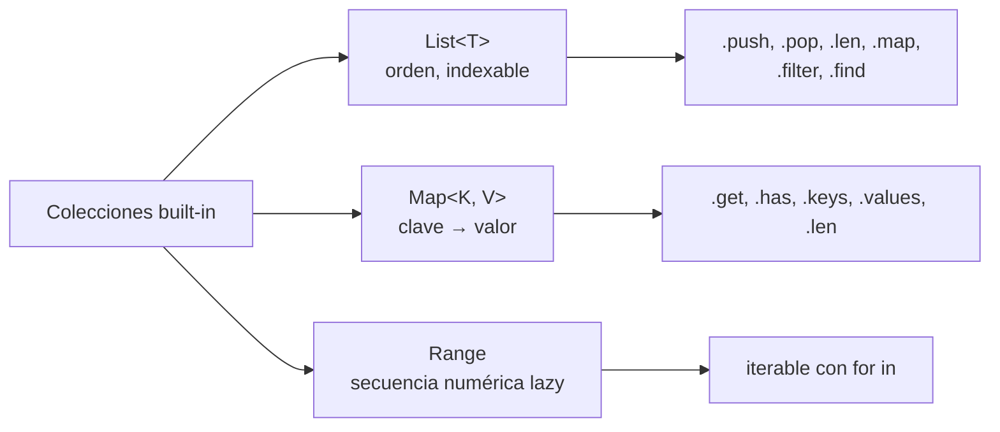

# M2.C5 — Listas, mapas y rangos

**Pre-requisitos**: [M2.C4 — Loops](c4-loops.md). Sabés iterar
con `for in`, `while`, `loop`.

**Objetivo**: dominar las **3 colecciones built-in** de Fitz —
`List<T>`, `Map<K, V>`, `Range` — con **todos sus métodos**,
todos los patrones canónicos (acceso, mutación, filtrado,
transformación), las semánticas de aliasing, y las limitaciones
del MVP.

**Por qué importa**: cualquier programa que procesa datos
trabaja con colecciones. Aprenderlas bien acá te deja escribir
código declarativo (`xs.filter(...).map(...)`) en vez de loops
manuales para todo.

---

## Mapa de las 3 colecciones



---

## Tabla rápida

| Tipo | Notación | Mutable? | Métodos clave |
|---|---|---|---|
| `List<T>` | `[1, 2, 3]` | ✅ | `push`, `pop`, `len`, `map`, `filter`, `find` |
| `Map<K, V>` | `{"k": v}` | ✅ | `get`, `has`, `keys`, `values`, `len` |
| `Range` | `0..10`, `0..=10` | n/a (lazy) | (iterable con `for in`) |

📚 **Detalle exhaustivo**: [cap 9 — Listas, mapas y rangos](../../guide.md#9-listas-mapas-y-rangos)
de la guía.

---

## Paso 1 — `List<T>` — declaración y acceso

```fitz
let xs = [10, 20, 30, 40, 50]
print(xs)         // [10, 20, 30, 40, 50]
print(xs.len())   // 5
```

Hover sobre `xs` → `xs: List<Int>`. El tipo se infirió del
literal.

### Indexing — `xs[i]`

```fitz
print(xs[0])                  // 10  (primer elemento)
print(xs[2])                  // 30
print(xs[xs.len() - 1])       // 50  (último elemento)
```

**Indices empiezan en 0**, no en 1. Para el último, usá
`xs.len() - 1` (no hay `xs[-1]` ni `xs.last()` en el MVP).

### Errores de indexing

| Caso | Resultado |
|---|---|
| Index válido (0 ≤ i < len) | Devuelve el elemento |
| Index ≥ len o negativo | **Panic en runtime** |

```fitz
print(xs[99])
```

```
✗ index 99 fuera de rango (len=5)
```

Para acceso "seguro" sin panic, el MVP **no tiene** `.get(i)`
en List (solo en Map). Workaround:

```fitz
if (i < xs.len()) {
    print(xs[i])
} else {
    print("fuera de rango")
}
```

### Listas vacías + anotación obligatoria

Sin anotación, una lista vacía infiere `List<Any>`:

```fitz
let xs = []              // List<Any> — el checker no sabe T
xs.push(1)
xs.push("dos")           // ✓ acepta porque Any
```

**Mejor**, anotala:

```fitz
let xs: List<Int> = []
xs.push(1)
xs.push("dos")           // ✗ error del checker
```

### Listas homogéneas vs heterogéneas

| Caso | Acepta `fitz run`? | Acepta `fitz build`? |
|---|---|---|
| `[1, 2, 3]` (homogénea Int) | ✅ | ✅ |
| `[1.0, 2.5]` (homogénea Float) | ✅ | ✅ |
| `["a", "b"]` (homogénea Str) | ✅ | ✅ |
| `[1, 2.5]` (mixto Int+Float) | ✅ promociona a `List<Float>` | ✅ promociona |
| `[1, "dos"]` (mixto Int+Str) | ⚠️ runtime OK como `List<Any>` | ❌ codegen rechaza |
| `[user1, user2]` (homogénea de `type`) | ✅ | ✅ |

> Si necesitás mezcla real, modelá la variación con un `type`
> custom o un `Map<Str, Any>`.

---

## Paso 2 — `List<T>` — mutación

### `.push(v)` — agregar al final

```fitz
let xs = [1, 2, 3]
xs.push(4)
xs.push(5)
print(xs)        // [1, 2, 3, 4, 5]
```

`.push()` devuelve `Null` — su valor es el side effect.

### `.pop()` — quitar el último

**ATENCIÓN**: `.pop()` en Fitz **devuelve el valor directo**
(no `Result`), y **paniquea si la lista está vacía**:

```fitz
let xs = [1, 2, 3]
let ultimo = xs.pop()
print(ultimo)    // 3
print(xs)        // [1, 2]

let empty: List<Int> = []
let nada = empty.pop()    // ← panic: ".pop() sobre lista vacía"
```

Para acceso seguro, chequeá `len()` primero:

```fitz
if (xs.len() > 0) {
    let v = xs.pop()
    // ...
}
```

> Esto es **diferente de `Map.get()`** que SÍ devuelve
> `Result`. Inconsistencia del MVP — deuda comprometida para
> futura uniformización.

### Asignar a un index — `xs[i] = v`

```fitz
let xs = [1, 2, 3, 4]
xs[1] = 999
print(xs)       // [1, 999, 3, 4]
```

Si te pasás del rango → panic igual que indexing.

### Lo que NO existe en el MVP

| Método | Workaround |
|---|---|
| `.insert(i, v)` | Manual: reconstruir la lista con loop |
| `.remove(i)` | Manual: igual |
| `.clear()` | `xs = []` (reasignación) |
| `.reverse()` | Manual con loop hacia atrás |
| `.sort()` | Manual o interop Python con `sorted()` |
| `.join(sep)` | Loop con concatenación |
| `.first()` / `.last()` | `xs[0]` / `xs[xs.len() - 1]` |
| `.is_empty()` | `xs.len() == 0` |
| `.contains(v)` | `xs.find(fn(x) => x == v).is_ok()` (pero `.is_ok()` tampoco existe — pattern con `match`) |

---

## Paso 3 — `List<T>` — métodos higher-order

Pasás una fn como argumento. Vamos a ver fns en profundidad en
C6, pero los patrones para listas ya entran acá:

### `.map(fn(T) -> U) -> List<U>` — transformar

```fitz
let xs = [1, 2, 3, 4, 5]
let dobles = xs.map(fn(x) => x * 2)
print(dobles)        // [2, 4, 6, 8, 10]
print(xs)            // [1, 2, 3, 4, 5]  ← original intacta
```

`.map()` devuelve una **nueva** lista; `xs` no se modifica.

### `.filter(fn(T) -> Bool) -> List<T>` — quedarte con los que matchean

```fitz
let pares = xs.filter(fn(x) => x % 2 == 0)
print(pares)         // [2, 4]
```

El callback **debe retornar `Bool`** (el LSP te marca si no).

### `.find(fn(T) -> Bool) -> Result<T>` — primer match

```fitz
let primer_par = xs.find(fn(x) => x % 2 == 0)
print(primer_par)    // Ok(2)

let primer_neg = xs.find(fn(x) => x < 0)
print(primer_neg)    // Err("no encontrado")
```

`.find()` devuelve `Result<T>` — `Ok(item)` si encuentra, `Err`
si no. **Razón**: a diferencia de Python (`None`) o JavaScript
(`undefined`), Fitz **te fuerza a manejar** el caso "no
encontrado" (con `match` o `?`).

### Encadenar (`.filter(...).map(...)`)

Como devuelven listas, los métodos se encadenan:

```fitz
let xs = [1, 2, 3, 4, 5, 6]
let pares_cuadrados = xs
    .filter(fn(x) => x % 2 == 0)
    .map(fn(x) => x * x)
print(pares_cuadrados)   // [4, 16, 36]
```

> **Las llamadas multi-línea con `.`** son válidas. El parser
> consume el newline antes del próximo `.`.

### Lo que NO existe (todavía)

| Método | Workaround actual |
|---|---|
| `.for_each(fn)` | `for v in xs { fn(v) }` |
| `.reduce(init, fn)` / `.fold(init, fn)` | Manual con `for` |
| `.sum()` / `.product()` | Manual con `for` |
| `.any(fn) -> Bool` / `.all(fn) -> Bool` | Manual con `for` + flag |
| `.take(n)` / `.skip(n)` | Manual con `for ... if (count < n)` |
| `.zip(other)` / `.unzip()` | Manual con loop indexado |

---

## Paso 4 — `Map<K, V>` — declaración y acceso

Pares clave-valor con **orden de inserción preservado**:

```fitz
let m = {"nombre": "Patagonia", "altitud": 350, "habitada": true}

print(m)              // {"nombre": "Patagonia", "altitud": 350, "habitada": true}
print(m["nombre"])    // Patagonia
print(m.len())        // 3
```

### Tipos de keys y values

| Tipo de key | Permitido | Notas |
|---|---|---|
| `Str` | ✅ | Lo más común |
| `Int` | ✅ | También OK |
| `Float` | ⚠️ | Funciona pero discouraged (precisión IEEE) |
| `Bool` | ⚠️ | Funciona (cuál tiene sentido?) |
| Composite (`List`, `Map`, `type` custom) | ❌ | No soportado |

Hover sobre `m` → `m: Map<Str, Any>` (porque values
heterogéneos). Si todos los values son del mismo tipo:

```fitz
let scores: Map<Str, Int> = {"ada": 95, "linus": 88}
```

### Indexing — `m["k"]`

```fitz
print(m["nombre"])     // Patagonia
```

**Si la clave no existe, paniquea**:

```fitz
print(m["xxx"])
```

```
✗ clave no encontrada en mapa: 'xxx'
```

Para acceso seguro, usá `.get(k)` (próximo paso).

### Asignar a una clave — `m["k"] = v`

```fitz
m["habitada"] = false       // sobreescribe
m["pais"] = "Argentina"     // agrega nueva (si no existía)
print(m)
```

Si el value es de tipo incompatible con `Map<K, V>` declarado,
el checker te marca.

---

## Paso 5 — `Map<K, V>` — métodos

### `.get(k) -> Result<V>` — acceso seguro

```fitz
let v = m.get("nombre")
print(v)                 // Ok("Patagonia")

let no_existe = m.get("xxx")
print(no_existe)         // Err("clave no encontrada: xxx")
```

### Patrón canónico para defaults

```fitz
let nombre = match m.get("nombre") {
    Ok(v) => v,
    Err(_) => "default"
}
```

(Match lo vemos en C7. Por ahora notá: con `.get` + `match`
nunca paniqueás.)

### `.has(k) -> Bool`

```fitz
print(m.has("nombre"))   // true
print(m.has("xxx"))      // false
```

Útil cuando solo querés "¿está la clave?" sin usar el valor.

### `.keys()` / `.values()`

Devuelven listas:

```fitz
print(m.keys())          // ["nombre", "altitud", "habitada"]
print(m.values())        // ["Patagonia", 350, true]
```

Útil para iterar:

```fitz
for k in m.keys() {
    print("{k} → {m[k]}")
}
```

```
nombre → Patagonia
altitud → 350
habitada → true
```

### `.len() -> Int`

Cantidad de pares en el mapa:

```fitz
print(m.len())     // 3
```

### Lo que NO existe en el MVP

| Método | Workaround |
|---|---|
| `.remove(k)` / `.delete(k)` | No hay; deuda |
| `.contains_value(v)` | Manual con `for v in m.values()` |
| `.clear()` | `m = {}` (reasignación) |
| `.merge(other)` | Manual con loop |
| Iteración directa `for k, v in m` | Usá `for k in m.keys() { let v = m[k] }` |

---

## Paso 6 — `Range` — secuencias numéricas

Vimos rangos en C4 como argumentos de `for in`. Pero **un rango
es un valor**:

```fitz
let r = 0..5
print(r)         // 0..5

for v in r {
    print(v)
}
```

```
0..5
0
1
2
3
4
```

### Tabla

| Notación | Inclusivo del end? | Iterando |
|---|---|---|
| `start..end` | ❌ exclusivo | `start, start+1, ..., end-1` |
| `start..=end` | ✅ inclusivo | `start, start+1, ..., end` |

### Lazy — no materializa

```fitz
let big = 0..1_000_000
// ← consumo O(1) en memoria; nada se itera todavía

for v in big {
    if (v > 5) { break }
    print(v)
}
```

Iterar `0..1_000_000` es **O(1) en memoria**, no aloca toda la
secuencia.

### Solo `Int` (no Float)

```fitz
for f in 0.0..1.0 {       // ← error: solo Int en ranges
    print(f)
}
```

Para iterar floats, usá `Int` y dividí:

```fitz
for i in 0..10 {
    let f = i / 10.0      // 0.0, 0.1, 0.2, ...
    print(f)
}
```

### Re-iterable

```fitz
let r = 0..5
for v in r { print(v) }   // imprime 0..4
for v in r { print(v) }   // imprime 0..4 de nuevo
```

A diferencia de iteradores de Python (que se agotan), los
rangos en Fitz son re-iterables.

---

## Paso 7 — `.len()` global vs método

`.len()` funciona como **método** en `List`, `Map`, y `Str`:

```fitz
print([1, 2, 3].len())      // 3
print({"a": 1}.len())       // 1
print("hola".len())         // 4
```

También está como **builtin global**: `len(x)`:

```fitz
print(len([1, 2, 3]))       // 3
print(len("hola"))           // 4
print(len({"a": 1}))         // 1
```

Las dos formas son equivalentes; **el método es más
idiomático** en Fitz (consistencia con `.map`, `.filter`,
etc.).

---

## Paso 8 — Semántica de referencias (importante)

Listas, mapas y `type` custom son **representados internamente
como referencias** (`Arc<Mutex<...>>`). Si bindeás la misma
lista en dos vars, **mutar una afecta a la otra**:

```fitz
let xs = [1, 2, 3]
let ys = xs              // ← misma lista, dos nombres
ys.push(4)
print(xs)                // [1, 2, 3, 4]  ← xs también ve el cambio
```

Si querés copiar la lista, **no hay `.clone()` en el MVP**.
Workaround:

```fitz
let xs = [1, 2, 3]
let ys = xs.map(fn(x) => x)   // copia via map identidad
ys.push(4)
print(xs)                // [1, 2, 3]
print(ys)                // [1, 2, 3, 4]
```

> Esto se va a refinar — `.clone()` o `[...xs]` (spread) es
> deuda comprometida.

---

## Paso 9 — Aplicarlo a `mi-saludos`

Mini-catálogo realista. Editá `src/main.fitz`:

```fitz
let lugares = [
    {"nombre": "Bariloche",  "altitud": 893,  "habitantes": 112000},
    {"nombre": "El Chaltén", "altitud": 405,  "habitantes": 2000},
    {"nombre": "Ushuaia",    "altitud": 23,   "habitantes": 82000},
]

print("Catálogo patagónico:")
for lugar in lugares {
    print("  - {lugar[\"nombre\"]}: {lugar[\"altitud\"]} m, {lugar[\"habitantes\"]} hab.")
}

// filter
let altos = lugares.filter(fn(l) => l["altitud"] > 100)
print("")
print("Pueblos de altura (>100m): {altos.len()}")
for a in altos {
    print("  - {a[\"nombre\"]}")
}

// find + Result
let primera_grande = lugares.find(fn(l) => l["habitantes"] > 50000)
print("")
print("Primera ciudad grande: {primera_grande}")

// map para extraer una columna
let nombres = lugares.map(fn(l) => l["nombre"])
print("")
print("Nombres: {nombres}")

// Chain
let nombres_altos = lugares
    .filter(fn(l) => l["altitud"] > 50)
    .map(fn(l) => l["nombre"])
print("")
print("Nombres de >50m: {nombres_altos}")

// Map para contar por categoría
let contador: Map<Str, Int> = {"chico": 0, "mediano": 0, "grande": 0}
for l in lugares {
    let h = l["habitantes"]
    if (h < 10000) {
        contador["chico"] += 1
    } else if (h < 100000) {
        contador["mediano"] += 1
    } else {
        contador["grande"] += 1
    }
}
print("")
print("Contador: {contador}")
```

```bash
fitz run
```

```
Catálogo patagónico:
  - Bariloche: 893 m, 112000 hab.
  - El Chaltén: 405 m, 2000 hab.
  - Ushuaia: 23 m, 82000 hab.

Pueblos de altura (>100m): 2
  - Bariloche
  - El Chaltén

Primera ciudad grande: Ok({"nombre": "Bariloche", "altitud": 893, "habitantes": 112000})

Nombres: ["Bariloche", "El Chaltén", "Ushuaia"]

Nombres de >50m: ["Bariloche", "El Chaltén"]

Contador: {"chico": 1, "mediano": 1, "grande": 1}
```

---

## Paso 10 — Limitaciones MVP (cuadro resumen)

### List

| Feature | Estado |
|---|---|
| Indexing `xs[i]` | ✅ (panic si OOB) |
| `.push`, `.pop`, `.len`, `.map`, `.filter`, `.find` | ✅ |
| `.first`, `.last`, `.is_empty`, `.contains`, `.reverse`, `.sort`, `.join`, `.slice`, `.clone` | ❌ |
| Heterogéneas | ⚠️ runtime OK, codegen rechaza |
| Aliasing por referencia | ✅ (intencional) |
| Spread `[...xs, ...ys]` | ❌ |
| Destructuring `let [a, b] = xs` | ❌ |

### Map

| Feature | Estado |
|---|---|
| Indexing `m[k]` | ✅ (panic si key falta) |
| `.get`, `.has`, `.keys`, `.values`, `.len` | ✅ |
| `.remove`, `.delete`, `.merge`, `.clear` | ❌ |
| Composite keys | ❌ |
| Iteración directa `for k, v in m` | ❌ (usá `for k in m.keys()`) |

### Range

| Feature | Estado |
|---|---|
| `0..N` y `0..=N` | ✅ |
| `r..` (infinito) | ❌ |
| `..N` (open start) | ❌ |
| `start..end..step` | ❌ |
| Re-iterable | ✅ |
| Float ranges | ❌ |

---

## Validación

- [ ] `let xs = [1,2,3]`; `xs.map(fn(x) => x * 2)` devuelve
      `[2, 4, 6]`.
- [ ] `xs.filter(fn(x) => x % 2 == 0)` te queda solo con los
      pares.
- [ ] `m["k"]` con clave existente devuelve el valor; con clave
      inexistente paniquea.
- [ ] `m.get("xxx")` con clave inexistente devuelve `Err(...)`
      (no paniquea).
- [ ] `for v in 0..5` itera `0, 1, 2, 3, 4`; `for v in 0..=5`
      incluye el `5`.
- [ ] `xs.pop()` sobre lista vacía paniquea.

---

## Troubleshooting

### `xs.find(...)` me devuelve `Ok(...)` y necesito el valor adentro

Es un `Result<T>`. En M2.C7 vemos `match` para destructurar.
Patrón quick:

```fitz
match xs.find(p) {
    Ok(v) => print(v),
    Err(_) => print("nada")
}
```

### `fitz build` me dice "lista heterogénea no soportada"

El intérprete acepta `[1, "dos"]` pero el codegen no.
Reescribilo homogéneo (todos Int o todos Str), o modelá la
variación con un `type` custom (C7).

### El `for in` sobre un mapa no funciona directo

Fitz no implementa `for in m` sobre Map. Usá `for k in m.keys()`
o `for v in m.values()`.

### No hay `.contains()` o `.indexOf()` en List

En el MVP no están como métodos dedicados. Workaround:

```fitz
let encontrado = match xs.find(fn(x) => x == buscado) {
    Ok(_) => true,
    Err(_) => false
}
```

### Hice `let ys = xs` y modifico `ys`, pero `xs` también cambia

Es **aliasing intencional** — listas, maps y `type` custom son
referencias. Para copiar:

```fitz
let ys = xs.map(fn(x) => x)
```

### `xs.pop()` en mi código devuelve `Ok(...)` en la guía

Diferencia con C7 (tipos custom + Result). **`.pop()` en
realidad devuelve T directo** y paniquea si vacío.
Inconsistencia documentada del MVP — `.get(k)` de Map sí
devuelve Result.

---

## Lo que viene en C6

Hasta acá las **fns las usamos siempre inline con `fn(x) => ...`**.
En el próximo cap aprendemos a **definir y nombrar fns
propias** con todas las variantes: con/sin anotaciones, return
explícito vs flecha, higher-order completo (fn que recibe o
devuelve fn), closures, y **`fitz test` con `@test fn`** para
testear todo lo que escribiste.
