# M2.C6 — Funciones (+ `fitz test`)

**Pre-requisitos**: [M2.C5 — Listas, mapas y rangos](c5-listas-mapas-rangos.md).
Sabés trabajar con colecciones y usar callbacks inline con
`.map`/`.filter`/`.find`.

**Objetivo**: dominar todas las **formas de declarar
funciones** (bloque vs arrow, con/sin anotaciones, defaults
para params), **higher-order** completo (fn que recibe o
devuelve fn), **closures**, recursión, **`fitz test` con
`@test`** y las 4 assertions built-in.

**Por qué importa**: las funciones son **la unidad fundamental
de reuso** del lenguaje. Hasta acá tu código era inline en
`main.fitz` — ahora aprendés a partirlo en pedazos testeables
y reusables. Y `fitz test` te deja escribir tests sin
instalar nada extra.

---

## Mapa del cap

```mermaid
flowchart TD
    A[Definir funciones] --> B[Forma bloque<br/>fn nombre&#40;...&#41; -> Ret &#123; ... return ... &#125;]
    A --> C[Forma arrow<br/>fn nombre&#40;...&#41; -> Ret => expr]
    A --> D[Con / sin anotaciones]
    A --> E[Defaults en params]
    F[Higher-order] --> G[Pasar fn como arg]
    F --> H[Devolver fn]
    F --> I[Closures<br/>capturan el entorno]
    J[Testing] --> K[&commat;test fn]
    J --> L[assert, assert_eq, assert_ne, assert_throws]
    J --> M[fitz test &#40;CLI&#41;]
```



---

## Paso 1 — Forma bloque: `fn name(...) -> Ret { ... }`

```fitz
fn cuadrado(n: Int) -> Int {
    return n * n
}

print(cuadrado(7))      // 49
```

Anatomía:

| Parte | Detalle |
|---|---|
| `fn` | Keyword |
| `cuadrado` | Nombre (convención `snake_case`) |
| `(n: Int)` | Params tipados (anotaciones **fuertemente recomendadas**) |
| `-> Int` | Return type (opcional pero recomendado) |
| `{ return ... }` | Body bloque con `return` explícito |

📚 **Detalle exhaustivo**: [cap 11 — Funciones](../../guide.md#11-funciones)
de la guía.

---

## Paso 2 — Forma arrow: `fn name(...) -> Ret => expr`

Cuando el body es **una sola expresión**, usá `=>`:

```fitz
fn cubo(n: Int) -> Int => n * n * n

print(cubo(3))     // 27
```

Equivalente a `{ return n * n * n }` pero más conciso.

| Convención | Cuándo |
|---|---|
| Arrow (`=>`) | Body de 1 expresión |
| Bloque (`{ }`) | Body con varias líneas o stmts (`print()`, `let`, etc.) |

> **El formatter (`fitz fmt`)** preserva tu elección. Si pusiste
> `=>` con una expresión larga, te queda así; si querés
> expandir, usá bloque a mano.

---

## Paso 3 — Variantes de declaración

### Sin anotaciones (modo gradual)

```fitz
fn doblar(n) => n * 2

print(doblar(21))      // 42
print(doblar(3.5))     // 7.0  (también funciona con Float)
```

**Trade-off**: el LSP no te ayuda en el caller. Sin saber que
`n: Int`, no puede chequear que `doblar("texto")` esté mal.
Para fns públicas o que vivan mucho tiempo, **anotá los tipos**.

### Sin return type

```fitz
fn print_n(n: Int) {
    print(n)
}
```

Implícitamente retorna `Null`. Equivalente a `-> Null`.

### Mixto (params anotados, return inferido)

```fitz
fn duplicar(s: Str) => s + s

print(duplicar("ha"))     // haha
```

El return se infiere del body.

### Tabla resumen

| Caso | Sintaxis | Cuándo |
|---|---|---|
| Anotación completa | `fn f(x: Int) -> Int => x * 2` | API pública, valores externos |
| Sin return type | `fn f(x: Int) => x * 2` | Local, return obvio del body |
| Sin nada | `fn f(x) => x * 2` | Prototipo rápido, gradual |
| Solo bloque | `fn f(x: Int) -> Int { ... return ... }` | Body con varias líneas |

---

## Paso 4 — Defaults en params

Los params pueden tener **valor default**:

```fitz
fn greet(name: Str = "amigo") {
    print("hola, {name}")
}

greet()              // hola, amigo
greet("Ada")         // hola, Ada
```

### Reglas

| Regla | Detalle |
|---|---|
| Params con default deben ir **al final** | `fn f(x: Int, y: Int = 0)` ✓; `fn f(y: Int = 0, x: Int)` ✗ |
| Default puede ser cualquier expresión | `fn f(now: Int = 1000)`, `fn f(s: Str = "x")` |
| Param nullable con default `null` | `fn f(name: Str? = null)` |

### Defaults con `null` (Nullable)

```fitz
fn greet(name: Str, prefix: Str? = null) {
    if (prefix != null) {
        print("{prefix}, {name}")
    } else {
        print("hola, {name}")
    }
}

greet("Ada")                  // hola, Ada
greet("Linus", "Saludos")     // Saludos, Linus
```

---

## Paso 5 — Llamar a una fn

Sintaxis estándar — nombre + paréntesis con args:

```fitz
fn saludar(quien: Str) -> Str {
    return "hola {quien}"
}

let msg = saludar("Patagonia")
print(msg)        // hola Patagonia
print(saludar("Ada"))   // hola Ada
```

### Lo que NO existe en el MVP

| Feature | Estado | Workaround |
|---|---|---|
| Named arguments (`f(x: 1, y: 2)`) | ❌ | Posicionales |
| Variadic (`fn f(...args)`) | ❌ | Pasar una lista |
| Spread call (`f(...args)`) | ❌ | Pasar args explícitos |
| Generics (`fn f<T>(x: T)`) | ❌ | Usar `Any` o anotaciones específicas |
| Sobrecarga (varias `fn` con el mismo nombre) | ❌ | Nombres distintos |

### Misma fn como var

Si declarás `fn len(x: Int) -> Int`, tu fn **gana** sobre el
built-in `len` (shadowing).

---

## Paso 6 — Recursión

Las fns pueden llamarse a sí mismas:

```fitz
fn factorial(n: Int) -> Int {
    if (n <= 1) { return 1 }
    return n * factorial(n - 1)
}

print(factorial(5))     // 120
print(factorial(10))    // 3628800
```

### Recursión mutua

Dos fns que se llaman entre sí. **Fitz las acepta** —
top-level fns son visibles antes de declararse (hoisted):

```fitz
fn es_par(n: Int) -> Bool {
    if (n == 0) { return true }
    return es_impar(n - 1)
}

fn es_impar(n: Int) -> Bool {
    if (n == 0) { return false }
    return es_par(n - 1)
}

print(es_par(4))     // true
print(es_par(7))     // false
```

### Tail-call optimization

Fitz **NO tiene TCO** (tail-call optimization). Recursión muy
profunda (>~10_000 nivel) puede romper el stack. Para
recursión pesada, convertir a loop iterativo.

---

## Paso 7 — Higher-order: fn que recibe fn

Una fn puede tomar otra fn como argumento:

```fitz
fn aplicar(f: Fn(Int) -> Int, x: Int) -> Int {
    return f(x)
}

fn cuadrado(n: Int) -> Int => n * n

print(aplicar(cuadrado, 7))             // 49
print(aplicar(fn(n) => n + 100, 5))     // 105
```

El tipo `Fn(Int) -> Int` se lee como "una fn que recibe un Int y
devuelve un Int". `Fn` es **una keyword** del lenguaje (no un tipo
nominal). Acepta cero o más params: `Fn() -> Str`, `Fn(Int, Str) -> Bool`,
etc. El return type es obligatorio en la sintaxis.

> **Inferencia bidireccional (desde v0.15.0)**: notá que el callback
> `fn(n) => n + 100` no anota `n: Int`. El checker lo infiere del
> tipo del param `f: Fn(Int) -> Int` — el `Int` del primer slot del
> `Fn(...)` se propaga al param `n` del callback. Si querés anotar
> explícitamente, podés (`fn(n: Int) => ...`); la anotación gana
> sobre el hint del receptor.

> **Alternativa gradual** (más laxa, sin chequeo de tipo): si no
> anotás `f` (`fn aplicar(f, x: Int)`), el checker trata `f` como
> `Any` — el call funciona pero perdés el chequeo estático de aridad
> y tipos. Útil para prototipos rápidos; en código de producción
> preferí siempre anotar.

### El callback puede ser inline (`fn(x) => ...`)

Lo viste ya con `.map`/`.filter`:

```fitz
let xs = [1, 2, 3]
let cuadrados = xs.map(fn(x) => x * x)
print(cuadrados)       // [1, 4, 9]
```

`fn(x) => x * x` es un **valor de tipo función** anónimo.

### Tabla de usos típicos

| Caso | Ejemplo |
|---|---|
| Predicate para filter | `xs.filter(fn(x) => x > 0)` |
| Transformer para map | `xs.map(fn(x) => x.upper())` |
| Comparator para sort (futuro) | `xs.sort(fn(a, b) => a - b)` |
| Callback async | `setTimeout(fn() => print("tic"), 1000)` |
| Strategy pattern | `procesar(datos, fn(d) => ...)` |

---

## Paso 8 — Higher-order: fn que devuelve fn (closures)

Casos como configurar un callback parametrizado:

```fitz
fn make_adder(n: Int) {
    return fn(x) => x + n
}

let add5 = make_adder(5)
let add100 = make_adder(100)

print(add5(10))       // 15
print(add100(10))     // 110
```

`make_adder(5)` te devuelve una **closure** que recordó `n=5`.

### Captura por valor en el momento de creación

El closure captura `n` **en el momento de creación**. Si después
modificás `n` afuera, el closure ya tiene su copia:

```fitz
let n = 5
let f = fn(x) => x + n      // captura n=5
n = 100                      // modificas n afuera
print(f(10))                 // 15 (no 110)
```

> Esto es **decisión de diseño** — closures inmutables sobre
> el env capturado son más predecibles que captura por
> referencia.

### Patrones útiles

| Patrón | Ejemplo |
|---|---|
| Partial application | `let saludar_ada = fn() => greet("Ada")` |
| Currying | `fn add(a) { return fn(b) => a + b }` → `add(2)(3)` |
| Decorator | `fn log(f) { return fn(x) { print("calling"); return f(x) } }` |
| Strategy parametrizada | `fn make_validator(min: Int) { return fn(x) => x >= min }` |

📚 **Detalle de closures**: [cap 11 — Funciones](../../guide.md#11-funciones)
sección de higher-order.

---

## Paso 9 — `fitz test` con `@test`

Marca cualquier fn con `@test` y `fitz test` la encuentra y la
corre:

```fitz
fn double(n: Int) -> Int => n * 2

@test fn double_funciona() {
    assert_eq(double(21), 42)
}

@test fn double_negativo() {
    assert_eq(double(-5), -10)
}
```

Desde la raíz del proyecto (necesita `fitz.toml`):

```bash
fitz test
```

```
running 2 tests
test src/main.fitz::double_funciona ... ok
test src/main.fitz::double_negativo ... ok

test result: ok. 2 passed; 0 failed; finished in 0.00s
```

Exit 0 si todos pasan, 1 si alguno falla.

### Sintaxis completa de `fitz test`

```
fitz test [OPTIONS] [FILTER]
```

| Argumento / flag | Para qué |
|---|---|
| `FILTER` | Substring del nombre del test para filtrar |
| `--file <FILE>` | Single-file mode (no requiere `fitz.toml`) |

Ejemplos:

```bash
fitz test                       # todos los @test
fitz test double                # solo los que contienen "double" en el nombre
fitz test --file my_test.fitz   # un archivo específico
```

### Las 4 assertion builtins

| Builtin | Sintaxis | Falla si... |
|---|---|---|
| `assert(cond)` | `assert(n > 0)` | `cond` es `false` |
| `assert_eq(a, b)` | `assert_eq(double(21), 42)` | `a != b` |
| `assert_ne(a, b)` | `assert_ne(double(0), 1)` | `a == b` |
| `assert_throws(fn)` | `assert_throws(fn() => panic_fn())` | la fn NO paniquea |

**Las assertions NO aceptan mensaje custom** en el MVP:
- ✅ `assert_eq(a, b)`
- ❌ `assert_eq(a, b, "mensaje")` — da "espera 2 argumentos"

Para contexto, **ponelo en el nombre del test**:

```fitz
@test fn double_con_negativos_devuelve_negativo() {
    assert_eq(double(-5), -10)
}
```

### `@test` no compila a binario

Las fns con `@test` **NO entran** al binario que genera
`fitz build` (paralelo a `#[cfg(test)]` de Rust). Pueden vivir
adentro de tu `src/main.fitz` sin contaminar el ejecutable.

### Restricciones de `@test`

| Regla | Detalle |
|---|---|
| Sin params | `@test fn foo()` ✓; `@test fn foo(x: Int)` ✗ |
| Return cualquier tipo | `@test fn foo() -> Int { ... return 0 }` OK pero no usado |
| Solo sync por defecto | `@test async fn` también funciona, ver Paso 10 |
| Orden de ejecución alfabético | Por nombre de fn dentro del archivo |

### Output con tests que fallan

```fitz
@test fn pasa() {
    assert_eq(1 + 1, 2)
}

@test fn falla() {
    assert_eq(1 + 1, 3)
}
```

```bash
fitz test
```

```
running 2 tests
test src/main.fitz::pasa ... ok
test src/main.fitz::falla ... FAILED

failures:

---- src/main.fitz::falla stdout ----
Error — aserción falló

failures:
    src/main.fitz::falla

test result: FAILED. 1 passed; 1 failed; finished in 0.00s
```

Exit code: 1.

📚 **Detalle exhaustivo**: [cap 24 — `fitz test`](../../guide.md#24---fitz-test--testing-built-in)
de la guía.

---

## Paso 10 — Tests en carpeta `tests/`

Por convención, **tests de integración** van en un dir
separado:

```
mi-saludos/
├── fitz.toml
├── src/
│   └── main.fitz       ← tu código + algunos @test inline
└── tests/
    ├── integration_test.fitz   ← @test fns de integración
    └── users_test.fitz
```

`fitz test` descubre **automáticamente** los `*.fitz` adentro
de `tests/` (top-level del proyecto) y corre sus `@test`.

```bash
fitz test
```

```
running 5 tests
test src/main.fitz::double_funciona ... ok
test tests/integration_test.fitz::end_to_end ... ok
test tests/integration_test.fitz::happy_path ... ok
test tests/users_test.fitz::create_user ... ok
test tests/users_test.fitz::update_user ... ok

test result: ok. 5 passed; 0 failed; finished in 0.05s
```

---

## Paso 11 — Aplicarlo a `mi-saludos`

Refactor con fns + tests. Editá `src/main.fitz`:

```fitz
// Helpers
fn formato_altitud(altitud_m: Int) -> Str {
    if (altitud_m > 1000) {
        return "altura"
    } else if (altitud_m > 200) {
        return "media"
    } else {
        return "llanura"
    }
}

fn formato_lugar(lugar) -> Str {
    let cat = formato_altitud(lugar["altitud"])
    return "{lugar[\"nombre\"]}: {lugar[\"altitud\"]} m ({cat})"
}

// Higher-order: aplicar a una lista
fn aplicar_a_todos(lugares, f) -> List<Str> {
    return lugares.map(f)
}

// Closure: builder de filtros
fn make_filter_altitud(min: Int) {
    return fn(l) => l["altitud"] > min
}

let lugares = [
    {"nombre": "Bariloche",  "altitud": 893},
    {"nombre": "El Chaltén", "altitud": 405},
    {"nombre": "Ushuaia",    "altitud": 23},
]

print("Catálogo:")
let descripciones = aplicar_a_todos(lugares, formato_lugar)
for d in descripciones {
    print("  - {d}")
}

print("")
let altos = lugares.filter(make_filter_altitud(100))
print("De más de 100m:")
for a in altos {
    print("  - {a[\"nombre\"]}")
}

// Tests inline
@test fn altitud_alta_es_altura() {
    assert_eq(formato_altitud(1500), "altura")
}

@test fn altitud_media() {
    assert_eq(formato_altitud(500), "media")
}

@test fn altitud_llanura() {
    assert_eq(formato_altitud(100), "llanura")
}

@test fn limite_exacto_200_es_llanura() {
    assert_eq(formato_altitud(200), "llanura")
}

@test fn closure_filter_funciona() {
    let f = make_filter_altitud(100)
    let resultado = f({"altitud": 150})
    assert(resultado)
    let resultado2 = f({"altitud": 50})
    assert(not resultado2)
}
```

```bash
fitz run
```

```
Catálogo:
  - Bariloche: 893 m (media)
  - El Chaltén: 405 m (media)
  - Ushuaia: 23 m (llanura)

De más de 100m:
  - Bariloche
  - El Chaltén
```

> Notá que `Bariloche` salió `media` aunque tiene `893 m` —
> nuestro umbral de "altura" es 1000m. Los tests capturan esto:

```bash
fitz test
```

```
running 5 tests
test src/main.fitz::altitud_alta_es_altura ... ok
test src/main.fitz::altitud_llanura ... ok
test src/main.fitz::altitud_media ... ok
test src/main.fitz::closure_filter_funciona ... ok
test src/main.fitz::limite_exacto_200_es_llanura ... ok

test result: ok. 5 passed; 0 failed; finished in 0.00s
```

Todos verdes. Si cambiás `formato_altitud` y rompés algo, el
próximo `fitz test` te lo dice.

---

## Validación

- [ ] Definís `fn cuadrado(n: Int) -> Int => n * n` y
      `cuadrado(7)` devuelve `49`.
- [ ] `fn greet(name: Str = "amigo")` aceptá `greet()` y
      `greet("Ada")` ambos.
- [ ] `fn make_adder(n: Int) { return fn(x) => x + n }` produce
      closures que recuerdan `n`.
- [ ] Recursión simple (`factorial(5)`) devuelve `120`.
- [ ] `@test fn nombre() { assert_eq(a, b) }` aparece en
      `fitz test` con status `ok`/`FAILED`.
- [ ] `fitz test` exit 1 cuando un test falla; exit 0 cuando
      todos pasan.
- [ ] `fitz test pattern` filtra tests por substring.

---

## Troubleshooting

### `error: la función 'X' espera N argumento(s), recibió M`

Conteo de args mal. El LSP también te lo marca en vivo.

### `error: se esperaba un nombre de tipo` cuando anoto `f: fn(Int) -> Int`

Limitación del parser: los tipos funcionales en anotaciones
**no se aceptan todavía**. Dejá el param sin anotar (gradual)
hasta que el lenguaje los soporte.

### `fitz test` no encuentra mis tests

- `fitz test` busca `fitz.toml` en cwd/ancestros. ¿Estás
  parado en la raíz del proyecto?
- ¿La fn tiene el decorator `@test`? Sin él, la fn es regular y
  no se descubre.
- ¿La fn tiene parámetros? `@test fn` **debe ser sin params**
  (los tests son self-contained).

### Mi test pasa local pero falla en CI

¿Dependes de archivos del filesystem o del orden de tests? Los
`@test` corren **en orden alfabético** por fn name, no por
orden en el archivo. Hacé cada test self-contained.

### `assert_eq(a, b, "mensaje")` me dice "espera 2 argumentos"

Las assertions del MVP **no aceptan mensaje custom**. Si querés
contexto, ponelo en el nombre del test:
`@test fn double_con_negativo_devuelve_negativo()`.

### Stack overflow en recursión profunda

Fitz no tiene TCO. Recursión muy profunda (>~10k) rompe.
Convertí a loop iterativo:

```fitz
// En vez de:
fn sum_recursive(n: Int) -> Int {
    if (n == 0) { return 0 }
    return n + sum_recursive(n - 1)
}

// Hacé:
fn sum_iterative(n: Int) -> Int {
    let total = 0
    for i in 1..=n { total += i }
    return total
}
```

### Closure no captura el valor que esperaba

Las closures capturan **al momento de crear**, no por
referencia. Si modificás la var afuera, el closure ya tiene su
copia.

---

## Lo que viene en C7

Hasta acá modelaste "data" con primitivos, listas y mapas. En
el próximo cap aprendés **`type`** — el equivalente de
`struct`/`class`/`interface` de otros lenguajes. Con
`type User { id: Int, name: Str }` definís tu propio tipo, lo
instanciás con struct literal, accedés a sus fields. Y
aprovechamos para ver **`match`** completo (no solo sobre
Result, sino sobre cualquier valor — patrones, ranges,
exhaustividad).

**C7 cierra M2**. Después arrancamos M3 (módulos y organización).
