# M2.C7 — `type` (tipos custom) + `match` + `Result` + `?`

**Pre-requisitos**: [M2.C6 — Funciones](c6-funciones.md). Sabés
definir fns, pasar callbacks, devolver clausuras, y testear con
`fitz test`.

**Objetivo**: dominar `type` con **todas sus variantes** —
defaults, nullables, anidados, igualdad estructural — y
**`match`** completo (literales, ranges, guards, exhaustividad
sobre `Result`), `Result<T>` como manejo de errores
canónico, y el operador **`?`** para propagación.

**Por qué importa**: hasta acá tus datos eran "primitivos
sueltos" o "maps anónimos". `type` te deja **nombrar tu
dominio** (`User`, `Order`, `Producto`) y darle estructura
tipada. `match` + `Result` es **el modelo de errores de
Fitz** (sin excepciones).

**Este cap CIERRA M2** — al terminar tenés el lenguaje base
entero a tu disposición.

---

## Mapa del cap

```mermaid
flowchart LR
    A[type custom] --> B[Definir<br/>type Name &#123; fields &#125;]
    A --> C[Instanciar<br/>Name &#123; field: valor &#125;]
    A --> D[Field access<br/>obj.field]
    A --> E[Defaults<br/>field: T = default]
    A --> F[Nullables<br/>field: T?]
    G[match] --> H[Sobre Result<br/>Ok&#40;v&#41; / Err&#40;e&#41;]
    G --> I[Sobre literales / ranges]
    G --> J[Con guards &#40;_ if cond&#41;]
    G --> K[Como expresión con valor]
    L[Result + ?] --> M[Ok&#40;v&#41; / Err&#40;e&#41;]
    L --> N[? propaga errores]
```



---

## Paso 1 — Definir un `type`

```fitz
type User {
    id: Int
    name: Str
    email: Str?
    activo: Bool = true
}
```

### Anatomía

| Parte | Detalle |
|---|---|
| `type` | Keyword |
| `User` | Nombre (convención `PascalCase`) |
| `{ ... }` | Bloque de fields |
| `id: Int` | Field requerido (sin default) |
| `email: Str?` | Field **nullable** (default implícito `null`) |
| `activo: Bool = true` | Field con **default explícito** |

### Sintaxis de fields

```
<nombre>: <Tipo>                    # requerido sin default
<nombre>: <Tipo>?                   # nullable, default implícito null
<nombre>: <Tipo> = <valor>          # con default explícito
<nombre>: <Tipo>? = <valor>         # nullable con default no-null
```

📚 **Detalle exhaustivo**: [cap 12 — Tipos con `type`](../../guide.md#12-tipos-con-type)
de la guía.

---

## Paso 2 — Instanciar con struct literal

```fitz
let u = User { id: 1, name: "Ada" }
print(u)
```

```
User { id: 1, name: "Ada", email: null, activo: true }
```

Lo que pasó:
- `id: 1` y `name: "Ada"` — provistos.
- `email` — no provisto, default a `null` (nullable).
- `activo` — no provisto, default a `true` (explícito).

### Con todos los fields

```fitz
let u2 = User {
    id: 2,
    name: "Linus",
    email: "linus@kernel.org",
    activo: false
}
print(u2)
```

```
User { id: 2, name: "Linus", email: "linus@kernel.org", activo: false }
```

### Multi-línea vs una línea

| Caso | Estilo |
|---|---|
| 1-3 fields cortos | Una línea: `User { id: 1, name: "Ada" }` |
| 4+ fields o values largos | Multi-línea con trailing comma |

```fitz
let u = User {
    id: 1,
    name: "Ada Lovelace",
    email: "ada@example.com",
    activo: true,
}
```

> **`fitz fmt`** normaliza el estilo según largo. Trailing comma
> solo en multi-línea.

### Si te falta un field requerido

```fitz
let bad = User { id: 3 }     // ← falta name
```

```
✗ Error en línea 1:11 — falta el campo requerido `name`
```

El checker lo agarra **en tiempo de compilación**.

### Si pasás un field que no existe

```fitz
let bad = User { id: 1, name: "x", xyz: 99 }
```

```
✗ Error — el campo `xyz` no existe en el tipo `User`
```

---

## Paso 3 — Field access (`obj.campo`)

```fitz
let u = User { id: 1, name: "Ada", email: "ada@example.com" }

print(u.id)        // 1
print(u.name)      // Ada
print(u.email)     // ada@example.com
print(u.activo)    // true
```

Hover sobre `u.email` → `u.email: Str?` (nullable). El LSP
propaga el tipo declarado del field.

### Mutar fields

```fitz
u.activo = false
print(u.activo)    // false
```

Las instancias son **mutables por default** (mismo modelo que
las vars). No hay keyword `let mut` ni `final`.

### Field access encadenado

```fitz
type Persona { nombre: Str, dir: Direccion? }
type Direccion { calle: Str, ciudad: Str }

let p = Persona {
    nombre: "Ada",
    dir: Direccion { calle: "Av X", ciudad: "BA" }
}

print(p.dir)              // Direccion { calle: "Av X", ciudad: "BA" }
print(p.dir.calle)        // ⚠️ error si p.dir es null!
```

> **`p.dir` es `Direccion?`** — antes de acceder a `.calle`,
> chequeá que no sea null:
>
> ```fitz
> if (p.dir != null) {
>     print(p.dir.calle)
> }
> ```

---

## Paso 4 — Tipos anidados y composición

`type` puede tener fields de otros `type`s:

```fitz
type Direccion {
    calle: Str
    numero: Int
    ciudad: Str
}

type Persona {
    nombre: Str
    edad: Int
    dir: Direccion?
}

let p = Persona {
    nombre: "Ada",
    edad: 36,
    dir: Direccion { calle: "Av X", numero: 100, ciudad: "BA" }
}

print(p)
```

```
Persona { nombre: "Ada", edad: 36, dir: Direccion { calle: "Av X", numero: 100, ciudad: "BA" } }
```

Display recursivo automático.

### Lista de instancias

```fitz
type User { id: Int, name: Str }

let users: List<User> = [
    User { id: 1, name: "Ada" },
    User { id: 2, name: "Linus" },
    User { id: 3, name: "Grace" }
]

for u in users {
    print(u.name)
}
```

### Map con valores de tipos custom

```fitz
let by_id: Map<Int, User> = {
    1: User { id: 1, name: "Ada" },
    2: User { id: 2, name: "Linus" }
}

print(by_id[1].name)     // Ada
```

---

## Paso 5 — Igualdad estructural

Dos instancias son iguales si **todos los fields son iguales**:

```fitz
let u1 = User { id: 1, name: "Ada" }
let u2 = User { id: 1, name: "Ada" }
let u3 = User { id: 2, name: "Ada" }

print(u1 == u2)    // true
print(u1 == u3)    // false (id distinto)
```

Recursivo para fields que son `type`s:

```fitz
let p1 = Persona { nombre: "A", dir: Direccion { calle: "X", ciudad: "BA" } }
let p2 = Persona { nombre: "A", dir: Direccion { calle: "X", ciudad: "BA" } }
print(p1 == p2)    // true
```

---

## Paso 6 — `match` — la herramienta canónica

`match <scrutinee> { <patrón> => <expr>, ... }` — destructura
y reacciona a un valor.

### Sintaxis

```
match <expr> {
    <patrón1> => <expr1>,
    <patrón2> => <expr2>,
    _ => <fallback>          // catch-all (opcional)
}
```

Cada arm:
- **Patrón**: literal, ident binding, `_`, `Ok(...)`, `Err(...)`,
  range, etc.
- **`=>`**: separador
- **Body**: una expresión o un bloque

El **último arm no necesita coma** (opcional).

### Sobre literales

```fitz
fn dia_de_semana(n: Int) -> Str => match n {
    1 => "lunes",
    2 => "martes",
    3 => "miércoles",
    4 => "jueves",
    5 => "viernes",
    6 => "sábado",
    7 => "domingo",
    _ => "número inválido"
}

print(dia_de_semana(3))    // miércoles
print(dia_de_semana(99))   // número inválido
```

### Sobre strings

```fitz
fn traducir(idioma: Str) -> Str => match idioma {
    "es" => "español",
    "en" => "inglés",
    "fr" => "francés",
    _ => "desconocido"
}

print(traducir("es"))      // español
print(traducir("ja"))      // desconocido
```

### Sobre rangos

```fitz
fn categoria_edad(edad: Int) -> Str => match edad {
    0..=12  => "niño",
    13..=17 => "adolescente",
    18..=64 => "adulto",
    _       => "adulto mayor"
}

print(categoria_edad(8))     // niño
print(categoria_edad(30))    // adulto
print(categoria_edad(75))    // adulto mayor
```

### Wildcard (`_`) e Ident binding

| Patrón | Qué hace |
|---|---|
| `_` | matchea cualquier cosa, NO bindea |
| `x` (cualquier ident) | matchea cualquier cosa, bindea a `x` adentro del arm |

```fitz
let n = 42
match n {
    0 => print("cero"),
    x => print("número: {x}"),     // bindea x al valor de n
}
```

### Con guards (`_ if cond`)

Una condición extra sobre el patrón:

```fitz
let m = 15
let label = match m {
    0 => "cero",
    x if x > 0 => "positivo: {x}",
    x => "negativo: {x}"        // catch-all (x ya es <0 acá)
}
print(label)    // positivo: 15
```

📚 **Detalle exhaustivo**: [cap 10 — Match](../../guide.md#10-match)
de la guía.

---

## Paso 7 — `Result<T>` — manejo de errores sin excepciones

Fitz **no tiene excepciones**. Los errores se manejan con
`Result<T>`:

```fitz
type Result<T> = Ok(T) | Err(Str)     // (conceptual — no escribís esto)
```

Tres formas de construir:

```fitz
let ok = Ok(42)              // Result<Int>
let err = Err("falló")       // Result<Any> (el T se infiere del uso)
let ok_str: Result<Str> = Ok("hola")
```

### Fns que pueden fallar retornan `Result`

```fitz
fn dividir(a: Int, b: Int) -> Result<Int> {
    if (b == 0) {
        return Err("división por cero")
    }
    return Ok(a / b)
}

print(dividir(10, 2))    // Ok(5)
print(dividir(10, 0))    // Err("división por cero")
```

### Patrones canónicos para construir

| Caso | Patrón |
|---|---|
| Éxito | `return Ok(valor)` |
| Falla con mensaje | `return Err("descripción")` |
| Operación que no tiene tipo de "ok" | `Ok(Null)` o usá fn que devuelva Null directo |

---

## Paso 8 — `match` sobre `Result` (con exhaustividad)

El uso más común de `match`: destructurar `Result<T>`:

```fitz
let users = [
    User { id: 1, name: "Ada" },
    User { id: 2, name: "Linus" }
]

let resultado = match users.find(fn(u) => u.id == 1) {
    Ok(u) => "encontrado: {u.name}",
    Err(_) => "no existe"
}

print(resultado)   // encontrado: Ada
```

### Patrones para Result

| Patrón | Matchea | Bindea |
|---|---|---|
| `Ok(x)` | cualquier `Ok(*)` | `x` = el valor adentro |
| `Ok(_)` | cualquier `Ok(*)` | nada |
| `Err(e)` | cualquier `Err(*)` | `e` = el mensaje (Str) |
| `Err(_)` | cualquier `Err(*)` | nada |

### Exhaustividad obligatoria

El checker **exige cubrir `Ok` Y `Err`** cuando matcheás sobre
`Result`:

```fitz
let r = match users.find(fn(u) => u.id == 1) {
    Ok(u) => u.name
    // ← falta Err — el checker te lo marca
}
```

```
✗ Error — el `match` sobre `Result<T>` no cubre el variant `Err`
```

**Razón**: esto es **lo que hace que Fitz no necesite
excepciones**. El compilador te fuerza a manejar los errores.

### Catch-all con `_`

Si no necesitás distinguir Ok y Err:

```fitz
let r = match users.find(fn(u) => u.id == 999) {
    _ => "valor por defecto"
}
```

(Pero el linter te marca `useless_match` — sería más claro un
asignación directa.)

---

## Paso 9 — `?` (operador de propagación)

Atajo para "si es Err, retornar el Err; si es Ok, desempacar":

```fitz
fn computar(x: Int, y: Int) -> Result<Int> {
    let q = dividir(x, y)?      // si dividir devuelve Err, computar retorna ese Err
    return Ok(q + 1)
}

print(computar(10, 2))    // Ok(6)
print(computar(10, 0))    // Err("división por cero")
```

Equivalente largo:

```fitz
fn computar(x: Int, y: Int) -> Result<Int> {
    let q = match dividir(x, y) {
        Ok(v) => v,
        Err(e) => return Err(e)
    }
    return Ok(q + 1)
}
```

`?` lo deja en una línea.

### Reglas de `?`

| Regla | Detalle |
|---|---|
| Solo aplicable sobre `Result<T>` | Si lo aplicás a otro tipo, error de tipo |
| La fn contenedora debe retornar `Result<U>` | Sino, "?" no tiene a dónde propagar |
| Cadenas funcionan | `fetch()?.parse()?.process()` |

### Cuándo NO usar `?`

Cuando querés manejar el error localmente:

```fitz
let v = match dividir(10, 0) {
    Ok(v) => v,
    Err(e) => {
        print("Error: {e}")
        0      // valor por default
    }
}
```

📚 **Detalle de Result + `?`**: [cap 14 — Result y manejo de
errores](../../guide.md#14-result-y-manejo-de-errores) de la
guía.

---

## Paso 10 — `match` como expresión

Igual que `if`, `match` devuelve **el valor del arm que mató**.

```fitz
let n = 5
let categoria = match n {
    0 => "cero",
    _ if n > 0 => "positivo",
    _ => "negativo"
}
print(categoria)    // positivo
```

### Gotcha del `return` adentro de fn

Si querés que tu `fn` devuelva el resultado del `match`, **usá
`return` o la arrow form**:

```fitz
// Forma 1 — return explícito
fn cat(n: Int) -> Str {
    return match n {
        0 => "cero",
        _ => "otro"
    }
}

// Forma 2 — arrow
fn cat(n: Int) -> Str => match n {
    0 => "cero",
    _ => "otro"
}
```

**Sin `return`, el `match` se evalúa y descarta** — la fn
devuelve `Null` y te frustrás:

```fitz
fn cat(n: Int) -> Str {
    match n {            // ← sin return
        0 => "cero",
        _ => "otro"
    }
    // ← acá la fn termina sin return → Null
}
print(cat(0))     // null (no "cero")
```

---

## Paso 11 — Limitaciones MVP del `match`

| Feature | Estado |
|---|---|
| Match sobre literal | ✅ Int, Float, Str, Bool, Null |
| Match sobre range | ✅ `0..=10` |
| Match sobre Ok/Err | ✅ con binding o wildcard |
| Wildcard `_` | ✅ |
| Ident binding | ✅ |
| Guards `if cond` | ✅ |
| Exhaustividad sobre Result | ✅ enforced |
| Exhaustividad sobre Bool | ❌ (no enforced) |
| Destructuring `User { id, name }` | ❌ no soportado |
| Or patterns (`Ok(_) \| Err(_)`) | ❌ no soportado |
| Match sobre tipo (`u is User`) | ❌ no soportado |
| Sub-patterns en estructura | ❌ no soportado |

---

## Paso 12 — Aplicarlo a `mi-saludos` — todo junto

Pongamos `type` + `match` + `Result` + `?` + tests. Editá
`src/main.fitz`:

```fitz
type Pueblo {
    nombre: Str
    altitud_m: Int
    habitantes: Int
}

fn categoria(p: Pueblo) -> Str => match p.habitantes {
    0..=999          => "aldea",
    1_000..=9_999    => "pueblo",
    10_000..=99_999  => "ciudad",
    _                => "metrópolis"
}

fn buscar_por_nombre(pueblos: List<Pueblo>, nombre: Str) -> Result<Pueblo> {
    return pueblos.find(fn(p) => p.nombre == nombre)
}

fn describir(pueblos: List<Pueblo>, nombre: Str) -> Result<Str> {
    let p = buscar_por_nombre(pueblos, nombre)?
    return Ok("{p.nombre}: {p.habitantes} hab. — {categoria(p)}")
}

let pueblos = [
    Pueblo { nombre: "El Chaltén", altitud_m: 405,  habitantes: 2000 },
    Pueblo { nombre: "Bariloche",  altitud_m: 893,  habitantes: 112000 },
    Pueblo { nombre: "Ushuaia",    altitud_m: 23,   habitantes: 82000 },
]

print("Catálogo:")
for p in pueblos {
    print("  - {p.nombre} ({p.habitantes} hab.): {categoria(p)}")
}

print("")
print("Búsqueda por nombre:")
let lugares = ["Bariloche", "Inexistente"]
for n in lugares {
    let resultado = describir(pueblos, n)
    match resultado {
        Ok(s) => print("  ✓ {s}"),
        Err(e) => print("  ✗ {e}")
    }
}

// Tests del clasificador
@test fn aldea_chica() {
    let p = Pueblo { nombre: "x", altitud_m: 0, habitantes: 500 }
    assert_eq(categoria(p), "aldea")
}

@test fn ciudad_mediana() {
    let p = Pueblo { nombre: "x", altitud_m: 0, habitantes: 50000 }
    assert_eq(categoria(p), "ciudad")
}

@test fn limite_mil_es_pueblo() {
    let p = Pueblo { nombre: "x", altitud_m: 0, habitantes: 1000 }
    assert_eq(categoria(p), "pueblo")
}

@test fn metropolis() {
    let p = Pueblo { nombre: "x", altitud_m: 0, habitantes: 500000 }
    assert_eq(categoria(p), "metrópolis")
}

@test fn buscar_existente_devuelve_ok() {
    let pueblos = [Pueblo { nombre: "X", altitud_m: 0, habitantes: 100 }]
    let r = buscar_por_nombre(pueblos, "X")
    match r {
        Ok(_) => assert(true),
        Err(_) => assert(false)
    }
}

@test fn buscar_inexistente_devuelve_err() {
    let pueblos = [Pueblo { nombre: "X", altitud_m: 0, habitantes: 100 }]
    let r = buscar_por_nombre(pueblos, "Y")
    match r {
        Ok(_) => assert(false),
        Err(_) => assert(true)
    }
}
```

Corré ambos:

```bash
fitz run
```

```
Catálogo:
  - El Chaltén (2000 hab.): pueblo
  - Bariloche (112000 hab.): metrópolis
  - Ushuaia (82000 hab.): ciudad

Búsqueda por nombre:
  ✓ Bariloche: 112000 hab. — metrópolis
  ✗ no encontrado
```

```bash
fitz test
```

```
running 6 tests
test src/main.fitz::aldea_chica ... ok
test src/main.fitz::buscar_existente_devuelve_ok ... ok
test src/main.fitz::buscar_inexistente_devuelve_err ... ok
test src/main.fitz::ciudad_mediana ... ok
test src/main.fitz::limite_mil_es_pueblo ... ok
test src/main.fitz::metropolis ... ok

test result: ok. 6 passed; 0 failed; finished in 0.00s
```

**Eso es Fitz a velocidad de crucero**: type para el dominio,
fns puras con `Result<T>` para manejar fallos, `?` para
propagar, tests con assertions, y un loop que imprime con
catch del error explícito.

---

## Validación

- [ ] `type User { id: Int, name: Str }` + `User { id: 1,
      name: "x" }` instancia OK.
- [ ] Field nullable (`email: Str?`) omitido al instanciar
      queda en `null`.
- [ ] Field con default explícito omitido al instanciar
      queda con el default.
- [ ] `match` sobre `Result` sin cubrir `Ok` Y `Err` te marca
      error de exhaustividad.
- [ ] `let x = match v { ... }` bindea `x` al valor del arm
      ganador.
- [ ] `match` con guards (`x if x > 0`) funciona.
- [ ] `expr?` adentro de fn `-> Result<T>` propaga `Err` y
      desempaca `Ok`.

---

## Troubleshooting

### `error: falta el campo requerido 'X'`

El field es no-nullable y no tiene default. Provéelo al
instanciar.

### `error: el campo 'X' no existe en el tipo 'Y'`

Typo en el field name. El LSP autocomplete de fields tras `.`
o adentro de struct literal te ayuda.

### Mi `match` adentro de una fn devuelve `null` siempre

Te falta `return` (`return match v { ... }`) o pasá la fn a
arrow form (`fn nombre(...) => match v { ... }`).

### `error: el match sobre Result no cubre el variant 'X'`

Agregá el arm faltante (`Ok(...)` o `Err(...)`) o un
catch-all con `_`.

### `?` me da error en una fn que no retorna Result

`?` solo funciona adentro de fns con return type `Result<U>`.
Si tu fn retorna `Int`, no podés usar `?` directo — manejá con
`match`.

### `fitz lint` me dice "useless_match" en un `match` con un solo arm

`match v { _ => ... }` es un catch-all puro — reemplazá por
el body directo. Si era intencional (placeholder), suprimí
con `// @allow(useless_match)`.

### Quería pattern destructuring en match: `User { id, name }`

No soportado en MVP. Workaround:

```fitz
match user_result {
    Ok(u) => print("{u.id} {u.name}"),
    Err(_) => print("error")
}
```

---

## Cerraste el módulo M2

**Felicidades** — completaste el módulo de tipos y funciones.
Repasemos qué sabés ahora:

- ✅ Los **5 primitivos** (`Int`, `Float`, `Str`, `Bool`,
  `Null`) con sus límites, escapes, y métodos de Str (**C1**).
- ✅ **Variables** con/sin anotación, reasignación, scope,
  identifiers Unicode (**C2**).
- ✅ **Operadores** aritméticos / comparación / lógicos
  (`and`/`or`/`not`) / bit-a-bit, precedencia, **`if` como
  expresión con valor** (**C3**).
- ✅ Los **3 tipos de loops** (`while`, `loop`, `for in`) +
  `break`/`continue`/`break <valor>` (**C4**).
- ✅ **Listas**, **mapas**, **rangos** y sus métodos canónicos
  (`.map`, `.filter`, `.find`, `.get`, `.has`, `.keys`,
  `.values`, `.len`) (**C5**).
- ✅ **Funciones** propias con todas las variantes
  (bloque/arrow, anotaciones, defaults), higher-order,
  closures, recursión, y **`fitz test`** (**C6**).
- ✅ **`type`** custom con defaults y nullables, **`match`**
  con literales, ranges, wildcards, guards, exhaustividad
  sobre `Result`, y `?` para propagación (**C7**) ← acá.

**Entregable del módulo**: podés modelar un dominio con tipos
custom, escribir fns que procesan colecciones de esos tipos,
manejar errores con `Result`+`match`+`?`, y testear todo con
`fitz test`. Ese es **el toolkit base** para escribir cualquier
programa Fitz real.

## Qué viene en M3 — Módulos y organización

Hasta ahora todo viviría en un solo `src/main.fitz`. Eso escala
hasta ~200 LoC. Para programas reales necesitás **partir el
código en módulos**: `src/users.fitz`, `src/orders.fitz`,
imports, deps externas, namespaces.

M3 cubre:
- C1 — Estructura de módulos + `import`/`from import`
- C2 — Path deps + lib local
- C3 — Git deps + lockfile
- C4 — `fitz add` / `fitz remove` / `fitz update`
- C5 — Patrones de organización (multi-archivo)

Cuando esté listo, el cap C1 del M3 va a aparecer en el [índice
del curso](../index.md).
