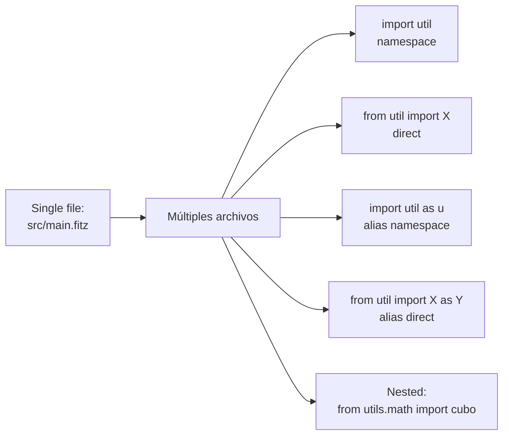

# M3.C1 — Estructura de módulos + `import` / `from import`

**Pre-requisitos**: [M2 completo](../m2-tipos-funciones/c7-type-match.md).
Sabés todo el lenguaje base — primitivos, vars, fns, types,
match, Result.

**Objetivo**: dominar el sistema de **módulos del lenguaje** —
partir tu código en varios archivos `.fitz`, importar con
`import foo` o `from foo import X`, usar paths relativos,
nested modules, aliases, y entender cómo el loader resuelve
los paths.

**Por qué importa**: hasta acá todo vivió en un solo
`src/main.fitz`. Eso escala hasta ~200 LoC. Para programas
reales necesitás **partir el código** — un archivo por
"responsabilidad" (un type, una capa, un dominio). Sin
imports, no hay proyectos serios.

---

## Mapa del cap



---

## Paso 1 — ¿Qué es un módulo?

Un **módulo** en Fitz es **un archivo `.fitz`**. Todo lo que
declares top-level adentro (fns, types, lets) son los
**exports** del módulo.

```
mi-proyecto/
└── src/
    ├── main.fitz        ← módulo "main" (el entry [bin].main)
    ├── util.fitz        ← módulo "util"
    └── users.fitz       ← módulo "users"
```

Desde `main.fitz` podés importar cosas de los otros:

```fitz
// src/main.fitz
from util import doblar
from users import create_user, User

let u = create_user(1, "Ada")
print(u)
print(doblar(21))
```

📚 **Detalle exhaustivo**: [cap 16 — Módulos](../../guide.md#16-modulos)
de la guía.

---

## Paso 2 — Dos formas de importar

### Forma 1: `import <módulo>` (namespace)

Importa el módulo entero como un **namespace**. Accedés a sus
exports con la sintaxis `<módulo>.<X>`:

```fitz
// src/main.fitz
import util

print(util.doblar(10))
print(util.PI)
```

Donde `src/util.fitz` tiene:

```fitz
// src/util.fitz
fn doblar(n: Int) -> Int => n * 2
let PI: Float = 3.14159
```

### Forma 2: `from <módulo> import <X>, <Y>` (direct)

Importa **símbolos específicos** del módulo, accesibles
directamente por su nombre:

```fitz
from util import doblar, PI

print(doblar(10))
print(PI)
```

### ¿Cuál usar?

| Caso | Preferí | Por qué |
|---|---|---|
| Usás 1-2 cosas del módulo | `from X import a, b` | Más conciso, menos verbose |
| Usás 5+ cosas | `import X` | Evita `from X import a, b, c, d, e, f, g, ...` |
| Hay colisión de nombres con otro módulo | `import X as alias` | Evita conflictos |
| Estás escribiendo una lib pública | `from X import ...` | Lectores ven qué se importa |
| Querés "qualificar todo" estilo Python | `import X` | `X.foo()` es explícito |

> **No es regla rígida**. Mezclá en el mismo archivo según
> conveniencia.

---

## Paso 3 — Demo end-to-end

Crealo en tu `mi-saludos/` (o un proyecto nuevo):

### `src/util.fitz`

```fitz
fn doblar(n: Int) -> Int => n * 2
fn cuadrado(n: Int) -> Int => n * n
let PI: Float = 3.14159
```

### `src/main.fitz` — versión con `from`

```fitz
from util import doblar, cuadrado, PI

print(doblar(21))      // 42
print(cuadrado(7))     // 49
print(PI)              // 3.14159
```

```bash
fitz run
```

```
42
49
3.14159
```

### `src/main.fitz` — versión con `import` namespace

```fitz
import util

print(util.doblar(21))
print(util.cuadrado(7))
print(util.PI)
```

Mismo output. Estilísticamente:
- Forma `from`: más corto en el call site.
- Forma `import`: más explícito sobre el origen de cada cosa.

---

## Paso 4 — Paths relativos

El path del import es **relativo al archivo donde está**, NO
al cwd:

```
mi-proyecto/
└── src/
    ├── main.fitz                  ← from util import X        → resuelve src/util.fitz
    ├── util.fitz
    └── subcarpeta/
        ├── helpers.fitz
        └── inner.fitz             ← from helpers import X     → resuelve src/subcarpeta/helpers.fitz
```

### Subcarpetas con `.`

Para módulos en subdirectorios, usá `.` como separador:

```fitz
// src/main.fitz
from utils.math import cubo
```

Esto resuelve **`src/utils/math.fitz`**.

```
src/
├── main.fitz
└── utils/
    └── math.fitz        ← contiene fn cubo
```

### Subir un nivel (no soportado directo)

Fitz **no tiene** notación `../` adentro de imports (a
diferencia de paths de shell). Para "ir al padre", el módulo
necesita estar en otro paquete con su propia dep declarada
(M3.C3).

### Tabla de resolución

| `from X import Y` en `archivo.fitz` | Resuelve a |
|---|---|
| `from util import Y` | `<dir-de-archivo>/util.fitz` |
| `from utils.math import Y` | `<dir-de-archivo>/utils/math.fitz` |
| `from utils.math.advanced import Y` | `<dir-de-archivo>/utils/math/advanced.fitz` |
| `from foo import Y` (foo es dep declarada en `fitz.toml`) | El `[lib].entry` de la dep |

---

## Paso 5 — Aliases con `as`

Renombrar el símbolo importado, útil para evitar colisiones:

### Alias en `from import`

```fitz
from util import doblar as multiplicar_por_dos
print(multiplicar_por_dos(7))    // 14
```

### Alias en `import` namespace

```fitz
import util as u
print(u.doblar(5))    // 10
```

### Alias mixto

```fitz
from util import doblar as d, cuadrado as q, PI
print(d(5))      // 10
print(q(3))      // 9
print(PI)        // 3.14159  ← sin alias
```

### Tabla de cuándo conviene

| Caso | Sintaxis |
|---|---|
| Dos módulos con el mismo nombre | `import a; import b as b2` |
| Nombre del símbolo es muy largo | `from x import really_long_name as short` |
| Acortar el namespace | `import super.deep.path as p` |

---

## Paso 6 — Compartir `type`s entre módulos

**Importante**: los `type` también se exportan e importan como
cualquier otro símbolo:

### `src/models.fitz`

```fitz
type User {
    id: Int
    name: Str
    email: Str?
}

type Order {
    id: Int
    user_id: Int
    total: Float
}
```

### `src/users.fitz` — usa los types

```fitz
from models import User

fn create_user(id: Int, name: Str) -> User {
    return User { id: id, name: name }
}
```

### `src/main.fitz` — combina ambos

```fitz
from models import User, Order
from users import create_user

let u = create_user(1, "Ada")
print(u)

let o = Order { id: 1, user_id: 1, total: 99.99 }
print(o)
```

```bash
fitz run
```

```
User { id: 1, name: "Ada", email: null }
Order { id: 1, user_id: 1, total: 99.99 }
```

> **`type` es identificado por nombre nominal**. `User`
> definido en `models.fitz` y `User` importado en `users.fitz`
> son el **mismo tipo** — `u: User` cumple ambos contratos.

---

## Paso 7 — Tipos exportables

Cualquier declaración top-level del módulo es **export
implícito**:

| Declaración | Exportable? | Sintaxis del importer |
|---|---|---|
| `fn name() { ... }` | ✅ | `from mod import name` |
| `type Name { ... }` | ✅ | `from mod import Name` |
| `let CONST = ...` | ✅ | `from mod import CONST` |
| `let local_var = ...` (no convención) | ✅ pero discouraged | Idem |
| Statement top-level (`print()`, `if`, etc.) | ⚠️ Se ejecuta al cargar | (no se importa, pero el efecto sucede) |

> **Side effects al cargar**: si un módulo tiene un `print("X")`
> top-level, ese print se ejecuta **la primera vez que algo lo
> importa**. Cargas siguientes (otro archivo importa el mismo
> módulo) usan cache — el print NO se repite.

---

## Paso 8 — Ciclos de imports

Fitz **detecta ciclos** y aborta:

```fitz
// src/a.fitz
from b import foo

// src/b.fitz
from a import bar
```

```bash
fitz run
```

```
✗ ciclo detectado en imports: a → b → a
```

Para evitar ciclos:
- Extraer el código compartido a un tercer módulo (`shared.fitz`).
- Refactorizar para que uno dependa del otro pero no viceversa.

---

## Paso 9 — Cache de módulos

Los módulos se **cargan UNA vez** por sesión:

```
main.fitz importa util         ← carga util por primera vez
main.fitz importa otra cosa
otra-cosa importa util          ← devuelve el cached util (no re-ejecuta)
```

Esto significa que:
- **Side effects** top-level corren UNA vez.
- **State top-level** (vars globales) se comparte entre todos
  los importers.
- El orden de evaluación del primer load es **determinístico**
  por path canónico.

---

## Paso 10 — Multi-archivo: organización canónica

Estructuras típicas según el tamaño:

### Mini (1-5 archivos)

```
src/
├── main.fitz              ← entry
└── helpers.fitz           ← fns + types compartidos
```

### Mediano (5-20 archivos) — por capa

```
src/
├── main.fitz
├── models.fitz            ← types compartidos
├── repo.fitz              ← persistencia
├── services.fitz          ← lógica
└── handlers.fitz          ← entry points (HTTP)
```

### Grande (20+ archivos) — por dominio

```
src/
├── main.fitz
├── shared/
│   ├── models.fitz
│   └── errors.fitz
├── users/
│   ├── models.fitz
│   ├── repo.fitz
│   ├── service.fitz
│   └── handlers.fitz
└── orders/
    ├── models.fitz
    ├── repo.fitz
    └── handlers.fitz
```

Imports cross-domain: `from users.models import User`.

> **No hay regla rígida** sobre cómo organizar. Convención:
> empezá flat (mini), y partí cuando algún archivo pase 200
> LoC.

---

## Paso 11 — Aplicarlo a `mi-saludos`

Refactor a multi-archivo. Crealos en `src/`:

### `src/models.fitz`

```fitz
type Pueblo {
    nombre: Str
    altitud_m: Int
    habitantes: Int
}
```

### `src/categorias.fitz`

```fitz
from models import Pueblo

fn altitud_cat(p: Pueblo) -> Str => match p.altitud_m {
    0..=200    => "llanura",
    201..=1000 => "media",
    _          => "altura"
}

fn habitantes_cat(p: Pueblo) -> Str => match p.habitantes {
    0..=999          => "aldea",
    1_000..=9_999    => "pueblo",
    10_000..=99_999  => "ciudad",
    _                => "metrópolis"
}
```

### `src/main.fitz`

```fitz
from models import Pueblo
from categorias import altitud_cat, habitantes_cat

let pueblos = [
    Pueblo { nombre: "El Chaltén", altitud_m: 405,  habitantes: 2000 },
    Pueblo { nombre: "Bariloche",  altitud_m: 893,  habitantes: 112000 },
    Pueblo { nombre: "Ushuaia",    altitud_m: 23,   habitantes: 82000 },
]

print("Catálogo:")
for p in pueblos {
    let alt = altitud_cat(p)
    let hab = habitantes_cat(p)
    print("  - {p.nombre}: {alt}, {hab}")
}
```

```bash
fitz run
```

```
Catálogo:
  - El Chaltén: media, pueblo
  - Bariloche: media, metrópolis
  - Ushuaia: llanura, ciudad
```

3 archivos, cada uno con su responsabilidad. Esto es **el
patrón canónico de Fitz** — un archivo por dominio, types
compartidos en un `models.fitz` común.

---

## Paso 12 — Limitaciones MVP

| Feature | Estado | Workaround |
|---|---|---|
| Imports cross-module | ✅ | — |
| Aliases (`as X`) | ✅ | — |
| Subcarpetas con `.` | ✅ | — |
| Cache + detección de ciclos | ✅ | — |
| Re-exports (`pub use` estilo Rust) | ❌ | Re-declarar en el módulo intermedio |
| Wildcard (`from X import *`) | ❌ | Importar uno por uno |
| Conditional imports | ❌ | No hay |
| Importar dep externa | ✅ con `[dependencies]` | M3.C3 |
| Path absolutos (`from /usr/...`) | ❌ | No tiene sentido — usá deps |
| Tests cross-module | ✅ | `tests/*.fitz` importa de `src/` |

---

## Validación

- [ ] Creás `src/util.fitz` con `fn doblar(n: Int) -> Int` y
      desde `src/main.fitz` lo importás con `from util import
      doblar`.
- [ ] `import util` namespace + `util.doblar(...)` también
      funciona.
- [ ] `import util as u` + `u.doblar(...)` funciona.
- [ ] `from util import doblar as d` + `d(...)` funciona.
- [ ] Path nested `from utils.math import X` resuelve a
      `src/utils/math.fitz`.
- [ ] Ciclo `a ↔ b` da error claro.
- [ ] Compartir un `type` entre módulos funciona — la instancia
      cumple el tipo en ambos lados.

---

## Troubleshooting

### `error: no se pudo cargar el módulo 'X'`

- Verificá el path. Es **relativo al archivo importer**, no al
  cwd.
- Para subcarpetas, usá `.` no `/`: `from utils.math import X`,
  no `from utils/math import X`.

### `error: el símbolo 'X' no existe en el módulo 'Y'`

- ¿Está declarado top-level en el módulo? Solo top-level se
  exporta.
- Typo en el nombre. El LSP autocomplete tras `from X import `
  no está implementado todavía (deuda).

### `error: ciclo detectado en imports`

Refactor: extraé el código compartido a un tercer módulo.

### Mi import "no anda" pero el path parece correcto

- ¿El archivo termina en `.fitz`?
- ¿El nombre del módulo es válido como identifier? (`hyphen-name`
  rompe; usá `underscore_name`).
- ¿Hay typo entre `from utils import` y la carpeta `util/`?

### El módulo se ejecuta varias veces

No debería — el loader cachea por path canónico. Si te
parece que sí, abrí issue con repro.

### Quiero importar de un proyecto externo

Eso es **dependency**. M3.C3 cubre `[dependencies]` con `path`
o `git`.

---

## Lo que viene en C2

Vimos cómo partir UN proyecto en módulos. En el próximo cap
aprendemos a **exponer tu proyecto como `lib`** para que otros
proyectos puedan importarlo — `[lib].entry` en `fitz.toml`,
estructura recomendada, qué exponer y qué mantener privado.
