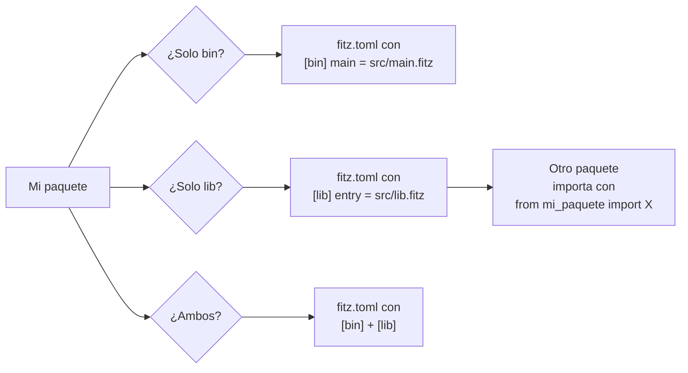
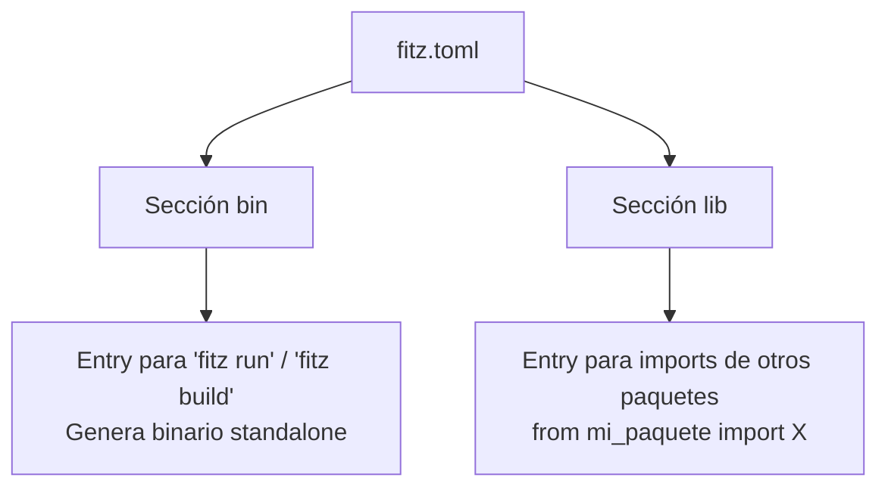

# M3.C2 — Lib local + sección `[lib]`

**Pre-requisitos**: [M3.C1 — Módulos + imports](c1-modulos-imports.md).
Sabés cómo partir un proyecto en archivos y usar `import` /
`from import`.

**Objetivo**: aprender a **exponer tu proyecto como una lib**
para que otros proyectos puedan importarlo. Sección `[lib]` en
`fitz.toml`, qué es `[lib].entry`, diferencias con `[bin]`,
estructura recomendada, qué exponer y qué mantener "privado",
y cómo coexisten `[bin]` y `[lib]` en el mismo paquete.

**Por qué importa**: el siguiente paso natural después de
"partir en módulos" es **partir en proyectos**. Si tu equipo
tiene 3 apps que comparten un set de utilidades, esas
utilidades viven en una **lib** que las apps importan. Sin
esto, copiás/pegás código entre proyectos.

---

## Mapa del cap



---

## Paso 1 — `[bin]` vs `[lib]` — la diferencia



| Sección | Qué declara | Cuándo aplica | Comando que usa |
|---|---|---|---|
| `[bin]` | Entry del binario ejecutable | `fitz run` / `fitz build` | "Quiero correr este proyecto" |
| `[lib]` | Entry para imports externos | Otros paquetes con `from <pkg> import X` | "Quiero que otros importen este proyecto" |

### Tabla de casos típicos

| Tipo de proyecto | `[bin]` | `[lib]` | Ejemplo |
|---|---|---|---|
| CLI tool | ✅ | ❌ | El típico CLI |
| HTTP server | ✅ | ❌ | API web |
| Lib de utilidades | ❌ | ✅ | `string_utils`, `math_helpers` |
| Lib publicable + ejemplo runnable | ✅ | ✅ | Lib que también tiene un demo |
| Monorepo con lib compartida | mixto | mixto | Lib + apps que la consumen |

---

## Paso 2 — Sintaxis de `[lib]`

```toml
[package]
name = "my_lib"
version = "0.1.0"
edition = "2026"

[lib]
entry = "src/lib.fitz"
```

| Campo | Tipo | Default | Para qué |
|---|---|---|---|
| `entry` | Str (path) | (sin default; requerido si la sección existe) | Archivo `.fitz` que otros paquetes importan |

> **Convención**: el archivo se llama `src/lib.fitz`. El
> nombre no es obligatorio (cualquier path sirve), pero esta
> convención coincide con Rust/Cargo y otras herramientas.

### Demo: paquete solo-lib

```bash
fitz new my_utils
cd my_utils
```

Por default, `fitz new` crea un proyecto con `[bin]`. Para
hacerlo "solo-lib", editá `fitz.toml`:

```toml
[package]
name = "my_utils"
version = "0.1.0"
edition = "2026"

[lib]
entry = "src/lib.fitz"
```

**Quitá la sección `[bin]`** (o dejala — coexisten).

Editá `src/lib.fitz`:

```fitz
fn doblar(n: Int) -> Int => n * 2
fn cuadrado(n: Int) -> Int => n * n
type Point { x: Int, y: Int }
let PI: Float = 3.14159
```

**Si dejaste `[bin]` apuntando a `src/main.fitz`**:
- `fitz run` ejecuta `src/main.fitz`.
- Otros paquetes pueden hacer `from my_utils import doblar`
  (resuelve a `src/lib.fitz`).

**Si quitaste `[bin]`**:
- `fitz run` aborta con "no hay `[bin]` declarado en `fitz.toml`".
- Solo sirve como lib para otros paquetes.

---

## Paso 3 — Coexistir `[bin]` + `[lib]`

Es **patrón común** — la lib tiene un demo CLI:

```toml
[package]
name = "string_utils"
version = "0.1.0"
edition = "2026"

[bin]
main = "src/main.fitz"      ← demo runnable: fitz run

[lib]
entry = "src/lib.fitz"      ← otros proyectos importan acá
```

Estructura típica:

```
string_utils/
├── fitz.toml
├── src/
│   ├── lib.fitz          ← exports públicos
│   ├── main.fitz         ← demo (usa lib.fitz)
│   ├── internal.fitz     ← helpers privados (no en lib.fitz)
│   └── advanced.fitz
└── tests/
    └── lib_test.fitz     ← tests de la API pública
```

### `src/lib.fitz` — la API pública

```fitz
// Re-exporta lo que querés que sea público.
// El consumidor verá SOLO esto:
fn slugify(s: Str) -> Str {
    return s.lower().replace(" ", "-")
}

type SearchResult {
    query: Str
    hits: Int
}
```

### `src/main.fitz` — demo runnable

```fitz
from lib import slugify, SearchResult

let r = SearchResult { query: "Hola Patagonia", hits: 42 }
print(r)
print(slugify(r.query))    // hola-patagonia
```

```bash
fitz run
```

```
SearchResult { query: "Hola Patagonia", hits: 42 }
hola-patagonia
```

### `src/internal.fitz` — helpers "privados"

```fitz
// No se re-exporta en lib.fitz, así que los consumidores externos
// no pueden importarlo... bueno, en teoría.

fn _normalize_internal(s: Str) -> Str {
    return s.trim().lower()
}
```

> **Nota honesta**: Fitz no tiene **encapsulación real**. Si
> alguien hace `from my_lib_internal_path import _normalize`,
> técnicamente funciona (sigue siendo un módulo `.fitz`). La
> "privacidad" es **convención**: solo declarás en `lib.fitz`
> lo que querés que sea API pública.

---

## Paso 4 — Cómo consume el otro paquete

Asumiendo tu lib es `my_utils` y tenés otro paquete `mi_app`:

```
~/proyectos/
├── my_utils/       ← lib
│   ├── fitz.toml ([lib].entry = src/lib.fitz)
│   └── src/lib.fitz (exporta doblar)
└── mi_app/         ← app
    ├── fitz.toml
    └── src/main.fitz
```

En `mi_app/fitz.toml` declarás la dep:

```toml
[package]
name = "mi_app"
version = "0.1.0"
edition = "2026"

[bin]
main = "src/main.fitz"

[dependencies]
my_utils = { path = "../my_utils" }
```

En `mi_app/src/main.fitz` importás como cualquier módulo:

```fitz
from my_utils import doblar

print(doblar(21))    // 42
```

```bash
cd mi_app
fitz run
```

```
42
```

> El detalle de **`[dependencies]`** y **`path = "..."`** se
> cubre a fondo en M3.C3. Por ahora, lo importante es:
> declarás la dep en `[dependencies]`, y el `from` importa
> automáticamente el `[lib].entry` de la dep.

---

## Paso 5 — Reglas de nombres de paquetes

Importante para que `from mi_paquete import X` funcione:

| Característica | Requisito |
|---|---|
| Lowercase | `my_utils` ✓, `MyUtils` ✗ |
| Solo letras / dígitos / `_` / `-` | `string-utils` válido **como nombre** PERO `from string-utils import X` rompe (Fitz parsea `-` como `MINUS`) |
| Empieza con letra | `2cosa` ✗ |
| Máx 64 caracteres | OK |

> **Recomendación**: usá **`_` en vez de `-`** para que el
> nombre sea importable directo sin alias.

| Nombre del paquete | `from <nombre> import X`? |
|---|---|
| `my_utils` | ✅ funciona |
| `string-utils` | ❌ rompe en el parser de import |
| `myutils` | ✅ |
| `m1` | ✅ |

Si tu paquete ya está publicado con `-`, podés importarlo con
alias (futuro — hoy es deuda):

```fitz
import "string-utils" as su      // ← no soportado MVP
```

Workaround actual: **renombrar el paquete a `_`**.

---

## Paso 6 — Tests de tu lib

Crealos en `tests/` (M2.C6):

### `tests/lib_test.fitz`

```fitz
from lib import slugify, SearchResult

@test fn slugify_basic() {
    assert_eq(slugify("Hola Mundo"), "hola-mundo")
}

@test fn slugify_already_lowercase() {
    assert_eq(slugify("ya esta"), "ya-esta")
}

@test fn search_result_eq() {
    let r1 = SearchResult { query: "x", hits: 1 }
    let r2 = SearchResult { query: "x", hits: 1 }
    assert(r1 == r2)
}
```

```bash
fitz test
```

```
running 3 tests
test tests/lib_test.fitz::search_result_eq ... ok
test tests/lib_test.fitz::slugify_already_lowercase ... ok
test tests/lib_test.fitz::slugify_basic ... ok

test result: ok. 3 passed; 0 failed; finished in 0.00s
```

> **`tests/*.fitz` se cargan automático en `fitz test`** —
> no hay que listarlos en ningún manifest.

---

## Paso 7 — Patrones de organización de la lib

### Patrón 1: lib chica con todo en `lib.fitz`

Si tu lib tiene 1-3 fns, todo cabe en un archivo:

```fitz
// src/lib.fitz
fn upper_safe(s: Str?) -> Str {
    if (s == null) { return "" }
    return s.upper()
}

fn lower_safe(s: Str?) -> Str {
    if (s == null) { return "" }
    return s.lower()
}
```

### Patrón 2: lib mediana con re-exports

Cuando la lib crece, partí en submódulos y reexportá en
`lib.fitz`:

```
src/
├── lib.fitz              ← API pública
├── strings.fitz          ← módulos internos
├── numbers.fitz
└── collections.fitz
```

```fitz
// src/lib.fitz — re-exporta
from strings import slugify, upper_safe, lower_safe
from numbers import clamp, lerp, percentile
from collections import deduplicate, group_by
```

> **Limitación MVP**: no hay `pub use` real, así que
> "re-exportar" es **re-declarar fns** que llaman a las
> originales. Workaround chango:
>
> ```fitz
> // src/lib.fitz
> from strings import slugify as _slugify
> fn slugify(s: Str) -> Str => _slugify(s)
> ```
>
> Esto es deuda comprometida — `pub use` simétrico llega
> futuro.

### Patrón 3: lib grande con submódulos jerárquicos

```
src/
├── lib.fitz                  ← API top-level
├── strings/
│   ├── mod.fitz              ← entry del sub-namespace (deuda — no es estándar Fitz aún)
│   ├── slug.fitz
│   └── case.fitz
└── numbers/
    └── ...
```

> **Limitación MVP**: Fitz no tiene `mod.fitz` estilo Rust.
> Cada `.fitz` es un módulo independiente. Para "agrupar",
> usá un archivo de re-export.

---

## Paso 8 — Aplicarlo a `mi-saludos`

Convertí tu `mi-saludos` para que **también** sea consumible
como lib. Editá `fitz.toml`:

```toml
[package]
name = "mi_saludos"
version = "0.1.0"
edition = "2026"

[bin]
main = "src/main.fitz"

[lib]
entry = "src/lib.fitz"
```

Creá `src/lib.fitz`:

```fitz
// API pública de mi_saludos.

from models import Pueblo
from categorias import altitud_cat, habitantes_cat

// Re-exports — fns públicas
fn clasificar_altitud(p: Pueblo) -> Str => altitud_cat(p)
fn clasificar_habitantes(p: Pueblo) -> Str => habitantes_cat(p)

// Helpers de alto nivel
fn descripcion_completa(p: Pueblo) -> Str {
    let alt = altitud_cat(p)
    let hab = habitantes_cat(p)
    return "{p.nombre} ({alt}, {hab})"
}
```

Crealo (o re-usá tu `src/main.fitz` actual). Hay duplicación
de imports en `main.fitz` y `lib.fitz` — es esperado.

Ahora otra app puede usar `mi_saludos` como lib:

```toml
# en otro proyecto:
[dependencies]
mi_saludos = { path = "../mi-saludos" }
```

> **Si tu carpeta se llama `mi-saludos` con guion**, el
> `[package].name` puede ser `mi_saludos` (no tienen que
> coincidir). Asegurate del nombre real en `fitz.toml`.

---

## Paso 9 — Validar que tu lib es importable

Quick check: crea un mini-paquete temporal que la importe:

```bash
cd /tmp
mkdir test-mi-saludos && cd test-mi-saludos
fitz init --no-git
```

Editá `fitz.toml`:

```toml
[package]
name = "test_mi_saludos"
version = "0.1.0"
edition = "2026"

[bin]
main = "src/main.fitz"

[dependencies]
mi_saludos = { path = "<ruta absoluta a mi-saludos>" }
```

Editá `src/main.fitz`:

```fitz
from mi_saludos import descripcion_completa, Pueblo

let p = Pueblo { nombre: "Bariloche", altitud_m: 893, habitantes: 112000 }
print(descripcion_completa(p))
```

```bash
fitz run
```

```
Bariloche (media, metrópolis)
```

Si compila y corre, **tu lib está bien expuesta**.

---

## Paso 10 — Limitaciones MVP

| Feature | Estado | Workaround |
|---|---|---|
| `[lib].entry` | ✅ | — |
| Coexistir `[bin]` + `[lib]` | ✅ | — |
| Re-exports automáticos (`pub use`) | ❌ | Re-declarar fns chango |
| Visibilidad real (private/public) | ❌ | Convención: solo en `lib.fitz` |
| Múltiples `[lib]` en un paquete | ❌ | Un solo entry |
| `[lib].name` diferente del paquete | ❌ | Mismo nombre |
| Publicar a registry | ❌ | Aún no hay registry (deuda Fase 9.y.5) |

---

## Validación

- [ ] Tu `fitz.toml` declara `[lib] entry = "src/lib.fitz"`.
- [ ] `src/lib.fitz` existe y re-exporta fns / types públicas.
- [ ] Desde otro proyecto, declarás `mi_saludos = { path =
      "..." }` en `[dependencies]` y podés hacer `from
      mi_saludos import X`.
- [ ] `fitz test` corre tus `tests/lib_test.fitz` que
      importan de `lib`.

---

## Troubleshooting

### `error: 'mi-saludos' no es un identifier válido en import`

Tu paquete tiene `-` en el nombre. Renombralo a `_`:
- En `fitz.toml` del paquete: `name = "mi_saludos"`.
- En las deps que lo usan: `mi_saludos = { path = "..." }`.

### Otros paquetes ven cosas que querría privadas

Fitz no tiene `private`. Tu opción: **NO declararlo en
`lib.fitz`**. Otros paquetes solo importan lo que `lib.fitz`
expone explícitamente. (Excepto si abusan importando los
módulos internos directamente — confiá en la convención.)

### `error: 'mi_saludos' no tiene el símbolo 'X'`

- ¿`X` está declarado top-level en `src/lib.fitz`?
- ¿`X` está re-exportado si es de un sub-módulo?
- ¿`fitz check` en el paquete lib pasa limpio?

### Mi `[lib]` y `[bin]` están confusos

Diferencia clave:
- `[bin].main` se ejecuta con `fitz run`.
- `[lib].entry` se importa por otros paquetes.

Pueden coexistir, pueden apuntar al mismo archivo, o cada uno
al suyo (recomendado).

---

## Lo que viene en C3

Vimos cómo **exponer** una lib. En el próximo cap aprendemos a
**consumir deps externas** — `[dependencies]` con `path = "..."`
para libs locales, el **lockfile** (`fitz.lock`) que registra
versiones exactas, y cómo el resolver de deps trabaja por
debajo.
