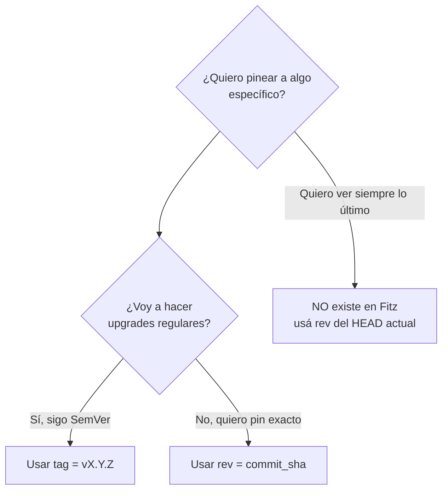

# M3.C4 — Git dependencies + cache

**Pre-requisitos**: [M3.C3 — Path deps](c3-path-deps.md). Sabés
declarar deps locales en `[dependencies]` y entendés el
lockfile.

**Objetivo**: dominar **git deps** — declarar libs publicadas
en GitHub/GitLab/self-hosted git como deps con `tag` para
SemVer o `rev` para pin a commit, entender el **cache local**,
cuándo invalidarlo, y los caveats de seguridad.

**Por qué importa**: path deps funcionan para monorepo, pero no
para libs **publicadas externamente**. Git deps te dejan
consumir libs de cualquier lado de internet sin necesidad de
un registry central — el patrón canónico de la era pre-registry
de Rust, Go, Deno.

---

## Mapa del cap

```mermaid
flowchart LR
    A[fitz.toml<br/>git = ..., tag = v1.0.0] --> B[fitz reconoce nueva dep]
    B --> C[git clone --depth 1 --branch v1.0.0]
    C --> D[~/.fitz/cache/git/<br/>github.com_user_repo&commat;v1.0.0/]
    D --> E[Cargar el [lib].entry de la dep]
    F[fitz.lock] --> G[Registra el commit hash exacto]
```

---

## Paso 1 — Sintaxis

```toml
[dependencies]
# Con tag (recomendado para versionado)
shared = { git = "https://github.com/owner/shared.git", tag = "v1.0.0" }

# Con rev (commit hash, para pinear exacto)
shared = { git = "https://github.com/owner/shared.git", rev = "a3f8b21c..." }
```

| Campo | Tipo | Obligatorio | Detalle |
|---|---|---|---|
| `git` | URL string | ✅ | URL del repo (https o ssh) |
| `tag` | string | XOR con `rev` | Tag a checkout |
| `rev` | string (SHA) | XOR con `tag` | Commit específico |
| `branch` | string | ❌ NO soportado | (sería no reproducible) |

> **`tag` y `rev` son mutuamente exclusivos** — uno o el otro.
> Si ponés ambos, error de manifest.

### Por qué `branch` NO está

Branches **se mueven** (`main` hoy ≠ `main` mañana). El
lockfile pierde sentido. Si querés "última versión de `main`",
usá `rev` con el SHA actual.

---

## Paso 2 — Demo: consumir una lib pública (hipotética)

Asumiendo `https://github.com/fitz-lang/string_utils` con tag
`v0.1.0` y `[lib].entry = "src/lib.fitz"`:

### `mi_app/fitz.toml`

```toml
[package]
name = "mi_app"
version = "0.1.0"
edition = "2026"

[bin]
main = "src/main.fitz"

[dependencies]
string_utils = { git = "https://github.com/fitz-lang/string_utils.git", tag = "v0.1.0" }
```

### Primer `fitz run`

```bash
cd mi_app
fitz run
```

```
✓ git clone https://github.com/fitz-lang/string_utils.git@v0.1.0 → ~/.fitz/cache/git/github.com_fitz-lang_string_utils@v0.1.0/
✓ actualizado fitz.lock
Hola desde mi_app
```

Lo que pasó:
1. Fitz detectó la dep `string_utils` nueva.
2. La cloneó al cache local con `git clone --depth 1 --branch
   v0.1.0`.
3. Resolvió el `[lib].entry` desde `~/.fitz/cache/.../src/
   lib.fitz`.
4. Actualizó `fitz.lock` con el commit hash exacto.

### Re-corridas

```bash
fitz run
```

```
Hola desde mi_app
```

**No vuelve a clonar** — usa el cache. Resolución es O(1).

---

## Paso 3 — Cache local

### Path del cache

| OS | Path default |
|---|---|
| Linux | `~/.fitz/cache/git/` |
| macOS | `~/.fitz/cache/git/` |
| Windows | `%USERPROFILE%\.fitz\cache\git\` |

### Override con env var

```bash
export FITZ_CACHE_DIR=/tmp/fitz-cache    # Linux/macOS
$env:FITZ_CACHE_DIR = "D:\fitz-cache"    # Windows
```

Útil para CI ephemeral, sandboxes, o si tu home está full.

### Estructura del cache

```
~/.fitz/cache/git/
├── github.com_owner_repo@v1.0.0/
│   ├── fitz.toml
│   └── src/lib.fitz
├── github.com_owner_repo@v1.1.0/        ← cada tag es dir separado
│   └── ...
└── gitlab.com_other_lib@a3f8b21c/       ← rev específico
    └── ...
```

### Naming determinístico

`<host>_<owner>_<repo>@<tag_or_rev>` — sin hashing.

Pro: el path es predecible (podés inspeccionarlo, copiarlo,
auditarlo).
Contra: nombres con caracteres raros pueden chocar (resuelto
con replaces internos).

---

## Paso 4 — `fitz.lock` con git deps

Para git deps, el lockfile registra **el commit hash exacto**
(no el tag — los tags pueden moverse):

```toml
version = 1

[[package]]
name = "string_utils"
source = "git+https://github.com/fitz-lang/string_utils.git#a3f8b21c4d5e6f..."
```

| Campo | Detalle |
|---|---|
| `name` | Nombre del paquete |
| `source` | `git+<url>#<commit_sha>` (Cargo-style) |

Si el tag upstream se mueve a otro commit, **tu lockfile sigue
pineado** al original. Para actualizar: `fitz update` (M3.C5).

---

## Paso 5 — `tag` vs `rev` — cuándo cada uno



### `tag = "vX.Y.Z"`

```toml
shared = { git = "https://...", tag = "v1.2.0" }
```

| Pro | Contra |
|---|---|
| Legible (sabés qué versión es) | Vulnerable a "tag re-tag" malicioso |
| Cargo-style | Requiere que la lib siga SemVer disciplinada |
| Lockfile pinea al commit del tag | Si el maintainer mueve el tag, `fitz update` te lleva al nuevo |

### `rev = "<sha>"`

```toml
shared = { git = "https://...", rev = "a3f8b21c4d5e6f7..." }
```

| Pro | Contra |
|---|---|
| Inmutable (commit no se mueve) | Menos legible |
| 100% reproducible siempre | Cuesta upgrade |
| Audit-friendly | Tenés que copiar SHAs |

### Tabla de decisión

| Caso | Usar |
|---|---|
| Lib estable con releases SemVer (`v1.2.3`) | `tag` |
| Lib con releases pero alpha/beta sin SemVer | `rev` |
| Lib del equipo interno sin releases formales | `rev` o path dep |
| Auditoría / compliance | `rev` |
| Prototipo / exploración rápida | `tag` |

---

## Paso 6 — Estrategia de clone

`fitz` usa **subprocess `git`** (no una lib embebida). Tenés
que tener `git` instalado.

| Caso | Comando interno |
|---|---|
| Con `tag` | `git clone --depth 1 --branch <tag> <url> <cache_dir>` |
| Con `rev` | `git clone <url> <cache_dir>` + `git checkout <rev>` (full clone) |

> **Tags son más rápidos** (shallow clone). Revs requieren full
> history para poder checkout-ear cualquier commit. Si tu CI
> es lento, preferí `tag`.

### URLs soportadas

| Esquema | Ejemplo | Soportado |
|---|---|---|
| HTTPS público | `https://github.com/owner/repo.git` | ✅ |
| HTTPS con token | `https://token@github.com/owner/repo.git` | ✅ (cuidado, queda en lockfile) |
| SSH | `git@github.com:owner/repo.git` | ✅ (requiere ssh-agent) |
| Self-hosted GitLab | `https://gitlab.empresa.com/team/repo.git` | ✅ |
| Bitbucket | `https://bitbucket.org/owner/repo.git` | ✅ |

> **No commitees tokens** en URLs HTTPS. Usá SSH o `git config
> credential.helper` para auth.

---

## Paso 7 — `fitz update` para git deps

`fitz update` **invalida el cache** y re-clona. Útil cuando:
- El tag upstream se movió (re-tagged).
- Querés un fetch fresh.
- El cache local está corrupto.

```bash
fitz update              # actualiza todas
fitz update shared       # actualiza solo `shared`
```

Comportamiento:

| Tipo de dep | `fitz update` |
|---|---|
| `path` | No-op (siempre fresh, lee del filesystem) |
| `git` + `tag` | Re-clona, actualiza lockfile con commit nuevo del tag |
| `git` + `rev` | Re-clona, el `rev` es fijo así que el commit no cambia |

Detalle exhaustivo de `fitz update` en M3.C5.

---

## Paso 8 — Migrar de path a git (o viceversa)

Caso común: tu lib empezó local, ahora la publicaste a GitHub.

### Antes (path)

```toml
[dependencies]
shared = { path = "../shared" }
```

### Después (git)

```toml
[dependencies]
shared = { git = "https://github.com/empresa/shared.git", tag = "v1.0.0" }
```

Acción adicional:
1. Borrá `fitz.lock` (o corré `fitz update`).
2. Primer `fitz run` clona del git y actualiza el lockfile.

### Mantener path durante desarrollo, git en producción

Patrón: ramas de git diferentes para cada modo. O TOML
override (no soportado MVP).

Workaround actual: dos archivos `fitz.toml` y un script
`switch.sh` que copia uno o el otro. Deuda comprometida —
`[patch.crates-io]` style Cargo para path overrides es deuda.

---

## Paso 9 — Seguridad

### Riesgos

| Riesgo | Mitigación |
|---|---|
| Lib hostil ejecuta código en build/run | Code review antes de agregar deps |
| Tag movido a commit malicioso | Usá `rev` para pin exacto + audita el commit |
| Dep con typo malicioso (typosquat) | Validá nombre + URL antes de agregar |
| URL HTTPS con token leakeado | Usá SSH o credential helper |
| Cache local manipulable | Permisos restrictivos en `~/.fitz/cache` |

### Auditoría

```bash
# Ver qué deps tenés
cat fitz.toml fitz.lock

# Inspeccionar el cache de una dep
ls ~/.fitz/cache/git/github.com_owner_repo@v1.0.0/

# Diff con el código local
diff -r ~/.fitz/cache/git/github.com_owner_repo@v1.0.0/src/ /tmp/extracted_lib/src/
```

### Validar SHA antes de pinear

```bash
git ls-remote https://github.com/owner/repo.git refs/tags/v1.0.0
```

Te devuelve el commit del tag. Comparalo con el que querías.

---

## Paso 10 — Limitaciones MVP

| Feature | Estado | Workaround |
|---|---|---|
| `git` + `tag` | ✅ | — |
| `git` + `rev` | ✅ | — |
| `git` + `branch` | ❌ | Usar `rev` con SHA actual |
| `git` + sub-directory | ❌ | Forkear el repo |
| Submodules | ⚠️ Funcionan si el clone los inicia | Verificá `git config submodule.recurse=true` |
| Auth con tokens en config | ❌ | URL con token (cuidado) o SSH |
| Mirror / fallback URL | ❌ | Una URL por dep |
| Verificación de SHA antes de clone | ❌ | Manual con `git ls-remote` |

---

## Paso 11 — Workflow CI

```yaml
# .github/workflows/ci.yml (ejemplo)
steps:
  - uses: actions/checkout@v4

  - name: Cache Fitz git deps
    uses: actions/cache@v4
    with:
      path: ~/.fitz/cache/git
      key: fitz-git-${{ hashFiles('fitz.lock') }}

  - name: Install Fitz
    run: # bajá Fitz binary

  - name: Run tests
    run: |
      fitz check
      fitz test
```

Lockfile + cache key = builds reproducibles + fast.

---

## Validación

- [ ] Declarás una dep con `git = "..."` + `tag = "v..."` en
      `[dependencies]`.
- [ ] Primer `fitz run` clona a `~/.fitz/cache/git/`.
- [ ] `fitz.lock` registra el commit SHA exacto.
- [ ] Re-corridas usan el cache (no vuelven a clonar).
- [ ] `fitz update <dep>` re-clona.

---

## Troubleshooting

### `git: command not found`

`fitz` usa subprocess `git`. Instalalo
([git-scm.com](https://git-scm.com/)).

### `fatal: could not read Username` (auth)

Si el repo es privado, necesitás auth:
- HTTPS: configurá credential helper (`git config --global
  credential.helper store`) o usá token en la URL (cuidado).
- SSH: `ssh-add ~/.ssh/id_rsa` y usá URL `git@host:owner/repo.git`.

### `error: tag 'v1.0.0' not found`

Verificá que el tag existe en el remote:

```bash
git ls-remote https://github.com/owner/repo.git refs/tags/v1.0.0
```

### Cache corrupto / build raro

Borrá el cache de esa dep y volvé a `fitz run`:

```bash
rm -rf ~/.fitz/cache/git/github.com_owner_repo@v1.0.0
fitz run
```

### Mi colega tiene una versión distinta que la mía

¿Commiteaste el `fitz.lock`? Si sí, deberían tener el mismo.
Si no, cada `fitz run` resuelve por su lado.

### El lockfile cambió y no entiendo por qué

Probable causa: `fitz update` se corrió. O alguien cambió las
deps. Comparar con `git diff fitz.lock`.

---

## Lo que viene en C5

Hasta acá editamos `[dependencies]` a mano. En el último cap
de M3 vemos los **subcomandos `fitz add` / `fitz remove` /
`fitz update`** que automatizan ese workflow, y cerramos con
patrones de organización de proyectos reales (monorepos,
shared libs, capas).
