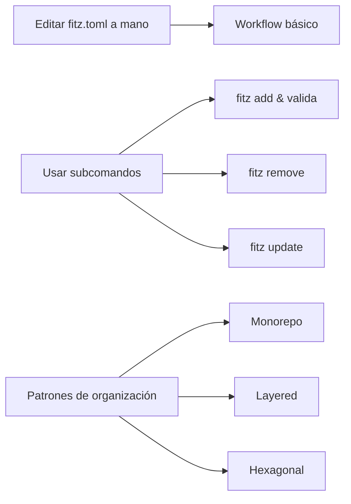

# M3.C5 — `fitz add` / `fitz remove` / `fitz update` + patrones

**Pre-requisitos**: [M3.C4 — Git deps](c4-git-deps.md). Sabés
todas las formas de declarar deps (path, git con tag/rev).

**Objetivo**: dominar los **subcomandos del package manager**
que automatizan la edición de `fitz.toml` y el lockfile (`fitz
add`, `fitz remove`, `fitz update`), y cerrar M3 con
**patrones de organización** de proyectos reales (monorepos,
shared libs, layered architecture).

**Por qué importa**: editar `fitz.toml` a mano funciona, pero
los subcomandos:
1. Validan que la dep resuelva antes de commitear el cambio.
2. Sincronizan el lockfile automáticamente.
3. Preservan tu formato y comentarios del TOML.

**Este cap CIERRA M3** — al terminar tenés todo lo que necesitás
para partir programas en módulos y paquetes.

---

## Mapa del cap



---

## Paso 1 — `fitz add` — sintaxis completa

```
fitz add [OPTIONS] <NAME>
```

| Posición / flag | Para qué |
|---|---|
| `<NAME>` (requerido) | Nombre con el que vas a importar la dep (key en `[dependencies]`) |
| `--path <PATH>` | Path dep (relativo al manifest) |
| `--git <URL>` | Git URL (HTTPS o SSH) |
| `--tag <TAG>` | Tag git (XOR con `--rev`) |
| `--rev <REV>` | Commit SHA (XOR con `--tag`) |
| `-h`, `--help` | Help |

### Reglas combinatorias

| Combo | Acción |
|---|---|
| `--path` solo | Agrega path dep |
| `--git` + `--tag` | Agrega git dep con tag |
| `--git` + `--rev` | Agrega git dep con rev |
| `--git` solo (sin tag/rev) | ❌ error: requiere uno de los dos |
| `--git` + `--tag` + `--rev` | ❌ error: mutuamente exclusivos |
| Sin `--path` ni `--git` | ❌ error: requiere fuente explícita |

### Demo: path dep

```bash
cd mi_app
fitz add util --path ../util
```

Output:

```
✓ agregado util = { path = "../util" } a fitz.toml
✓ actualizado fitz.lock
```

Antes / después:

```diff
# fitz.toml
[package]
name = "mi_app"
version = "0.1.0"
edition = "2026"

[bin]
main = "src/main.fitz"

+ [dependencies]
+ util = { path = "../util" }
```

### Demo: git dep con tag

```bash
fitz add shared --git https://github.com/empresa/shared.git --tag v1.0.0
```

```
✓ git clone ...
✓ agregado shared = { git = "https://...", tag = "v1.0.0" } a fitz.toml
✓ actualizado fitz.lock
```

### Demo: git dep con rev

```bash
fitz add shared --git https://github.com/empresa/shared.git --rev a3f8b21c4d5e6f...
```

### Preserva tus comentarios y formato

`fitz add` usa **`toml_edit`** (lib que preserva la estructura
del TOML original). Si tenés comentarios en `fitz.toml`, se
mantienen:

```toml
# fitz.toml ANTES de fitz add

# Mi proyecto buenardo
[package]
name = "mi_app"
# version semver — cambiar antes de release
version = "0.1.0"
edition = "2026"

[bin]
main = "src/main.fitz"
```

Después de `fitz add util --path ../util`:

```toml
# Mi proyecto buenardo
[package]
name = "mi_app"
# version semver — cambiar antes de release
version = "0.1.0"
edition = "2026"

[bin]
main = "src/main.fitz"

[dependencies]
util = { path = "../util" }
```

Comentarios intactos. **Esto es importante** — algunos
package managers (como pip + freeze) destruyen tu formato.

### Si la dep ya existía — sobreescribe

```bash
fitz add util --path ../otro_util
```

```
⚠ dep 'util' ya existía con path = "../util", sobrescribiendo
✓ agregado util = { path = "../otro_util" } a fitz.toml
```

Convención **cargo-style** — no falla, sobreescribe (vos
revertís manualmente con `fitz remove` si no querías).

### Si la resolución falla

`fitz add` valida que la dep resuelva ANTES de commitear el
cambio. Si el path no existe o el git clone falla:

```bash
fitz add util --path ../no_existe
```

```
✗ error resolviendo dep 'util': no se encontró fitz.toml en '../no_existe'

(no se modificó fitz.toml)
```

> **Eager persistence**: el manifest **se actualiza igual** si
> la resolución falla en algún paso intermedio (cargo-style).
> Para revertir: `fitz remove <name>`.

---

## Paso 2 — `fitz remove` — quitar una dep

```
fitz remove <NAME>
```

```bash
fitz remove util
```

```
✓ removido util de fitz.toml
✓ actualizado fitz.lock
```

### Si la dep no existía

```bash
fitz remove no_existe
```

```
✗ dep 'no_existe' no encontrada en fitz.toml
```

Exit 1.

### Si el lockfile queda vacío

Cuando quitás la última dep, **`fitz.lock` se borra** (no se
deja un archivo vacío).

---

## Paso 3 — `fitz update` — re-resolver deps

```
fitz update [NAME]
```

| Argumento | Qué hace |
|---|---|
| `<NAME>` | Re-resuelve solo esa dep |
| (sin args) | Re-resuelve **todas** las deps del manifest |

### Comportamiento por tipo de dep

| Tipo | `fitz update` |
|---|---|
| `path` | **No-op** (siempre fresh) |
| `git` + `tag` | **Re-clona**, actualiza lockfile con el nuevo commit del tag |
| `git` + `rev` | Re-clona pero el commit es fijo — sin cambio en lockfile |

### Demo

```bash
fitz update shared
```

```
✓ re-clonado shared desde git@v1.0.0
✓ actualizado fitz.lock (commit nuevo: a3f8...)
```

```bash
fitz update         # todas
```

```
✓ re-clonado shared desde git@v1.0.0
✓ no-op para util (path)
✓ actualizado fitz.lock
```

### Tabla: cuándo `fitz update`

| Caso | ¿Correr `fitz update`? |
|---|---|
| Cambiaste path dep en filesystem | ❌ No necesario — fresh siempre |
| Tag upstream se movió a otro commit | ✅ Sí |
| Bajaste una versión nueva con `fitz add ... --tag` | ❌ No — `fitz add` ya re-clona |
| Cache local corrupto | ✅ Sí (re-clona) |
| Querés ver "qué cambió en mis deps" | ✅ Sí + diff del lockfile |

---

## Paso 4 — Demo end-to-end con los 3 subcomandos

```bash
# Crear proyecto
cd ~/proyectos
fitz new mi_app --no-git
cd mi_app

# Agregar deps
fitz add string_utils --git https://github.com/empresa/string_utils.git --tag v0.1.0
fitz add models --path ../shared/models

# Ver el resultado
cat fitz.toml
```

```toml
[package]
name = "mi_app"
version = "0.1.0"
edition = "2026"

[bin]
main = "src/main.fitz"

[dependencies]
string_utils = { git = "https://github.com/empresa/string_utils.git", tag = "v0.1.0" }
models = { path = "../shared/models" }
```

```bash
# Decidir que models no se usa más
fitz remove models
```

```bash
# Actualizar string_utils (probablemente cambió el tag)
fitz update string_utils
```

---

## Paso 5 — Patrón: Monorepo con shared libs

Estructura para un equipo:

```
empresa/
├── shared/
│   ├── models/          ← types comunes
│   │   ├── fitz.toml ([lib])
│   │   └── src/lib.fitz
│   ├── auth/            ← lib de auth reusable
│   │   └── ...
│   └── logger/
│       └── ...
└── apps/
    ├── api_users/
    │   ├── fitz.toml ([bin] + deps a shared/*)
    │   └── src/main.fitz
    └── api_orders/
        └── ...
```

Setup desde cero:

```bash
mkdir empresa && cd empresa
mkdir -p shared apps

# Shared libs
cd shared
fitz new models --no-git
fitz new auth --no-git
fitz new logger --no-git
# (editar cada fitz.toml para agregar [lib].entry)

cd ../apps
fitz new api_users --no-git
cd api_users
fitz add models --path ../../shared/models
fitz add auth --path ../../shared/auth
fitz add logger --path ../../shared/logger
```

### `apps/api_users/fitz.toml` resultante

```toml
[package]
name = "api_users"
...

[bin]
main = "src/main.fitz"

[dependencies]
models = { path = "../../shared/models" }
auth = { path = "../../shared/auth" }
logger = { path = "../../shared/logger" }
```

### Ventajas del patrón

| Aspecto | Detalle |
|---|---|
| Code reuse | Una lib, varios consumidores |
| Refactor friendly | Cambios en `shared/` se ven al toque |
| Testing aislado | Cada lib tiene sus `tests/` |
| Versionado | Path deps son siempre fresh; usá git deps si querés pinear |

---

## Paso 6 — Patrón: Layered architecture (mono-proyecto)

Adentro de UN solo proyecto, partís por capas:

```
mi_app/
├── fitz.toml
├── src/
│   ├── main.fitz                ← entry point (handlers HTTP)
│   ├── handlers/                ← capa HTTP
│   │   ├── users.fitz
│   │   └── orders.fitz
│   ├── services/                ← lógica de negocio
│   │   ├── users.fitz
│   │   └── orders.fitz
│   ├── repos/                   ← persistencia
│   │   ├── users.fitz
│   │   └── orders.fitz
│   └── models/                  ← types compartidos
│       ├── user.fitz
│       └── order.fitz
└── tests/
    ├── handlers_test.fitz
    └── services_test.fitz
```

### Imports estilo "dependencia hacia adentro"

```fitz
// src/handlers/users.fitz
from services.users import crear_usuario
from models.user import User

// handlers solo importan services + models, NUNCA repos directos
```

```fitz
// src/services/users.fitz
from repos.users import save_user
from models.user import User
```

```fitz
// src/repos/users.fitz
from models.user import User

// repos NO importan services ni handlers (sin upward deps)
```

Patrón **hexagonal** / **clean architecture** lite, sin tooling
extra.

---

## Paso 7 — Patrón: Lib publicable + ejemplo runnable

Tu lib tiene un demo CLI que vive en el mismo paquete:

```
mi_lib/
├── fitz.toml ([bin] + [lib])
├── src/
│   ├── lib.fitz                ← API pública
│   ├── main.fitz               ← demo runnable
│   └── internal.fitz           ← privados (no expuestos en lib.fitz)
├── tests/
│   ├── lib_test.fitz
│   └── integration_test.fitz
└── examples/                   ← scripts demo adicionales
    ├── basic.fitz
    └── advanced.fitz
```

```toml
[package]
name = "mi_lib"
...

[bin]
main = "src/main.fitz"          ← fitz run

[lib]
entry = "src/lib.fitz"          ← otros importan
```

`fitz test` recoje `tests/*.fitz`. `fitz run` ejecuta el demo.
`examples/*.fitz` son ejemplos manuales (no automáticos).

---

## Paso 8 — Workflow CI con `fitz add` / `update`

CI completo para un proyecto con deps:

```yaml
# .github/workflows/ci.yml
steps:
  - uses: actions/checkout@v4

  - name: Cache deps
    uses: actions/cache@v4
    with:
      path: ~/.fitz/cache/git
      key: fitz-${{ hashFiles('fitz.lock') }}

  - name: Install Fitz
    run: ...

  - name: Validar manifest + lockfile
    run: |
      fitz check
      # Si el lockfile no está sincronizado con el manifest, falla
      if ! git diff --exit-code fitz.lock; then
        echo "fitz.lock desincronizado — corre 'fitz check' local y commitea"
        exit 1
      fi

  - name: Tests
    run: fitz test

  - name: Build
    run: fitz build
```

### `fitz add` en CI

Útil para actualizar deps automáticamente:

```yaml
# Workflow programado que actualiza una dep semanal
- name: Update shared lib
  run: |
    fitz update shared
    if ! git diff --exit-code fitz.lock; then
      # crear PR con los cambios
      gh pr create --title "chore: update shared lib" --body "..."
    fi
```

---

## Paso 9 — Recap: el CLI del package manager

Tabla resumen del módulo:

| Comando | Cuándo |
|---|---|
| `fitz new <name>` | Crear proyecto nuevo en carpeta nueva |
| `fitz init` | Inicializar proyecto en cwd |
| `fitz add <name> --path <p>` | Agregar path dep |
| `fitz add <name> --git <url> --tag <t>` | Agregar git dep con tag |
| `fitz add <name> --git <url> --rev <r>` | Agregar git dep con rev |
| `fitz remove <name>` | Quitar una dep |
| `fitz update [<name>]` | Re-resolver deps (re-clonar git, no-op path) |

Más los comandos del CLI base (M1.C4 + M1.C6):

| Comando | Cuándo |
|---|---|
| `fitz run` | Ejecutar |
| `fitz build` | Compilar a binario |
| `fitz check` | Type-check |
| `fitz test` | Correr tests |
| `fitz fmt` | Formatear |
| `fitz lint` | Detectar patrones |
| `fitz dev` | Hot reload |
| `fitz repl` | REPL interactivo |

---

## Paso 10 — Limitaciones MVP del package manager

| Feature | Estado | Workaround |
|---|---|---|
| `fitz add` con path o git | ✅ | — |
| `fitz remove` | ✅ | — |
| `fitz update` | ✅ | — |
| Validación de resolución antes de persistir | ✅ | — |
| Preservación de comentarios | ✅ | — |
| Versiones registry (`foo = "1.0.0"`) | ❌ no hay registry | path / git deps |
| `[dev-dependencies]` | ❌ | Todo es dep regular |
| `[build-dependencies]` | ❌ | No hay etapas separadas |
| Features / optional deps | ❌ | No hay |
| Workspaces (`[workspace]`) | ❌ | Monorepo con path deps repetidas |
| `fitz publish` (subir a registry) | ❌ | No hay registry |
| `fitz tree` (ver árbol de deps) | ❌ | Leer fitz.lock |
| Compatibility ranges (`^1.2`, `~1.2`) | ❌ | Pinear con tag |

---

## Validación

- [ ] `fitz add util --path ../util` agrega la entry en
      `[dependencies]` y actualiza `fitz.lock`.
- [ ] `fitz add shared --git URL --tag v1.0.0` agrega git dep.
- [ ] `fitz remove util` quita la entry y sincroniza lockfile.
- [ ] `fitz update` re-clona git deps (no-op para path).
- [ ] Tus comentarios en `fitz.toml` siguen ahí después de
      `fitz add`/`remove`.

---

## Troubleshooting

### `fitz add` me dice "requiere --path o --git"

Pasá uno explícito. Versiones registry sueltas (`foo =
"1.0.0"`) no se soportan en el MVP.

### `fitz add --git URL` sin `--tag` ni `--rev`

`--git` requiere uno de los dos para que el lockfile sea
reproducible. Error claro al ejecutar.

### `fitz remove X` y `X` no existe

Error claro con sugerencia ("¿quisiste decir...?" — futuro).
Verificá que `X` está en `[dependencies]` con
`grep X fitz.toml`.

### `fitz update` me cambia el lockfile pero la build sigue igual

Es esperado para git deps con `tag`. Si el tag se movió a otro
commit, el lockfile pinea al nuevo SHA pero el código que
importás es funcionalmente equivalente (asumiendo SemVer).

### Mi `fitz.toml` se reformateó después de `fitz add`

No debería — `toml_edit` preserva tu formato. Si pasó, reportá
issue con el `fitz.toml` antes/después.

### `fitz add` con un git dep privado falla auth

`fitz` usa subprocess `git`. Configurá auth de git
(credential helper, SSH key) como lo harías para clones
manuales.

---

## Cerraste el módulo M3

**Felicidades** — completaste el módulo de módulos y
organización. Sabés:

- ✅ Partir tu programa en **módulos** (`from X import Y`,
  paths relativos, nested) (**C1**).
- ✅ Exponer tu paquete como **lib** con `[lib].entry` (**C2**).
- ✅ Consumir **path deps** + entender el lockfile (**C3**).
- ✅ Consumir **git deps** con tag/rev + cache local (**C4**).
- ✅ Automatizar el workflow con **`fitz add` / `remove` /
  `update`** + patrones canónicos de organización (**C5**) ← acá.

**Entregable del módulo**: podés organizar un proyecto en
módulos, exponer lib, consumir deps externas. Estás listo para
proyectos serios — monorepo, lib publicable, layered
architecture.

## Qué viene en M4 — HTTP first-class

A partir del próximo módulo entramos al **diferencial más
importante de Fitz frente a otros lenguajes**: HTTP **en el
core del lenguaje**. Sin frameworks. `@get`, `@post`, `@server`,
auth, middleware, OpenAPI auto-generado — todo built-in.

M4 cubre:
- C1 — `@get`/`@post`/`@put`/`@delete` + `@server`
- C2 — Path params + query params + body deserialization
- C3 — Middleware + CORS
- C4 — OpenAPI auto-generado + `/docs` UI
- C5 — Auth con `@authenticated` + JWT + Argon2

Cuando esté listo, el cap C1 del M4 va a aparecer en el [índice
del curso](../index.md).
