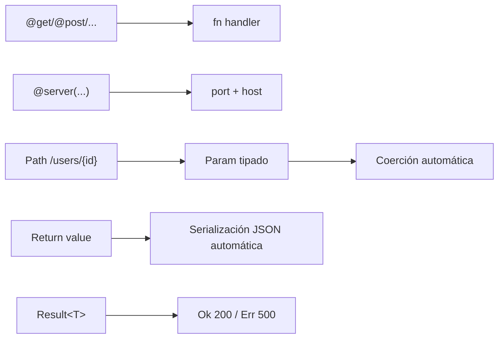
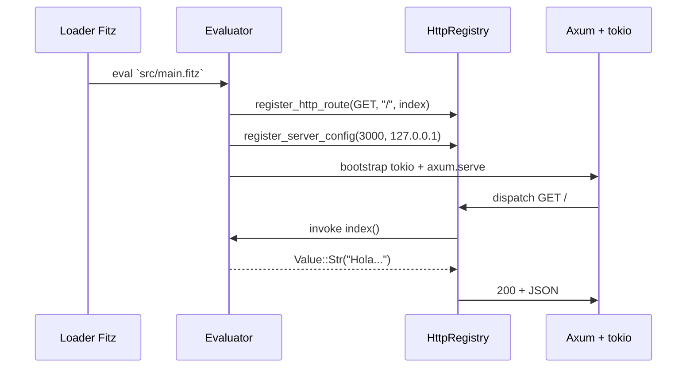
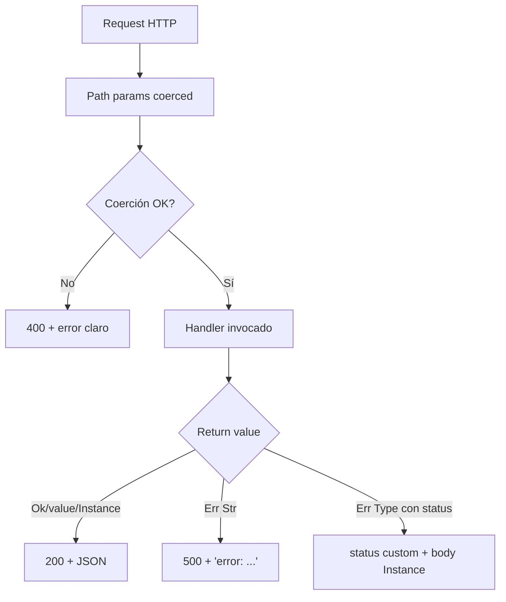

# M4.C1 — `@get` / `@post` / `@put` / `@delete` + `@server`

**Pre-requisitos**: [M3](../m3-modulos/c1-modulos-imports.md)
completo. Sabés organizar un proyecto Fitz, tenés tipos custom y
manejás `Result` con `match` y `?`.

**Objetivo**: hacer **tu primer servidor HTTP en Fitz** y
entender lo que lo distingue del resto del ecosistema —
**HTTP es parte del lenguaje, no un framework que importás**.

**Por qué importa**: en Python necesitás `pip install fastapi` +
`uvicorn` + `pydantic`. En Node necesitás Express o Fastify +
glue. En Java armás un `pom.xml` con Spring Boot y dos days de
config. En Fitz: anotás una función con `@get("/")`, corrés
`fitz run`, y hay un server escuchando. Sin imports, sin
`app = Fitz()`, sin runtime ceremony.

**Cross-link**: [Guía cap 17 — HTTP nativo](../../guide.md#17-http-nativo).

---

## Mapa del cap



---

## Por qué Fitz es distinto acá

Tabla comparativa rápida:

| | Python (FastAPI) | Node (Express) | Java (Spring) | Go (net/http) | **Fitz** |
|---|---|---|---|---|---|
| `import` lib? | Sí (`fastapi`) | Sí (`express`) | Sí (anotación + classpath) | Solo stdlib | **No — built-in** |
| `app = ...` setup? | Sí | Sí | Sí (`@SpringBootApplication`) | No | **No** |
| Path params tipados auto? | Sí (Pydantic) | No (Express) / sí (Hapi) | Sí | No (parse manual) | **Sí** |
| Body deserializado a tipo? | Sí (Pydantic) | No nativo | Sí (Jackson) | No (parse manual) | **Sí** |
| JSON response automático? | Sí | `res.json(...)` | Sí | Manual | **Sí** |
| Compila a binario standalone? | No | No (`pkg` hack) | Sí (jar) | Sí | **Sí (`fitz build`)** |
| OpenAPI auto? | Sí | No nativo | Sí (springdoc) | No | **Sí (próximo cap)** |

Fitz combina la ergonomía de FastAPI con la entrega de Go (binario
standalone) **sin necesitar ningún `pip install` ni `npm install`**.

---

## Paso 1 — Tu primer endpoint

Creá un proyecto nuevo con `--http`:

```bash
cd ~/proyectos
fitz new mi_api --http --no-git
cd mi_api
```

`fitz new --http` arma el skeleton con un `@get("/")` y un
`@server(3000)` pre-cargados. Resultado en `src/main.fitz`:

```fitz
@server(3000)
fn main() => 0

@get("/")
fn index() -> Str => "Hola desde Fitz"
```

Levantá el server:

```bash
fitz run
```

Output:

```
🏔️  Fitz HTTP escuchando en http://127.0.0.1:3000
   GET /
```

En otra terminal:

```bash
curl http://127.0.0.1:3000/
```

```
"Hola desde Fitz"
```

**Bajalo con Ctrl-C**. El intérprete espera a las requests en
vuelo y cierra limpio.

### Qué pasó adentro



1. El evaluator ve `@get("/")` arriba de `fn index`, lo registra
   en el `HttpRegistry` interno.
2. Termina de evaluar el archivo. Como hay rutas registradas,
   arranca tokio + axum en background.
3. Cada request entra como una task tokio, axum la dispatchea, y
   el handler Fitz corre como cualquier otra función.

**Sin loop main**, **sin `app.run()`**. El runtime detecta que hay
rutas y monta el server.

---

## Paso 2 — Los cuatro verbos: GET, POST, PUT, DELETE

```fitz
@get("/users")
fn list_users() -> List<Str> => ["ana", "luis"]

@post("/users")
fn create_user() -> Str => "creado"

@put("/users/{id}")
fn update_user(id: Int) -> Str => "actualizado {id}"

@delete("/users/{id}")
fn delete_user(id: Int) -> Str => "borrado {id}"
```

Tabla de decoradores:

| Decorator | Verbo HTTP | Idiomático para |
|---|---|---|
| `@get("/path")` | GET | Leer / listar / buscar |
| `@post("/path")` | POST | Crear |
| `@put("/path")` | PUT | Actualizar (idempotente) |
| `@delete("/path")` | DELETE | Borrar |

**No hay otros verbos del lenguaje** todavía — PATCH, OPTIONS,
HEAD quedan como deuda menor. (OPTIONS lo emite Fitz automático
cuando hay CORS — ver M4.C3.)

### Errores típicos al registrar rutas

```fitz
@get("/users/{id}")
fn list1(id: Int) => "ok"

@get("/users/{id}")
fn list2(id: Int) => "duplicado"
```

```
✗ ruta duplicada: GET /users/{id} (ya registrada como `list1`)
```

```fitz
@unknown_verb("/users")
fn h() => "ok"
```

```
✗ decorador 'unknown_verb' no reconocido
```

```fitz
@get("/a/{x}/b/{x}")
fn h(x: Str) => x
```

```
✗ path '/a/{x}/b/{x}': nombre 'x' repetido
```

---

## Paso 3 — Path params tipados

Las llaves dentro del path son **params**. El nombre adentro de
`{...}` tiene que coincidir con un parámetro de la función:

```fitz
@get("/users/{id}")
fn get_user(id: Int) -> Str => "user {id}"
```

```bash
curl http://127.0.0.1:3000/users/42
# "user 42"
```

### Coerción automática según el tipo

El tipo declarado del parámetro decide cómo se parsea el path:

| Tipo declarado | Path matcheable | Si falla |
|---|---|---|
| `Int` | `/users/42` | 400 con error claro |
| `Float` | `/users/3.14` | 400 |
| `Bool` | `/users/true` o `/users/false` | 400 |
| `Str` | cualquier cosa | Nunca falla |
| (sin anotación) | cualquier cosa | Llega como `Str` |

Demo del error:

```bash
curl -i http://127.0.0.1:3000/users/abc
```

```
HTTP/1.1 400 Bad Request
content-type: application/json

{"error":"path param 'id': se esperaba Int, recibió 'abc'"}
```

**Punto importante**: el error es **automático** — vos no
escribiste validación. El runtime ve `id: Int`, intenta parsear,
y emite el 400 si no puede. Cero glue.

### Múltiples path params

```fitz
@get("/orgs/{org}/users/{id}")
fn get_user_in_org(org: Str, id: Int) -> Str
    => "{org}/{id}"
```

```bash
curl http://127.0.0.1:3000/orgs/anthropic/users/7
# "anthropic/7"
```

---

## Paso 4 — Serialización automática de la respuesta

Lo que devolvés del handler **se serializa a JSON sin glue**.
Tabla del mapping:

| Tipo Fitz que devolvés | JSON producido | Status |
|---|---|---|
| `Int`, `Float`, `Bool`, `Null` | el primitivo | 200 |
| `Str` | string entre comillas | 200 |
| `List<T>` | array JSON | 200 |
| `Map<Str, V>` | object JSON | 200 |
| Instance de un `type` | object con fields en orden de declaración | 200 |
| `Ok(v)` | `v` serializado | 200 |
| `Err(e)` con `e: Str` | `{"error": e}` | **500** |
| `Err(e)` con `e: Type {status, ...}` | la instance serializada | **status del field** |

### Demo con un `type`

```fitz
type User {
    id: Int
    name: Str
    email: Str?
}

@get("/users/{id}")
fn get_user(id: Int) -> User {
    return User { id: id, name: "ada", email: "ada@x.com" }
}
```

```bash
curl http://127.0.0.1:3000/users/7
# {"id":7,"name":"ada","email":"ada@x.com"}
```

Fields nullables emiten `null` cuando son `None`:

```bash
curl http://127.0.0.1:3000/users/1
# si email fuera null: {"id":1,"name":"ada","email":null}
```

### Demo con `List`

```fitz
@get("/users")
fn list_users() -> List<User> {
    return [
        User { id: 1, name: "ana", email: null },
        User { id: 2, name: "luis", email: "luis@x.com" },
    ]
}
```

```bash
curl http://127.0.0.1:3000/users
# [{"id":1,"name":"ana","email":null},{"id":2,"name":"luis","email":"luis@x.com"}]
```

**Sin `to_json()`, sin serializer, sin `JSON.stringify`**. Tu
`type` es el contrato.

---

## Paso 5 — `Result<T>` + `?` = handlers limpios

El mapping `Ok` / `Err` desbloquea **propagación de errores con
`?`** dentro del handler:

```fitz
type User { id: Int, name: Str }

let users = [
    User { id: 1, name: "ana" },
    User { id: 2, name: "luis" },
]

fn find_user(id: Int) -> Result<User> {
    let found = users.find(fn(u) => u.id == id)
    return match found {
        Ok(u)  => Ok(u)
        Err(_) => Err("usuario {id} no encontrado")
    }
}

@get("/users/{id}")
fn get_user(id: Int) -> Result<User> {
    let u = find_user(id)?
    return Ok(u)
}
```

Comportamiento:

```bash
curl -i http://127.0.0.1:3000/users/1
# HTTP/1.1 200 OK
# {"id":1,"name":"ana"}

curl -i http://127.0.0.1:3000/users/99
# HTTP/1.1 500 Internal Server Error
# {"error":"usuario 99 no encontrado"}
```

El `?` corta el handler con `Err(...)`, el runtime traduce a
**500 + `{"error": ...}`**. Sin try/catch, sin `if err != nil`,
sin glue.

### Diagrama del flujo



---

## Paso 6 — `@server(port, host)` — configurar el server

Por default el server escucha en `127.0.0.1:3000`. Para cambiar:

```fitz
@server(8080)
fn main() => 0
```

```fitz
@server(8080, "0.0.0.0")
fn main() => 0
```

| Posición | Tipo | Default | Validación |
|---|---|---|---|
| 1ra (port) | `Int` | `3000` | rango `[1, 65535]`, fuera → error al registrar |
| 2da (host) | `Str` | `"127.0.0.1"` | tiene que parsear como IP literal IPv4/IPv6 |

### Por qué `"0.0.0.0"` y no `"localhost"`

```fitz
@server(8080, "localhost")  // ❌ ERROR
fn main() => 0
```

```
✗ @server: host 'localhost' no es una IP literal válida.
   Usá '127.0.0.1' (IPv4) o '::1' (IPv6).
```

**No hay resolución DNS** — Fitz exige IP literal porque
`localhost` puede resolver a IPv4 o IPv6 según el sistema, y eso
genera bugs sutiles de "anda en mi máquina pero no en CI".
Explícito siempre.

### `0.0.0.0` vs `127.0.0.1`

| Host | Qué escucha |
|---|---|
| `127.0.0.1` (default) | Solo conexiones del **mismo equipo** (loopback) |
| `0.0.0.0` | **Todas** las interfaces de red (LAN, Docker, etc.) |
| `::1` | Loopback IPv6 |
| `::` | Todas las interfaces IPv6 |

Para Docker: siempre `0.0.0.0` (sino el container no acepta
requests desde el host).

### Múltiples `@server` → error

```fitz
@server(3000)
fn main1() => 0

@server(8080)
fn main2() => 0
```

```
✗ @server ya configurado (port=3000, host=127.0.0.1). Hay un solo
   server por programa.
```

### La convención `fn main() => 0`

```fitz
@server(3000)
fn main() => 0
```

La función decorada con `@server` queda definida en el env como
cualquier otra, pero **no se ejecuta automáticamente**. Por
convención se le pone `main` y un body trivial (`=> 0`), porque
estéticamente queda como "este es el entrypoint del programa".
Pero el nombre **no es mágico** — podés escribir:

```fitz
@server(3000)
fn configurar_server() => 0
```

Y andará idéntico. Lo que importa es el decorator, no el nombre
de la fn.

---

## Paso 7 — State compartido entre handlers

Variables top-level son **el state** del server. Todos los
handlers comparten el mismo env:

```fitz
@server(3000)
fn main() => 0

type User { id: Int, name: Str }

let users = [
    User { id: 1, name: "ana" },
    User { id: 2, name: "luis" },
]

@get("/users")
fn list_users() -> List<User> => users

@post("/users")
fn create_user() -> Str {
    let new_id = users.len() + 1
    users.push(User { id: new_id, name: "nuevo" })
    return "creado #{new_id}"
}
```

Probalo:

```bash
curl http://127.0.0.1:3000/users
# [{"id":1,"name":"ana"},{"id":2,"name":"luis"}]

curl -X POST http://127.0.0.1:3000/users
# "creado #3"

curl http://127.0.0.1:3000/users
# [{"id":1,"name":"ana"},{"id":2,"name":"luis"},{"id":3,"name":"nuevo"}]
```

**Las modificaciones persisten** entre requests porque `users` es
una `List` (compartida por referencia) y todos los handlers
cierran sobre el mismo env top-level.

### Para producción de verdad

Esto es **"memory storage"** — perfecto para prototipos,
juguetes, tests. Para producción real querés:

- **Persistencia en disco** o en una DB (Postgres — M6 del curso).
- **Concurrencia segura** — Fitz usa `Arc<Mutex<>>` por dentro
  (post-F17), pero si dos handlers escriben al mismo recurso
  simultáneamente, el orden de operaciones depende del
  scheduler. Para casos donde la consistencia importa, usá DB
  con transactions.

---

## Paso 8 — Paralelismo HTTP real

Fitz corre handlers **en paralelo** sobre múltiples threads tokio
desde post-F17 (2026-05-14). Demo simple:

```fitz
@server(3000)
fn main() => 0

@get("/lento")
async fn lento() -> Str {
    sleep(1000).await   // duerme 1 segundo
    return "ok"
}
```

```bash
# Sin paralelismo (1 request por vez):
# Tiempo total esperado: ~5 segundos

# Con paralelismo:
time (curl http://127.0.0.1:3000/lento &
      curl http://127.0.0.1:3000/lento &
      curl http://127.0.0.1:3000/lento &
      curl http://127.0.0.1:3000/lento &
      curl http://127.0.0.1:3000/lento &
      wait)
# Tiempo real: ~1.2 segundos
```

`async` y `.await` se cubren en detalle en **M5** del curso.
Para ahora, alcanza con saber que **el server es multi-threaded
nativo, sin worker config**.

---

## Paso 9 — `fitz build` con HTTP (binario standalone)

Compilá el server a binario nativo:

```bash
fitz build
```

Output:

```
✓ src/main.fitz → target/release/mi_api(.exe)
```

Corré el binario directamente — **sin runtime Fitz ni Rust en la
máquina destino**:

```bash
./target/release/mi_api      # Linux/macOS
.\target\release\mi_api.exe  # Windows
```

```
🏔️  Fitz HTTP escuchando en http://127.0.0.1:3000
   GET /
```

Funcionalmente idéntico al `fitz run`. Diferencia:

| `fitz run` | `fitz build` + binario |
|---|---|
| Startup ~150ms (parse + check) | Startup ~5ms (skip parse) |
| Edit & reload con `fitz dev` | Recompilás para ver cambios |
| Pesa lo que pese tu source | ~10-15MB el binario |
| Ideal para dev | Ideal para producción |

**Paridad bit-a-bit** — el mismo programa produce las mismas
responses byte por byte en ambos modos. Los tests CI corren
ambos modos contra los mismos curl asserts.

---

## Paso 10 — Demo end-to-end completo

`src/main.fitz` mínimo pero realista:

```fitz
@server(3000)
fn main() => 0

type User {
    id: Int
    name: Str
    email: Str?
}

let users = [
    User { id: 1, name: "ana", email: "ana@x.com" },
    User { id: 2, name: "luis", email: null },
]

fn find_user(id: Int) -> Result<User> {
    let found = users.find(fn(u) => u.id == id)
    return match found {
        Ok(u)  => Ok(u)
        Err(_) => Err("usuario {id} no encontrado")
    }
}

@get("/")
fn index() -> Str => "Mi API en Fitz"

@get("/users")
fn list_users() -> List<User> => users

@get("/users/{id}")
fn get_user(id: Int) -> Result<User> {
    return find_user(id)
}

@delete("/users/{id}")
fn delete_user(id: Int) -> Result<Str> {
    let u = find_user(id)?
    return Ok("borrado {u.name}")
}
```

Pruebas:

```bash
curl http://127.0.0.1:3000/
curl http://127.0.0.1:3000/users
curl http://127.0.0.1:3000/users/1
curl http://127.0.0.1:3000/users/99
curl -X DELETE http://127.0.0.1:3000/users/1
curl -X DELETE http://127.0.0.1:3000/users/99
```

Outputs esperados:

```
"Mi API en Fitz"
[{"id":1,"name":"ana","email":"ana@x.com"},{"id":2,"name":"luis","email":null}]
{"id":1,"name":"ana","email":"ana@x.com"}
{"error":"usuario 99 no encontrado"}     # 500
"borrado ana"
{"error":"usuario 99 no encontrado"}     # 500
```

---

## Paso 11 — Subset compilable a binario

Lo que cubrimos en este cap **compila end-to-end con `fitz
build`**:

| Feature | `fitz run` | `fitz build` |
|---|---|---|
| `@get/@post/@put/@delete` | ✅ | ✅ |
| `@server(port, host)` | ✅ | ✅ |
| Path params tipados (Int/Float/Bool/Str) | ✅ | ✅ |
| Serialización automática JSON | ✅ | ✅ |
| `Result<T>` → 200/500 | ✅ | ✅ |
| State compartido top-level | ✅ | ✅ |
| Paralelismo HTTP | ✅ | ✅ |

POST con body deserializado, query params y headers se cubren en
[M4.C2](c2-body-query-headers.md). También compilan.

---

## Validación

- [ ] `fitz new mi_api --http --no-git` arma skeleton con `@get` y
      `@server` listos.
- [ ] `fitz run` levanta server en `127.0.0.1:3000`, banner
      muestra rutas registradas.
- [ ] `curl http://127.0.0.1:3000/` devuelve el string del
      handler como JSON.
- [ ] `@get("/users/{id}")` con `id: Int` rechaza `/users/abc`
      con 400 + mensaje claro.
- [ ] `Result<T>` Ok → 200, Err Str → 500 con `{"error":...}`.
- [ ] `fitz build` produce un binario standalone que sirve
      idéntico al `fitz run`.
- [ ] `@server(8080)` cambia el puerto, banner lo refleja.

---

## Troubleshooting

### "Address already in use" al `fitz run`

```
✗ no se pudo bindear 127.0.0.1:3000: Address already in use (os error 98)
```

Hay otro proceso en el mismo puerto. Mátalo o cambiá el `@server(...)`:

```bash
# Linux/macOS — ver qué usa el 3000:
lsof -i :3000

# Windows:
netstat -ano | findstr :3000
taskkill /F /PID <pid>
```

### El curl desde otra máquina no llega

Por default el server escucha en `127.0.0.1` (loopback). Para
aceptar conexiones de la LAN o de Docker:

```fitz
@server(3000, "0.0.0.0")
fn main() => 0
```

Verificá también el firewall del OS (Windows Defender / iptables
/ macOS firewall).

### "path param 'id': se esperaba Int, recibió '12.5'"

`Int` rechaza decimales. Si el path puede traer `12.5`, declará
`id: Float` o `id: Str` y parseás vos.

### "ruta duplicada: GET /users"

Definiste dos handlers con el mismo método y path. Fitz no
permite overloading por content-type o headers (todavía) — un
método+path único por handler.

### El handler devuelve `List<Map>` y el JSON sale raro

```fitz
@get("/data")
fn data() -> List<Map<Str, Any>> => [{"x": 1}, {"y": "z"}]
```

Map con `Any` heterogéneo no siempre serializa lo que esperás.
Definí un `type` y devolvé `List<Foo>` — más claro y mejor
documentado.

### Cómo veo qué rutas hay registradas

El banner al arrancar las lista. Cuando llegue OpenAPI ([M4.C4](c4-openapi-docs.md))
vas a tener `/openapi.json` con todo el contrato.

---

## Lo que sigue

En este cap viste **la mitad del flujo HTTP**: rutas, path
params, serialización automática, `Result<T>` → status code,
server config.

**Falta la otra mitad**: cómo recibir **body JSON** (POST/PUT con
datos), **query params** (`?limit=10&page=2`) y **headers
HTTP** (`Authorization`, `X-Trace-Id`). Eso es el próximo cap.

→ **[M4.C2 — Body deserialization + query params + headers](c2-body-query-headers.md)**
