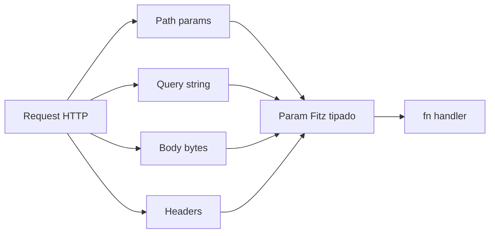
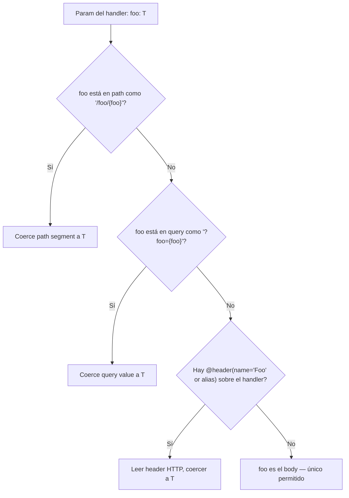

# M4.C2 — Body, query params y headers

**Pre-requisitos**: [M4.C1 — Verbos + `@server`](c1-verbos-server.md).
Sabés montar un server, declarar rutas con path params y devolver
JSON automático.

**Objetivo**: cubrir **las tres formas de recibir datos del
cliente** que faltan después del path:

1. **Body** (típicamente POST/PUT con JSON o form data).
2. **Query params** (`?limit=10&page=2`).
3. **Headers** (`Authorization: bearer ...`, `X-Trace-Id: ...`).

**Por qué importa**: con `@get` y path params sólo cubrís APIs
muy simples. Apenas necesitás crear un recurso, paginar, filtrar
o autenticar, necesitás body + query + headers. Fitz los modela
**todos como parámetros tipados del handler** — sin extractores
manuales, sin glue.

**Cross-link**: [Guía cap 17 — HTTP nativo](../../guide.md#17-http-nativo).

---

## Mapa del cap



Todos los inputs de la request se modelan como **parámetros del
handler con tipos Fitz nativos**. El runtime resuelve cuál es
cuál por convención sintáctica.

---

## Paso 1 — Body JSON deserializado a un `type`

La forma idiomática: declarás un `type` para el body y lo
pasás como param del handler:

```fitz
@server(3000)
fn main() => 0

type UserInput {
    name: Str
    email: Str?
}

type User {
    id: Int
    name: Str
    email: Str?
}

let users = [
    User { id: 1, name: "ana", email: "ana@x.com" },
]

@post("/users")
fn create_user(body: UserInput) -> User {
    let new_id = users.len() + 1
    let u = User { id: new_id, name: body.name, email: body.email }
    users.push(u)
    return u
}
```

```bash
curl -X POST http://127.0.0.1:3000/users \
    -H "Content-Type: application/json" \
    -d '{"name":"luis","email":"luis@x.com"}'
# {"id":2,"name":"luis","email":"luis@x.com"}
```

### Convención: cuál es el body

**El runtime detecta el body como `el param del handler cuyo
nombre no aparece como path param`**. En `@post("/users")` no hay
`{...}` en el path, así que `body: UserInput` es el body.

Mezclando path params y body:

```fitz
@put("/users/{id}")
fn update_user(id: Int, body: UserInput) -> User {
    // id ← path, body ← request body
    return User { id: id, name: body.name, email: body.email }
}
```

`id` viene del path (matchea `{id}`), `body` queda como body.

### Máximo un body por handler

```fitz
@post("/x")
fn doble(body1: UserInput, body2: UserInput) => ...
```

```
✗ handler 'doble': se permite máximo 1 body param,
   tiene 2 (body1, body2)
```

Si necesitás dos objetos en el mismo body, agrupalos en un `type`
parent.

### Validación automática contra el schema

`UserInput` declara `name: Str` (obligatorio) y `email: Str?`
(opcional). El runtime valida cada request:

```bash
# Body válido
curl -X POST http://127.0.0.1:3000/users \
    -H "Content-Type: application/json" \
    -d '{"name":"ana"}'
# {"id":2,"name":"ana","email":null}

# Falta campo no nullable
curl -i -X POST http://127.0.0.1:3000/users \
    -H "Content-Type: application/json" \
    -d '{"email":"x@x.com"}'
# HTTP/1.1 400 Bad Request
# {"error":"body para 'UserInput': falta el campo 'name'"}

# Campo extra que no declaraste
curl -i -X POST http://127.0.0.1:3000/users \
    -H "Content-Type: application/json" \
    -d '{"name":"ana","extra":true}'
# HTTP/1.1 400 Bad Request
# {"error":"body para 'UserInput': campo no declarado: extra"}

# JSON roto
curl -i -X POST http://127.0.0.1:3000/users \
    -H "Content-Type: application/json" \
    -d 'not json'
# HTTP/1.1 400 Bad Request
# {"error":"body no es JSON válido: expected ident at line 1 column 2"}
```

Tabla de qué dispara qué error:

| Caso | Status | Mensaje |
|---|---|---|
| Body no parsea como JSON | 400 | `body no es JSON válido: <razón>` |
| Falta campo obligatorio sin default | 400 | `falta el campo '<name>'` |
| Tipo de campo no matchea (`name: 42`) | 400 | `campo 'name': se esperaba Str, recibió Int` |
| Campo extra no declarado | 400 | `campo no declarado: <name>` |
| Field nullable con `null` | ✅ acepta | — |
| Field con default | ✅ usa default | — |

**Strict mode** — no hay "ignorar campos extras". Si tu cliente
manda extras, falla 400. Eso evita typos silenciosos:
`{"emial": ...}` no se traga como ausente.

### Defaults en el `type`

```fitz
type UserInput {
    name: Str
    email: Str?
    role: Str = "user"      // default si no viene
    active: Bool = true
}
```

```bash
curl -X POST http://127.0.0.1:3000/users \
    -H "Content-Type: application/json" \
    -d '{"name":"ana"}'
# El handler ve: UserInput { name: "ana", email: null, role: "user", active: true }
```

---

## Paso 2 — Body sin schema (Map libre)

A veces no querés tipar el body — webhooks de terceros, APIs
exploratorias, payloads heterogéneos. Declarás `Map<Str, Any>`:

```fitz
@post("/webhook")
fn webhook(body: Map<Str, Any>) -> Str {
    let event = body["event"]
    return "recibí: {event}"
}
```

```bash
curl -X POST http://127.0.0.1:3000/webhook \
    -H "Content-Type: application/json" \
    -d '{"event":"signup","user_id":42,"meta":{"source":"google"}}'
# "recibí: signup"
```

Tipos soportados en `body` libre:

| JSON | Fitz declarado |
|---|---|
| Object | `Map<Str, Any>` |
| Array | `List<Any>` |
| Primitivo | `Int` / `Float` / `Str` / `Bool` / `Null` |

**Trade-off**: perdés validación, ganás flexibilidad. Usalo para
webhooks; para APIs propias siempre tipá con `type`.

---

## Paso 3 — Body como `application/x-www-form-urlencoded`

El formato que mandan los `<form>` HTML cuando NO especifican
`enctype`:

```fitz
@post("/login")
fn login(body: Map<Str, Str>) -> Str {
    let user = body["username"]
    let pass = body["password"]
    return "hola {user}"
}
```

```bash
curl -X POST http://127.0.0.1:3000/login \
    -d "username=ada&password=secret123"
# "hola ada"
```

Fitz detecta el header `Content-Type:
application/x-www-form-urlencoded` y parsea automáticamente a
`Map<Str, Str>` con URL-decoding aplicado (`+` → espacio,
`%XX` → byte hex).

**Paridad bit-a-bit `fitz run` ↔ `fitz build`** — el binario
nativo también acepta urlencoded.

---

## Paso 4 — Body multipart (uploads de files)

Cuando el form HTML usa `enctype="multipart/form-data"`:

```fitz
@post("/upload")
fn upload(body: Map<Str, File>) -> Str {
    let f = body["doc"]
    if (f.name == null) {
        return "sin filename"
    }
    let bytes = len(f.content)
    return "subiste '{f.name}' ({bytes} caracteres)"
}
```

```bash
curl -X POST http://127.0.0.1:3000/upload \
    -F "doc=@notas.txt"
# "subiste 'notas.txt' (123 caracteres)"
```

`File` es un **tipo built-in** del runtime (no requiere import)
con fields:

| Field | Tipo | Para qué |
|---|---|---|
| `name` | `Str?` | `filename` del part (puede faltar si el cliente no lo mandó) |
| `content_type` | `Str?` | MIME del part (declarado por el cliente, no se valida) |
| `content` | `Bytes` | Contenido real del file |

Para mixto (text fields + files):

```fitz
@post("/upload-with-meta")
fn upload(body: Map<Str, Any>) -> Str {
    let title = body["title"]      // text field
    let doc = body["doc"]          // File instance
    return "{title}: {doc.name}"
}
```

```bash
curl -X POST http://127.0.0.1:3000/upload-with-meta \
    -F "title=mis notas" \
    -F "doc=@notas.txt"
# "mis notas: notas.txt"
```

### Validar bytes vs UTF-8

`f.content` es `Bytes`. Si querés tratarlo como string, usá
`.to_str()` que devuelve `Result<Str>`:

```fitz
@post("/upload-text")
fn upload(body: Map<Str, File>) -> Str {
    let f = body["doc"]
    let text = f.content.to_str()
    return match text {
        Ok(s)  => "leí {len(s)} caracteres UTF-8"
        Err(_) => "archivo no es UTF-8"
    }
}
```

Bytes binarios (imágenes, PDFs, zips) pasan como `Bytes` sin
asumir encoding.

---

## Paso 5 — Validación de Content-Type estricta (415)

Fitz exige que el Content-Type matchee con lo que el handler
sabe parsear:

| Content-Type del cliente | Manejo |
|---|---|
| `application/json` (o ausente) | Parse como JSON |
| `application/x-www-form-urlencoded` | Parse como `Map<Str, Str>` |
| `multipart/form-data; boundary=...` | Parse como `Map<Str, Any>` |
| Otro (`text/plain`, `application/xml`, ...) | **415 Unsupported Media Type** |

Demo:

```bash
curl -i -X POST http://127.0.0.1:3000/users \
    -H "Content-Type: text/plain" \
    -d 'soy texto plano'
# HTTP/1.1 415 Unsupported Media Type
# {"error":"Content-Type no soportado: 'text/plain'. El handler espera JSON
#  (`application/json`), urlencoded (`application/x-www-form-urlencoded`) o
#  multipart (`multipart/form-data`). Otros formatos quedan como sub-paso futuro."}
```

**Sin Content-Type explícito** (curl sin `-H`), Fitz **asume
JSON** — es la convención de la mayoría de los clientes HTTP.

---

## Paso 6 — Query params

Para recibir `?limit=10&offset=20`, declarás los params adentro
del path después de `?`:

```fitz
@server(3000)
fn main() => 0

type Item { id: Int, name: Str }

@get("/items?limit={limit}&offset={offset}")
fn list_items(limit: Int, offset: Int) -> List<Item> {
    return [
        Item { id: 1, name: "primero" },
        Item { id: 2, name: "segundo" },
    ]
}
```

```bash
curl "http://127.0.0.1:3000/items?limit=10&offset=20"
# [{"id":1,"name":"primero"},{"id":2,"name":"segundo"}]
```

Reglas:

- Cada `{name}` adentro del query corresponde a un parámetro del
  handler con el mismo nombre.
- La key del query y el nombre del parámetro tienen que
  **coincidir exactamente** — `?l={limit}` es error al
  registrar.

### Obligatorios vs opcionales

| Anotación del param | Comportamiento |
|---|---|
| `limit: Int` | **Obligatorio**. Falta → 400 |
| `limit: Int?` | **Opcional**. Falta → `null` adentro del handler |

```fitz
@get("/search?name={name}&limit={limit}")
fn search(name: Str, limit: Int?) -> Str {
    if (limit == null) {
        return "buscando '{name}' sin límite"
    }
    return "buscando '{name}' con límite {limit}"
}
```

```bash
curl "http://127.0.0.1:3000/search?name=fitz"
# "buscando 'fitz' sin límite"

curl "http://127.0.0.1:3000/search?name=fitz&limit=10"
# "buscando 'fitz' con límite 10"

curl -i "http://127.0.0.1:3000/search?limit=10"
# HTTP/1.1 400 Bad Request
# {"error":"query param 'name': falta — es obligatorio"}
```

### Coerción automática

Los query values llegan **siempre como Str** desde HTTP. Fitz los
parsea al tipo declarado:

| Anotación | Path matcheable | Si falla |
|---|---|---|
| `Int` | `?n=42` | 400 con mensaje claro |
| `Float` | `?f=3.14` | 400 |
| `Bool` | `?active=true` o `?active=false` | 400 |
| `Str` | cualquier cosa | Nunca falla |

```bash
curl -i "http://127.0.0.1:3000/search?name=fitz&limit=abc"
# HTTP/1.1 400 Bad Request
# {"error":"query param 'limit': se esperaba Int, recibió 'abc'"}
```

### Tipos compuestos en query (deuda)

Hoy `List<T>` y tipos custom **no se soportan** en query params.
Si necesitás `?tags=a,b,c`, declarálo como `Str` y parseálo
adentro:

```fitz
@get("/posts?tags={tags}")
fn list_posts(tags: Str) -> Str {
    // splitear manualmente
    return "filtrando por: {tags}"
}
```

Soporte nativo de `List<T>` en query queda como sub-paso futuro
si aparece demanda.

### Combinable con path + body

```fitz
type Patch { value: Int }

@put("/items/{id}?dry_run={dry_run}")
fn update_item(id: Int, dry_run: Bool, body: Patch) -> Str {
    // id ← path, dry_run ← query, body ← request body
    if (dry_run) {
        return "simulación: setearía {body.value}"
    }
    return "actualizado"
}
```

```bash
curl -X PUT "http://127.0.0.1:3000/items/7?dry_run=true" \
    -H "Content-Type: application/json" \
    -d '{"value":42}'
# "simulación: setearía 42"
```

---

## Paso 7 — Headers HTTP con `@header(name=...)`

Para recibir un header como param del handler, apilás
`@header(name="...")` **antes** del decorator de ruta:

```fitz
@server(3000)
fn main() => 0

@header(name="Authorization")
@get("/private")
fn private(authorization: Str) -> Str {
    return "auth = {authorization}"
}

@header(name="X-Trace-Id")
@get("/traced")
fn traced(x_trace_id: Str?) -> Str {
    if (x_trace_id == null) {
        return "sin trace id"
    }
    return "trace = {x_trace_id}"
}
```

```bash
curl http://127.0.0.1:3000/private \
    -H "Authorization: bearer-xyz"
# "auth = bearer-xyz"

curl -i http://127.0.0.1:3000/private
# HTTP/1.1 400 Bad Request
# {"error":"header 'Authorization': falta — es obligatorio"}

curl http://127.0.0.1:3000/traced
# "sin trace id"

curl http://127.0.0.1:3000/traced \
    -H "X-Trace-Id: abc123"
# "trace = abc123"
```

### Convención del nombre del param

Por defecto el nombre del param Fitz se deriva del header así:

1. Lowercase todo el nombre.
2. Reemplazar `-` por `_`.

| `@header(name=...)` | Nombre del param Fitz |
|---|---|
| `"Authorization"` | `authorization` |
| `"X-Trace-Id"` | `x_trace_id` |
| `"Content-Type"` | `content_type` |
| `"X-API-Key"` | `x_api_key` |

### Alias con `into=...`

Si la convención no te gusta, podés renombrar el param Fitz con
`into="..."`:

```fitz
@header(name="X-Auth", into="token")
@get("/me")
fn me(token: Str) -> Str => "token: {token}"
```

```bash
curl http://127.0.0.1:3000/me -H "X-Auth: abc"
# "token: abc"
```

### Tipos soportados

| Anotación | Comportamiento |
|---|---|
| `Str` | Obligatorio (400 si falta) |
| `Str?` | Opcional (llega `null` si falta) |
| Otro (`Int`, `Bool`, ...) | Error al registrar |

Si necesitás un header numérico, parseálo adentro:

```fitz
@header(name="X-Page-Size")
@get("/items")
fn list_items(x_page_size: Str?) -> Str {
    if (x_page_size == null) {
        return "page size default"
    }
    // parsear x_page_size a Int con `.to_int()` o similar
    return "page size = {x_page_size}"
}
```

### Lookup case-insensitive

HTTP es case-insensitive en headers, así que Fitz también:

```bash
# Todos válidos para @header(name="Authorization"):
curl ... -H "Authorization: x"
curl ... -H "authorization: x"
curl ... -H "AUTHORIZATION: x"
```

Internamente, el runtime convierte todos los nombres a lowercase
antes de buscar.

### Múltiples headers en el mismo handler

Apilás varios `@header(...)`:

```fitz
@header(name="Authorization")
@header(name="X-Trace-Id")
@get("/api/resource")
fn get_resource(authorization: Str, x_trace_id: Str?) -> Str {
    return "auth: {authorization}, trace: {x_trace_id}"
}
```

---

## Paso 8 — Todos los inputs en un handler

```fitz
@server(3000)
fn main() => 0

type CreateItem {
    name: Str
    quantity: Int = 1
}

type Item {
    id: Int
    name: Str
    quantity: Int
    user_id: Int
}

@header(name="Authorization")
@header(name="X-Trace-Id")
@post("/users/{user_id}/items?notify={notify}")
fn create_item(
    user_id: Int,           // path
    notify: Bool,           // query (obligatorio)
    authorization: Str,     // header obligatorio
    x_trace_id: Str?,       // header opcional
    body: CreateItem        // body JSON
) -> Item {
    return Item {
        id: 1,
        name: body.name,
        quantity: body.quantity,
        user_id: user_id,
    }
}
```

```bash
curl -X POST "http://127.0.0.1:3000/users/42/items?notify=true" \
    -H "Content-Type: application/json" \
    -H "Authorization: bearer-xyz" \
    -H "X-Trace-Id: req-001" \
    -d '{"name":"libro","quantity":2}'
# {"id":1,"name":"libro","quantity":2,"user_id":42}
```

**Cinco fuentes distintas de datos**, **un handler**, **cero
glue**:

| Fuente | Param | Validación |
|---|---|---|
| Path `/users/{user_id}/items` | `user_id: Int` | coerción Int |
| Query `?notify={notify}` | `notify: Bool` | obligatorio + coerción Bool |
| Header `Authorization` | `authorization: Str` | obligatorio |
| Header `X-Trace-Id` | `x_trace_id: Str?` | opcional |
| Body JSON | `body: CreateItem` | schema validation |

---

## Paso 9 — Diagrama mental: cómo Fitz resuelve cada param



Reglas resumidas:

1. Path primero.
2. Query segundo.
3. Header tercero (si hay `@header(name=...)`).
4. **Lo último que queda** = body. Solo puede haber **uno**.

---

## Paso 10 — Subset compilable a binario (`fitz build`)

Todo lo del cap compila end-to-end:

| Feature | `fitz run` | `fitz build` |
|---|---|---|
| Body `Map<Str, Any>` libre | ✅ | ✅ |
| Body tipado con `type` | ✅ | ✅ |
| Body urlencoded `Map<Str, Str>` | ✅ | ✅ |
| Body multipart `Map<Str, File>` | ✅ | ✅ |
| Query params obligatorios + opcionales | ✅ | ✅ |
| Coerción automática `Int`/`Float`/`Bool` | ✅ | ✅ |
| `@header(name=...)` con alias `into=` | ✅ | ✅ |
| Headers case-insensitive | ✅ | ✅ |
| 400 / 415 automáticos | ✅ | ✅ |

---

## Validación

- [ ] `POST /users` con body JSON tipado devuelve la instance
      serializada.
- [ ] Body con campo extra dispara 400 con mensaje claro.
- [ ] Body con campo obligatorio faltante dispara 400.
- [ ] `GET /search?name={name}&limit={limit}` con `Int?`
      acepta `?name=x` (limit null) y `?name=x&limit=10`.
- [ ] Header `Authorization` obligatorio rechaza con 400 si
      falta.
- [ ] Header con alias `into="token"` matchea con el nombre
      Fitz declarado.
- [ ] Content-Type `text/plain` sobre handler que espera JSON
      devuelve 415.
- [ ] Multipart upload con `-F file=@x.txt` llega como
      `File { name: "x.txt", content_type: ..., content: ... }`.

---

## Troubleshooting

### "se esperaba Int, recibió '12.5'"

Coerción estricta. Si tu API debe aceptar `12.5`, declará el param
como `Float`. Si querés aceptar cualquier cosa y parsear vos,
usá `Str`.

### "body no es JSON válido"

Verificá que el body realmente sea JSON parseable. Errores típicos:

- Olvidaste comillas dobles: `{name: "x"}` (no JSON, ident
  Python-style).
- Trailing comma: `{"a": 1,}` (no JSON estándar).
- Cliente mandó vacío con `Content-Type: application/json`.

### "campo no declarado: foo"

Tu `type` exige strict schema. Dos opciones:

1. Agregás el field al `type`.
2. Si el campo es realmente opcional y no te importa, declarás
   `body: Map<Str, Any>` para perder el schema.

### Query param `?tags=a&tags=b&tags=c` no llega como lista

Soporte de listas en query es deuda. Workaround: usá
`?tags=a,b,c` y parseás:

```fitz
@get("/posts?tags={tags}")
fn list(tags: Str) -> Str {
    // tags = "a,b,c" — splitear vos
    return "tags: {tags}"
}
```

### Header nunca llega aunque el cliente lo manda

Verificá:

- El name en `@header(name="...")` matchea con el cliente
  (case-insensitive ok).
- El param del handler tiene el nombre derivado correcto
  (lowercase + `-` → `_`), o tiene un `into="..."` explícito.

### Curl con body multipart no llega como `Map<Str, File>`

Verificá que estás usando `-F` (multipart) y no `-d` (urlencoded):

```bash
# multipart (correcto para upload):
curl -X POST http://... -F "doc=@archivo.txt"

# urlencoded (NO sirve para files):
curl -X POST http://... -d "doc=archivo.txt"
```

### File con bytes binarios falla parse

`f.content` es `Bytes` desde hace ya un tiempo. Si tu código
asume `Str`, fallaba en versiones viejas. Para procesar texto,
`f.content.to_str()` devuelve `Result<Str>`.

---

## Lo que sigue

Ya cubrimos todo lo que entra al handler. **El próximo cap cubre
lo que pasa ALREDEDOR del handler**: middleware (logging, auth,
rate limiting) y CORS (para frontends en otro dominio).

→ **[M4.C3 — Middleware + CORS](c3-middleware-cors.md)**
