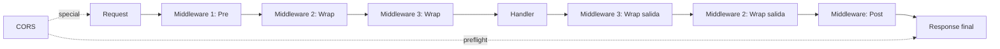

# M4.C3 — Middleware + CORS

**Pre-requisitos**: [M4.C2 — Body + query + headers](c2-body-query-headers.md).
Sabés recibir y validar todo lo que el cliente puede mandar.

**Objetivo**: cubrir **todo lo que pasa alrededor del handler** —
logging, autenticación, rate limiting, observability, y **CORS**
(para que tu API la consuman frontends en otro dominio).

**Por qué importa**: el handler es solo "qué hacer cuando llega
una request válida". El middleware modela el resto del ciclo de
vida HTTP — lo que pasa **antes** del handler (auth, validaciones
cross-cutting), **después** del handler (logging, modificar
response, agregar headers) o **envolviendo** la invocación
(timing, decisión condicional de continuar). Sin middleware,
todo eso se repite en cada handler.

**Cross-link**: [Guía cap 17 — Middleware y CORS](../../guide.md#middleware-y-cors).

---

## Mapa del cap



Tres clases de middleware + CORS como caso especial.

---

## Paso 1 — `@middleware(fn)` — la idea base

Decorás un handler con `@middleware(funcion)` antes del decorator
de ruta. La fn se ejecuta como parte del ciclo de la request:

```fitz
@server(3000)
fn main() => 0

fn logger(req: Request) {
    // Sin return → la cadena continúa al handler
}

@middleware(logger)
@get("/")
fn index() -> Str => "ok"
```

Reglas básicas:

1. Los `@middleware(...)` van **antes** del decorator de ruta
   (`@get`/`@post`/...).
2. Cada uno recibe un primer arg de tipo `Request`.
3. **El orden importa**: el `@middleware(...)` más arriba corre
   primero.

`Request` es un tipo **built-in** del runtime con fields:

| Field | Tipo | Para qué |
|---|---|---|
| `method` | `Str` | "GET" / "POST" / ... |
| `path` | `Str` | URL path (sin query) |
| `headers` | `Map<Str, Str>` | Headers de la request (keys lowercase) |

---

## Paso 2 — Las tres clases de middleware

Fitz tiene **tres modelos** según la firma de la fn:

| Aridad | Tipo del 2do param | Kind | Cuándo corre |
|---|---|---|---|
| 1 | (solo `Request`) | **Pre** | ANTES del handler (gate-only) |
| 2 | `Response` | **Post** | DESPUÉS del handler |
| 2 | `Fn() -> Response` | **Wrap** | ENVUELVE la invocación |

El runtime infiere el kind automáticamente desde la firma.

### Pre (gate)

```fitz
fn auth(req: Request) {
    if (req.headers.has("authorization")) {
        return null      // continúa la chain
    }
    return 401 {"error": "auth required"}
}

@middleware(auth)
@get("/admin")
fn admin() -> Str => "datos administrativos"
```

Comportamiento:

| Acción del middleware | Efecto |
|---|---|
| `return null` o sin return | **Continúa** al próximo middleware / handler |
| `return <status> { ... }` | **Corta** la chain, el handler nunca corre |
| Cualquier otro retorno | Error claro al registrar |

Demo:

```bash
curl -i http://127.0.0.1:3000/admin
# HTTP/1.1 401 Unauthorized
# {"error":"auth required"}

curl -i http://127.0.0.1:3000/admin -H "Authorization: x"
# HTTP/1.1 200 OK
# "datos administrativos"
```

**Use cases típicos**:
- Autenticación
- Rate limiting
- Logging básico (request recibida)
- Validación cross-cutting (todos los handlers que necesitan un
  header X)

### Post (post-process)

```fitz
fn add_server_header(req: Request, resp: Response) -> Response {
    // Modificá la response o devolvé una nueva
    return resp
}

@middleware(add_server_header)
@get("/")
fn index() -> Str => "hola"
```

`Response` es un tipo built-in **opaco** (no podés ver sus
fields directamente). Hoy podés:

- Recibirla del handler.
- Devolverla tal cual.
- Devolver una response distinta con `return <status> { ... }`.

```fitz
fn rewrite(req: Request, resp: Response) -> Response {
    if (req.path == "/secret") {
        return 200 {"rewritten": true}
    }
    return resp
}
```

**Use cases típicos**:
- Logging de response (status, tiempo, body size)
- Inyectar headers de seguridad
- Rewriting de errores

**Limitación**: handlers `-> Result<T>` + post-process middleware
**no compila en `fitz build`** todavía (deuda residual). En
`fitz run` funciona end-to-end.

### Wrap (envoltura con `next`)

El segundo param es un **callable** `Fn() -> Response`. El
middleware decide cuándo (o si) invocar `next()`:

```fitz
fn timing(req: Request, next: Fn() -> Response) -> Response {
    // Acá podríamos medir tiempo antes
    let r = next()           // ejecuta el resto: wraps, handler, posts
    // Acá podríamos medir tiempo después
    return r
}

@middleware(timing)
@get("/api")
fn api() -> Str => "data"
```

Más útil: gate condicional con response wrapping:

```fitz
fn auth_gate(req: Request, next: Fn() -> Response) -> Response {
    let token = req.headers.get("x-auth")
    match token {
        Ok(_)  => next()       // ejecuta el handler
        Err(_) => return 401 {"error": "auth required"}
    }
}
```

| Cuándo Wrap > Pre | Por qué |
|---|---|
| Medir tiempo de toda la chain | Pre no ve la response |
| Decisión condicional de invocar handler | Pre solo gate-only |
| Envolver la response (cambiar body después) | Pre no devuelve response |
| Tres niveles de mw + handler todo medido | Pre+Post no anida correctamente |

**Limitación**: Wrap **solo en `fitz run`**. `fitz build` rechaza
con error claro:

```
✗ middleware wrap-style 'timing' requiere `fitz run`.
   `fitz build` no soporta wrap todavía (sub-paso futuro). Usá
   Pre + Post como alternativa, o `fitz run`.
```

---

## Paso 3 — Apilar múltiples middlewares

Los `@middleware(...)` se apilan **top-down**:

```fitz
@middleware(logger)       // corre primero
@middleware(auth)         // corre segundo
@middleware(rate_limit)   // corre tercero
@get("/api")
fn api() -> Str => "ok"
```

Orden de ejecución para una request entrante:

1. `logger(req)` → null → continúa
2. `auth(req)` → null o cortar
3. `rate_limit(req)` → null o cortar
4. `api()` → handler corre

Para post-process middlewares el orden de salida es **inverso**:

```fitz
@middleware(outer_post)
@middleware(inner_post)
@get("/x")
fn x() -> Str => "ok"
```

Ejecución:

1. `outer_post` se anota para correr al final
2. `inner_post` se anota para correr al final
3. Handler corre
4. `inner_post(req, resp)` corre primero
5. `outer_post(req, resp)` corre después

Como **una stack** — el más cercano al handler corre primero al
salir.

### Mezclar pre + post + wrap

```fitz
@middleware(logger)        // Pre
@middleware(timing)        // Wrap
@middleware(auth)          // Pre
@middleware(add_headers)   // Post
@get("/api")
fn api() -> Str => "ok"
```

Flow:

```
logger(req)
  timing(req, next):
    auth(req)
      handler api()
      respuesta
    add_headers(req, resp)
  retorno de timing
respuesta final
```

---

## Paso 4 — CORS — para frontends en otro dominio

**El problema**: si tu API corre en `api.miempresa.com` y tu
frontend Vue/React corre en `app.miempresa.com`, el browser
**bloquea las requests** del frontend por la **same-origin
policy**.

**La solución estándar**: el server responde headers
`Access-Control-Allow-*` autorizando explícitamente al frontend
a hacer requests cross-origin. Eso es CORS.

**En Fitz**: `cors(...)` es un **built-in** que se aplica como
middleware:

```fitz
@middleware(cors())
@get("/api/items")
fn list_items() -> List<Str> => ["uno", "dos"]
```

`cors()` sin args usa defaults permisivos (todo origen
permitido). Para producción querés restringir — más abajo.

### Qué hace `cors(...)` por dentro

Cuando aplicás `cors(...)`:

1. **Registra un handler OPTIONS automático** para el mismo
   path. Una request preflight `OPTIONS /api/items` responde
   **204 No Content** con los headers `Access-Control-Allow-*`
   configurados.
2. **Inyecta headers en las responses reales** del handler
   (`GET /api/items`, `POST ...`). Esto vale **también para
   errores** (500/400/etc.) — sin eso, el browser tapa el error
   real con un "CORS error" en consola que es indescifrable.

Demo del preflight:

```bash
curl -i -X OPTIONS http://127.0.0.1:3000/api/items \
    -H "Origin: https://app.example.com" \
    -H "Access-Control-Request-Method: GET"
# HTTP/1.1 204 No Content
# access-control-allow-origin: *
# access-control-allow-methods: GET, POST, PUT, DELETE, OPTIONS
# access-control-allow-headers: content-type, authorization
```

Demo del request real:

```bash
curl -i http://127.0.0.1:3000/api/items \
    -H "Origin: https://app.example.com"
# HTTP/1.1 200 OK
# content-type: application/json
# access-control-allow-origin: *
# ["uno","dos"]
```

### Configuración custom

```fitz
@middleware(cors({
    "allow_origin": "https://app.example.com",
    "allow_methods": ["GET", "POST"],
    "allow_headers": ["content-type", "authorization", "x-trace-id"],
    "max_age": 3600
}))
@get("/api/items")
fn list_items() -> List<Str> => ["uno", "dos"]
```

Keys soportadas:

| Key | Tipo | Default | Para qué |
|---|---|---|---|
| `allow_origin` | `Str` o `"echo"` o `List<Str>` | `"*"` | Origen(es) permitidos |
| `allow_methods` | `List<Str>` | `["GET","POST","PUT","DELETE","OPTIONS"]` | Métodos HTTP que el browser puede usar |
| `allow_headers` | `List<Str>` | `["content-type","authorization"]` | Headers custom permitidos |
| `max_age` | `Int` | (ausente) | Cuánto cachea el browser el preflight (segundos) |

### Modos de `allow_origin`

| Valor | Comportamiento |
|---|---|
| `"*"` (default) | Cualquier origen. **Incompatible con cookies/auth** según el spec CORS |
| `"https://app.example.com"` (literal) | Solo ese origen exacto |
| `["https://a.com", "https://b.com"]` (List) | Echo del `Origin` si está en la lista, si no NO emite el header |
| `"echo"` (especial) | Echo del `Origin` recibido sin filtro. Útil para dev local |

```fitz
// Producción con cookies → echo selectivo
@middleware(cors({
    "allow_origin": ["https://app.miempresa.com", "https://staging.miempresa.com"]
}))
@get("/api/me")
fn me() -> Str => "session info"
```

```fitz
// Dev local — cualquier puerto del local
@middleware(cors({"allow_origin": "echo"}))
@get("/api")
fn api() -> Str => "dev mode"
```

### Restricciones de `cors(...)`

- **Máximo uno por ruta**. Apilar dos da error al registrar.
- Convive sin problema con user-fn middlewares:
  ```fitz
  @middleware(logger)        // Pre
  @middleware(cors())        // CORS
  @middleware(auth)          // Pre
  @get("/api")
  fn api() -> Str => "ok"
  ```
- En `fitz build`, `cors(...)` se evalúa **en build-time**:
  el codegen emite un `static __FITZ_CORS_*` con los headers
  precomputados y un handler de preflight dedicado. **Cero
  overhead por request**.

---

## Paso 5 — Patrones comunes con middleware

### Auth con JWT (preview de M5)

```fitz
fn auth_jwt(req: Request) {
    let token = req.headers.get("authorization")
    match token {
        Err(_) => return 401 {"error": "missing auth header"},
        Ok(t)  => {
            // Validar JWT — cubierto en detalle en M5
            // jwt.decode(t, "secret") ...
            return null
        }
    }
}
```

Auth nativa de Fitz con `@authenticated` y `jwt` built-in se
cubre en **M5.C3** del curso.

### Logging estructurado

```fitz
fn log_request(req: Request) {
    print("→ {req.method} {req.path}")
}

fn log_response(req: Request, resp: Response) -> Response {
    print("← {req.method} {req.path}: <status>")
    return resp
}

@middleware(log_request)
@middleware(log_response)
@get("/x")
fn x() -> Str => "ok"
```

Para logs production-ready (timestamps, trace IDs, JSON
estructurado), usás el toolkit del lenguaje + algo de helpers.

### Rate limiting básico

```fitz
let rate_state: Map<Str, Int> = {}

fn rate_limit(req: Request) {
    let ip = req.headers.get("x-real-ip")
    let key = match ip {
        Ok(v)  => v
        Err(_) => "unknown"
    }
    let count = rate_state.get(key)
    let current = match count {
        Ok(n)  => n
        Err(_) => 0
    }
    if (current >= 100) {
        return 429 {"error": "rate limit exceeded"}
    }
    rate_state[key] = current + 1
    return null
}

@middleware(rate_limit)
@get("/api")
fn api() -> Str => "ok"
```

**Limitación**: el state global se resetea cada vez que reiniciás
el server. Para rate limiting real querés Redis o un store
externo.

### Timing observability (Wrap)

```fitz
fn timing(req: Request, next: Fn() -> Response) -> Response {
    // Acá medirías el tiempo antes y después
    // Hoy `time.now()` no es built-in — usaría una helper de FFI futura
    let r = next()
    return r
}
```

Cuando aterricen `time.now()` y métricas built-in en el lenguaje
(post Fase 12), esto se vuelve trivial.

---

## Paso 6 — Subset compilable a binario (`fitz build`)

| Feature | `fitz run` | `fitz build` |
|---|---|---|
| `@middleware(fn)` Pre | ✅ | ✅ |
| `@middleware(fn)` Post (handler sin Result) | ✅ | ✅ |
| `@middleware(fn)` Post (handler `-> Result<T>`) | ✅ | ❌ deuda |
| `@middleware(fn)` Wrap | ✅ | ❌ usa `fitz run` |
| `cors()` defaults | ✅ | ✅ (build-time, cero overhead) |
| `cors({...})` con todos los modos | ✅ | ✅ |
| Múltiples middlewares apilados | ✅ | ✅ |
| Preflight OPTIONS automático | ✅ | ✅ |

---

## Paso 7 — Demo end-to-end

```fitz
@server(3000, "0.0.0.0")
fn main() => 0

// --- Pre: logger global ---
fn logger(req: Request) {
    print("→ {req.method} {req.path}")
}

// --- Pre: auth simple por header ---
fn auth(req: Request) {
    if (req.headers.has("authorization")) {
        return null
    }
    return 401 {"error": "auth required"}
}

// --- Public endpoint ---
@middleware(logger)
@middleware(cors())
@get("/health")
fn health() -> Str => "ok"

// --- Protected endpoint ---
@middleware(logger)
@middleware(cors({
    "allow_origin": "https://app.miempresa.com",
    "allow_methods": ["GET", "POST"]
}))
@middleware(auth)
@get("/me")
fn me() -> Str => "usuario actual"

// --- Public POST con CORS ---
@middleware(logger)
@middleware(cors())
@post("/items")
fn create_item() -> Str => "creado"
```

Probalo:

```bash
# Health pública
curl http://127.0.0.1:3000/health
# "ok"

# /me sin auth → 401
curl -i http://127.0.0.1:3000/me
# HTTP/1.1 401 Unauthorized

# /me con auth → 200
curl http://127.0.0.1:3000/me -H "Authorization: x"
# "usuario actual"

# Preflight OPTIONS desde un browser ficticio
curl -i -X OPTIONS http://127.0.0.1:3000/items \
    -H "Origin: https://app.miempresa.com" \
    -H "Access-Control-Request-Method: POST"
# HTTP/1.1 204 No Content
# access-control-allow-origin: *
```

---

## Validación

- [ ] `@middleware(logger)` apilado sobre un handler corre
      ANTES del handler en cada request.
- [ ] Un middleware Pre que devuelve `return 401 {...}` corta
      la chain — el handler no corre.
- [ ] Middleware sin return o con `return null` deja seguir.
- [ ] `cors()` sin args responde 204 al preflight OPTIONS.
- [ ] `cors({"allow_origin": "..."})` emite el header
      `Access-Control-Allow-Origin` en cada response.
- [ ] Múltiples `@middleware(...)` corren en orden top-down
      para Pre, y bottom-up para Post.
- [ ] `fitz build` produce binario que ejecuta Pre y Post mws
      con la misma semántica que `fitz run` (Wrap rechazado).

---

## Troubleshooting

### "expected `Request` but found something else"

El primer param de un middleware tiene que tipar como `Request`.
Si declarás otro tipo:

```fitz
fn malo(x: Int) { ... }
@middleware(malo)        // ❌
```

Error claro al registrar.

### Middleware Pre que cortocircuita aunque debería continuar

```fitz
fn malo(req: Request) {
    return "x"     // ❌ — esto NO es null ni Response
}
```

Solo se permite `return null` (continuar) o `return <status> {...}`
(cortar). Cualquier otro retorno es error al registrar.

### "ya hay un cors() registrado sobre esta ruta"

Apilaste dos `cors(...)`:

```fitz
@middleware(cors())
@middleware(cors({"max_age": 3600}))    // ❌
@get("/x")
fn x() => "..."
```

Máximo uno por ruta. Si necesitás varias políticas, partí en
handlers distintos.

### CORS no funciona desde el browser pero curl funciona

CORS solo aplica a requests desde un **browser** que activa la
same-origin policy. Curl no respeta CORS. Para debuggear:

1. Abrí DevTools del browser → Network → mirar el preflight
   OPTIONS y verificá que devuelva 204 con los headers que
   esperás.
2. Verificá que el `Origin` que manda el browser está en el
   `allow_origin` del server.
3. Si usás cookies o `Authorization`, **`allow_origin: "*"` no
   funciona** — usá un valor específico o `"echo"`.

### Wrap middleware no compila con `fitz build`

```
✗ middleware wrap-style 'timing' requiere `fitz run`
```

Hoy Wrap solo corre interpretado. Para producción:

1. Convertí el Wrap a Pre + Post si la lógica permite.
2. Usá `fitz run` (acepta producción si el throughput alcanza).
3. Esperá el sub-paso futuro que cierra esta deuda.

### Post mw después de un handler `-> Result<T>` no compila

```
✗ Post mw 'log_response' sobre handler `-> Result<T>`: deuda residual
```

Workaround: convertí el handler a `-> T` y manejá el error
adentro con `return <status> {...}`. O usá `fitz run`.

---

## Lo que sigue

Ya tenés un toolkit HTTP **completo** — rutas, body, query,
headers, middleware, CORS. El próximo cap cubre algo **único**
de Fitz que ahorra horas en cada proyecto: **OpenAPI 3.1
autogenerado** desde tus decoradores + tipos custom + anotaciones
+ una UI interactiva en `/docs`. Cero `pip install fastapi[all]`
ni `springdoc-openapi-ui`.

→ **[M4.C4 — OpenAPI autogenerado + `/docs` UI](c4-openapi-docs.md)**
