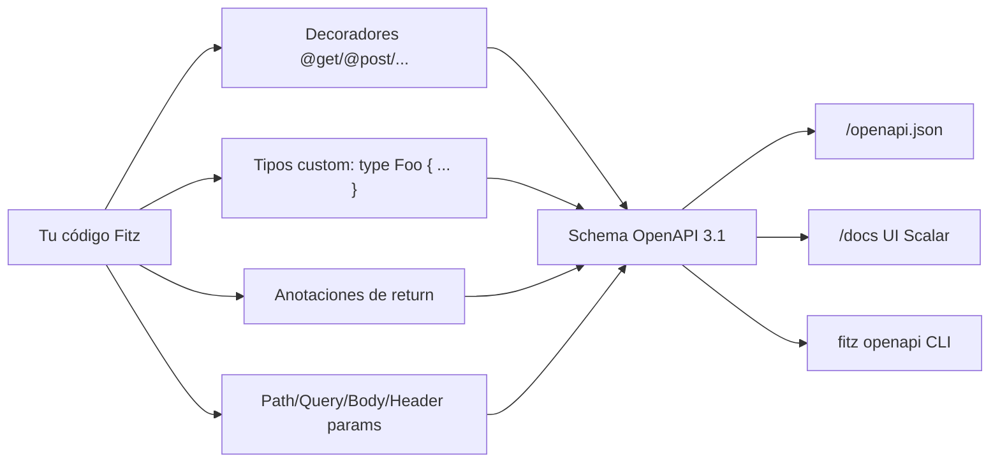
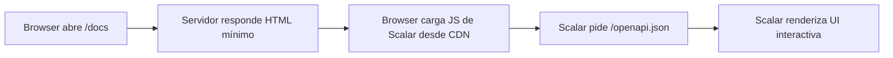

# M4.C4 — OpenAPI 3.1 autogenerado + UI Scalar en `/docs`

**Pre-requisitos**: [M4.C3 — Middleware + CORS](c3-middleware-cors.md).
Tenés un server con rutas, body tipado, validación y middleware
configurado.

**Objetivo**: entender el **otro gran diferencial de Fitz frente
a otros lenguajes** — **OpenAPI 3.1 autogenerado** desde tus
decoradores y tipos, **sin ninguna lib que importar ni anotación
extra**. Más una **UI interactiva en `/docs`** que un cliente del
API puede usar para explorar y probar endpoints en el browser.

**Por qué importa**: una API sin documentación es una API que
nadie sabe usar. La industria lo resolvió con OpenAPI (antes
Swagger) como formato estándar — pero generarlo cuesta:

- **FastAPI** lo genera automático pero requiere Pydantic +
  decoradores específicos.
- **Spring Boot** necesita `springdoc-openapi-ui` + anotaciones.
- **Express** no tiene nada nativo — usás `swagger-jsdoc` con
  comentarios `/** @swagger ... */` que se desincronizan con el
  código real.
- **Go (net/http)** no tiene nada — usás `swag` con comentarios.
- **Fitz** lo extrae **del código real**: decoradores `@get`,
  tipos `type`, anotaciones de return. Una sola fuente de verdad.

**Cross-link**: [Guía cap 18 — Docs automáticas](../../guide.md#18-docs-automaticas).

---

## Mapa del cap



Tres caminos para acceder al mismo schema (**bit-a-bit
idéntico** entre los tres).

---

## Paso 1 — Probarlo desde un server existente

Cualquier server Fitz con `@get`/`@post`/... **ya expone**:

| Ruta | Qué sirve |
|---|---|
| `GET /openapi.json` | Schema OpenAPI 3.1 |
| `GET /docs` | UI interactiva [Scalar](https://scalar.com/) |

Mini server de prueba (`api.fitz`):

```fitz
@server(3000)
fn main() => 0

type User {
    id: Int
    name: Str
    email: Str?
}

type CreateUser {
    name: Str
    email: Str?
}

@get("/users")
fn list_users() -> List<User> => []

@get("/users/{id}")
fn get_user(id: Int) -> User {
    return User { id: id, name: "ada", email: null }
}

@post("/users")
fn create_user(body: CreateUser) -> User {
    return User { id: 1, name: body.name, email: body.email }
}
```

Levantalo:

```bash
fitz run api.fitz
```

Probá:

```bash
# Schema completo (JSON):
curl http://127.0.0.1:3000/openapi.json | head -30
```

```json
{
  "openapi": "3.1.0",
  "info": {
    "title": "Fitz API",
    "version": "0.1.0"
  },
  "paths": {
    "/users": {
      "get": { ... },
      "post": { ... }
    },
    "/users/{id}": {
      "get": { ... }
    }
  },
  "components": {
    "schemas": {
      "User": { ... },
      "CreateUser": { ... }
    }
  }
}
```

**UI en el browser**:

```
open http://127.0.0.1:3000/docs    # macOS
xdg-open http://127.0.0.1:3000/docs # Linux
start http://127.0.0.1:3000/docs   # Windows
```

Ves un panel con los endpoints, schemas, ejemplos auto-generados,
y un botón "Try it" que arma curls y manda requests reales contra
tu server.

---

## Paso 2 — Cómo Fitz arma el schema

Fitz recorre tus decoradores + tipos al boot del server y emite
el schema. **Cero anotaciones extras** — el schema se deriva
**del código que ya escribiste**.

### Tabla de mapping `Fitz → OpenAPI`

| Construcción Fitz | Lugar en el schema |
|---|---|
| `@get("/path")` sobre fn | `paths./path.get` |
| `@post("/path")` sobre fn | `paths./path.post` |
| `type Foo { ... }` | `components.schemas.Foo` |
| Param del path `{id}` | `paths.X.method.parameters[in=path]` |
| Param del query `?x={x}` | `paths.X.method.parameters[in=query]` |
| `@header(name="X")` | `paths.X.method.parameters[in=header]` |
| Param `body: T` del handler | `paths.X.method.requestBody.content."application/json".schema` |
| `fn h() -> T` (anotación) | `paths.X.method.responses.200.content...schema` |
| `fn h() -> Result<T>` | responses 200 + 500 |
| `return 404 {...}` adentro de la fn | responses suma `"404"` |
| `Err(ApiErr {status: 404, ...})` con const top-level | responses suma `"404"` |

### Tabla de mapping `TypeExpr → JSON Schema`

| Fitz | JSON Schema |
|---|---|
| `Int` | `{"type":"integer","format":"int64"}` |
| `Float` | `{"type":"number"}` |
| `Str` | `{"type":"string"}` |
| `Bool` | `{"type":"boolean"}` |
| `T?` | schema de `T` + `"nullable": true` |
| `List<T>` | `{"type":"array","items":<T>}` |
| `Map<Str, V>` | `{"type":"object","additionalProperties":<V>}` |
| `Result<T>` (return) | 200 con `T` + 500 con `{error: string}` |
| `User` (nominal) | `{"$ref":"#/components/schemas/User"}` |

Cada `type Foo { ... }` entra a `components.schemas.Foo` con:

- **Properties** = los fields del `type` en orden de declaración.
- **Required** = los fields sin default y no nullables. Los demás
  quedan opcionales.

---

## Paso 3 — La UI Scalar en `/docs`

Scalar es una UI moderna para OpenAPI (alternativa a Swagger UI
y Redoc). Fitz embebe un HTML mínimo (~10 líneas) que carga el
schema en el browser:



Features que tenés gratis:

- Listado de endpoints agrupados por path.
- Detalle de cada endpoint con params, body schema, responses.
- Ejemplos de request/response auto-generados.
- **Try it** — un editor con curl/JS/Python listo para probar.
- Búsqueda full-text en el listado.
- Schemas en el sidebar.

**Limitación honesta**: la UI carga el bundle JS desde
`cdn.jsdelivr.net`. La primera vez necesita red — después el
browser cachea. Embeber offline cuesta ~3.7 MB extra al binario;
quedó como deuda menor. Si necesitás 100% offline:

```fitz
@server(3000, docs=false)
fn main() => 0

// Y servís tu propia UI en /docs:
@get("/docs")
fn my_docs() -> Str => "<html>...</html>"
```

---

## Paso 4 — `fitz openapi <file>` — schema sin levantar server

Para CI, snapshot testing del contrato, o generar SDKs en otros
lenguajes con `openapi-generator`:

```bash
fitz openapi api.fitz > schema.json
```

Output: el mismo schema que serviría el server, **escrito a
stdout sin levantar nada**. Útil para:

- **CI gate** — `fitz openapi src/main.fitz | diff - committed_schema.json`
  asegura que el schema no cambió sin querer.
- **Generar SDKs** — el schema alimenta `openapi-generator` para
  generar clientes en Python, TypeScript, Go, Java, ...
- **Mock servers** — herramientas como Prism pueden levantar un
  mock con tu schema sin que tu API esté corriendo.

### Demo

```bash
fitz openapi api.fitz | python -m json.tool | head -20
```

```json
{
    "openapi": "3.1.0",
    "info": {
        "title": "Fitz API",
        "version": "0.1.0"
    },
    ...
}
```

---

## Paso 5 — Personalizar `info.title` e `info.version`

Por default el schema arma `info`:

```json
"info": {
    "title": "Fitz API",
    "version": "0.1.0"
}
```

Override del `version` desde `@server(...)`:

```fitz
@server(3000, api_version="1.2.3")
fn main() => 0
```

```bash
curl -s http://127.0.0.1:3000/openapi.json | python -c \
    "import sys,json; print(json.load(sys.stdin)['info']['version'])"
# 1.2.3
```

Override del `title` queda como deuda menor — hoy es fijo `"Fitz
API"`. Si necesitás un schema con tu nombre comercial, podés
parchearlo con `jq` o post-processing en CI:

```bash
fitz openapi src/main.fitz \
    | jq '.info.title = "Mi API Comercial"' \
    > schema-prod.json
```

---

## Paso 6 — Opt-out de docs: `@server(docs=false)`

A veces no querés exponer ni `/openapi.json` ni `/docs`
públicamente — el schema revela tu superficie de API y eso a
veces es info que no querés filtrar:

```fitz
@server(3000, docs=false)
fn main() => 0
```

Con `docs=false`:

- `/openapi.json` → 404
- `/docs` → 404
- `fitz openapi <file>` sigue funcionando (es local, no levanta server)

Funcionalidad idéntica en `fitz run` y `fitz build`.

### Patrón: docs solo en dev

Para abrir docs en dev pero apagarlos en prod, podés controlarlo
con un env var:

```fitz
@server(3000)
fn main() => 0
// Para apagar en prod: cambiar el @server arriba a @server(3000, docs=false)
// con un build flag o env var (deuda menor — hoy se hace a mano).
```

Workflow más limpio cuando aterrice el sub-paso "decorators
condicionales": deuda menor.

---

## Paso 7 — Status codes custom en el schema

Cuando un handler emite status custom con `return <int> {...}` o
con `Err(Tipo {status: ..., ...})`, Fitz lo detecta y lo agrega
al schema:

```fitz
let NOT_FOUND = 404
let UNAUTHORIZED = 401

type ApiErr {
    status: Int = 500
    message: Str = ""
}

@get("/protected")
fn protected() -> Str {
    return UNAUTHORIZED {"error": "no autorizado"}
}

@get("/users/{id}")
fn get_user(id: Int) -> Result<Str, ApiErr> {
    if (id == 0) {
        return Err(ApiErr { status: NOT_FOUND, message: "no existe" })
    }
    return Ok("user-{id}")
}
```

Schema generado:

```json
"/protected": {
    "get": {
        "responses": {
            "200": { ... },
            "401": { "description": "Unauthorized", "content": {...} }
        }
    }
},
"/users/{id}": {
    "get": {
        "responses": {
            "200": { ... },
            "404": { "description": "Not Found", "content": {...} }
        }
    }
}
```

**Reglas del detection**:

1. `return <Int literal> { ... }` → status entra al schema.
2. `return <Ident> { ... }` con el Ident apuntando a una `let X =
   <Int literal>` top-level → status entra al schema.
3. `Err(Tipo {status: 404, ...})` con literal o const top-level
   también entra.
4. **Vars locales del handler** o **cálculos** (`return
   compute_status() { ... }`) NO entran al schema — caen al 500
   default histórico.

Esto se cubre en más detalle en [M4.C5](c5-status-content-errores.md).

---

## Paso 8 — Paridad bit-a-bit `fitz run` ↔ `fitz build`

El schema se computa **al boot del server** y se sirve desde
memoria. En `fitz build`, el codegen lo computa **al compilar** y
lo embebe como `&'static str` en el binario.

**Resultado**:

| Comando | Schema generado |
|---|---|
| `fitz openapi api.fitz > schema_a.json` | A |
| `fitz run api.fitz` + `curl /openapi.json > schema_b.json` | B |
| `fitz build api.fitz && ./api & curl /openapi.json > schema_c.json` | C |

**A == B == C** byte por byte. Una sola fuente de verdad para el
contrato del API.

Si CI corre `diff <(fitz openapi src/main.fitz) committed_schema.json`,
cualquier divergencia entre el código y el contrato salta antes
de mergear.

---

## Paso 9 — Si declarás `/openapi.json` o `/docs` propios

Fitz **cede** al user-fn — el auto-register de docs no machaca
tus rutas:

```fitz
@server(3000)
fn main() => 0

@get("/openapi.json")
fn miyo() -> Str {
    return "{\"openapi\":\"3.1.0\",\"info\":{\"title\":\"Custom\"}}"
}

@get("/docs")
fn my_docs() -> Str => "<html>...</html>"
```

Útil si querés:

- Servir un schema custom (filtrado, agrupado).
- Una UI distinta (Redoc, Swagger UI, custom branding).
- Servir desde un proxy externo.

---

## Paso 10 — Demo end-to-end con schema rico

```fitz
@server(3000, api_version="1.0.0")
fn main() => 0

type User {
    id: Int
    name: Str
    email: Str?
    role: Str = "user"
}

type CreateUser {
    name: Str
    email: Str?
    role: Str = "user"
}

type ApiErr {
    status: Int = 500
    message: Str = ""
}

let users = [
    User { id: 1, name: "ana", email: "ana@x.com", role: "admin" },
]

@get("/users?limit={limit}")
fn list_users(limit: Int?) -> List<User> => users

@get("/users/{id}")
fn get_user(id: Int) -> Result<User, ApiErr> {
    let found = users.find(fn(u) => u.id == id)
    return match found {
        Ok(u)  => Ok(u)
        Err(_) => Err(ApiErr { status: 404, message: "no existe" })
    }
}

@header(name="X-Idempotency-Key")
@post("/users")
fn create_user(body: CreateUser, x_idempotency_key: Str) -> User {
    return User {
        id: users.len() + 1,
        name: body.name,
        email: body.email,
        role: body.role,
    }
}
```

Schema esperado:

```bash
fitz openapi demo.fitz | python -m json.tool
```

- `info.version`: `"1.0.0"` (override)
- `paths./users.get.parameters`: `limit` (in: query, type: integer, nullable)
- `paths./users/{id}.get.parameters`: `id` (in: path, type: integer)
- `paths./users/{id}.get.responses`: `200` (ref User), `404`
- `paths./users.post.parameters`: `X-Idempotency-Key` (in: header, type: string)
- `paths./users.post.requestBody`: ref `CreateUser`
- `components.schemas`: `User`, `CreateUser`, `ApiErr` con
  properties + required

Abrí http://127.0.0.1:3000/docs en el browser y vas a verlo todo
prolijo en la UI.

---

## Paso 11 — Subset compilable a binario

| Feature | `fitz run` | `fitz build` |
|---|---|---|
| `/openapi.json` autoregistrado | ✅ | ✅ (schema embebido) |
| `/docs` UI Scalar | ✅ | ✅ |
| `fitz openapi <file>` CLI | ✅ | n/a (local) |
| Status codes custom en schema | ✅ | ✅ |
| `@server(api_version="...")` | ✅ | ✅ |
| `@server(docs=false)` opt-out | ✅ | ✅ |
| User-fn que pisa `/openapi.json` | ✅ | ✅ |

---

## Validación

- [ ] `fitz run api.fitz` arranca y `curl /openapi.json`
      devuelve un JSON válido con `openapi: "3.1.0"`.
- [ ] Abrir `http://127.0.0.1:3000/docs` en el browser muestra
      la UI Scalar con los endpoints listados.
- [ ] `fitz openapi api.fitz > schema.json` produce el mismo
      schema sin levantar el server.
- [ ] Un `type Foo { ... }` aparece en `components.schemas.Foo`
      con los fields como properties.
- [ ] `@server(api_version="1.2.3")` cambia `info.version` en
      el schema.
- [ ] `@server(docs=false)` hace que `/openapi.json` devuelva
      404.
- [ ] `return 404 {...}` adentro de un handler agrega `"404"`
      a las responses del schema.

---

## Troubleshooting

### `/docs` está en blanco en el browser

Network de DevTools → ¿la request al CDN de Scalar falla? Si
estás detrás de proxy corporativo o sin internet:

- Solución rápida: `curl /openapi.json | swagger-codegen` o usá
  Postman para explorar el schema.
- Solución mediana: servís tu propia UI con `@get("/docs") fn
  my_docs() => "<html>...</html>"` con el bundle JS embebido
  inline.

### El schema dice `"description": ""` en muchos lados

Hoy las descriptions vienen vacías porque el lexer descarta
comentarios y los doc-strings sobre handlers son deuda residual.
Cuando aterrice "doc-strings parseados al AST" (post-F17), tus
comentarios sobre los handlers van a aparecer en el schema.

### `info.title` es siempre "Fitz API"

Por ahora sí — override de `title` queda como deuda menor.
Workaround: `jq '.info.title = "Mi API"'` en CI.

### Anotación de return `-> Result<T>` no aparece como 500 en el schema

Verificá que el return type del handler tenga la anotación
explícita. Si la fn es `fn h() => ...` (sin `-> T`), el schema
no sabe qué status emitir y cae al 200 default.

```fitz
// ❌ Sin anotación — schema dice solo 200
@get("/x")
fn h() => Err("boom")

// ✅ Con anotación — schema dice 200 + 500
@get("/x")
fn h() -> Result<Str> => Err("boom")
```

### Mi tipo `Map<K, V>` con K no Str no aparece bien

OpenAPI no modela objetos con keys no-string. Si tenés un
`Map<Int, V>`, en el schema aparece como `{"type": "object",
"additionalProperties": <V>}` que es lo más cercano al spec.
Para keys tipadas estrictamente, modelá como `List<{key: K,
value: V}>`.

### Status custom desde una var local NO entra al schema

```fitz
@get("/x") fn h() -> Str {
    let code = 404      // var local — invisible al schema
    return code {"error": "..."}
}
```

Para que entre, usá una `let X = <Int literal>` **top-level** o
literal directo. Detalle en [M4.C5](c5-status-content-errores.md).

---

## Lo que sigue

Ya tenés docs automáticos para todo lo que el handler **promete**.
El próximo cap profundiza en lo que **puede ir mal** — todos los
status codes que existen, cómo modelar errores ricos con tipos
custom, cómo content negotiation funciona en Fitz (spoiler:
JSON-only por ahora), y patterns para errores HTTP que escalan
en proyectos reales.

→ **[M4.C5 — Status codes custom + errores HTTP](c5-status-content-errores.md)**
