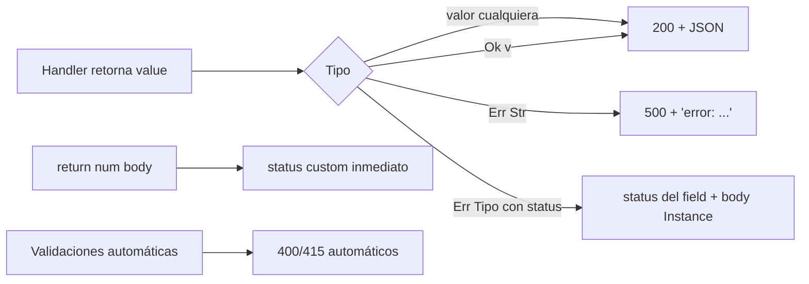

# M4.C5 — Status codes custom, content negotiation y errores HTTP

**Pre-requisitos**: [M4.C4 — OpenAPI + `/docs`](c4-openapi-docs.md).
Tenés un server con rutas, body, middleware, CORS y docs
autogenerados.

**Objetivo**: cerrar M4 con **el modelo completo de status codes
y errores HTTP** en Fitz. Cómo emitir cualquier status (no solo
200/500), cómo modelar errores ricos con tipos custom, qué hace
Fitz con content negotiation (spoiler: JSON-only por ahora) y
patrones que escalan en APIs reales.

**Por qué importa**: una API que solo emite 200 y 500 es una API
mal modelada. Status codes son **parte del contrato HTTP** y
clientes serios discriminan comportamiento por código (401 →
re-login, 429 → backoff exponencial, 404 → mostrar empty state).
Si todo es 500, los clientes pierden esa info.

**Este cap CIERRA M4** — al terminar tenés todo el toolkit HTTP
necesario para shippear APIs production-ready en Fitz.

**Cross-link**: [Guía cap 17 — Status codes custom](../../guide.md#status-codes-custom).

---

## Mapa del cap



---

## Paso 1 — El default histórico

Sin ninguna sintaxis especial, Fitz mapea el retorno del handler
así:

| Lo que devolvés | Status | Body |
|---|---|---|
| `Int`, `Float`, `Str`, `Bool`, `Null` | **200** | el primitivo serializado |
| `List<T>` | **200** | array JSON |
| `Map<Str, V>` | **200** | object JSON |
| Instance de un `type` | **200** | object con fields |
| `Ok(v)` | **200** | `v` serializado |
| `Err(e)` con `e: Str` | **500** | `{"error": e}` |
| `Err(e)` con `e: Tipo {status, ...}` | **status del field** | la instance serializada |

Esto es suficiente para muchos casos simples. Cuando necesitás
más control, Fitz tiene **dos mecanismos**.

---

## Paso 2 — Mecanismo 1: `return <status> { ... }`

Adentro de un handler, podés cortar la ejecución con un status
específico y un body literal:

```fitz
@get("/protected")
fn protected() -> Str {
    return 401 {"error": "no autorizado"}
}

@get("/teapot")
fn teapot() -> Str {
    return 418 {"message": "I'm a teapot"}
}

@get("/users/{id}")
fn get_user(id: Int) -> Str {
    if (id == 1) {
        return "alice"          // 200 (default)
    }
    return 404 {"error": "no encontrado"}
}
```

```bash
curl -i http://127.0.0.1:3000/protected
# HTTP/1.1 401 Unauthorized
# {"error":"no autorizado"}

curl -i http://127.0.0.1:3000/teapot
# HTTP/1.1 418 I'm a teapot
# {"message":"I'm a teapot"}

curl -i http://127.0.0.1:3000/users/1
# HTTP/1.1 200 OK
# "alice"

curl -i http://127.0.0.1:3000/users/2
# HTTP/1.1 404 Not Found
# {"error":"no encontrado"}
```

### Reglas

1. `return <int> { ... }` solo funciona **adentro de un handler
   HTTP** (`@get`/`@post`/...). Afuera, el checker lo rechaza
   con error claro.
2. **El status es Int literal** (rango `[100, 599]`) o **un
   identificador** que apunta a `let X = <Int literal>`
   top-level. Variables locales o expresiones complejas no
   funcionan.
3. El body es **obligatorio**. Para "no content" (204), usá
   `{}` explícito:
   ```fitz
   return 204 {}
   ```
4. El body es **cualquier expresión serializable a JSON** —
   map literal, struct, valor primitivo.
5. El **return type formal del handler se ignora** en este path
   — un handler `-> Str` puede mezclar `return "ok"` con
   `return 404 {...}` en la misma fn.

### Disambiguación con struct literal

Map literal y struct literal se parecen pero el parser los
distingue por la **forma del body**:

| Sintaxis | Interpretado como |
|---|---|
| `return 404 {"key": ...}` (Str primero) | **ReturnStatus** con map literal |
| `return 404 {key: ...}` (Ident primero) | **Return** + struct literal `{key: ...}` (ambiguo, evitar) |
| `return 404 some_var` (sin braces) | **ReturnStatus** con body = `some_var` |
| `return Ok(...)` | **Return** normal |

**Recomendación**: para emitir status custom, usá siempre map
literal con keys entre comillas: `return 404 {"error": "..."}`.

### Status codes nombrados con constantes

Si tenés muchos handlers con los mismos códigos, nombrá las
constantes — mejor legibilidad y bonus: el schema OpenAPI los
detecta:

```fitz
let NOT_FOUND = 404
let UNAUTHORIZED = 401
let TEAPOT = 418

@get("/protected")
fn protected() -> Str {
    return UNAUTHORIZED {"message": "no autorizado"}
}

@get("/users/{id}")
fn get_user(id: Int) -> Str {
    if (id == 0) {
        return NOT_FOUND {"error": "no existe"}
    }
    return "user-{id}"
}
```

**Reglas para que el schema lo detecte**:

- `let X = <Int literal>` **top-level del programa**.
- El Ident en `return X {...}` apunta directo a esa const.
- **Var locales del handler** o **cálculos** (`return
  compute_status() {...}`) NO entran al schema — caen al 500
  default histórico.

---

## Paso 3 — Mecanismo 2: `Result<T, ApiErr>` con `status` field

El más expresivo: definís un `type` propio para errores que
incluya un field `status: Int`, y el runtime mapea
automáticamente al status del field:

```fitz
type ApiErr {
    status: Int = 500
    message: Str = ""
}

@get("/users/{id}")
fn get_user(id: Int) -> Result<Str, ApiErr> {
    if (id == 0) {
        return Err(ApiErr { status: 404, message: "no existe" })
    }
    if (id < 0) {
        return Err(ApiErr { status: 400, message: "id inválido" })
    }
    return Ok("user-{id}")
}
```

```bash
curl -i http://127.0.0.1:3000/users/0
# HTTP/1.1 404 Not Found
# {"status":404,"message":"no existe"}

curl -i http://127.0.0.1:3000/users/-5
# HTTP/1.1 400 Bad Request
# {"status":400,"message":"id inválido"}

curl -i http://127.0.0.1:3000/users/7
# HTTP/1.1 200 OK
# "user-7"
```

### Por qué es expresivo

| Beneficio | Detalle |
|---|---|
| **Schema rico** | `ApiErr` aparece en `components.schemas` con sus fields |
| **Propagación con `?`** | Las fns que devuelven `Result<T, ApiErr>` componen automáticamente |
| **Body completo** | El cliente recibe la instance entera (no solo `{"error": "..."}`) |
| **Multi-status** | Una sola fn puede emitir 400, 401, 403, 404 con la misma estructura |
| **Type-safe** | El checker valida que el `Err(...)` matchee la signature |

### Patrón de composición con `?`

```fitz
type ApiErr {
    status: Int = 500
    message: Str = ""
}

fn validate_id(id: Int) -> Result<Int, ApiErr> {
    if (id <= 0) {
        return Err(ApiErr { status: 400, message: "id debe ser > 0" })
    }
    return Ok(id)
}

fn fetch_user(id: Int) -> Result<Str, ApiErr> {
    if (id > 100) {
        return Err(ApiErr { status: 404, message: "usuario no existe" })
    }
    return Ok("user-{id}")
}

@get("/users/{id}")
fn get_user(id: Int) -> Result<Str, ApiErr> {
    let valid_id = validate_id(id)?         // 400 si falla
    let user = fetch_user(valid_id)?         // 404 si falla
    return Ok(user)
}
```

Cada `?` propaga el error con su status real. **Sin nesting de
ifs**, sin try/catch, sin glue.

### Fields requeridos

| Para que mapping funcione | Detalle |
|---|---|
| El `type` tiene field `status: Int` | obligatorio |
| El valor del field está en rango `[100, 599]` | si no, fallback a 500 |
| El `type` puede tener más fields | todos se serializan en el body |

```fitz
type ApiErrRico {
    status: Int = 500
    code: Str        // "USER_NOT_FOUND"
    message: Str
    request_id: Str?
    retry_after: Int?
}

return Err(ApiErrRico {
    status: 404,
    code: "USER_NOT_FOUND",
    message: "no existe el usuario 42",
    request_id: "req-abc-123",
    retry_after: null,
})
```

Body emitido:

```json
{
    "status": 404,
    "code": "USER_NOT_FOUND",
    "message": "no existe el usuario 42",
    "request_id": "req-abc-123",
    "retry_after": null
}
```

### Sin `status` field → 500 default

Si tu `type` de error no tiene `status: Int`, el runtime falla al
500 histórico:

```fitz
type SimpleErr { message: Str }

return Err(SimpleErr { message: "boom" })
// → HTTP 500
// {"error": "SimpleErr { message: \"boom\" }"}
```

---

## Paso 4 — Tabla maestra de status codes que Fitz emite

Status que **Fitz emite automático** (sin que vos los pidas):

| Status | Cuándo |
|---|---|
| **200 OK** | Default cuando el handler retorna sin status custom |
| **400 Bad Request** | Path param coerce falla • body JSON malformado • body faltan campos • body campo extra • query param obligatorio falta • query coerce falla |
| **404 Not Found** | Path no matchea ninguna ruta registrada |
| **405 Method Not Allowed** | Path existe pero el método no |
| **415 Unsupported Media Type** | Content-Type del body ni JSON/urlencoded/multipart |
| **500 Internal Server Error** | `Err(<Str>)` retornado • panic en el handler • response no serializable a JSON |

Status que **vos podés emitir** con la sintaxis:

| Sintaxis | Mecanismo |
|---|---|
| `return <int_literal> { ... }` | ReturnStatus |
| `return <const_top_level> { ... }` | ReturnStatus con const |
| `Err(ApiErr { status: 404, ... })` con const o literal | Result + status field |

### Lista de status HTTP que típicamente vas a usar

| Código | Reason phrase | Cuándo lo emitís |
|---|---|---|
| 200 | OK | Success simple — default automático |
| 201 | Created | POST que crea un recurso |
| 204 | No Content | DELETE exitoso, PATCH que no devuelve body |
| 301 / 302 | Moved | Redirects (poco común desde API) |
| 400 | Bad Request | Validación de input falló |
| 401 | Unauthorized | Auth requerida y falta o es inválida |
| 403 | Forbidden | Auth OK pero el user no tiene permisos |
| 404 | Not Found | Recurso no existe |
| 409 | Conflict | "Ya existe" — POST con email duplicado |
| 410 | Gone | El recurso existió y ya no — para sunsets |
| 422 | Unprocessable Entity | Validación semántica (vs sintáctica = 400) |
| 429 | Too Many Requests | Rate limit excedido |
| 500 | Internal Server Error | Tu bug — default para `Err(Str)` |
| 503 | Service Unavailable | Sobrecarga / mantenimiento |
| 502/504 | Gateway errors | Upstream caído / timeout |

### Pattern: factories por tipo de error

```fitz
type ApiErr {
    status: Int = 500
    code: Str = ""
    message: Str = ""
}

fn not_found(msg: Str) -> ApiErr {
    return ApiErr { status: 404, code: "NOT_FOUND", message: msg }
}

fn unauthorized() -> ApiErr {
    return ApiErr { status: 401, code: "UNAUTHORIZED", message: "auth required" }
}

fn conflict(msg: Str) -> ApiErr {
    return ApiErr { status: 409, code: "CONFLICT", message: msg }
}

@post("/users")
fn create(body: CreateUser) -> Result<User, ApiErr> {
    let existing = find_by_email(body.email)
    match existing {
        Ok(_)  => return Err(conflict("email ya registrado"))
        Err(_) => {} // sigue
    }
    return Ok(User { id: 1, name: body.name, email: body.email })
}
```

Una sola fn por tipo de error mantiene el code limpio y los
status consistentes.

---

## Paso 5 — Content negotiation: ¿qué hace Fitz?

**Short answer**: Fitz es **JSON-only por convención** hoy.

### Lo que Fitz NO hace

- **No mira el `Accept` header del cliente.** Si el cliente
  manda `Accept: application/xml`, Fitz igual devuelve JSON.
- **No emite XML, YAML, MessagePack, Protobuf u otros formatos**
  desde el handler automático.
- **No serializa según el tipo MIME negociado.**

### Lo que SÍ hace

- **Valida el Content-Type del request body** estrictamente —
  `application/json`, `application/x-www-form-urlencoded`,
  `multipart/form-data` o **415 Unsupported Media Type**
  (cubierto en M4.C2).
- **Emite siempre `Content-Type: application/json`** en
  responses normales.
- **Si tu handler devuelve `Str`, lo serializa como JSON string**
  (entre comillas dobles).

### Si necesitás XML / texto plano / binario

Hoy: workaround manual. Tu handler retorna `Str` o `Bytes` con el
formato deseado, pero el `Content-Type` de salida sigue siendo
`application/json`:

```fitz
@get("/data.xml")
fn data_xml() -> Str {
    return "<root><item>1</item></root>"
}
// HTTP/1.1 200 OK
// content-type: application/json     ← desafortunadamente
// "<root><item>1</item></root>"      ← string JSON con XML adentro
```

Esto es **deuda residual**. Cuando aterrice "control de
Content-Type del response" (sub-paso futuro), vas a poder hacer:

```fitz
// Sintaxis hipotética (no implementada todavía)
@get("/data.xml")
fn data_xml() -> Response {
    return response(200, "<root>...</root>", "application/xml")
}
```

**Por ahora**: si vas a necesitar non-JSON content negotiation
seriamente, Fitz HTTP no es la mejor opción. Para 99% de APIs
modernas (REST + JSON), va perfecto.

---

## Paso 6 — Patrón: error tipado + handler limpio

Un ejemplo end-to-end de un patrón production-ready:

```fitz
@server(3000, api_version="1.0.0")
fn main() => 0

// --- Modelos ---

type User {
    id: Int
    name: Str
    email: Str
}

type CreateUser {
    name: Str
    email: Str
}

// --- Error tipado rico ---

type ApiErr {
    status: Int = 500
    code: Str = "INTERNAL"
    message: Str = ""
    field: Str?      // qué field falló (validación)
}

let NOT_FOUND = 404
let CONFLICT = 409
let UNAUTHORIZED = 401
let VALIDATION = 422

// --- Factories ---

fn not_found(msg: Str) -> ApiErr {
    return ApiErr { status: NOT_FOUND, code: "NOT_FOUND", message: msg, field: null }
}

fn conflict(msg: Str) -> ApiErr {
    return ApiErr { status: CONFLICT, code: "CONFLICT", message: msg, field: null }
}

fn validation_error(field: Str, msg: Str) -> ApiErr {
    return ApiErr {
        status: VALIDATION,
        code: "VALIDATION_ERROR",
        message: msg,
        field: field
    }
}

// --- State ---

let users = [
    User { id: 1, name: "ana", email: "ana@x.com" },
]

// --- Auth middleware (preview de M5) ---

fn require_auth(req: Request) {
    if (req.headers.has("authorization")) {
        return null
    }
    return UNAUTHORIZED {"code": "UNAUTHORIZED", "message": "auth required"}
}

// --- Validaciones ---

fn validate_email(email: Str) -> Result<Str, ApiErr> {
    if (email.len() == 0) {
        return Err(validation_error("email", "email vacío"))
    }
    // Más validaciones acá
    return Ok(email)
}

fn find_user(id: Int) -> Result<User, ApiErr> {
    let found = users.find(fn(u) => u.id == id)
    return match found {
        Ok(u)  => Ok(u)
        Err(_) => Err(not_found("usuario {id} no existe"))
    }
}

fn find_by_email(email: Str) -> Result<User, ApiErr> {
    let found = users.find(fn(u) => u.email == email)
    return match found {
        Ok(u)  => Ok(u)
        Err(_) => Err(not_found("email no registrado"))
    }
}

// --- Endpoints ---

@get("/users")
fn list_users() -> List<User> => users

@middleware(require_auth)
@get("/users/{id}")
fn get_user(id: Int) -> Result<User, ApiErr> {
    return find_user(id)
}

@middleware(require_auth)
@post("/users")
fn create_user(body: CreateUser) -> Result<User, ApiErr> {
    let email = validate_email(body.email)?
    let existing = find_by_email(email)
    match existing {
        Ok(_)  => return Err(conflict("email ya registrado"))
        Err(_) => {} // OK, sigue
    }
    let new_id = users.len() + 1
    let u = User { id: new_id, name: body.name, email: email }
    users.push(u)
    return Ok(u)
}

@middleware(require_auth)
@delete("/users/{id}")
fn delete_user(id: Int) -> Result<Str, ApiErr> {
    let u = find_user(id)?
    return Ok("borrado {u.name}")
}
```

Pruebas:

```bash
# GET sin auth → 401
curl -i http://127.0.0.1:3000/users/1
# 401 {"code":"UNAUTHORIZED","message":"auth required"}

# GET con auth + id existente → 200
curl -H "Authorization: x" http://127.0.0.1:3000/users/1
# {"id":1,"name":"ana","email":"ana@x.com"}

# GET con auth + id no existente → 404
curl -i -H "Authorization: x" http://127.0.0.1:3000/users/99
# 404 {"status":404,"code":"NOT_FOUND","message":"usuario 99 no existe","field":null}

# POST con email duplicado → 409
curl -i -X POST -H "Authorization: x" -H "Content-Type: application/json" \
    -d '{"name":"x","email":"ana@x.com"}' \
    http://127.0.0.1:3000/users
# 409 {"status":409,"code":"CONFLICT","message":"email ya registrado","field":null}

# POST con email vacío → 422
curl -i -X POST -H "Authorization: x" -H "Content-Type: application/json" \
    -d '{"name":"x","email":""}' \
    http://127.0.0.1:3000/users
# 422 {"status":422,"code":"VALIDATION_ERROR","message":"email vacío","field":"email"}
```

**Observá**: 5 status distintos (200, 401, 404, 409, 422), un
solo `type ApiErr`, propagación con `?`, cero glue. La intención
del handler **se lee como prosa**.

---

## Paso 7 — El schema OpenAPI con errores ricos

El demo de arriba produce un schema que incluye:

```json
"paths": {
    "/users/{id}": {
        "get": {
            "responses": {
                "200": { "content": {...User} },
                "401": { ... },         // del middleware require_auth
                "404": { ... }          // del Err(not_found(...))
            }
        }
    },
    "/users": {
        "post": {
            "responses": {
                "200": { "content": {...User} },
                "401": { ... },         // middleware
                "404": { ... },         // find_by_email
                "409": { ... },         // conflict
                "422": { ... }          // validation_error
            }
        }
    }
},
"components": {
    "schemas": {
        "User": { ... },
        "CreateUser": { ... },
        "ApiErr": {
            "type": "object",
            "properties": {
                "status": { "type": "integer", "format": "int64" },
                "code": { "type": "string" },
                "message": { "type": "string" },
                "field": { "type": "string", "nullable": true }
            },
            "required": []      // todos tienen default o son nullable
        }
    }
}
```

**Sin código extra**, los clientes que generen SDK con
`openapi-generator` van a tener tipos correctos para cada
respuesta posible. Eso es lo que llamamos "código que se
documenta solo".

---

## Paso 8 — Subset compilable a binario

| Feature | `fitz run` | `fitz build` |
|---|---|---|
| `return <int_literal> { ... }` | ✅ | ✅ |
| `return <const_top_level> { ... }` | ✅ | ✅ |
| `Err(Tipo { status: 404, ... })` con literal | ✅ | ✅ |
| `Err(Tipo { status: NOT_FOUND, ... })` con const | ✅ | ✅ |
| Schema OpenAPI captura status custom | ✅ | ✅ |
| 415 automático sobre Content-Type ajeno | ✅ | ✅ |
| 400 automático sobre body inválido | ✅ | ✅ |

---

## Validación

- [ ] `return 404 {"error": "..."}` desde un handler emite
      `HTTP/1.1 404 Not Found` con el body.
- [ ] `let NOT_FOUND = 404` + `return NOT_FOUND {...}` también
      funciona y aparece en el schema OpenAPI.
- [ ] `Result<T, ApiErr>` con `Err(ApiErr {status: 404, ...})`
      emite 404 con la instance serializada como body.
- [ ] `ApiErr` sin `status: Int` cae al 500 default.
- [ ] Content-Type `text/xml` sobre handler que espera JSON
      devuelve 415.
- [ ] Body sin campo obligatorio devuelve 400 con mensaje
      claro.
- [ ] 5 status distintos en un mismo handler con `Result<T,
      ApiErr>` se distinguen correctamente en las responses.

---

## Troubleshooting

### `return 404 {error: "x"}` con Ident — parse ambiguo

```fitz
return 404 {error: "x"}    // ❌ ambiguo
```

El parser lo interpreta como `return 404` + struct literal
`{error: "x"}`, lo cual NO matchea ReturnStatus. **Solución**:
keys entre comillas:

```fitz
return 404 {"error": "x"}    // ✅
```

### `return code {...}` con var local NO emite status custom

```fitz
@get("/x") fn h() -> Str {
    let code = 404
    return code {"error": "..."}    // ❌ code es local
}
```

El parser lo interpreta como `return code` (var) `{...}` (struct
literal). **Solución**: usar literal directo o const top-level:

```fitz
let NOT_FOUND = 404

@get("/x") fn h() -> Str {
    return NOT_FOUND {"error": "..."}    // ✅
}
```

### `Err(ApiErr {status: 999, ...})` → 500 en vez del 999

Status fuera del rango `[100, 599]` (no es un código HTTP
válido). El runtime cae al 500 por seguridad.

### "status field es nullable y vino null → 500"

Si tu `type` tiene `status: Int?` (nullable) y emitís un Err
con `status: null`, fallback a 500. Para forzar el status,
declará no-nullable con default: `status: Int = 500`.

### El cliente recibe 200 cuando debería ser 404

Verificá:

1. El handler devuelve `Err(...)` y NO `Ok(...)`.
2. El tipo del Err tiene `status: Int` con valor en rango
   válido.
3. La fn está anotada como `-> Result<T, ApiErr>` (no `-> T`).

### 415 cuando no quiero — el cliente manda XML legítimo

Hoy Fitz solo acepta JSON/urlencoded/multipart. Si necesitás XML
en el body, vas a tener que declarar `body: Map<Str, Any>` con
parsing manual del header `Content-Type` adentro del handler, o
esperar el sub-paso de content negotiation.

### El schema OpenAPI no incluye el 404 de mi handler

Verificá:

1. El status se referencia con literal (`return 404 {...}`) o
   con `let X = 404` **top-level** (no local).
2. Si usás `Err(ApiErr {status: X, ...})`, X debe ser literal o
   const top-level.
3. Vars locales del handler son invisibles al schema.

---

## Cerraste el módulo M4

**Felicidades** — completaste el módulo de HTTP first-class.
Sabés:

- ✅ Levantar un server con `@get`/`@post`/`@put`/`@delete` +
  `@server` (**C1**).
- ✅ Recibir body (JSON tipado + urlencoded + multipart files),
  query params y headers (**C2**).
- ✅ Apilar middleware (Pre/Post/Wrap) y configurar CORS
  (**C3**).
- ✅ OpenAPI 3.1 autogenerado + UI Scalar en `/docs` + CLI
  `fitz openapi` (**C4**).
- ✅ Emitir status codes custom y modelar errores HTTP ricos con
  `Result<T, ApiErr>` (**C5**) ← acá.

**Entregable del módulo**: podés escribir una API completa
production-ready en Fitz — handlers tipados, validación
automática del input, errores ricos con status code correcto,
middleware reusable, CORS configurado y docs autogenerados. **Sin
ningún `pip install`, `npm install`, ni `pom.xml`**.

### Comparativa final: lo que ganaste vs alternativas

| Feature | FastAPI | Express | Spring | **Fitz M4** |
|---|---|---|---|---|
| Setup mínimo | `pip` + main.py | `npm` + server.js | `pom.xml` + classes | **`fitz new --http`** |
| Path params tipados | ✅ Pydantic | ❌ manual | ✅ | ✅ |
| Body validation | ✅ Pydantic | ❌ Joi/Zod | ✅ Jackson | ✅ |
| OpenAPI auto | ✅ | ❌ | ✅ springdoc | ✅ |
| UI Swagger/Scalar | ✅ | ❌ | ✅ | ✅ |
| Status custom ricos | ✅ Exception | ✅ manual | ✅ Exception | ✅ Result+tipo |
| CORS built-in | Middleware | npm cors | ✅ | ✅ |
| Compila a binario | ❌ | ❌ pkg hack | ✅ jar | ✅ standalone |
| Multi-thread real | ⚠ uvicorn workers | ❌ event loop | ✅ | ✅ post-F17 |

## Qué viene en M5 — Async, auth, real-time

A partir del próximo módulo entramos al stack moderno completo:
**`async fn` + `.await`** para concurrencia ergonómica, **auth
nativa** con `@authenticated`/`@admin` + JWT + Argon2, y
**WebSockets tipados** con `@ws("/chat")` para real-time —
todo built-in, sin libs externas.

M5 cubre:

- **[C1 — `async fn` + `.await` + paralelismo HTTP real](../m5-async-auth-rt/c1-async-await.md)**
- **[C2 — Auth nativa: `@auth_provider` + `@authenticated` +
  `@admin` + `jwt` + `hash`](../m5-async-auth-rt/c2-auth.md)**
- **[C3 — WebSockets tipados con `@ws("/chat")` + `WsConn<T>` +
  broadcasting + AsyncAPI auto](../m5-async-auth-rt/c3-websockets.md)**
- **[C4 — Jobs sin Celery: `@cron` + `@background` + `spawn` +
  persistencia con Postgres](../m5-async-auth-rt/c4-jobs.md)**

Arrancá con [M5.C1](../m5-async-auth-rt/c1-async-await.md) o
volvé al [índice del curso](../index.md).
