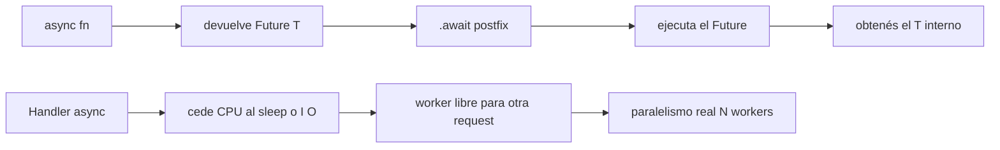

# M5.C1 — `async fn`, `.await` y paralelismo HTTP real

**Pre-requisitos**: [M4 entero — HTTP first-class](../m4-http/c1-verbos-server.md).
Tenés un server con rutas, body, middleware, CORS, OpenAPI y
status codes. Todos los handlers eran sync.

**Objetivo**: introducir `async fn` + `.await` + `Future<T>` +
`sleep` como **ciudadanos de primera clase** del lenguaje. Que
puedas escribir handlers HTTP que pausan sin bloquear el worker,
que entiendas por qué Fitz da paralelismo real (no event-loop
simulado), y que sepas exactamente dónde el checker permite
`.await` y dónde no.

**Por qué importa**: una API real espera. Espera a la DB, espera
a otro microservicio, espera a S3. Si el handler es sync,
bloquea su worker durante esos ms. Multiplicalo por 100 req/s y
necesitás más cores que requests/s para no fundirte. Con async,
el worker cede CPU mientras espera; otros requests usan ese
worker en paralelo. Fitz lo trae built-in con sintaxis ergonómica
y multi-thread real post-F17 — sin `pip install asyncio`, sin
`tokio = "1"`, sin `Node cluster`, sin nada.

**Cross-link**: [Guía cap 19 — Async y concurrencia](../../guide.md#19-async-y-concurrencia).

---

## Mapa del cap



---

## Por qué Fitz es distinto

| Feature | Python (asyncio + uvicorn) | Node.js | Go | Rust (tokio crudo) | **Fitz** |
|---|---|---|---|---|---|
| Sintaxis `async`/`await` | ✅ | ✅ | ❌ goroutines | ✅ | ✅ |
| Sin runtime config | ❌ workers manual | ✅ event loop | ✅ scheduler | ❌ `#[tokio::main]` | ✅ |
| Multi-thread real | ⚠ N uvicorn workers | ❌ event loop único | ✅ | ✅ | ✅ post-F17 |
| `Future<T>` como tipo del lenguaje | ⚠ `Awaitable[T]` opcional | ❌ `Promise<T>` con `any` | N/A | ✅ con type params | ✅ built-in |
| Checker bloquea `.await` mal puesto | ❌ runtime warning | ❌ runtime hang | N/A | ✅ | ✅ |
| `sleep` async built-in | `asyncio.sleep` | `setTimeout` Promise | `time.Sleep` (blocking) | `tokio::time::sleep` | ✅ `sleep(ms)` |
| `.await` top-level del archivo | ❌ requiere `asyncio.run` | ⚠ top-level await reciente | N/A | ❌ requiere `#[tokio::main]` | ✅ directo |
| Compila a binario standalone | ❌ | ⚠ pkg hack | ✅ | ✅ | ✅ `fitz build` |

El diferencial mayor: **el runtime se arma solo**. No escribís
`asyncio.run(main())` ni `#[tokio::main]` ni configurás workers
— escribís `.await` y Fitz monta lo que haga falta. Si el
programa es CLI, `current_thread`. Si tiene `@server`,
`multi_thread` con N workers según los cores. Si el programa es
solo `@cron`, también `multi_thread`. Vos no decidís: el
compilador lo deriva del shape del programa.

---

## Paso 1 — `async fn` declara una función concurrente

Una `async fn` se ve casi igual que una `fn` normal, pero con
el prefijo `async`:

```fitz
async fn pausar(ms: Int) -> Int {
    let _ = sleep(ms).await
    return ms
}
```

**Lo que cambia para el caller** (afuera de la fn):

- La firma vista desde afuera es `(Int) -> Future<Int>`, no
  `(Int) -> Int`.
- Llamarla **NO ejecuta el cuerpo**. Te devuelve un `Future<Int>`
  pendiente — un valor que representa "una ejecución que todavía
  no sucedió".
- Para correr el cuerpo y obtener el `Int`, le hacés `.await`.

**Lo que NO cambia adentro** (en el body de la fn):

- Los `return n` siguen retornando `Int` puro, no
  `Future<Int>`. El `async` es transparente desde adentro.
- Podés llamar a otras `async fn` con `.await` libremente.
- Las fns sync que llames adentro siguen siendo sync (no se
  vuelven async mágicamente).

Llamarla:

```fitz
let pending: Future<Int> = pausar(100)   // <- NO se ejecutó nada todavía
let n: Int = pending.await               // <- recién acá pausa 100ms y devuelve 100
```

O en una sola línea:

```fitz
let n = pausar(100).await
```

---

## Paso 2 — `Future<T>` es un tipo del lenguaje

`Future<T>` no es un tipo "interno mágico" como en algunos
lenguajes. Es un genérico built-in al mismo nivel que `List<T>`,
`Map<K, V>`, `Result<T>`:

```fitz
async fn pausar(ms: Int) -> Int { ... }

// Variable tipada explícita.
let pending: Future<Int> = pausar(50)

// Parameter type.
async fn componer(f: Future<Int>) -> Int {
    let n = f.await
    return n + 1
}

// En un type custom.
type Tarea {
    nombre: Str,
    resultado: Future<Int>,
}
```

Esto es útil cuando querés **separar la creación del Future de
su ejecución**: lanzás el trabajo, hacés otra cosa, después
recogés el valor. El cap explica el patrón en el Paso 7.

---

## Paso 3 — `sleep(ms)`, el primer async primitive

Fitz trae un builtin `sleep(ms: Int) -> Future<Null>` que sirve
para pausar N milisegundos sin bloquear el worker:

```fitz
async fn esperar_y_saludar(nombre: Str) -> Str {
    let _ = sleep(200).await
    return "hola, {nombre}"
}
```

Tres detalles:

- **No bloquea el worker** mientras espera. Cualquier otro task
  del runtime tokio (otro request HTTP, otro `@cron`, otro
  `spawn`) puede usar el worker durante esos 200ms.
- Devuelve `Future<Null>`. Lo asignás a `_` porque `Null` no
  tiene contenido útil (igual que `print` retorna `Null`).
- Acepta cualquier `Int` no negativo. `sleep(0).await` cede el
  worker un tick sin pausa real — útil para "dejar correr otras
  tasks" sin esperar.

Para timing en producción usás `sleep` solo en jobs/retries; el
ms-bound real lo da la DB, la API que estés llamando, etc. Lo
usamos en este cap como ejemplo simple porque no necesita
infraestructura.

---

## Paso 4 — Dónde se permite `.await`

El checker valida el contexto del `.await` **en compile-time**.
Las reglas:

| Contexto | `.await` permitido | Por qué |
|---|---|---|
| Adentro de `async fn` | ✅ | El runtime sabe cómo suspender la fn. |
| Top-level del archivo | ✅ | El runtime envuelve el `main` implícito en `async`. |
| Adentro de `fn` sync | ❌ | Sync no tiene cómo suspender. |
| Adentro de FnExpr (`fn(x) => ...`) | ❌ | Los closures todavía no son async-capable. |
| Adentro de `@cron` sync | ❌ | El cron handler sync se invoca como sync. |

Si rompés la regla, el checker dispara un error claro:

```fitz
fn pausa_sync() -> Int {
    let _ = sleep(100).await    // ❌
    return 42
}
```

```
✗ ejemplo.fitz — 1 error(es) de tipo:
  Error en línea 2:23 — `.await` solo es válido adentro de
  `async fn` o a nivel top-level
```

**El fix** es agregar `async`:

```fitz
async fn pausa_async() -> Int {
    let _ = sleep(100).await    // ✅
    return 42
}
```

O usar el patrón "wrapper top-level" si necesitás hacer una sola
operación async como entrada del programa (`fitz run hello.fitz`
arranca su propio runtime):

```fitz
// hello.fitz — top-level del archivo
let n = pausar(100).await        // ✅ permitido top-level
print("pausé y devolvió {n}")
```

---

## Paso 5 — Handlers HTTP async

Cualquier handler HTTP de M4 puede ser `async fn`. axum los
acepta sin que escribas nada extra:

```fitz
@server(3000)
fn main() => 0

@get("/lento")
async fn lento() -> Str {
    let _ = sleep(500).await
    return "respondí después de medio segundo"
}

@get("/rapido")
fn rapido() -> Str => "ya"
```

Cliente:

```bash
$ curl http://localhost:3000/lento     # tarda ~500ms
respondí después de medio segundo
$ curl http://localhost:3000/rapido    # respuesta inmediata
ya
```

**Sync y async conviven libremente**. Mismo router, mismo
servidor. La diferencia se nota cuando el handler async hace I/O
real (DB query, llamada externa, file read): durante la espera,
el worker queda libre para otros requests.

**Regla pragmática**: si el handler hace cualquier I/O o espera
algo medible (>1ms), usá `async fn`. Si es solo CPU + memoria
in-process, `fn` sync alcanza y es más simple. No hay penalty
por mezclar.

---

## Paso 6 — Paralelismo HTTP real

Post-F17 (mayo 2026), el runtime HTTP de Fitz corre sobre
**tokio `multi_thread`**: N workers según los cores disponibles,
procesando handlers en simultáneo. **Esto no es Python con
GIL ni Node con event loop único** — son threads de verdad.

Vamos a medirlo con `examples/guide/19b-paralelismo.fitz`:

```fitz
@server(3000)
fn main() => 0

@get("/lento")
async fn lento() -> Str {
    let _ = sleep(1000).await
    return "ok"
}
```

Levantar el server:

```bash
$ fitz run examples/guide/19b-paralelismo.fitz
🏔️  Fitz HTTP escuchando en http://127.0.0.1:3000
   GET /lento
   GET /rapido
```

Cliente con 5 requests en paralelo (xargs `-P 5`):

```bash
$ time seq 5 | xargs -P 5 -I _ curl -s http://127.0.0.1:3000/lento
okokokokok
real    0m1.2s    # ← cada worker duerme 1s, todos en paralelo
```

Compará con la misma operación en serie:

```bash
$ time for i in 1 2 3 4 5; do curl -s http://127.0.0.1:3000/lento; done
okokokokok
real    0m5.3s    # ← suma de los sleeps
```

**5 requests en ~1s vs ~5s en serie**. Eso es paralelismo real:
mientras un worker duerme, otros sirven nuevas requests.
Pre-F17 ambos eran ~5s (`current_thread`); post-F17 es
multi-thread por default sin que vos toques nada.

Para programas CLI con `.await`, esto no cambia nada — hay una
sola tarea a la vez, `current_thread` es suficiente. El
compilador decide el flavor del runtime por el shape del
programa: `@server` o `@cron` → `multi_thread`; CLI puro →
`current_thread`.

> **PowerShell equivalente**: en Windows sin `xargs`, podés usar
> ```powershell
> Measure-Command { 1..5 | ForEach-Object -Parallel { curl -s http://127.0.0.1:3000/lento } -ThrottleLimit 5 }
> ```
> El `TotalSeconds` te da el wall-clock real.

---

## Paso 7 — Patrón "lanzar primero, esperar después"

`async` no es solo "esperar a una cosa". El verdadero poder
aparece cuando **lanzás varias operaciones, hacés otro trabajo,
y recogés los resultados al final**. Es concurrencia adentro de
un solo handler.

```fitz
async fn obtener_user(id: Int) -> Str {
    let _ = sleep(200).await        // simula API call
    return "user-{id}"
}

@get("/dashboard/{id}")
async fn dashboard(id: Int) -> Str {
    // Lanzamos 3 operaciones SIN .await — todas arrancan ya.
    let f1 = obtener_user(id)
    let f2 = obtener_user(id + 1)
    let f3 = obtener_user(id + 2)

    // Hacemos algún trabajo sync mientras corren.
    let titulo = "dashboard del user {id}"

    // Y al final esperamos cada uno.
    let a = f1.await
    let b = f2.await
    let c = f3.await
    return "{titulo}: {a}, {b}, {c}"
}
```

Sin esto, escribirías:

```fitz
// ❌ secuencial: tarda ~600ms
let a = obtener_user(id).await
let b = obtener_user(id + 1).await
let c = obtener_user(id + 2).await
```

Con el patrón "lanzar primero":

- Los 3 `obtener_user` arrancan al instante (devuelven `Future`
  pendientes).
- El runtime tokio progresa los 3 en paralelo durante el
  `.await`.
- Tiempo total: **~200ms** (el `sleep` más lento), no 600ms.

Es el patrón canónico cuando un handler depende de varias
fuentes independientes. Sin `await` propio para juntar resultados
(`Promise.all` / `asyncio.gather`) todavía — eso queda como
deuda visible para una iteración futura del lenguaje. Por ahora
`.await` uno por uno es el approach standard, y el runtime los
intercala bien.

---

## Paso 8 — Componer `async fn` entre sí

`async fn` se llaman desde otras `async fn` igual que sync.
Componés naturalmente:

```fitz
async fn cargar_perfil(id: Int) -> Str {
    let _ = sleep(50).await
    return "perfil-{id}"
}

async fn cargar_posts(id: Int) -> Int {
    let _ = sleep(80).await
    return id * 10
}

async fn vista_completa(id: Int) -> Str {
    let perfil = cargar_perfil(id).await
    let posts = cargar_posts(id).await
    return "{perfil} con {posts} posts"
}

@get("/vista/{id}")
async fn vista(id: Int) -> Str => vista_completa(id).await
```

Tres niveles de async fn anidados, cada uno con sus `.await`.
El compilador "infiere" todo lo necesario para que el runtime
suspenda y reanude correctamente — vos solo escribís el flow.

---

## Subset compilable a binario

| Feature | `fitz run` | `fitz build` |
|---|---|---|
| `async fn nombre() -> T` | ✅ | ✅ |
| `.await` postfix | ✅ | ✅ |
| `Future<T>` como tipo en anotaciones | ✅ | ✅ |
| `sleep(ms)` builtin | ✅ | ✅ |
| `.await` top-level del archivo | ✅ | ✅ |
| Handler HTTP `async fn` | ✅ | ✅ |
| Paralelismo `multi_thread` automático | ✅ | ✅ |
| Patrón "lanzar primero, esperar después" | ✅ | ✅ |
| `async fn(x) => ...` (closure async) | ❌ | ❌ |
| `Promise.all` / `gather` agregador | ❌ | ❌ |

El binario nativo (`fitz build`) embebe tokio y emite
`#[tokio::main]` automático. El Cargo.toml generado suma
`tokio` con feature `time` cuando el programa usa `sleep` o
async. **Cero config — la línea correcta del Cargo.toml la elige
el compilador**.

Smoke local con CLI async:

```bash
# Tu fuente.
$ cat hello-async.fitz
async fn doblar(n: Int) -> Int {
    let _ = sleep(10).await
    return n * 2
}
let r = doblar(21).await
print("doble = {r}")

# Compilar y correr.
$ fitz build hello-async.fitz
$ ./hello-async          # Linux/macOS
doble = 42
$ .\hello-async.exe      # Windows
doble = 42
```

---

## Validación

- [ ] Una `async fn` retorna `Future<T>` cuando la llamás sin
      `.await`.
- [ ] `.await` postfix devuelve el `T` interno.
- [ ] `sleep(ms).await` pausa N milisegundos sin bloquear el
      worker.
- [ ] `.await` adentro de una `fn` sync dispara error del checker
      con mensaje claro citando "solo es válido adentro de
      `async fn` o a nivel top-level".
- [ ] `.await` top-level del archivo (sin envolver en una fn)
      funciona.
- [ ] Un handler `async fn` con `sleep(1000).await` responde 5
      requests concurrentes en ~1s, no en ~5s.
- [ ] `fitz build` de un programa CLI async produce binario
      standalone que corre sin Fitz instalado.

---

## Troubleshooting

### `` `.await` solo es válido adentro de `async fn` o a nivel top-level ``

Pusiste `.await` en un contexto no async:

```fitz
fn calcular() -> Int {
    let n = pausar(10).await    // ❌
    return n
}
```

**Fix**: prefijar la fn con `async`:

```fitz
async fn calcular() -> Int {
    let n = pausar(10).await    // ✅
    return n
}
```

Si la fn es invocada desde otro lugar como sync (e.g. un handler
sync), también tenés que volverlo async — el async se propaga
hacia arriba.

### Mismo error pero en una closure `fn(x) => ...`

Los FnExpr no soportan `async` todavía:

```fitz
let f = fn(n: Int) => pausar(n).await    // ❌
```

**Fix**: declará una `async fn` con nombre y pasala como valor:

```fitz
async fn doblar(n: Int) -> Int => pausar(n).await * 2

let f = doblar         // f tiene tipo Function — pasable como valor
let n = f(5).await     // ✅
```

### El handler async parece correr en serie aunque pruebo con curl en paralelo

Verificá:

1. Que el binario es **post-F17** (mayo 2026 o más reciente).
   Pre-F17 todo el runtime HTTP era `current_thread` y serializaba
   handlers. Si reportás `fitz --version` y es ≤0.9.20, es eso.
2. Que estás midiendo con **N requests en paralelo** y no en
   serie. `xargs -P N` o `Measure-Command -Parallel` lo
   garantizan. Un loop de bash `for i in ...; do curl; done`
   espera cada response antes de mandar la siguiente.
3. Que el handler tiene `async fn` (no sync). Sync con
   `sleep(...).await` no compila (el checker te avisa).

### `sleep(0).await` no parece hacer nada

`sleep(0)` cede el worker un tick sin pausa real. Es útil
adentro de loops largos para no monopolizar el worker, pero
no agrega delay observable. Si querés pausa medible, `sleep(1)`
o más.

### El programa termina antes de que terminen mis tasks lanzadas con futures pendientes

Caso típico:

```fitz
let f = pausar(500)        // lanzado pero sin await
print("listo")
// programa termina acá — f nunca corrió
```

**Fix**: o awaitás el Future, o usás `spawn(...)` (cap C4) que es
fire-and-forget y queda detached hasta completar. Un `Future`
crudo sin `.await` es **lazy** y no progresa solo.

### `Future` adentro de un `type` custom no compila a binario

Hoy `Future<T>` como field type funciona en `fitz run` pero el
codegen para `fitz build` lo rechaza con error claro citando
"feature no soportada". Es deuda visible — workaround: rearmar
el tipo para que solo guarde el resultado ya resuelto (`T`), no
el Future.

---

## Lo que sigue

Llegaste al final del cap. Lo que cubriste:

- `async fn` declara una función concurrente — retorna
  `Future<T>` desde afuera, body normal desde adentro.
- `.await` postfix desempaca el Future y ejecuta su body.
- `Future<T>` es un tipo del lenguaje (`List<T>`-level), usable
  en anotaciones, params y fields.
- `sleep(ms)` es el primer async primitive built-in.
- El checker bloquea `.await` mal puesto en compile-time con
  mensaje claro.
- Handlers HTTP `async fn` corren en paralelo real — N workers
  tokio post-F17, no event loop simulado.
- El patrón "lanzar primero, esperar después" para concurrencia
  adentro de un mismo handler.
- `fitz build` embebe tokio automático — el flavor del runtime
  lo elige el compilador según el shape del programa.

**Próximo cap**: [M5.C2 — Auth nativa con `@auth_provider` +
`@authenticated` + `@admin` + `jwt` + `hash`](c2-auth.md). Vamos
a ver cómo Fitz integra JWT, Argon2id y validación de tokens
**en el lenguaje** — sin libs externas, sin reflection, validado
estáticamente por el checker.
