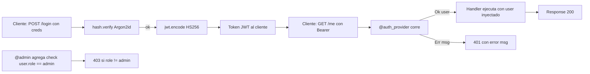

# M5.C2 — Auth nativa con `@auth_provider`, JWT y Argon2id

**Pre-requisitos**: [M5.C1 — `async fn` + `.await`](c1-async-await.md).
Sabés escribir handlers async y entendés cuándo el runtime cede
CPU. Necesitás eso porque el `@auth_provider` se puede declarar
como `async fn` (típico en producción donde el lookup del user
toca la DB).

**Objetivo**: armar una API protegida con login + JWT + password
hashing **sin instalar nada**. Tres decoradores
(`@auth_provider`, `@authenticated`, `@admin`) y dos módulos
built-in (`jwt`, `hash`) cubren el 90% de los casos reales. El
checker valida estáticamente que cada handler protegido reciba
el `User` del provider — los errores que en FastAPI/Spring
descubrirías en runtime, acá los ves en compile-time.

**Por qué importa**: la auth es la **primera frontera del
sistema**. En FastAPI necesitás `fastapi-users` +
`python-jose` + `passlib`. En Spring, configurás Spring Security
con XML/JavaConfig. En Express, montás `passport.js` + `bcrypt`
+ `jsonwebtoken` y los pegás a mano. Mínimo 3 dependencias,
configuración manual, validación en runtime — descubrís que tu
handler protegido no recibe el `user` cuando ya está en prod.

En Fitz, **auth es parte del lenguaje**. JWT firmado, Argon2id
hashing, validación pre-handler, inyección del user, OpenAPI
con `bearerAuth` — todo built-in. Deploy: un binario.

**Cross-link**: [Guía cap 28 — Auth nativa](../../guide.md#28-auth-nativa).

---

## Mapa del cap



---

## Por qué Fitz es distinto

| Feature | FastAPI | Spring Security | ASP.NET | Express+passport | **Fitz** |
|---|---|---|---|---|---|
| Setup mínimo | `pip install` ×3 | XML/JavaConfig + AOP | `[Authorize]` + middleware | `npm install` ×4 | **builtin** |
| JWT signing | `python-jose` | `jjwt` lib | `System.IdentityModel.Tokens.Jwt` | `jsonwebtoken` | **`jwt.encode`** |
| Password hashing | `passlib[bcrypt]` | `BCryptPasswordEncoder` | `Microsoft.AspNetCore.Identity` | `bcrypt`/`argon2` | **`hash.password` (Argon2id)** |
| Validación estática | ❌ runtime | ❌ reflection AOP | ❌ runtime | ❌ runtime | ✅ **checker** |
| User inyectado al handler | `Depends(...)` | `@AuthenticationPrincipal` | `User` claim | `req.user` opaco | **param tipado** |
| OpenAPI con `bearerAuth` auto | ✅ con setup | ✅ springdoc + config | ✅ con annotations | ❌ manual | ✅ **auto** |
| Sin deps externas | ❌ 3-5 paquetes | ❌ Spring Security entero | ❌ NuGet packages | ❌ 4+ npm | ✅ **0 deps** |
| Compila a binario standalone | ❌ | ✅ jar | ✅ self-contained | ⚠ pkg hack | ✅ **`fitz build`** |

El diferencial mayor: **el checker valida en compile-time** que
cada `@authenticated`/`@admin` tenga un `@auth_provider`
declarado, que el `User` del provider matchee con el `User` del
handler, y que `@admin` solo se use sobre un `User` con campo
`role: Str`. Spring AOP / ASP.NET `[Authorize]` resuelven esto
en runtime; cuando rompe, rompe en prod.

---

## Paso 1 — Las cinco piezas

```fitz
type User { id: Int, email: Str, role: Str }

// 1. El provider (singleton del programa).
@auth_provider
fn check_token(headers: Map<Str, Str>) -> Result<User> {
    let auth = headers.get("authorization")?
    let claims = jwt.decode(auth, "secret")?      // 2. jwt built-in
    return Ok(User { id: 1, email: claims["email"], role: claims["role"] })
}

// 3. @authenticated apilado sobre @get.
@authenticated
@get("/me")
fn me(user: User) -> User => user

// 4. @admin = @authenticated + check role.
@admin
@get("/admin/panel")
fn panel(user: User) -> Str => "hola {user.email}"

// 5. hash para passwords (no JWT — tipo Argon2id).
let hashed = hash.password("supersecret")
let ok = hash.verify("supersecret", hashed)       // → true
```

Las cinco piezas trabajan juntas: el provider corre antes de
cada handler protegido, decodifica el token con `jwt`, verifica
contra `hash` si lo necesita, y devuelve el `User` que el
runtime inyecta como param del handler.

---

## Paso 2 — `@auth_provider`: el corazón

El provider es **uno por programa** (singleton). Una `fn` que:

- Recibe **un** parámetro `Map<Str, Str>` con los headers HTTP
  del request (claves en minúsculas — Fitz normaliza).
- Devuelve `Result<T>` donde `T` es un `type` custom (nominal).
- Es **sync o async** — si tu lookup toca la DB, declarás
  `async fn`.
- Se declara **antes** de los handlers que lo usan (limitación
  del pass-único del codegen).

```fitz
type User { id: Int, email: Str, name: Str, role: Str }

@auth_provider
fn check_token(headers: Map<Str, Str>) -> Result<User> {
    // Patrón canónico: extraer header con match (no `?`)
    // para devolver mensajes cliente-friendly en el Err.
    let auth: Str = match headers.get("authorization") {
        Ok(v) => v,
        Err(_) => return Err("falta header Authorization"),
    }

    let parts = auth.split(" ")
    if (parts.len() != 2) {
        return Err("Authorization debe ser 'Bearer <token>'")
    }
    if (parts[0] != "Bearer") {
        return Err("scheme debe ser Bearer, fue: {parts[0]}")
    }

    // jwt.decode falla si el token es inválido — propagamos con `?`.
    let claims = jwt.decode(parts[1], "mi-secret")?
    let email = claims["email"]

    // En producción: SELECT * FROM users WHERE email = $email.
    return Ok(User {
        id: 1,
        email: email,
        name: "Ada",
        role: claims["role"],
    })
}
```

**Lo que valida el checker estáticamente**:

- Que haya exactamente UN `@auth_provider` (dos = error).
- Que reciba `Map<Str, Str>` como único param.
- Que retorne `Result<T>` con `T` nominal (no `Result<Str>` ni
  `Result<Map>`).

Si lo rompés:

```fitz
@authenticated
@get("/me")
fn me(user: User) -> User => user
// ❌ Sin @auth_provider declarado.
```

```
✗ archivo.fitz — 1 error(es) de tipo:
  Error en línea 1:1 — @authenticated sobre fn 'me': no hay
  `@auth_provider` registrado en el programa. Declará una fn
  con `@auth_provider\nfn nombre(headers: Map<Str, Str>) ->
  Result<User> { ... }`.
```

Y si declarás dos:

```
✗ archivo.fitz — 1 error(es) de tipo:
  Error en línea 13:1 — @auth_provider duplicado: la fn
  'check1' (línea 8) ya fue declarada como provider; la fn
  'check2' (línea 13) es un segundo provider. Solo se admite
  uno por programa.
```

---

## Paso 3 — Módulo built-in `jwt`

`jwt` es un módulo **always-available** — no requiere import.
Tres funciones principales:

```fitz
// Firma con HS256 default (HMAC con secret compartido).
let token: Str = jwt.encode(
    {"sub": "u42", "email": "ada@x.com", "role": "admin"},
    "mi-secret-super-secreto-de-32-chars"
)
// → "eyJ0eXAiOiJKV1QiLCJhbGciOiJIUzI1NiJ9..."

// Verifica firma + parsea payload.
let claims: Map<Str, Str> = jwt.decode(token, "mi-secret-super-secreto-de-32-chars")?

// Algoritmos opcionales (HS384, HS512).
let token384 = jwt.encode(payload, secret, "HS384")
let claims384 = jwt.decode(token384, secret, "HS384")?
```

Detalles operativos:

- **HS256 default** (HMAC-SHA256). Si querés HS384/HS512 pasás
  el algoritmo como tercer arg.
- **Payload `Map<Str, Str>`** strict en MVP. Heterogéneos
  (`{"sub": "u42", "exp": 1700000000}` con números) NO funcionan
  hoy — workaround: serializá los valores a string en el caller.
- **`encode` devuelve `Str`** (el JWT firmado).
- **`decode` devuelve `Result<Map<Str, Str>>`**: token inválido,
  firma mal, expirado, malformado → `Err(msg)`. Patrón canónico:
  desempacar con `?`.

Smoke CLI (sin server) para ver que funciona:

```fitz
let secret = "test-secret-abcdef-1234567890"
let token = jwt.encode({"sub": "u42", "role": "admin"}, secret)
print("token = {token}")

let claims = jwt.decode(token, secret)?
print("sub = {claims[\"sub\"]}")
```

```bash
$ fitz run jwt-cli.fitz
token = eyJ0eXAiOiJKV1QiLCJhbGciOiJIUzI1NiJ9...
sub = u42
```

> **Seguridad del secret**: en producción usá una env var
> (`env_or("JWT_SECRET", "")`) o un secret store. Hardcodearlo
> en el código fuente es OK para ejemplos del curso y demos
> locales; mover ANTES de deployar.

---

## Paso 4 — Módulo built-in `hash` (Argon2id)

`hash` cubre password hashing con **Argon2id** — la
recomendación OWASP 2024, mejor que bcrypt para passwords
nuevos:

```fitz
// Hash de un password — produce el formato PHC string.
let hashed: Str = hash.password("supersecret")
// → "$argon2id$v=19$m=19456,t=2,p=1$<salt>$<hash>"

// Verificación.
let ok: Bool = hash.verify("supersecret", hashed)   // true
let bad: Bool = hash.verify("wrong", hashed)         // false
let mal: Bool = hash.verify("supersecret", "garbage") // false (no panic)
```

Detalles:

- **Argon2id** memory-hard, resistente a GPU + ASIC + side-channel.
  Parámetros default: `m=19456` KiB, `t=2`, `p=1` (OWASP).
- **Salt aleatorio por hash** — `hash.password("X")` produce
  hashes distintos en cada llamada (es lo esperado: el salt
  va en el output PHC).
- **`hash.verify` devuelve `Bool`** (no `Result`). Hash
  malformado, mismatch o cualquier error → `false` por
  seguridad — no se filtra info al attacker. Si hace falta
  distinguir "hash corrupto en DB" de "password incorrecto",
  validá el shape del hash antes con regex.

Smoke CLI:

```fitz
let hashed = hash.password("supersecret")
print("hash = {hashed}")
print("ok = {hash.verify(\"supersecret\", hashed)}")
print("bad = {hash.verify(\"malo\", hashed)}")
```

```bash
$ fitz run hash-cli.fitz
hash = $argon2id$v=19$m=19456,t=2,p=1$<salt>$<hash>
ok = true
bad = false
```

---

## Paso 5 — `@authenticated`: proteger un handler

Apilás `@authenticated` **antes** del decorator de ruta:

```fitz
@authenticated
@get("/me")
fn me(user: User) -> User => user
```

Lo que pasa en runtime:

1. Cliente llama `GET /me` con `Authorization: Bearer <token>`.
2. axum captura el request y arma `headers: Map<Str, Str>`.
3. El runtime invoca el `@auth_provider` con esos headers.
4. Si devuelve `Ok(user)`, el handler ejecuta con `user`
   inyectado como param.
5. Si devuelve `Err(msg)`, el runtime responde **401** con body
   `{"error": "<msg>"}` y el handler NO ejecuta.

Las pruebas curl:

```bash
# Sin token → 401 con el mensaje del provider.
$ curl localhost:3000/me
{"error":"falta header Authorization"}

# Token inválido → 401 con el mensaje de jwt.decode.
$ curl -H "Authorization: Bearer garbage" localhost:3000/me
{"error":"InvalidToken"}

# Token válido → 200 con el user.
$ curl -H "Authorization: Bearer eyJ..." localhost:3000/me
{"id":1,"email":"ada@x.com","name":"Ada","role":"admin"}
```

**Regla del param leftover**: el handler puede tener cualquier
combinación de path params + query params + headers (M4.C2),
y el `User` del provider se inyecta como el **param sin
binding explícito**:

```fitz
// Path param `id` + body `body` + user inyectado.
@authenticated
@put("/users/{id}")
fn update(id: Int, body: UpdateRequest, user: User) -> User {
    // `user` es el currently-logged-in, no se enruta desde la HTTP request.
    return user
}
```

El checker valida que **haya exactamente un param compatible
con el tipo del provider** que no sea path/body/query/header.
Hoy en MVP, ese param leftover debe ser exactamente uno — si
necesitás body + user separados con tipos diferentes, todo OK;
si necesitás dos params del tipo User, es deuda.

---

## Paso 6 — `@admin`: shorthand con check de role

`@admin` apilás igual que `@authenticated`, pero agrega un
check adicional:

```fitz
type User { id: Int, email: Str, role: Str }   // <- role requerido

@admin
@get("/admin/users")
fn admin_list(user: User) -> List<User> {
    return [user]   // ejemplo trivial
}
```

Lo que valida el checker en compile-time:

1. Que haya un `@auth_provider` declarado.
2. Que el `User` del provider tenga `role: Str` (no nullable).

Si falta `role`:

```fitz
type User { id: Int, name: Str }   // ← sin role

@auth_provider
fn check(headers: Map<Str, Str>) -> Result<User> { ... }

@admin
@get("/admin")
fn admin(user: User) -> Str => "x"
```

```
✗ archivo.fitz — 1 error(es) de tipo:
  Error en línea 13:1 — @admin sobre fn 'admin': el tipo `User`
  (return del `@auth_provider`) debe tener un campo `role: Str`
  para discriminar admins. Agregalo a la declaración de `User`.
```

Lo que pasa en runtime:

1. Mismo flow que `@authenticated`: provider corre, devuelve
   `Ok(user)`.
2. Runtime chequea `user.role == "admin"`:
   - Si sí → handler ejecuta con `user` inyectado.
   - Si no → **403** con body `{"error":"acceso prohibido — se
     requiere rol admin"}` y el handler NO ejecuta.

Smoke:

```bash
# Token de un user con role "admin" → 200.
$ curl -H "Authorization: Bearer <admin-token>" localhost:3000/admin/users
[{"id":1,"email":"ada@x.com","role":"admin"}]

# Token de un user con role "user" → 403.
$ curl -H "Authorization: Bearer <user-token>" localhost:3000/admin/users
{"error":"acceso prohibido — se requiere rol admin"}
```

---

## Paso 7 — Status custom en login + mensajes del provider

El provider de auth devuelve `Err(<msg>)` para el flow 401, pero
el **endpoint de login** (sin auth) emite los códigos a mano —
porque el login no pasa por `@authenticated`, es público. Usás
el `return <status> { ... }` del M4.C5:

```fitz
type Credentials { email: Str, password: Str }
type LoginResponse { token: Str }

@post("/login")
fn login(creds: Credentials) -> LoginResponse {
    let user: User = match find_user(creds.email) {
        Ok(u) => u,
        Err(_) => return 401 { "error": "credenciales inválidas" },
    }
    let hashed: Str = match stored_hash(creds.email) {
        Ok(h) => h,
        Err(_) => return 401 { "error": "credenciales inválidas" },
    }
    if (not hash.verify(creds.password, hashed)) {
        return 401 { "error": "credenciales inválidas" }
    }
    let claims = {"email": user.email, "role": user.role}
    let token = jwt.encode(claims, SECRET)
    return LoginResponse { token: token }
}
```

Tres detalles:

- Devolvemos **el mismo 401 + mismo mensaje** sea cual sea la
  falla (user no existe, hash no existe, password mal). Esto es
  **seguridad por timing**: si distinguimos "user no existe"
  vs "password mal", un attacker enumera usuarios. La regla
  estándar es **fail con mensaje único**.
- `hash.verify(...)` devuelve `Bool`, no `Result`. Por eso lo
  envolvemos con `if (not ...)`.
- El happy path es un `LoginResponse` normal — el runtime lo
  serializa como 200 con `{"token": "..."}`.

---

## Paso 8 — OpenAPI con `bearerAuth` y 401/403 auto

Cuando el programa declara `@authenticated`/`@admin`, el schema
OpenAPI generado en `/openapi.json` agrega automáticamente:

```json
{
  "components": {
    "securitySchemes": {
      "bearerAuth": {
        "type": "http",
        "scheme": "bearer",
        "bearerFormat": "JWT"
      }
    }
  },
  "paths": {
    "/me": {
      "get": {
        "security": [{"bearerAuth": []}],
        "responses": {
          "200": { "...": "..." },
          "401": { "description": "auth requerida", "content": {...} }
        }
      }
    },
    "/admin/users": {
      "get": {
        "security": [{"bearerAuth": []}],
        "responses": {
          "200": { "...": "..." },
          "401": { "...": "..." },
          "403": { "description": "rol admin requerido", "content": {...} }
        }
      }
    }
  }
}
```

La UI de Scalar en `/docs` muestra:

- **Lock icon** en cada handler protegido.
- Un campo "Authorization" en la parte superior donde pegás el
  bearer token una sola vez (se aplica a todas las requests).
- Documentación de 401/403 al mismo nivel que la response 200 —
  los SDK generados con `openapi-generator` saben qué esperar
  en cada caso.

Sin escribir un solo YAML/JSON de OpenAPI.

---

## Paso 9 — Ejemplo end-to-end completo

`examples/guide/28-auth.fitz` arma una API mini-realista con
**todo lo de M4 + M5.C2 trabajando junto**:

- 3 tipos del dominio (`User`, `Credentials`, `LoginResponse`).
- `@auth_provider` que decodea JWT con `match` para mensajes
  cliente-friendly.
- `POST /login` (público) — verifica con `hash.verify`, firma
  con `jwt.encode`, retorna `LoginResponse`.
- `GET /me` — `@authenticated`, devuelve el user del token.
- `GET /admin/users` — `@admin`, exige role admin.
- `return 401 { ... }` para credenciales inválidas.

Una sesión típica:

```bash
$ fitz run examples/guide/28-auth.fitz
🏔️  Fitz HTTP escuchando en http://127.0.0.1:43928
   POST /login
   GET /me
   GET /admin/users
   GET /openapi.json
   GET /docs

# 1. Login con creds correctas → 200 + token.
$ curl -X POST localhost:43928/login \
       -H 'Content-Type: application/json' \
       -d '{"email":"ada@example.com","password":"secret-ada-123"}'
{"token":"eyJ0eXAiOi..."}

# 2. /me con el token de Ada (admin).
$ curl localhost:43928/me -H 'Authorization: Bearer eyJ0eXAi...'
{"id":1,"email":"ada@example.com","name":"Ada","role":"admin"}

# 3. /admin/users con token de admin → 200.
$ curl localhost:43928/admin/users -H 'Authorization: Bearer eyJ0eXAi...'
[{"id":1,"email":"ada@example.com",...}, ...]

# 4. /admin/users con token de Alan (role "user") → 403.
$ curl localhost:43928/admin/users -H 'Authorization: Bearer <alan>'
{"error":"acceso prohibido — se requiere rol admin"}

# 5. /me sin token → 401 con mensaje del provider.
$ curl localhost:43928/me
{"error":"falta header Authorization"}

# 6. Login con password mal → 401.
$ curl -X POST localhost:43928/login \
       -d '{"email":"ada@example.com","password":"WRONG"}' \
       -H 'Content-Type: application/json'
{"error":"credenciales inválidas"}
```

El ejemplo entero compila a binario nativo con `fitz build` y
produce output bit-a-bit idéntico. **<100 LoC de Fitz** cubren
todo el flow: tipos custom + decoradores + body deserialization
+ JWT + Argon2id + status codes custom + OpenAPI auto.

---

## Subset compilable a binario

| Feature | `fitz run` | `fitz build` |
|---|---|---|
| `@auth_provider` singleton | ✅ | ✅ |
| `@authenticated` apilado sobre `@get`/`@post`/... | ✅ | ✅ |
| `@admin` con check `user.role == "admin"` | ✅ | ✅ |
| `jwt.encode` / `jwt.decode` (HS256/384/512) | ✅ | ✅ |
| `hash.password` / `hash.verify` (Argon2id) | ✅ | ✅ |
| OpenAPI `bearerAuth` + 401/403 entries | ✅ | ✅ |
| `return <status> { ... }` para 401 en login | ✅ | ✅ |
| Payload heterogéneo en `jwt.encode/decode` (`fitz run`) | ✅ | ❌ |
| RBAC con roles custom (`@requires("editor")`) — v0.12.4 | ✅ | ✅ |
| Token revocación con `auth.blacklist`/`is_blacklisted` — v0.12.6 | ✅ | ✅ |
| Sessions cookie-based | ❌ | ❌ |
| Refresh tokens dedicados (OAuth2 dual-token) | ❌ | ❌ |
| Asimétricos (RS256/ES256) | ❌ | ❌ |

El binario nativo embebe `jsonwebtoken` + `argon2` + `rand_core`
sin que vos los pongas en el Cargo.toml. **Deploy = un binario**
que valida tokens, hashea passwords y emite el schema OpenAPI
sin requerir Python/Node/JDK instalados.

---

## Validación

- [ ] `@authenticated` sin `@auth_provider` dispara error del
      checker citando "no hay `@auth_provider` registrado".
- [ ] Dos `@auth_provider` dispara error "duplicado: ... solo
      se admite uno por programa".
- [ ] `@admin` sobre `User` sin `role: Str` dispara error
      citando "debe tener un campo `role: Str` para discriminar
      admins".
- [ ] `jwt.encode` + `jwt.decode` round-trip recupera el mismo
      payload (con HS256 default).
- [ ] `hash.password("X")` produce **distintos** hashes en cada
      llamada (salt aleatorio).
- [ ] `hash.verify("X", hash.password("X"))` devuelve `true`.
- [ ] `hash.verify("X", "garbage")` devuelve `false` sin panic.
- [ ] Llamar `GET /me` sin Authorization devuelve 401 con
      `{"error": "<mensaje del provider>"}`.
- [ ] Llamar `GET /admin/*` con token de role `"user"` devuelve
      403.
- [ ] El `/openapi.json` incluye `components.securitySchemes.bearerAuth`
      con `type=http`, `scheme=bearer`, `bearerFormat=JWT`.
- [ ] La UI de `/docs` muestra el lock icon en handlers
      protegidos y un campo de bearer token global.
- [ ] `fitz build` del programa de auth produce binario standalone
      que valida tokens y hashea passwords sin Python/Node
      instalados.

---

## Troubleshooting

### `@authenticated sobre fn 'X': no hay @auth_provider registrado`

Declaraste `@authenticated` pero ninguna fn del programa tiene
`@auth_provider`.

**Fix**: agregar un provider:

```fitz
@auth_provider
fn check(headers: Map<Str, Str>) -> Result<User> {
    // tu lógica de validación
    return Ok(User { ... })
}
```

Tiene que aparecer **antes** del primer handler `@authenticated`/
`@admin` en el archivo (orden top-down).

### `@auth_provider duplicado`

Declaraste dos fns con `@auth_provider`. **Solo se admite una
por programa**. Para múltiples providers (caso raro: distintos
esquemas de auth en distintos endpoints), tenés que mergear la
lógica en una sola fn que despache internamente. Multi-provider
scoped es deuda visible — sub-paso futuro.

### `@admin sobre fn 'X': el tipo User debe tener un campo role: Str`

Tu tipo `User` (el que retorna el provider) no tiene `role: Str`
o lo tiene como nullable. `@admin` requiere el campo no nullable
para discriminar admins en runtime.

**Fix**:

```fitz
type User { id: Int, email: Str, role: Str }   // ✅ role: Str obligatorio
```

NO `role: Str?` ni `role: Str = "user"` (el default no compensa
para @admin).

### Cliente recibe 401 con mensaje raro tipo `"clave no encontrada: \"authorization\""`

El provider usa `?` directo sobre `headers.get("authorization")`,
y el error que Fitz emite cuando una clave de mapa falta es ese
mensaje. **Fix**: desempacar con `match` para devolver un
mensaje cliente-friendly:

```fitz
let auth: Str = match headers.get("authorization") {
    Ok(v) => v,
    Err(_) => return Err("falta header Authorization"),
}
```

### `jwt.encode({"exp": 1700000000, ...}, secret)` rechazado

El payload del JWT en MVP es `Map<Str, Str>` strict. Valores
numéricos / booleanos / nested no van.

**Workaround**: serializar a string en el caller:

```fitz
let exp = "1700000000"
let payload = {"sub": "u42", "exp": exp}
let token = jwt.encode(payload, secret)
```

Y al decodear, parsear de string a Int en el provider si lo
necesitás. Heterogéneos vendrán con `__FitzValue` integration —
deuda explícita.

### `hash.password("X")` devuelve algo nuevo cada vez

Esperado. Argon2id usa salt aleatorio por hash; el salt va
embebido en el output PHC. Para verificar, **siempre** usás
`hash.verify(input, hash_guardado)`:

```fitz
let h1 = hash.password("X")
let h2 = hash.password("X")
// h1 != h2, pero ambos verifican contra "X"
print(hash.verify("X", h1))   // true
print(hash.verify("X", h2))   // true
```

Esto es **una feature de seguridad**, no un bug: dos users con
mismo password tienen hashes distintos, así un attacker no puede
identificar passwords comunes con rainbow tables.

### Status 401 con `{"error":"InvalidToken"}` en vez del mensaje custom

El provider usa `?` sobre `jwt.decode(...)`. Cuando el token es
inválido, el error que `jwt.decode` emite es `"InvalidToken"`
(el formato de la lib subyacente).

**Fix**: customizar con `match`:

```fitz
let claims: Map<Str, Str> = match jwt.decode(parts[1], SECRET) {
    Ok(c) => c,
    Err(_) => return Err("token expirado o inválido"),
}
```

### El handler `@admin` no recibe `user` aunque el token es válido

Verificá:

1. El handler tiene **exactamente un param** del tipo `User` (el
   del provider).
2. El param se llama como quieras (no requiere magic name como
   `user`).
3. No estás también pasando body separado: en MVP, un handler
   protegido con body custom + user separado no compila (deuda).
   Workaround: pasar el body como headers/query, o desplazar al
   handler sync con `user` extraído del header manualmente.

### `fitz build` del programa de auth falla con error de Cargo

Verificá:

1. Tenés conexión a internet la primera vez (cargo baja
   `jsonwebtoken`, `argon2`, `rand_core` desde crates.io).
2. La cache de cargo no está corrupta: `cargo clean` y reintentá.
3. La version de cargo es ≥ 1.95 (rust-version del manifest).

---

## Lo que sigue

Llegaste al final del cap. Lo que cubriste:

- `@auth_provider` singleton — corre antes de cada handler
  protegido, decodifica el token, devuelve el `User`.
- `@authenticated` apilado sobre `@get`/`@post`/... — 401
  automático si el provider devuelve `Err`.
- `@admin` shorthand que agrega check `user.role == "admin"` —
  403 si el rol no matchea.
- `jwt.encode` / `jwt.decode` con HS256/384/512 sin dependencias
  externas.
- `hash.password` / `hash.verify` con Argon2id (recomendación
  OWASP).
- El checker valida estáticamente que cada `@authenticated`/
  `@admin` tenga su provider, que el `User` matchee, y que
  `@admin` tenga `role: Str`.
- OpenAPI `bearerAuth` + 401/403 auto en `/openapi.json` + lock
  icon en `/docs`.
- Mismo mensaje en todos los failure paths del login (timing
  attack mitigation).

**Próximo cap**: [M5.C3 — WebSockets tipados con `@ws("/path")`
+ `WsConn<T>` + AsyncAPI auto + heartbeat](c3-websockets.md).
Vamos a abrir un canal bidireccional persistente entre cliente
y servidor, con marshaling JSON automático por frame, auth
integrada (los decoradores `@authenticated`/`@admin` apilan
sobre `@ws`), y AsyncAPI 3.0 generado del código.
