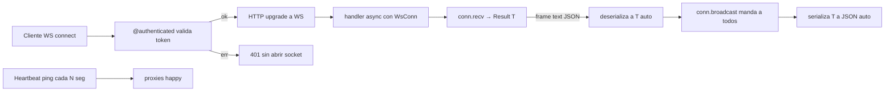

# M5.C3 — WebSockets tipados con `@ws`, `WsConn<T>` y AsyncAPI

**Pre-requisitos**: [M5.C2 — Auth nativa](c2-auth.md). Vas a
apilar `@authenticated`/`@admin` sobre `@ws` igual que sobre
`@get`. También necesitás los conceptos de `async fn` + `.await`
del M5.C1 — el handler WS **siempre** es `async fn`.

**Objetivo**: abrir un canal bidireccional persistente entre
cliente y servidor con **tipado end-to-end**, **marshaling JSON
automático** por frame, **AsyncAPI 3.0** generado del código,
**heartbeat built-in** para sobrevivir proxies, y **auth
integrada** en el handshake. Plus tres variantes del `WsConn`
para casos avanzados: simétrico, asimétrico y binario raw.

**Por qué importa**: WebSockets son la base de chat, dashboards
real-time, juegos multiplayer, sincronización colaborativa
(Figma/Notion-style), trading data feeds, IoT. En FastAPI te dan
un `WebSocket` opaco y vos parseás JSON con `json.loads` +
Pydantic. En Socket.IO los eventos son strings sin schema. En
SignalR los proxies tipados son solo `.NET`. En todos hace falta
configurar heartbeat manual para Nginx/Cloudflare (60s/100s
idle-killers), validar auth en código, y mantener un YAML
AsyncAPI a mano que se atrasa.

En Fitz son **parte del lenguaje** con tipado completo, AsyncAPI
auto, heartbeat default, auth integrada. Ningún otro lenguaje
hoy combina las cinco.

**Cross-link**: [Guía cap 29 — WebSockets tipados](../../guide.md#29-websockets-tipados).

---

## Mapa del cap



---

## Por qué Fitz es distinto

| Feature | FastAPI WebSocket | Socket.IO | Phoenix Channels | SignalR | **Fitz** |
|---|---|---|---|---|---|
| Marshaling JSON tipado por frame | ❌ `json.loads` + Pydantic | ❌ eventos string | ✅ Elixir pattern match | ✅ proxies C# | ✅ **`WsConn<T>` auto** |
| AsyncAPI 3.0 auto-generado | ❌ manual YAML | ❌ manual | ❌ manual | ⚠ con plugin | ✅ **`/asyncapi.json` auto** |
| UI AsyncAPI embebida | ❌ | ❌ | ❌ | ❌ | ✅ **`/asyncapi`** |
| Heartbeat built-in | ❌ código manual | ✅ ping interval | ✅ con config | ✅ con config | ✅ **`@server(ws_heartbeat_secs=N)`** |
| Auth pre-upgrade | ❌ middleware manual | ✅ con plugin | ✅ token plug | ✅ `[Authorize]` | ✅ **`@authenticated @ws(...)`** |
| Channels asimétricos (`In ≠ Out`) | ❌ sin tipos | ❌ | ⚠ pattern match | ✅ C# | ✅ **`WsConn<In, Out>`** |
| Frames binarios raw | ⚠ `bytes` opaco | ⚠ binary opaco | ⚠ binary opaco | ✅ | ✅ **`WsConn<Bytes>`** |
| Browser auth via subprotocol | ❌ código manual | ✅ con setup | ✅ con setup | ✅ con setup | ✅ **`bearer.<token>` auto** |
| Compila a binario standalone | ❌ | ❌ | ⚠ release Elixir | ✅ self-contained | ✅ **`fitz build`** |

**Ningún otro lenguaje hoy** combina WS tipados con AsyncAPI
auto, heartbeat built-in y auth pre-upgrade integrada. Phoenix
te da tipado por pattern matching pero solo en Elixir; SignalR
solo en `.NET`; Socket.IO sin schema. Fitz los junta en un
lenguaje nuevo con binario standalone.

---

## Paso 1 — `@ws("/path")`: declarar un canal

```fitz
type Msg { user: Str, text: Str }

@ws("/chat")
async fn chat(conn: WsConn<Msg>) -> Null {
    loop {
        match conn.recv() {
            Ok(msg) => { let _ = conn.broadcast(msg) }
            Err(_) => return null
        }
    }
    return null
}
```

Tres reglas que el checker valida:

1. **`async fn`** obligatorio. Los métodos de `WsConn` son async
   (devuelven `Future`); una fn sync no puede `.await`-earlos.
2. **Primer param `WsConn<T>`** con `T` resoluble. Sin auth,
   ese es el ÚNICO param.
3. **Return `Null`**. El ciclo de vida del WS lo maneja el
   runtime — el handler corre hasta que la conexión se cierra
   o el handler retorna (lo mismo).

Si rompés la primera:

```fitz
@ws("/chat")
fn chat(conn: WsConn<Msg>) -> Null { ... }   // ❌ sync
```

```
✗ archivo.fitz — 1 error(es) de tipo:
  Error en línea 1:1 — @ws sobre fn 'chat': debe declararse
  `async fn` — los métodos del `WsConn` (`recv`/`send`/
  `broadcast`) son async.
```

---

## Paso 2 — `WsConn<T>`: la conexión activa

`WsConn<T>` tiene 4 métodos. Todos async, todos devuelven
`Result`:

```fitz
async fn chat(conn: WsConn<Msg>) -> Null {
    // 1. recv() bloquea hasta el próximo frame text.
    //    Deserializa el JSON al tipo T del WsConn.
    let result: Result<Msg> = conn.recv()

    // 2. send(msg) manda un frame text SOLO al sender.
    //    Serializa T a JSON automático.
    let _ = conn.send(Msg { user: "system", text: "bienvenido" })

    // 3. broadcast(msg) manda a TODOS los conn del endpoint —
    //    incluido el sender (convención Socket.IO/Phoenix).
    let _ = conn.broadcast(Msg { user: "ada", text: "hola a todos" })

    // 4. close() cierra explícitamente.
    //    Opcional — return null también cierra.
    let _ = conn.close()

    return null
}
```

**Marshaling JSON automático**:

- Cliente envía `{"user":"Ada","text":"hola"}` (frame text).
- `recv()` lo deserializa a `Msg { user: "Ada", text: "hola" }` —
  mismo trait que sirve los handlers HTTP del M4.
- Si el frame no parsea contra `T` (JSON mal, fields faltantes,
  tipo equivocado), `recv()` devuelve `Err` con mensaje claro.
- `send(msg)` y `broadcast(msg)` hacen el reverse: serializan
  `T` a JSON y emiten `Message::Text`.

**Convención de broadcast**: el sender SE INCLUYE en el
broadcast. Es el comportamiento que ESPERA un cliente típico de
chat (te ves a vos mismo escribiendo). Si querés excluir al
sender, filtrá del lado cliente. Excluir del lado server es
deuda visible.

---

## Paso 3 — Heartbeat con `@server(ws_heartbeat_secs=N)`

Las conexiones WebSocket idle son **enemigas de los proxies**.
Nginx default cierra a los 60s. Cloudflare a ~100s. AWS ALB
también 60s. Si la conexión no manda nada durante ese intervalo,
chau socket.

**La solución universal**: ping/pong frames. El server emite
Ping cada N segundos; el cliente responde Pong automático (WS
spec); el proxy ve tráfico y mantiene la conn viva.

Fitz trae esto built-in:

```fitz
@server(43929, ws_heartbeat_secs=30)
fn main() => 0
```

- **Default**: 30s (más bajo que los proxies comunes — seguro).
- **N=0**: desactiva el heartbeat (no recomendado en deploys
  con proxies entremedio).
- **Mecánica**: cada N segundos el runtime manda un Ping frame
  por cada conexión viva del programa. Si el cliente no
  responde Pong, el sink falla en el próximo write y el writer
  task termina limpio (no requiere tracking explícito de Pong).

Sin esto, en producción tu chat funciona ~1 min y después los
clientes se desconectan "sin razón aparente". Con esto, andan
indefinidamente.

---

## Paso 4 — Apilar `@authenticated` sobre `@ws`

Igual que con `@get`/`@post`, podés apilar `@authenticated` o
`@admin` antes del `@ws`. El runtime corre el provider
**ANTES** del HTTP upgrade:

```fitz
type User { id: Int, email: Str, role: Str }
type Msg { user: Str, text: Str }

@auth_provider
fn check(headers: Map<Str, Str>) -> Result<User> {
    // ... validación con jwt.decode(...)? ... (M5.C2)
    return Ok(User { id: 1, email: "ada@x.com", role: "admin" })
}

@authenticated
@ws("/chat")
async fn chat(conn: WsConn<Msg>, user: User) -> Null {
    // user inyectado — viene del @auth_provider.
    let welcome = Msg { user: "system", text: "bienvenido {user.email}" }
    let _ = conn.send(welcome)

    loop {
        match conn.recv() {
            Ok(msg) => {
                // Forzamos el user real (no confiamos en lo que mande el cliente).
                let stamped = Msg { user: user.email, text: msg.text }
                let _ = conn.broadcast(stamped)
            }
            Err(_) => return null
        }
    }
    return null
}
```

**Flow del handshake con auth**:

1. Cliente abre WS con `Authorization: Bearer <token>`.
2. Runtime invoca el `@auth_provider` con los headers del
   handshake.
3. Si devuelve `Ok(user)` → HTTP upgrade a WS, handler ejecuta
   con `user` inyectado.
4. Si devuelve `Err(msg)` → **401 con `{"error": "<msg>"}` SIN
   ABRIR EL SOCKET**. El cliente no llega a `onopen`.

Esto último es la **diferencia con FastAPI/Socket.IO típicos**:
ahí la auth corre adentro del handler ya conectado, así que el
attacker puede empezar a mandar frames antes de la validación.
Fitz cierra esa ventana — auth pre-upgrade.

`@admin` apilable también, mismo flow + check `user.role ==
"admin"` → 403 si no matchea.

---

## Paso 5 — Auth WS desde browsers (subprotocol `bearer.<token>`)

`new WebSocket(url)` desde un browser **NO permite setear
headers HTTP custom**. El header `Authorization` que usaste con
wscat/curl no se puede mandar desde JavaScript.

El segundo argumento del constructor SÍ acepta una lista de
**subprotocols**. La convención estándar (Socket.IO, Phoenix,
varios proyectos Node) es pasar el token via subprotocol con
formato `bearer.<token>`.

Fitz lo soporta sin cambios del lado server — el runtime extrae
el token del header `Sec-WebSocket-Protocol` y lo inyecta como
`authorization: Bearer <token>` al map que ve el provider:

```javascript
// Cliente browser
const token = "eyJhbGc...";   // JWT del POST /login
const ws = new WebSocket(
    "ws://localhost:43929/chat",
    `bearer.${token}`
);
ws.onopen = () => ws.send(JSON.stringify({user: "Ada", text: "hola"}));
ws.onmessage = (ev) => console.log("got:", JSON.parse(ev.data));
```

```fitz
// Server Fitz — sin cambios respecto al ejemplo con header.
@auth_provider
fn check(headers: Map<Str, Str>) -> Result<User> {
    let auth = match headers.get("authorization") {
        Ok(v) => v,                    // <- "Bearer eyJhbGc..."
        Err(_) => return Err("falta Authorization"),
    }
    // ... resto igual ...
}

@authenticated
@ws("/chat")
async fn chat(conn: WsConn<Msg>, user: User) -> Null { ... }
```

**Detalles operativos**:

- **Echo del subprotocol**: RFC 6455 §4.1 exige que el server
  confirme el subprotocol elegido en el handshake response.
  Fitz lo hace automático — si el cliente envió `bearer.<token>`,
  el server responde con el mismo subprotocol. Sin echo, el
  browser rechaza el upgrade.
- **Header gana sobre subprotocol**: si el cliente envía
  AMBOS (`Authorization: Bearer ...` Y `Sec-WebSocket-Protocol:
  bearer.<token>`), el header gana. Esto preserva el caso
  wscat/curl/clientes no-browser.
- **Paridad bit-a-bit `fitz run` ↔ `fitz build`**.

---

## Paso 6 — Canales asimétricos: `WsConn<In, Out>`

Para canales donde el **cliente envía un tipo** y el **server
emite otro distinto**, declarás `WsConn<In, Out>` con dos type
params:

```fitz
type ChatMsg { user: Str, text: Str }

@ws("/cmd")
async fn cmd(conn: WsConn<Str, ChatMsg>) -> Null {
    let welcome = ChatMsg { user: "system", text: "conectado" }
    let _ = conn.send(welcome)

    loop {
        match conn.recv() {
            Ok(input) => {
                // input: Str (el `In`)
                let reply = ChatMsg { user: "system", text: "got: {input}" }
                let _ = conn.send(reply)     // espera ChatMsg (el `Out`)
            }
            Err(_) => return null
        }
    }
    return null
}
```

- **`conn.recv()`** devuelve `Result<In>`.
- **`conn.send(msg)`** y **`conn.broadcast(msg)`** aceptan `Out`.

Si te equivocás de tipo, el checker te avisa en compile-time:

```fitz
// ❌ send con Str sobre WsConn<Str, ChatMsg>
let _ = conn.send("hola")
//      ^^^^^^^^^^^^^^^^^ espera ChatMsg, no Str
```

**Cuándo usar asimétrico**:

- Chat con comandos (cliente manda comandos como string, server
  emite eventos estructurados).
- Dashboards real-time (cliente manda queries, server stream de
  updates tipados).
- Protocolos custom client-driven (request/response asimétrico).

**Compat hacia atrás**: `WsConn<T>` simétrico es equivalente a
`WsConn<T, T>`. Todos los handlers `WsConn<T>` siguen
funcionando idéntico.

**AsyncAPI asimétrico**: cuando `In != Out`, el schema emite
**dos messages distintos** — `msg_in` con payload de `In` y
`msg_out` con payload de `Out`. Generadores de clientes
producen interfaces separadas para recv y send.

Ejemplo runnable: [`examples/guide/29c-ws-bidir.fitz`](https://github.com/Thegreekman76/fitz/blob/main/examples/guide/29c-ws-bidir.fitz).

---

## Paso 7 — Frames binarios: `WsConn<Bytes>`

Cuando el wire es binario raw — protocolos custom (gRPC-Web,
protobuf, MessagePack, CBOR), streaming de audio/video, file
transfer chunk-a-chunk — usás `WsConn<Bytes>`:

```fitz
@server(43930)
fn main() => 0

@ws("/raw")
async fn raw(conn: WsConn<Bytes>) -> Null {
    loop {
        match conn.recv() {
            Ok(buf) => {
                let _ = conn.send(buf)   // echo binario puro
            }
            Err(_) => return null
        }
    }
    return null
}
```

Detalles:

- `recv()` espera `Message::Binary` (NO `Message::Text`) y lo
  devuelve como `Result<Bytes>` (`Vec<u8>` en runtime).
- `send(buf)` y `broadcast(buf)` emiten `Message::Binary` raw —
  **sin re-encoding a JSON ni base64**.
- Mismatch entre frame type esperado y recibido (el cliente
  manda text sobre un endpoint binary) → `Err` con mensaje
  claro.

**El schema AsyncAPI refleja el modo binario**:

```json
{
  "channels": {
    "/raw": {
      "messages": {
        "msg": {
          "contentType": "application/octet-stream",
          "payload": { "type": "string", "format": "binary" }
        }
      }
    }
  }
}
```

Tools como AsyncAPI Studio o generadores de clientes binarios
lo reconocen y renderean el endpoint como "binary upload" en
vez de schema JSON convencional.

**Trade-off**: un endpoint es **text-only XOR binary-only**.
Para canales mixtos en el mismo socket, declarás dos endpoints
separados (`@ws("/raw")` para bytes, `@ws("/chat")` para text).

Ejemplo runnable: [`examples/guide/29b-ws-binary.fitz`](https://github.com/Thegreekman76/fitz/blob/main/examples/guide/29b-ws-binary.fitz).

---

## Paso 8 — AsyncAPI 3.0 auto-generado

OpenAPI 3.1 documenta endpoints HTTP request/response. **AsyncAPI
3.0** es la **spec hermana** para canales event-driven — WS,
MQTT, Kafka, etc. Cuando declarás `@ws(...)`, Fitz genera el
schema en `/asyncapi.json` sin código extra:

```json
{
  "asyncapi": "3.0.0",
  "info": { "title": "Fitz API", "version": "0.1.0" },
  "channels": {
    "/chat": {
      "messages": {
        "Msg": {
          "name": "Msg",
          "payload": {
            "type": "object",
            "properties": {
              "user": { "type": "string" },
              "text": { "type": "string" }
            },
            "required": ["user", "text"]
          }
        }
      }
    }
  },
  "operations": {
    "receive_/chat": {
      "action": "receive",
      "channel": { "$ref": "#/channels/~1chat" }
    },
    "send_/chat": {
      "action": "send",
      "channel": { "$ref": "#/channels/~1chat" }
    }
  },
  "components": {
    "securitySchemes": {
      "bearerAuth": {
        "type": "http",
        "scheme": "bearer",
        "bearerFormat": "JWT"
      }
    }
  }
}
```

**Quién consume este JSON**:

- **AsyncAPI Studio** (asyncapi.com/studio) — UI online que
  visualiza el schema, valida sintaxis, sugiere mejoras.
- **Generadores de clientes** — `@asyncapi/generator` produce
  clientes en JS/TS/Python/Java/Go con tipos. Escribís `type
  Msg { ... }` una vez en Fitz, generás clientes en otros
  lenguajes automático.
- **Tools de testing** — algunos clientes WS profesionales
  (Insomnia, recientes) leen AsyncAPI para autocomplete.

**UI embebida en `/asyncapi`** — paralelo al `/docs` del
OpenAPI/Scalar. Cuando hay handlers `@ws`, el server auto-registra
dos rutas adicionales:

- `GET /asyncapi.json` — schema crudo.
- `GET /asyncapi` — UI HTML embebida usando
  `@asyncapi/react-component` (CDN). Renderiza channels,
  operations, mensajes con sus schemas, security requirements.

Cuando arrancás un server con WS, vas a ver:

```
🏔️  Fitz HTTP escuchando en http://127.0.0.1:43929
   WS  /chat
   GET /openapi.json
   GET /asyncapi.json (canales WebSocket)
   GET /docs          (UI Scalar)
   GET /asyncapi      (UI AsyncAPI)
```

Si el usuario declara su propio `@get("/asyncapi")` (caso raro),
el auto-register cede al handler del user. Opt-out global de
**ambas** UIs con `@server(docs=false)`.

---

## Paso 9 — Ejemplo end-to-end: chat broadcast con auth

`examples/guide/29-ws.fitz` arma un servidor de chat completo en
~100 líneas que combina **todo el stack M5**:

- **Tipos del dominio**: `User`, `ChatMsg`, `Credentials`,
  `LoginResponse`.
- **`POST /login`** (HTTP plano) verifica password con
  `hash.verify` (Argon2id) y devuelve un JWT firmado con
  `jwt.encode` (HS256). **M5.C2**.
- **`@auth_provider fn check_token(headers)`** corre antes de
  CADA request `@authenticated` — HTTP **y** WS. Para el WS,
  corre en el handshake antes del upgrade. **M5.C2**.
- **`@authenticated @ws("/chat") async fn chat(conn:
  WsConn<ChatMsg>, user: User)`** broadcast tipado. **Este cap**.
- **`@server(43929, ws_heartbeat_secs=30)`** puerto + heartbeat.
  **Este cap**.

Una sesión típica (con `wscat -c URL -H "Authorization: ..."`):

```bash
# 1. Login para obtener un token.
$ curl -X POST localhost:43929/login \
       -H 'Content-Type: application/json' \
       -d '{"email":"ada@example.com","password":"secret-ada-123"}'
{"token":"eyJ0eXAi..."}

# 2. Conectar 2 clientes WS en terminales distintas, cada uno
#    con su bearer token.
$ wscat -c "ws://localhost:43929/chat" \
        -H "Authorization: Bearer eyJ0eXAi..."
Connected (press CTRL+C to quit)
< {"user":"system","text":"bienvenido Ada"}
> {"user":"Ada","text":"hola"}
< {"user":"Ada","text":"hola"}                # broadcast incluye sender

# 3. Token inválido → 401 SIN abrir socket.
$ wscat -c "ws://localhost:43929/chat" \
        -H "Authorization: Bearer fake"
error: Unexpected server response: 401
```

El ejemplo entero compila a binario nativo con `fitz build`. **<100
LoC de Fitz** cubren todo: tipos custom + JWT + Argon2id + WS
tipado + broadcast + heartbeat + AsyncAPI.

---

## Subset compilable a binario

| Feature | `fitz run` | `fitz build` |
|---|---|---|
| `@ws("/path")` + `async fn` | ✅ | ✅ |
| `WsConn<T>` simétrico | ✅ | ✅ |
| `WsConn<In, Out>` asimétrico | ✅ | ✅ |
| `WsConn<Bytes>` binario raw | ✅ | ✅ |
| `recv` / `send` / `broadcast` / `close` async | ✅ | ✅ |
| Marshaling JSON automático del frame text | ✅ | ✅ |
| Heartbeat ping/pong automático | ✅ | ✅ |
| `@authenticated`/`@admin` apilados sobre `@ws` | ✅ | ✅ |
| Subprotocol `bearer.<token>` para browsers | ✅ | ✅ |
| AsyncAPI 3.0 en `/asyncapi.json` + UI en `/asyncapi` | ✅ | ✅ |
| Rooms / sub-canales adentro de un endpoint | ❌ | ❌ |
| Reconnect con state replay | ❌ | ❌ |
| Backpressure explícito (outbox bounded) | ❌ | ❌ |
| Mixed text+binary en mismo endpoint | ❌ | ❌ |

El binario nativo embebe `axum` feature `ws` + `futures-util` +
`tokio-tungstenite`. **Deploy = un binario** que sirve WS
tipados con auth y heartbeat sin requerir Node/Python/JDK.

---

## Validación

- [ ] `@ws` sobre fn **sync** dispara error citando "debe
      declararse `async fn` — los métodos del `WsConn` son
      async".
- [ ] `@ws` sin `@authenticated` con dos params (`conn, x: Int`)
      dispara error citando "espera 1 param(s) (1 `WsConn<T>`)".
- [ ] `@authenticated @ws(...)` permite **dos** params:
      `WsConn<T>` + `User` del provider.
- [ ] `conn.recv()` deserializa el frame text JSON al `T` del
      `WsConn<T>` automático.
- [ ] `conn.broadcast(msg)` envía a TODOS los clientes
      conectados, **incluido el sender**.
- [ ] Frame inválido (JSON mal o fields wrong) hace `recv()`
      devolver `Err` — no panic.
- [ ] Programa con `@ws` autoregistra `GET /asyncapi.json`,
      `GET /asyncapi`, `GET /openapi.json`, `GET /docs`.
- [ ] `/asyncapi.json` incluye `components.securitySchemes.bearerAuth`
      cuando hay `@authenticated @ws(...)`.
- [ ] `@server(ws_heartbeat_secs=30)` manda ping cada 30s sin
      código del usuario.
- [ ] Cliente browser con subprotocol `bearer.<token>` autentica
      sin escribir headers manuales.
- [ ] `WsConn<Bytes>` no acepta frames text (devuelve `Err`).
- [ ] `WsConn<Str, ChatMsg>` (asimétrico) tipa `conn.recv()`
      como `Result<Str>` y `conn.send(msg)` exige `ChatMsg`.
- [ ] `fitz build` del programa de chat produce binario standalone
      con WS + auth + heartbeat funcionales.

---

## Troubleshooting

### `@ws sobre fn 'X': debe declararse async fn`

Pusiste `@ws` sobre una fn sync. Los métodos de `WsConn`
(`recv`/`send`/`broadcast`/`close`) son async y solo se pueden
`.await` adentro de `async fn` (M5.C1).

**Fix**: agregar `async`:

```fitz
@ws("/chat")
async fn chat(conn: WsConn<Msg>) -> Null { ... }
```

### `@ws sobre fn 'X': espera 1 param(s), recibió 2`

Declaraste `@ws` sin `@authenticated` con dos o más params. Sin
auth, el handler recibe SOLO el `WsConn<T>` — nada más.

**Fix con auth**: stackear `@authenticated`:

```fitz
@authenticated
@ws("/chat")
async fn chat(conn: WsConn<Msg>, user: User) -> Null { ... }
```

**Fix sin auth**: dejar solo el `WsConn`:

```fitz
@ws("/chat")
async fn chat(conn: WsConn<Msg>) -> Null { ... }
```

### El cliente WS se desconecta a los 60s "sin razón"

Casi seguro proxies idle-killers (Nginx, Cloudflare, ALB).

**Fix**: bajar el `ws_heartbeat_secs` a un valor < 60:

```fitz
@server(43929, ws_heartbeat_secs=30)
fn main() => 0
```

30s es el default razonable. Si tu proxy tiene timeout < 30s
(raro), bajar a 20 o 15.

### Browser dispara error `Unexpected response code: 401`

El handshake pasó pero el provider de auth devolvió `Err`. El
browser **no muestra el body del error 401** del WS handshake
por seguridad — necesitás ver los logs del server.

**Fix más común**: el browser no puede mandar `Authorization`
header. Usar subprotocol:

```javascript
const ws = new WebSocket("ws://...", `bearer.${token}`);
```

### Mensajes de un cliente NO llegan a otros

Verificá:

1. Estás usando `conn.broadcast(msg)` (no `conn.send(msg)`).
   `send` manda solo al sender; `broadcast` manda a todos.
2. Los dos clientes están conectados al MISMO endpoint (mismo
   `@ws("/path")`).
3. Si tenés N réplicas del server detrás de un load balancer,
   el broadcast es **per-instancia**: clientes en réplicas
   distintas no se ven. Coordinación cross-réplicas requiere
   pub/sub externo (Redis Pub/Sub, NATS) — deuda residual.

### `conn.recv()` devuelve `Err("missing field 'X'")`

El cliente mandó JSON que NO tiene todos los fields obligatorios
de `T`. Si `Msg { user: Str, text: Str }`, el cliente debe
mandar AMBOS.

**Fix**: o agregar default al field opcional, o validar del
lado cliente.

```fitz
type Msg { user: Str = "anonymous", text: Str }
```

### `WsConn<Bytes>` no parece recibir nada

El cliente está mandando `Message::Text` (e.g. `ws.send("hola")`
en JS = text). `WsConn<Bytes>` requiere `Message::Binary`:

```javascript
// ❌ esto manda text
ws.send("hello");

// ✅ esto manda binary
const buf = new TextEncoder().encode("hello");
ws.send(buf);
```

### El schema AsyncAPI no incluye mi tipo `Msg`

Verificá:

1. `Msg` está declarado en el mismo archivo que el handler `@ws`.
2. `Msg` es un `type` custom (no un primitivo como `Str`/`Int`).
3. Los fields del `Msg` están tipados con tipos resolubles (no
   `Any`).

Tipos importados de otro módulo también funcionan, pero el
schema toma la definición del módulo de origen.

---

## Lo que sigue

Llegaste al final del cap. Lo que cubriste:

- `@ws("/path")` sobre `async fn` con `WsConn<T>` como primer
  param y return `Null`.
- 4 métodos: `recv`/`send`/`broadcast`/`close`. Todos async.
- Marshaling JSON automático por frame con el mismo trait
  `__ToFitzJson`/`__FromFitzJson` que el HTTP.
- Heartbeat ping/pong built-in con `@server(ws_heartbeat_secs=N)`,
  default 30s.
- Auth pre-upgrade apilando `@authenticated`/`@admin`. 401 SIN
  abrir el socket.
- Subprotocol `bearer.<token>` para browsers que no pueden
  mandar `Authorization` header. Auto-injected como header del
  lado del provider.
- `WsConn<In, Out>` asimétrico para canales con tipos
  distintos por dirección.
- `WsConn<Bytes>` para frames binarios raw sin re-encoding.
- AsyncAPI 3.0 auto en `/asyncapi.json` + UI embebida en
  `/asyncapi`, paralelo al OpenAPI/Scalar del M4.

**Próximo cap**: [M5.C4 — Jobs sin Celery con `@cron`,
`@background`, `spawn` + persistencia](c4-jobs.md). Vamos a ver
cómo Fitz hace tareas periódicas y fire-and-forget **sin Celery,
sin Redis, sin systemd timers** — todo en el mismo binario. Con
persistencia opcional sobre Postgres, retry built-in con
backoff, y timezone IANA.
