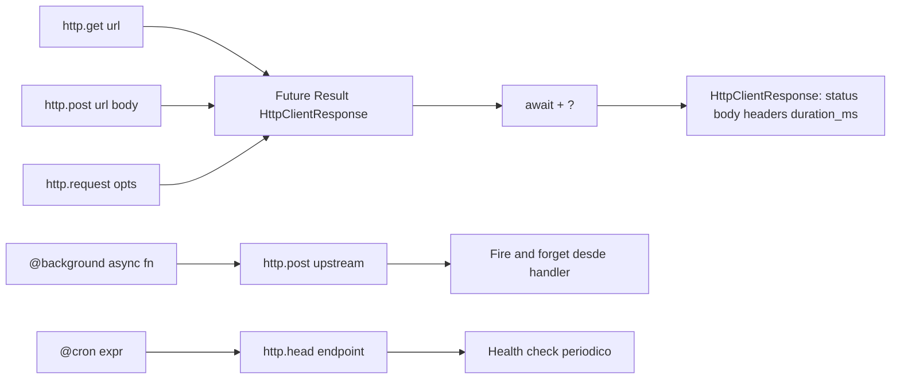

# M5.C5 — HTTP client outbound: requests salientes ciudadanas

**Pre-requisitos**: [M5.C1 — async](c1-async-await.md),
[M5.C4 — Jobs](c4-jobs.md). Vas a usar `async fn` + `.await` para
todos los calls, y vas a integrar el cliente con `@background +
spawn(...)` (webhook dispatcher) y `@cron` (health checker).

**Objetivo**: hacer **requests HTTP salientes** desde Fitz a APIs
externas — webhooks, health checks de servicios externos,
proxying a upstream APIs, scraping. **Sin pip install requests,
sin npm install axios, sin cargo add reqwest, sin importar
nada**. El módulo `http` es **built-in del lenguaje** paralelo a
`db`/`jwt`/`hash`/`log`.

**Por qué importa**: el HTTP server-side de M4 cubre solo medio
mundo de las apps. La otra mitad es **hablar con otros servidores**
— pagar con Stripe, mandar mails con Mailgun, despachar webhooks
a Slack/Discord, refrescar tokens OAuth, scrapear un sitio,
chequear si un endpoint upstream está vivo. Todos esos casos
necesitan un cliente HTTP. En Python necesitás `requests` o
`httpx`; en Node, `fetch` (Node 18+) o `axios`; en Rust,
`reqwest` o `hyper`. **Fitz lo trae built-in**, con paridad
bit-a-bit `fitz run` ↔ `fitz build` y zero deps externas en el
binario final.

**Cross-link**: [Guía cap 17 — HTTP client outbound](../../guide.md#http-client-outbound).

---

## Mapa del cap



---

## Por qué Fitz es distinto

| Feature | Python (`requests`) | JS (`axios`) | Rust (`reqwest`) | Java (`OkHttp`) | **Fitz** |
|---|---|---|---|---|---|
| Built-in del lenguaje | ❌ `pip install requests` | ❌ `npm install axios` | ❌ `cargo add reqwest` | ❌ Gradle dep | ✅ **módulo `http`** |
| Async ciudadano | ❌ `httpx` aparte | ✅ Promise | ✅ async | ⚠ `enqueue` callback | ✅ **`Future<T>`** |
| `Result<T>` automático | ❌ exceptions | ❌ try/catch o `.catch` | ✅ Result | ❌ exceptions | ✅ **`Result::Err`** |
| Sin runtime extra | ✅ sync por default | ✅ V8 nativo | ❌ `tokio::main` manual | ✅ JVM | ✅ **tokio embebido** |
| Paridad intérprete↔binario | N/A | N/A | N/A | N/A | ✅ **`fitz run` ↔ `fitz build`** |
| TLS sin libsystema | ❌ openssl host | ✅ Node TLS | ⚠ rustls/openssl | ✅ JSSE | ✅ **rustls linkeado estático** |
| Marshaling JSON auto | ⚠ `.json()` manual | ⚠ `response.data` | ⚠ `.json()::<T>()` | ⚠ Jackson/Gson | ⚠ `Map` body → JSON auto (MVP) |
| Cero deps en binario final | ❌ Python runtime | ❌ Node runtime | ❌ `Cargo.toml` editado | ❌ JAR + JRE | ✅ **standalone** |

El diferencial mayor es **la integración con el resto del
lenguaje**. `http.post(url, body).await?` se combina con
`@background + spawn(...)` (webhook dispatcher), con `@cron`
(health checker periódico), con `log.X(...)` estructurado
(observability automática), con el checker estático (errores
en compile-time si te olvidás de manejar el `Result`). En
Python/Node/Rust necesitás pegar 4-5 librerías independientes
y resolver vos la integración. En Fitz **todo viene del mismo
core**.

---

## Paso 1 — Los 5 métodos comunes

```fitz
let r = http.get("https://api.example.com/data").await
let r = http.head("https://example.com").await
let r = http.post("https://api.example.com/items", body).await
let r = http.put("https://api.example.com/items/42", body).await
let r = http.delete("https://api.example.com/items/42").await
```

Todos devuelven `Future<Result<HttpClientResponse>>`. Patrón
canónico con `match`:

```fitz
async fn fetch_user(id: Int) -> Result<Null> {
    let r = http.get("https://api.example.com/users/{id}").await
    match r {
        Ok(resp) => {
            print("status={resp.status} duration_ms={resp.duration_ms}")
            print("body={resp.body}")
            return Ok(null)
        }
        Err(e) => {
            log.error("fetch falló", user_id: id, error: e)
            return Err(e)
        }
    }
}
```

**`HttpClientResponse`** es un tipo built-in con 4 fields:

| Field | Tipo | Qué tiene |
|---|---|---|
| `status` | `Int` | Código HTTP (200, 404, 500, etc.). |
| `body` | `Str` | Body de la response como texto plano (UTF-8). |
| `headers` | `Map<Str, Str>` | Headers de la response (lowercase keys; gana el último si hay duplicados). |
| `duration_ms` | `Int` | Tiempo total medido en el cliente, en ms. |

**Smoke MVP** contra `httpbin.org`:

```bash
$ cat smoke.fitz
async fn run() -> Result<Null> {
    let r = http.get("https://httpbin.org/get?fitz=cool").await?
    print("status={r.status} duration_ms={r.duration_ms}")
    return Ok(null)
}
match run().await {
    Ok(_) => print("OK"),
    Err(e) => print("ERROR: {e}"),
}

$ fitz run smoke.fitz
status=200 duration_ms=412
OK
```

> **¿Por qué `async fn run() -> Result<Null>` envolviendo todo?**
> El operador `?` solo se acepta adentro de una fn que retorna
> `Result<T>` (regla del checker, ver C1). Como top-level no es
> una fn con return type explícito, no podés escribir
> `http.get(...).await?` directo afuera de una fn. El patrón
> canónico es envolver en `async fn run() -> Result<Null>` y
> hacer `match run().await { ... }` desde top-level.

---

## Paso 2 — Body shapes (Str / Map / Bytes)

`http.post`/`put` toman un segundo argumento `body` que acepta
3 shapes nativos:

| Shape Fitz | Wire body | Content-Type auto |
|---|---|---|
| `Str` | as-is UTF-8 | **no se toca** |
| `Map<Str, Any>` | `serde_json` flat | **`application/json`** |
| `Bytes` | as-is octetos | **no se toca** |

```fitz
// 1. Str raw — útil para text/plain, XML, form-data manual.
let r = http.post("https://httpbin.org/post", "hola mundo").await?

// 2. Map<Str, Any> — caso 90%. Fitz serializa a JSON y agrega
//    Content-Type: application/json automático.
let payload: Map<Str, Str> = {
    "user": "ada",
    "event": "signup",
    "source": "fitz",
}
let r = http.post("https://api.example.com/events", payload).await?

// 3. Bytes — para uploads binarios, protobuf, octet-stream.
let raw: Bytes = bytes([0x89, 0x50, 0x4E, 0x47])  // header de PNG
let r = http.post("https://api.example.com/upload", raw).await?
```

**Si necesitás otros Content-Type sobre Map** (por ejemplo,
`application/x-www-form-urlencoded` o `application/cbor`),
serializá vos en Fitz a `Str` o `Bytes` y mandalo como ese shape
con headers explícitos via `http.request(...)` (paso 3).

---

## Paso 3 — `http.request(opts)` low-level

Cuando los 5 métodos comunes te quedan cortos (necesitás
override de timeout, headers custom, desactivar redirects),
caés a la API low-level:

```fitz
let r = http.request({
    "method": "GET",                          // obligatorio
    "url": "https://api.example.com/data",    // obligatorio
    "timeout_ms": 5000,                       // opcional, default 30000
    "headers": {
        "Authorization": "Bearer {token}",
        "X-Request-Id": req_id,
    },
    "body": payload,                          // opcional (Str | Map | Bytes)
    "follow_redirects": true,                 // opcional, default true
}).await?
```

**Casos típicos**:

- **Bearer auth manual**: `"Authorization": "Bearer {token}"`
  como key del Map de headers.
- **API key custom**: `"X-API-Key": "..."`.
- **Disable redirects**: `"follow_redirects": false` para ver el
  301/302 directo (caso típico de URL shorteners).
- **Timeout corto** para health checks: `"timeout_ms": 1000`.

---

## Paso 4 — Modelo de errores: transporte vs status

Esto es la decisión de diseño más importante del módulo y la que
te puede sorprender al venir de `requests` o `axios`:

- **Errores de transporte** → `Result::Err(Str)`. Ejemplos:
  timeout, DNS no resuelve, TLS handshake falla, URL inválida,
  conexión rechazada. El `?` los propaga; el checker exige
  manejo con `match`.
- **Status 4xx / 5xx** → `Result::Ok(resp)` con
  `resp.status >= 400`. **El user mira `r.status`**. NO son
  errores de transporte — la request llegó, el server respondió,
  solo que con un código no-2xx.

```fitz
async fn fetch_with_status_check(url: Str) -> Result<Null> {
    let r = http.get(url).await
    match r {
        Ok(resp) => {
            if (resp.status >= 200 and resp.status < 300) {
                print("OK status={resp.status}")
                return Ok(null)
            } else if (resp.status >= 400 and resp.status < 500) {
                log.warn("client error", url: url, status: resp.status)
                return Err("client error: {resp.status}")
            } else {
                log.error("server error", url: url, status: resp.status)
                return Err("server error: {resp.status}")
            }
        }
        Err(e) => {
            log.error("transport error", url: url, error: e)
            return Err(e)
        }
    }
}
```

**Por qué este modelo**:

- Mantiene paralelo con `db.X(...)` y `jwt.decode(...)` — los
  errores que retornan `Result::Err` son **fallas del medio**,
  no del payload. Status 4xx es info de negocio, no falla del
  transporte.
- El `?` propaga **automático** las fallas de red sin que tengas
  que escribir lógica especial.
- Es lo que hace Rust con `reqwest` y lo que Go hace con
  `net/http` — comparten esta semántica.
- En Python con `requests` tenés que escribir `r.raise_for_status()`
  manual para que 4xx/5xx se vuelvan excepciones; acá la
  decisión queda en tus manos sin friccion.

**Errores comunes** que dispara el módulo:

```
timeout después de 5000ms
no se pudo resolver el host: api.example.com
TLS handshake falló: certificate verify failed
URL inválida: relative URL without a base
conexión rechazada por el servidor
```

---

## Paso 5 — Webhook dispatcher canónico (con `@background + spawn`)

El patrón más común del HTTP client outbound en apps reales:
recibís un evento en un handler HTTP y querés despachar un
webhook a un endpoint externo (Slack, Discord, Sentry, tu propio
servicio analytics). El handler **no debe esperar** al webhook
upstream — el cliente recibe 202 Accepted casi instantáneo, el
dispatch corre fire-and-forget en `spawn(...)` sobre una fn
`@background async`.

```fitz
@server(8080)
fn main() => 0

let WEBHOOK_URL: Str = "https://hooks.slack.com/services/T00/B00/XXX"

type EventInput {
    event: Str,
    user: Str,
}

// `@background` autoriza el callsite de `spawn(...)`. Sin el
// decorator, el checker rechaza el spawn ANTES de runtime.
@background
async fn dispatch_to_slack(event: Str, user: Str) -> Null {
    let payload: Map<Str, Str> = {
        "event": event,
        "user": user,
        "source": "fitz-app",
    }
    log.info("dispatching webhook", event: event, user: user)

    let r = http.post(WEBHOOK_URL, payload).await
    match r {
        Ok(resp) => {
            if (resp.status >= 200 and resp.status < 300) {
                log.info(
                    "webhook dispatched",
                    event: event,
                    status: resp.status,
                    duration_ms: resp.duration_ms,
                )
            } else {
                log.warn(
                    "webhook rejected",
                    event: event,
                    status: resp.status,
                    body_preview: resp.body,
                )
            }
        }
        Err(e) => {
            // Errores de transporte. En producción real, encolaríamos
            // para reintentar — acá solo logueamos.
            log.error("webhook failed", event: event, error: e)
        }
    }
    return null
}

@post("/events")
fn create_event(input: EventInput) {
    // spawn(call) arranca la tarea fire-and-forget. Devuelve un
    // Future<Null> que descartamos — el task queda detached
    // corriendo hasta completar.
    let _ = spawn(dispatch_to_slack(input.event, input.user))

    // Respondemos inmediato. El status 202 es REST-convencional
    // para "acepté la operación, la voy a procesar async".
    return 202 {
        "status": "accepted",
        "event": input.event,
        "user": input.user,
    }
}
```

**Lo que pasa cuando llega un request** `POST /events`:

1. Cliente manda `{"event":"signup","user":"ada"}`.
2. El handler `create_event` ejecuta
   `spawn(dispatch_to_slack(...))`. `spawn` arranca el task,
   devuelve `Future<Null>`, lo descartamos.
3. El handler retorna `202 {...}` **en ~5 ms**.
4. En paralelo, el task de `dispatch_to_slack` corre la POST a
   Slack. Si Slack tarda 3 segundos, no le importa al cliente —
   ya respondimos hace 3 segundos.
5. El log estructurado en stderr captura el resultado del
   dispatch para tu observability (Loki/Datadog/CloudWatch).

**¿Por qué `@background` es opt-in?** Porque `spawn(...)` sin
opt-in sería trampa: una fn cualquiera podría ser disparada en
background sin que el autor lo haya autorizado, generando
patrones difíciles de debuggear. El checker exige `@background`
explícito, lo que hace **estáticamente visible** qué fns están
diseñadas para fire-and-forget. Si no lo ponés, el checker
falla en compile-time con un mensaje claro.

---

## Paso 6 — Health checker periódico (con `@cron`)

Patrón canónico del status page tipo Uptime Robot / Pingdom /
Better Stack: cada N segundos / minutos chequeás si una lista
de URLs responde 200. Combina `@cron` con `http.head`:

```fitz
let ENDPOINTS: List<Str> = [
    "https://api.example.com/health",
    "https://auth.example.com/healthz",
    "https://api.thirdparty.com/v1/ping",
]

async fn check_one(url: Str) -> Null {
    let r = http.request({
        "method": "HEAD",
        "url": url,
        "timeout_ms": 5000,
        "follow_redirects": true,
    }).await
    match r {
        Ok(resp) => {
            if (resp.status >= 200 and resp.status < 400) {
                log.info(
                    "health check OK",
                    url: url,
                    status: resp.status,
                    duration_ms: resp.duration_ms,
                )
            } else {
                log.warn(
                    "health check status no-OK",
                    url: url,
                    status: resp.status,
                )
            }
        }
        Err(e) => {
            log.error(
                "health check transport error",
                url: url,
                error: e,
            )
        }
    }
    return null
}

// @cron con persistencia opt-in (paso 6 de C4). Cada 30 segundos
// chequea TODOS los endpoints. En producción real persistirías
// el resultado en DB para el dashboard del status page.
@cron("*/30 * * * * *",
      tz="America/Argentina/Buenos_Aires")
async fn check_all() -> Null {
    log.info("health check tick", count: len(ENDPOINTS))
    let _ = check_one(ENDPOINTS[0]).await
    let _ = check_one(ENDPOINTS[1]).await
    let _ = check_one(ENDPOINTS[2]).await
    return null
}

// Mantenemos el runtime vivo con un endpoint trivial. Sin
// @server, el cron-only mode también funciona pero el bug
// heredado del intérprete (ver C4 Paso 6) complica el dev
// loop.
@get("/health")
fn health() -> Str { return "ok" }

@server(43931, docs=false)
fn main() => 0
```

**Decisión técnica MVP**: el loop sobre `ENDPOINTS` está
desenrollado a 3 calls explícitas porque hay una limitación
conocida del codegen v0.16.0 que rompe Send adentro de
`for x in <List>` con `.await` en el body de un `@cron`
(documentada en `docs/deudas-post-5b.md`). El workaround es
desenrollar manualmente o usar 3 fns separadas, una por URL.
Refinable cuando se cierre la deuda — el patrón conceptual no
cambia.

**Combinando con persistencia** (`store=db` del C4), llegás al
patrón fitzwatch real: cada check se persiste en una tabla
`monitor_checks`, las transitions up→down/down→up abren/cierran
`incidents`, y un endpoint público sirve el dashboard con el
estado actual. Es exactamente el caso de uso que motivó el cierre
de la mini-fase HTTP client builtin.

---

## Paso 7 — Capstone integrador del módulo M5

Llegamos al final del módulo. Para cerrarlo con el stack
completo, el ejemplo runnable
[`examples/curso/m5-async-auth-rt/c5-http-client/app.fitz`](https://github.com/Thegreekman76/fitz/blob/main/examples/curso/m5-async-auth-rt/c5-http-client/app.fitz)
combina **TODO lo visto en M5** en una app chica:

- **C1**: `async fn` + `.await` en los handlers + cliente HTTP.
- **C2**: `@auth_provider` + `@authenticated` sobre el endpoint
  de admin que dispara webhooks.
- **C4**: `@cron` para health checks + `@background + spawn`
  para webhook dispatcher.
- **C5**: `http.head` (health checks) + `http.post` (webhook
  dispatch) + manejo de errores con `match`.

El programa es <100 LoC y funciona end-to-end con `fitz run`
contra `httpbin.org`. Replica el caso real "API + auth + jobs +
client outbound" que vas a escribir en cualquier app de
producción.

Léelo, corrélo, modificalo. Es el resumen ejecutable del
módulo.

---

## Subset compilable a binario

| Feature | `fitz run` | `fitz build` |
|---|---|---|
| `http.get/head/post/put/delete(...)` | ✅ | ✅ |
| `http.request(opts)` low-level | ✅ | ✅ |
| Body `Str` / `Map` / `Bytes` | ✅ | ✅ |
| `HttpClientResponse` con 4 fields | ✅ | ✅ |
| `await?` adentro de `async fn -> Result<T>` | ✅ | ✅ |
| `match` sobre el Result | ✅ | ✅ |
| Integración con `@background + spawn` | ✅ | ✅ |
| Integración con `@cron` | ✅ | ✅ |
| TLS estricto (rustls linkeado) | ✅ | ✅ |
| `for url in <List>` con `.await` adentro de `@cron` | ⚠ workaround unroll | ⚠ workaround unroll |
| Stream del body (response no se carga entera) | ❌ post-MVP | ❌ post-MVP |
| Multipart form-data upload | ❌ post-MVP | ❌ post-MVP |
| Cookie jar persistente entre requests | ❌ post-MVP | ❌ post-MVP |
| HTTP/2 push, HTTP/3 (QUIC) | ❌ post-MVP | ❌ post-MVP |

---

## Validación

- [ ] `http.get("https://httpbin.org/get").await?` adentro de
      `async fn run() -> Result<Null>` devuelve `resp.status=200`
      y `resp.duration_ms > 0`.
- [ ] `http.post(url, {"a":"b"})` envía body
      `Content-Type: application/json` automático.
- [ ] `http.post(url, "raw")` con Str envía sin tocar
      Content-Type.
- [ ] `http.head("https://example.com")` devuelve resp con
      `body=""` (HEAD descarta el body por protocolo).
- [ ] `http.request({"method":"GET","url":"...","timeout_ms":1}).await`
      → `Err` con `"timeout"` en el mensaje.
- [ ] `http.get("http://host-inexistente-xyz.example/").await`
      → `Err` con `"no se pudo resolver"` o `"DNS"`.
- [ ] `http.get("https://httpbin.org/status/404").await?` → `Ok`
      con `resp.status=404` (NO es `Err`).
- [ ] El checker rechaza `let r = http.get(...).await?` adentro
      de una fn sin `-> Result<T>` con mensaje claro citando
      regla 5.3.3.
- [ ] Webhook dispatcher con `spawn(dispatch(...))` devuelve
      `202` al cliente en <50ms aunque el upstream tarde 2-3
      segundos.
- [ ] `@cron("*/5 * * * * *")` que llama `http.head(...)`
      ejecuta cada 5 segundos sin fugas (verificable con `log.info`
      estructurado y `journalctl`/stdout).
- [ ] El binario nativo `fitz build` con HTTP client linkea
      `reqwest` + `rustls` y corre sin Python/Node/openssl en el
      host destino.

---

## Troubleshooting

### `el operador ? solo puede usarse adentro de una fn que retorne Result<...>`

Pusiste `let r = http.get(...).await?` directamente a nivel
top-level del archivo o adentro de una fn sin return type
explícito.

**Fix**: envolver en `async fn run() -> Result<Null>` y llamar
desde top-level con `match`:

```fitz
async fn run() -> Result<Null> {
    let r = http.get("...").await?
    return Ok(null)
}

match run().await {
    Ok(_) => print("OK"),
    Err(e) => print("ERROR: {e}"),
}
```

### `timeout después de Nms`

La request tardó más que el `timeout_ms` configurado (default
30000 = 30 segundos).

**Diagnóstico**:

1. ¿El upstream está realmente vivo? Probá con `curl` desde la
   misma red para descartar problemas de red.
2. Subí `timeout_ms` temporalmente para descartar timeout muy
   bajo:
   ```fitz
   let r = http.request({
       "method": "GET",
       "url": url,
       "timeout_ms": 60000,
   }).await
   ```
3. Si el upstream es genuinamente lento, considerá moverlo a
   `@background + spawn(...)` para no bloquear handlers HTTP.

### `no se pudo resolver el host: <host>`

DNS falla. **Diagnóstico**:

1. `nslookup <host>` desde la misma máquina — ¿funciona?
2. Si corre adentro de Docker, ¿el container tiene DNS bien
   configurado? Verificá `cat /etc/resolv.conf` adentro del
   container.
3. Si es un dominio interno (`api.internal.corp`), ¿el host
   está en `/etc/hosts` o el DNS del corp router conoce el
   record?

### `TLS handshake falló: certificate verify failed`

El cert del server upstream no valida contra la cadena de CAs
embebida en rustls.

**Causas típicas**:

1. Cert expirado.
2. Cert auto-firmado (self-signed) — caso típico de servicios
   internos sin Let's Encrypt.
3. CA raíz custom que no está en la base de CAs públicas.

**Fix para self-signed en dev**: no se soporta en el MVP saltarse
la verificación TLS (decisión deliberada, paralelo a `curl -k`
desactivado por default). Workaround: usar `http://` en local o
configurar tu cert con una CA confiable.

### El handler responde rápido pero el log del `spawn(...)` nunca aparece

El task `spawn(...)` corre detached en otro tokio task. Si tu
proceso muere antes de que el task termine (caso: `fitz run`
y le mandás Ctrl+C, o el container se reinicia), el task se
trunca.

**En desarrollo local**: dejá el proceso vivo el tiempo necesario.
**En producción**: usá un `signal handler` que espere a los
inflight tasks antes de cerrar (deuda post-MVP — hoy `fitz build`
no provee un drain explícito).

### `Map<Str, Str>` vs `Map<Str, Any>` en el body

`http.post(url, body)` con body como `Map<Str, Str>` funciona
perfecto cuando todos los valores son strings. Si necesitás
heterogéneos (Int/Bool/Float/nested), declará `Map<Str, Any>`:

```fitz
let payload: Map<Str, Any> = {
    "user_id": 42,                // Int
    "active": true,               // Bool
    "tags": ["beta", "premium"],  // List<Str>
    "score": 4.5,                 // Float
}
let r = http.post(url, payload).await?
```

Fitz lo serializa a `{"user_id":42,"active":true,...}` con
preservación de orden (paridad con `serde_json::preserve_order`
de Rust).

---

## Cerraste el módulo M5

**Felicidades** — completaste el módulo de async + auth +
real-time + HTTP client. Sabés:

- ✅ Declarar `async fn` + `.await` + `Future<T>` y entender
  por qué Fitz da **paralelismo HTTP real** post-F17, no event
  loop simulado (**C1**).
- ✅ Proteger handlers con `@auth_provider` + `@authenticated`
  + `@admin`, firmar JWT con `jwt.encode` (HS256/384/512) y
  hashear passwords con Argon2id via `hash.password`/`verify`
  — **sin dependencias externas** y validado estáticamente por
  el checker (**C2**).
- ✅ Abrir canales WebSocket con `@ws("/path")` + `WsConn<T>`
  para text JSON con marshaling automático, `WsConn<In, Out>`
  asimétrico, `WsConn<Bytes>` binario raw, heartbeat built-in
  con `@server(ws_heartbeat_secs=N)`, auth pre-upgrade, subprotocol
  `bearer.<token>` para browsers, y **AsyncAPI 3.0** auto en
  `/asyncapi.json` + UI en `/asyncapi` (**C3**).
- ✅ Tareas programadas con `@cron("expr")` + tz IANA + retry
  con backoff + catch_up + persistencia opt-in sobre Postgres
  con `store=db`, fire-and-forget con `@background` + `spawn`
  tipado, todo **sin Celery, sin Redis, sin systemd timers**
  (**C4**).
- ✅ Requests HTTP outbound con módulo `http` built-in (6
  builtins, 3 body shapes, `Result<HttpClientResponse>`
  automático), integrado con `@background + spawn` para webhook
  dispatchers y con `@cron` para health checkers, **sin pip
  install requests, sin npm install axios, sin cargo add
  reqwest** (**C5**) ← acá.

**Entregable del módulo**: tenés todas las features modernas de
producción **integradas en el lenguaje**. La diferencia con
FastAPI/Spring/Express es que en esos stacks necesitás 5-10
dependencias externas + configuración manual + Redis/RabbitMQ
+ Celery worker + uvicorn workers + nginx WS proxy + requests/
httpx aparte. En Fitz: `fitz new`, escribir el código, `fitz
build`, deploy de un binario. **Cero pip install, cero npm
install, cero docker compose para infrastructure básica**.

### Comparativa final: lo que ganaste con M5 vs alternativas

| Feature | FastAPI + Celery + httpx | Express + Bull + axios | Spring + Quartz + OkHttp | **Fitz M5** |
|---|---|---|---|---|
| Async/await ergonómico | ✅ asyncio | ✅ promises | ⚠ CompletableFuture | ✅ **built-in** |
| Multi-thread real | ⚠ uvicorn workers | ❌ event loop | ✅ | ✅ **post-F17** |
| JWT + bcrypt/Argon2 | 3 deps mínimo | 4 deps mínimo | Spring Security XML | ✅ **0 deps** |
| WebSocket tipado | ❌ json manual | ❌ events sin schema | ❌ STOMP setup | ✅ **`WsConn<T>`** |
| AsyncAPI auto | ❌ | ❌ | ⚠ plugin | ✅ **`/asyncapi.json`** |
| Cron + retry + tz | Celery beat + Redis | Bull + node-schedule | Quartz config | ✅ **kwargs nativos** |
| Job persistence + visibility | Flower + Redis Sentinel | Bull UI + Redis | Quartz JDBC store | ✅ **`store=db`** |
| HTTP client outbound | ⚠ `pip install httpx` aparte | ⚠ `npm install axios` aparte | ⚠ Gradle dep OkHttp | ✅ **módulo `http` built-in** |
| Compila a binario | ❌ | ⚠ pkg hack | ✅ jar | ✅ **standalone** |
| Deploy = un binario | ❌ Python+Redis+Worker+nginx | ❌ Node+Redis+nginx | ⚠ jar + JVM | ✅ **un binario** |

## Qué viene en M6 — Capstone Postgres + ORM nativo

A partir del próximo módulo entramos al **stack persistente** de
verdad. Postgres con un **driver puro Fitz** (sin libpq, sin
tokio-postgres), **ORM declarativo** sobre `type` con relations
(`@belongs_to`/`@has_many`/`@has_one`), QueryBuilder chain,
agregados, eager loading, y todas las features de DB que vienen
con esto: `Map<Str, Any>` ↔ jsonb, arrays nativos `List<T>` ↔
`T[]`, JSON operators directos sobre `.where(...)`, navigation
methods generados, etc.

M6 cubre 7 capítulos:

- **[C1 — Setup Postgres + `db.connect` + driver crudo](../m6-postgres-orm/c1-setup-driver-crudo.md)**
- **[C2 — `@table`, `@primary` y lecturas tipadas](../m6-postgres-orm/c2-table-decoradores-reads.md)**
- **[C3 — Writes + QueryBuilder chain + agregados](../m6-postgres-orm/c3-writes-querybuilder-agregados.md)**
- **[C4 — Relations + navigation + eager loading](../m6-postgres-orm/c4-relations-navigation-preload.md)**
- **[C5 — Tipos avanzados: jsonb, arrays, Date/DateTime/Uuid](../m6-postgres-orm/c5-tipos-avanzados.md)**
- **[C6 — Migraciones con `fitz db`](../m6-postgres-orm/c6-migraciones-fitz-db.md)**
- **[C7 — Capstone: app CRUD completa con auth + ORM + WS + cron + Docker](../m6-postgres-orm/c7-capstone-crud-completo.md)**

Es el bloque más ambicioso del curso porque integra **TODO lo
visto** en una app production-ready end-to-end. Arrancá con
[M6.C1](../m6-postgres-orm/c1-setup-driver-crudo.md).
