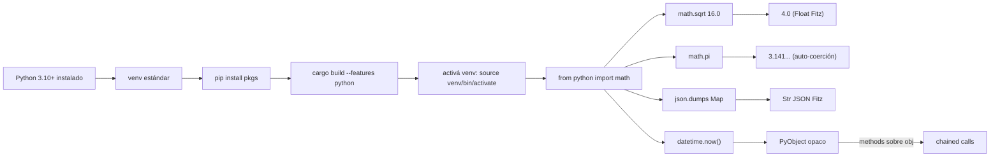

# M7.C1 — Setup venv + `from python import` + casos simples

**Pre-requisitos**: [M6.C7 — capstone CRUD completo](../m6-postgres-orm/c7-capstone-crud-completo.md).
Tenés una app real cerrada con el stack web entero de Fitz nativo. Ahora
abrimos una puerta lateral: **importar Python**. Para entender por qué
importa, M6 cerrado ayuda — vas a saber exactamente cuándo conviene
quedarse en Fitz y cuándo bajar a una lib de Python (M7.C3 cierra eso).

**También necesitás**:

- Python 3.10+ instalado (cualquier installer: python.org,
  `apt install python3`, `brew install python@3.12`, etc.).
- Una build de `fitz` con la feature `python` activa:
  ```bash
  cargo build --release --features python
  ```
  El binario default de los releases NO incluye libpython (cero costo
  para los users que no usan interop). Para activarla hay que
  recompilar desde fuente.

**Objetivo**: dejar tu primer programa Fitz llamando a `math.sqrt`,
`json.dumps` y `datetime.now` desde el ecosistema Python real, usando
un venv estándar. Sin reescribir ninguna librería, sin spawn de
subprocess, **PyO3 adentro del binario** llamando CPython embebido.

**Por qué importa**: Python tiene el ecosistema más grande del mundo
(numpy, pandas, SQLAlchemy, httpx, scikit-learn, transformers...).
Pedirle al user de Fitz que reescriba todo desde cero es irreal. La
interop con Python es **el puente** para usar Fitz hoy sin renunciar a
los packages que ya tenés. La promesa del lenguaje es clara:
**Python entra como backend de librerías, no como identidad del
lenguaje**. Fitz NO se vuelve "Python con sintaxis distinta" — el
core (HTTP, async, ORM, types) sigue siendo Fitz nativo. Python aparece
solo cuando lo necesitás explícitamente con `from python import ...`.

**Cross-link**: [cap 21 de la guía — Interop Python](../../guide.md#21-interop-python)
para el detalle exhaustivo de cada feature (15 sub-secciones).

---

## Mapa del cap



---

## Por qué Fitz es distinto

| Feature | Subprocess / IPC | Node + child_process | Rust + PyO3 manual | Julia + PyCall | Java + JNI | **Fitz** |
|---|---|---|---|---|---|---|
| Setup | `subprocess.run("python", ...)` | `child_process.spawn("python")` | `cargo add pyo3 --features auto-initialize` + 30 LoC boilerplate | `using PyCall` + setup PYCALL_JL_RUNTIME | `System.loadLibrary` + JNI bindings | **`--features python` + `from python import X`** |
| Latencia por call | ~10-100 ms (process spawn + serialization) | ~10-100 ms idem | <1ms (in-process) | <1ms (in-process) | <1ms (in-process) | **<1ms (in-process)** |
| Marshaling de tipos | manual via stdin/stdout/JSON | manual via stdin/stdout/JSON | manual con `IntoPy`/`FromPyObject` | automático parcial | manual con conversores | **automático para primitivos + List/Map/Instance** |
| Excepciones Python | manual: parsear stderr | manual idem | manual con `PyResult` | automático parcial | manual con try/catch | **automático: `Result::Err` wrap (Fase 8.3)** |
| Async (asyncio) | NO posible | NO posible (bloquea) | manual con tokio-pyo3 | NO | NO | **bridge built-in `<py>.await` (Fase 8.6)** |
| Validación estática del shape | NO | NO | ⚠ macros parciales | NO | NO | **anotaciones Fitz + `fitz py-types` (Fase 8.4-8.5)** |
| Bundling sin Python instalado | imposible | imposible | imposible (manual) | imposible | imposible | **`fitz build --bundle-python` (Fase 8.b)** |
| Editor support (LSP) | NO | NO | ⚠ con rust-analyzer | NO | NO | **completions de `from python import` + tipo PyAny** |

El diferencial mayor: **interop Python es ciudadano de primera clase**.
En Rust podés hacerlo con PyO3 pero pagás boilerplate (30+ LoC para un
import + call). En Node es subprocess con todos sus costos. En Fitz es
**sintaxis del lenguaje** — el mismo shape de `from foo import bar` que
ya conocés de M3 (módulos Fitz) funciona contra el namespace virtual
`python`. El runtime resuelve `path[0] == "python"` y rutea al
intérprete embebido.

---

## Paso 1 — Verificar Python 3.10+

```bash
$ python3 --version
Python 3.12.4
```

Si no tenés Python instalado:

- **Linux**: `sudo apt install python3 python3-venv python3-pip`
- **macOS**: `brew install python@3.12`
- **Windows**: descargar de https://www.python.org/downloads/

> **Política de venvs**: el patrón estándar Python. Fitz NO inventa
> magia propia para gestionar entornos virtuales. Activás tu venv
> ANTES de correr `fitz run`, y CPython lee `VIRTUAL_ENV` al boot.
> Cero código nuevo en Fitz para esto.

---

## Paso 2 — Crear un venv para el proyecto

```bash
$ mkdir mi-app-python
$ cd mi-app-python
$ python3 -m venv venv
```

Activá el venv:

```bash
# Linux / macOS
$ source venv/bin/activate

# Windows PowerShell
PS> venv\Scripts\Activate.ps1
```

Ahora `(venv)` aparece en tu prompt. Cualquier `pip install` instala
adentro de `./venv/`, no contamina tu Python global.

Para este cap no necesitás packages externos todavía (usamos
`math`/`json`/`datetime` que son stdlib). El venv lo creamos para
prepararnos para C2 cuando bajemos `numpy`/`pandas`.

---

## Paso 3 — Compilar `fitz` con la feature `python`

Si todavía no lo hiciste:

```bash
$ git clone https://github.com/Thegreekman76/fitz.git ~/src/fitz
$ cd ~/src/fitz
$ cargo build --release --features python
   Compiling pyo3 v0.22
   Compiling fitz v0.12.6 (...)
    Finished `release` profile [optimized] target(s) in 1m 47s
$ cp target/release/fitz ~/.local/bin/fitz-python  # o donde tengas tu PATH
```

Si lo ponés con un nombre distinto (`fitz-python`), podés tener los dos
binarios: el `fitz` default standalone (sin libpython) y
`fitz-python` cuando necesités interop. Si lo ponés como `fitz` plain,
sobrescribís el default — válido también, el binario con la feature
sigue corriendo programas SIN interop sin overhead.

**Validá**:

```bash
$ fitz-python --version
fitz 0.12.6
```

---

## Paso 4 — Tu primer `from python import`

Creá `app.fitz` adentro del proyecto:

```fitz
// app.fitz — primer programa con interop Python.
from python import math

let radio = 5.0
let area = math.pi * math.sqrt(radio)
print("área aproximada: {area}")
```

Corré:

```bash
$ source venv/bin/activate  # IMPORTANTE
(venv) $ fitz-python run app.fitz
área aproximada: 7.024814731040727
```

Qué pasó:

1. `from python import math` → Fitz detectó `path[0] == "python"` y
   ruteó al loader CPython embebido en lugar del loader normal de
   módulos Fitz (M3.C1).
2. Al boot del programa, PyO3 hizo `Python::attach` + importó el
   módulo `math`. Cero costo cuando NO usás interop (lazy
   initialization).
3. `math.pi` — field access sobre `Value::PyObject` (el módulo). PyO3
   resuelve con `getattr`, devuelve `3.14...` como Python float, Fitz
   lo auto-coerciona a `Float` nativo (Fase 8.1.3).
4. `math.sqrt(5.0)` — method call. Fitz convierte `5.0` a Python
   `float`, PyO3 invoca, recibe `2.236...` Python, auto-coerciona a
   `Float` Fitz.
5. La multiplicación `math.pi * math.sqrt(...)` ya es aritmética
   nativa Fitz sobre Floats.

> **Auto-coerción primitiva bidireccional**: `bool`, `int` (con cuidado
> de overflow), `float`, `str`, `None`. Es lo más natural — para
> primitivos NO escribís código de conversión. (Fase 8.1.3)

---

## Paso 5 — JSON round-trip

`json` es otro módulo de stdlib Python. Útil para mostrar marshaling
bidireccional con tipos compuestos:

```fitz
from python import json

let user = {"id": 42, "name": "Ada", "active": true}
let serialized = json.dumps(user)
print("JSON: {serialized}")

let parsed = json.loads(serialized)
print("parsed: {parsed}")
```

```bash
(venv) $ fitz-python run app.fitz
JSON: {"id": 42, "name": "Ada", "active": true}
parsed: {"id": 42, "name": "Ada", "active": true}
```

Qué pasó adentro:

1. `Map<Str, Any>` Fitz → `dict` Python (eager copy, Fase 8.2).
2. `json.dumps(...)` produce un `str` Python.
3. Auto-coerción `str` → `Str` Fitz.
4. `json.loads(serialized)` produce un `dict` Python.
5. Conversión `dict` → `Map<Str, Any>` Fitz preservando orden de
   inserción (garantía CPython 3.7+).

> **Política "copia eager bidireccional"** (decisión Fase 8.2): los
> dos GCs (Rust + CPython) no comparten state. Cada marshaling clona.
> Trade-off: previene pesadillas de lifetime y races entre GIL y
> tokio. Costo: ~O(N) para containers grandes. Para data analysis
> intenso (M7.C2 con pandas) usamos APIs que minimizan los hops.

---

## Paso 6 — `datetime` y objetos opacos

No todo se auto-coerciona. Tipos complejos quedan como
**`Value::PyObject` opaco**:

```fitz
from python import datetime

let now = datetime.datetime.now()
print("now es: {now}")

let year = now.year
print("año: {year}")
```

```bash
(venv) $ fitz-python run app.fitz
now es: 2026-06-03 21:45:12.487193
año: 2026
```

Qué pasó:

1. `datetime.datetime.now()` retorna un `datetime.datetime` Python.
   Fitz NO sabe convertir eso a un tipo nativo (no hay tipo Date
   universal), así que lo guarda como **PyObject opaco**.
2. El `print("now es: {now}")` invoca `__str__` Python sobre el
   objeto, obtiene el string `"2026-06-03 ..."`.
3. `now.year` — field access sobre PyObject. PyO3 hace `getattr`,
   recibe `int` Python, auto-coerciona a `Int` Fitz.

**El patrón clave**: para objetos opacos Python, `.field`/`.method(args)`
funciona como en Python normal — Fitz delega al `getattr`/`call` de
PyO3.

---

## Paso 7 — Combinar todo: mini app HTTP

Combinamos los 3 módulos en un handler HTTP real:

```fitz
// app.fitz
from python import math
from python import json
from python import datetime

@get("/circle/{radius}")
fn circle_area(radius: Float) -> Map<Str, Any> {
    let area = math.pi * radius * radius
    let now = datetime.datetime.now()
    return {
        "radius": radius,
        "area": area,
        "computed_at": now.isoformat()
    }
}

@server(3000)
fn main() => 0
```

```bash
(venv) $ fitz-python run app.fitz
# en otra terminal:
$ curl localhost:3000/circle/5.0
{"radius":5.0,"area":78.53981633974483,"computed_at":"2026-06-03T21:45:12.487193"}
```

Acá estás combinando:

- **HTTP nativo de Fitz** (`@get`, `@server`) — vivo desde M4.
- **Interop Python** (`math.pi`, `datetime.isoformat()`).
- **Marshaling automático** de `Map<Str, Any>` → JSON via axum.

El binario tiene HTTP nativo Y libpython, todo standalone (~50 MB
con feature `python`, ~10 MB sin).

---

## Subset compilable a binario (`fitz run` vs `fitz build`)

**`fitz run` cubre 100%** de lo que viste en este cap. Hoy es el
target principal para interop Python.

**`fitz build` con interop** (Fase 8.7 — CERRADA) compila a binario
nativo Linux/macOS/Windows con libpython linkeada:

```bash
$ fitz-python build app.fitz
$ ./app   # corre standalone, requiere python3.X en el sistema
```

Hay **una deuda residual menor** que te puede afectar si tu programa
hace algo muy específico:

- ⚠ **Coerción Python `list`/`dict` → Fitz `List<T>`/`Map<K,V>` en
  codegen** sigue como deuda menor. Para `fitz run` funciona perfecto;
  para `fitz build` algunos casos terminan como `PyObject` opaco en
  lugar de `List` nativa. Workaround: usá `list(...)` Python o
  conviértelo a string JSON y `json.loads()` en Fitz.

**Para distribución sin Python instalado**: M7.C3 muestra
`--bundle-python` y `--bundle-pip` (CPython + paquetes empaquetados
adentro del binario).

---

## Validación

Probá end-to-end:

```bash
# 1. Verificá venv y feature
$ source venv/bin/activate
(venv) $ python3 --version
Python 3.12.4
(venv) $ fitz-python --version
fitz 0.12.6

# 2. Cubrí los 4 casos principales.
$ cat > test1.fitz <<'EOF'
from python import math
print(math.sqrt(16.0))
EOF
(venv) $ fitz-python run test1.fitz
4.0

$ cat > test2.fitz <<'EOF'
from python import json
print(json.dumps({"hola": "mundo", "n": 42}))
EOF
(venv) $ fitz-python run test2.fitz
{"hola": "mundo", "n": 42}

$ cat > test3.fitz <<'EOF'
from python import datetime
let dt = datetime.datetime.now()
print(dt.year)
EOF
(venv) $ fitz-python run test3.fitz
2026

# 3. Handler HTTP combinado del Paso 7.
$ fitz-python run app.fitz &
$ curl localhost:3000/circle/3.0
{"radius":3.0,"area":28.274333882308138,"computed_at":"..."}
```

Si los 3 mini-tests + el HTTP responden, dominaste el setup
inicial.

---

## Troubleshooting

**`✗ from python import foo: módulo no encontrado`**: el venv no
está activo, o el package no está instalado. Verificá con
`python3 -c "import foo"` adentro del venv — si falla ahí, hay que
hacer `pip install foo`.

**`linking with cc failed: cannot find -lpython3.X`** durante el
build con `--features python`: tu sistema no tiene los headers de
desarrollo. `sudo apt install python3-dev` o equivalente.

**`Python.h: No such file or directory`**: similar al anterior,
faltan headers de desarrollo. PyO3 los necesita.

**El programa con `--features python` corre pero
`from python import` aborta con `feature not enabled`**: pasaron la
flag `--no-default-features` por accidente y se perdió el `python`.
Re-compila con `cargo build --release --features python` plain.

**Linux/macOS: `fitz build --bundle-python` falla con
`incompatible libpython`**: bundling tiene constraint arquitectural
(builder Python version == bundle version). En Windows hay un shim
`python3.dll` stable ABI que lo evita; en Linux/macOS NO existe.
Cubierto exhaustivamente en M7.C3 cuando hablamos de
`--bundle-python` para distribución.

**`mismatched marshaling`** o tipos extraños en logs: probablemente
estás mezclando `Map<Str, Any>` con `Map<Str, Str>` para `json.dumps`.
El `Any` es lo seguro; especificar `Str` strict te bloquea con
ints/bools que también deben entrar.

---

## Lo que viene en M7.C2

Ahora que tenés el flow básico, vamos al sweet spot: **numpy + pandas
para data analysis real**. Vas a leer un CSV con pandas, hacer
operaciones con numpy, y devolver el resultado a Fitz como
`List<Map<Str, Any>>` para servirlo por HTTP. Si alguna vez tuviste
que tirar un microservicio Python solo para pandas, este cap te
muestra cómo eliminás esa fricción.

→ [M7.C2 — numpy + pandas reales: data analysis](c2-numpy-pandas-data-analysis.md)
