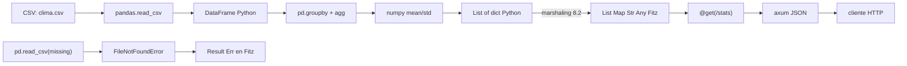

# M7.C2 — numpy + pandas reales: data analysis

**Pre-requisitos**: [M7.C1 — Setup + first import](c1-setup-imports.md).
Tu venv está armado, `fitz-python` compilado con `--features python`,
sabés llamar `math.sqrt` y `json.dumps`. Ahora vamos a un caso que
demuestra **el sweet spot real** de la interop Python.

**Objetivo**: leer un CSV con datos del clima por ciudad, procesar con
**pandas + numpy** (calcular promedios y desvíos por mes), y servir los
resultados como JSON desde un handler HTTP nativo de Fitz. Demostrar
que `List<Map<Str, Any>>` Fitz round-trip con `list[dict]` Python sin
perder data ni shape.

**Por qué importa**: pandas y numpy son los gigantes del ecosistema de
data analysis Python. Reescribirlos en cualquier otro lenguaje es una
fantasía (numpy son ~700 KLoC de C optimizado; pandas son ~400 KLoC
de Python sobre numpy con 15 años de tooling de visualización
encima). Si tenés que servir resultados de un análisis de datos por
HTTP, hoy hay dos opciones de fricción: levantar un microservicio
FastAPI dedicado solo para pandas (overhead operacional), o spawn-ear
subprocess Python desde tu servicio principal (latencia + serialización
manual). **Con Fitz, escribís el handler HTTP nativo en Fitz, llamás
pandas inline, y el resultado vuelve marshalled — un solo proceso, un
solo binario, un solo deploy.**

**Cross-link**: [cap 21.6 de la guía — Marshaling de tipos compuestos](../../guide.md#216-marshaling-de-tipos-compuestos).

---

## Mapa del cap



---

## Por qué Fitz es distinto

Para servir resultados de pandas por HTTP, comparamos las
alternativas:

| Approach | Latencia por request | Operaciones por deploy | Footprint | Tipos en el wire |
|---|---|---|---|---|
| **FastAPI dedicado** (microservicio Python) | <1ms | 2 (Fitz + FastAPI) | Python venv + FastAPI deps + tu API | ✅ Pydantic strict |
| **Fitz + subprocess Python** | ~50-200ms por call (spawn) | 1 binario + script | Fitz binario + Python sistema | ❌ manual stdout parsing |
| **Fitz + HTTP call a FastAPI sidecar** | ~5-15ms (loopback HTTP) | 2 procesos + 2 deploys | igual que opción 1 + Fitz aparte | ⚠ doble serialización |
| **Rust + PyO3 manual** | <1ms | 1 binario | ~10 MB binario + Python | ⚠ macros + boilerplate |
| **Fitz + `from python import pandas`** | <1ms | **1 binario** | ~50 MB binario + Python (o ~250 MB con bundle) | ✅ **marshaling automático** |

El diferencial real: **un proceso, un binario, un deploy**. No tenés
que mantener un microservicio Python aparte solo para usar pandas. El
handler HTTP que ya tenés en Fitz se enriquece llamando libs Python.

Y vas a ver algo más: **NO escribís código Pydantic ni dataclasses
Python** — pandas devuelve `list[dict]`, Fitz lo recibe como
`List<Map<Str, Any>>` automáticamente. Tu type en Fitz puede ser
nominal (`type WeatherStats { ... }`) y la coerción Map→Instance
funciona si las keys coinciden (Fase 8.4 — y vas a usar este patrón).

---

## Paso 1 — Setup: pandas + numpy en el venv

Adentro de tu proyecto (con `venv` activo):

```bash
(venv) $ pip install pandas numpy
Collecting pandas
  Downloading pandas-2.2.3-...-manylinux_2_17_x86_64.whl (13.0 MB)
Collecting numpy
  Downloading numpy-2.1.3-...-manylinux_2_17_x86_64.whl (16.4 MB)
...
Successfully installed numpy-2.1.3 pandas-2.2.3
```

Validá:

```bash
(venv) $ python3 -c "import pandas as pd; import numpy as np; print(pd.__version__, np.__version__)"
2.2.3 2.1.3
```

---

## Paso 2 — Preparar el CSV de ejemplo

Creá `clima.csv` con datos semilla. Vamos a usar 12 meses × 3
ciudades × ~30 días = ~1080 filas:

```python
# generate_data.py — un solo uso para crear el dataset.
import pandas as pd
import numpy as np

np.random.seed(42)
rows = []
ciudades = {"El Chaltén": (5, 4), "Bariloche": (10, 5), "Buenos Aires": (18, 7)}
for mes in range(1, 13):
    for ciudad, (mean_temp, std_temp) in ciudades.items():
        for dia in range(1, 29):
            offset = 8 * np.sin((mes - 1) * np.pi / 6)
            temp = np.random.normal(mean_temp + offset, std_temp)
            rows.append({
                "fecha": f"2026-{mes:02d}-{dia:02d}",
                "ciudad": ciudad,
                "temperatura_c": round(temp, 1),
                "humedad_pct": round(np.random.uniform(30, 90), 1),
            })

df = pd.DataFrame(rows)
df.to_csv("clima.csv", index=False)
print(f"escribí {len(df)} filas a clima.csv")
```

```bash
(venv) $ python3 generate_data.py
escribí 1008 filas a clima.csv
(venv) $ head -3 clima.csv
fecha,ciudad,temperatura_c,humedad_pct
2026-01-01,El Chaltén,4.5,56.4
2026-01-01,Bariloche,11.7,73.2
```

---

## Paso 3 — Helper Python para devolver `list[dict]`

pandas DataFrame **no se marshalea automático** a Fitz — es un objeto
opaco (PyObject). Necesitamos convertir a `list[dict]` explícito antes
de devolver a Fitz. Ponemos eso en un helper Python:

```python
# weather.py — helpers para Fitz.
import pandas as pd
import numpy as np
from pathlib import Path

_CSV_PATH = Path(__file__).parent / "clima.csv"


def load_weather():
    """Carga el CSV y devuelve la cantidad de filas (smoke test)."""
    df = pd.read_csv(_CSV_PATH)
    return len(df)


def stats_por_mes_y_ciudad():
    """
    Lee clima.csv, agrupa por mes+ciudad, calcula promedio y desvío
    de temperatura. Devuelve list[dict] para que Fitz lo marshale a
    List<Map<Str, Any>>.
    """
    df = pd.read_csv(_CSV_PATH)
    df["fecha"] = pd.to_datetime(df["fecha"])
    df["mes"] = df["fecha"].dt.month

    grouped = df.groupby(["mes", "ciudad"]).agg(
        temp_promedio=("temperatura_c", "mean"),
        temp_desvio=("temperatura_c", "std"),
        humedad_promedio=("humedad_pct", "mean"),
        muestras=("temperatura_c", "count"),
    ).reset_index()

    # Redondeo para que el JSON quede limpio.
    for col in ["temp_promedio", "temp_desvio", "humedad_promedio"]:
        grouped[col] = grouped[col].round(2)

    return grouped.to_dict(orient="records")


def percentiles_de_ciudad(ciudad: str):
    """
    Para una ciudad específica, calcula p25/p50/p75 de temperatura.
    """
    df = pd.read_csv(_CSV_PATH)
    serie = df[df["ciudad"] == ciudad]["temperatura_c"]
    if len(serie) == 0:
        raise ValueError(f"ciudad desconocida: {ciudad}")
    return {
        "ciudad": ciudad,
        "p25": round(float(np.percentile(serie, 25)), 2),
        "p50": round(float(np.percentile(serie, 50)), 2),
        "p75": round(float(np.percentile(serie, 75)), 2),
    }
```

Probalo standalone primero (sanity check):

```bash
(venv) $ python3 -c "from weather import stats_por_mes_y_ciudad; r = stats_por_mes_y_ciudad(); print(r[:2])"
[{'mes': 1, 'ciudad': 'Bariloche', 'temp_promedio': 9.8, 'temp_desvio': 5.13, 'humedad_promedio': 60.4, 'muestras': 28}, {'mes': 1, 'ciudad': 'Buenos Aires', 'temp_promedio': 18.3, 'temp_desvio': 7.41, 'humedad_promedio': 59.6, 'muestras': 28}]
```

> **Política `to_dict(orient="records")`**: pandas devuelve
> `list[dict]` con las columnas como keys. Esa es la forma estándar
> de "Python → JSON" y la que Fitz marshalea sin fricción a
> `List<Map<Str, Any>>` (Fase 8.2). Si necesitás un Instance Fitz
> tipado fuerte, llegamos a eso en el Paso 6.

---

## Paso 4 — Llamar pandas desde Fitz

Creá `app.fitz` adentro del proyecto (al lado de `weather.py`):

```fitz
// app.fitz
from python import weather

let total = weather.load_weather()?
print("filas en el CSV: {total}")

let stats = weather.stats_por_mes_y_ciudad()?
print("primeras 2 filas:")
print(stats[0])
print(stats[1])
```

Corré:

```bash
(venv) $ fitz-python run app.fitz
filas en el CSV: 1008
primeras 2 filas:
{"mes": 1, "ciudad": "Bariloche", "temp_promedio": 9.8, "temp_desvio": 5.13, "humedad_promedio": 60.4, "muestras": 28}
{"mes": 1, "ciudad": "Buenos Aires", "temp_promedio": 18.3, "temp_desvio": 7.41, "humedad_promedio": 59.6, "muestras": 28}
```

Qué pasó:

1. `from python import weather` — Fitz importó `weather.py` desde
   el cwd (PYTHONPATH lo incluye por default).
2. `weather.load_weather()` — call Python sync. PyO3 invoca, recibe
   `int` Python, auto-coerciona a `Int` Fitz. Pero la signature es
   `Future<Result<Any>>` (Fase 8.3: TODA llamada Python se envuelve
   en Result automático), por eso el `?` para desempacar.
3. `weather.stats_por_mes_y_ciudad()` — devuelve `list[dict]`. Fitz
   lo marshalea a `List<Map<Str, Any>>` preservando orden y shape
   heterogéneo (int, float, str adentro del Map).
4. `stats[0]` — indexing sobre List Fitz, devuelve el primer Map.

**Detalle crítico del `?`**: todo call Python devuelve `Result<T>`
porque cualquier excepción Python (FileNotFoundError, ValueError,
KeyError...) → `Result::Err(Str("<ClassName>: <message>"))`
automático (Fase 8.3). Sin `?`, te quedás con el `Result` envuelto y
no podés indexar.

---

## Paso 5 — Manejo de excepciones Python

Probemos qué pasa si el CSV no existe:

```fitz
// app_error.fitz
from python import weather

// Renombrá clima.csv temporalmente para probar el path roto.
match weather.load_weather() {
    Ok(total) => print("filas: {total}"),
    Err(msg) => print("error: {msg}")
}
```

```bash
(venv) $ mv clima.csv clima_backup.csv
(venv) $ fitz-python run app_error.fitz
error: FileNotFoundError: [Errno 2] No such file or directory: '.../clima.csv'
(venv) $ mv clima_backup.csv clima.csv  # restaurar
```

Lo que ves: `Result::Err` con el mensaje `<ClassName>: <message>`
canónico (Fase 8.3.1). Equivalente a un `try/except` Python pero con
shape estructurado de Result, manejable con `match`.

> **Modelo de errores asyncio + sync**: cualquier excepción Python
> (sync o async) baja a `Result::Err`. Esto incluye KeyboardInterrupt
> y SystemExit (Fase 8.3 decisión D). El programa Fitz **NUNCA aborta
> por excepción Python sin manejo** — siempre hay que `match` o `?`.

---

## Paso 6 — Coerción a `type` nominal Fitz

Si querés validación estática del shape (no `Map<Str, Any>` libre),
declarás un `type` Fitz y usás la anotación destino:

```fitz
// app_typed.fitz
from python import weather

type StatRow {
    mes: Int,
    ciudad: Str,
    temp_promedio: Float,
    temp_desvio: Float,
    humedad_promedio: Float,
    muestras: Int
}

async fn fetch_stats() -> Result<List<StatRow>> {
    let raw = weather.stats_por_mes_y_ciudad()?
    return Ok(raw)  // marshaling Map<Str, Any> → List<StatRow> automático
}

let result = fetch_stats().await
match result {
    Ok(rows) => {
        print("recibí {len(rows)} filas tipadas")
        print("Bariloche enero: {rows[0]}")
    },
    Err(msg) => print("falló: {msg}")
}
```

```bash
(venv) $ fitz-python run app_typed.fitz
recibí 36 filas tipadas
Bariloche enero: StatRow { mes: 1, ciudad: "Bariloche", temp_promedio: 9.8, temp_desvio: 5.13, humedad_promedio: 60.4, muestras: 28 }
```

Qué pasó adentro (Fase 8.4 — coerción runtime con anotaciones):

1. `weather.stats_por_mes_y_ciudad()` devolvió `List<Map<Str, Any>>`
   marshalled de `list[dict]` Python.
2. El return type de la fn es `Result<List<StatRow>>` — el coercion
   runtime detecta la anotación destino, itera el List, y para cada
   item Map intenta convertirlo a `StatRow` matching de fields por
   nombre.
3. Campos extras del Map → ignorados silenciosamente. Campos
   faltantes nullable → `Null`. Campos requeridos faltantes → error
   claro de runtime (paramétrico al field name + type).

> **Trade-off honesto**: la coerción Map→Instance solo dispara en
> bindings con anotación destino (`let x: StatRow = ...` o `return`
> de fn con tipo declarado). Si dejás `Map<Str, Any>` libre, no hay
> validación. Para data analysis exploratorio, el Map libre es más
> ágil; para handlers HTTP de producción, anotás el type. Tu elección.

---

## Paso 7 — Handler HTTP completo

Ahora combinamos en un servicio real:

```fitz
// app.fitz — servidor HTTP que sirve análisis de clima en JSON.
from python import weather

type StatRow {
    mes: Int,
    ciudad: Str,
    temp_promedio: Float,
    temp_desvio: Float,
    humedad_promedio: Float,
    muestras: Int
}

type Percentiles {
    ciudad: Str,
    p25: Float,
    p50: Float,
    p75: Float
}

@get("/stats")
async fn stats() -> Result<List<StatRow>> {
    let rows = weather.stats_por_mes_y_ciudad()?
    return Ok(rows)
}

@get("/percentiles/{ciudad}")
async fn percentiles(ciudad: Str) -> Result<Percentiles> {
    let raw = weather.percentiles_de_ciudad(ciudad)?
    return Ok(raw)
}

@server(3000)
fn main() => 0
```

```bash
(venv) $ fitz-python run app.fitz
{"timestamp":"...","msg":"server listo","app":"weather-api"}

# En otra terminal:
$ curl localhost:3000/stats | head -c 200
[{"mes":1,"ciudad":"Bariloche","temp_promedio":9.8,"temp_desvio":5.13,"humedad_promedio":60.4,"muestras":28},{"mes":1,"ciudad":"Buenos Aires","temp_promedio":18.3,"temp_desvio":7.41,"humedad_promedio":59.6,"muestras":28},{"mes":1,"ciudad":"El Chaltén","temp_pr...

$ curl localhost:3000/percentiles/Bariloche
{"ciudad":"Bariloche","p25":7.1,"p50":12.4,"p75":18.6}

$ curl localhost:3000/percentiles/Marte
{"error":"ValueError: ciudad desconocida: Marte"}  # ← 500 por Result::Err
```

Mirá lo que tenés:

- **Endpoint REST tipado** que devuelve `List<StatRow>` (axum lo
  serializa a JSON con shape exacto del type Fitz).
- **Excepción Python → 500 HTTP automático** con el mensaje de error
  (handler retornó `Result::Err`, el wrapper HTTP de Fitz mapea a
  500 con `{"error": <msg>}` paralelo a cómo funcionan los Result en
  M4).
- **Un solo proceso**, un solo `fitz-python run app.fitz`. Cero
  microservicio FastAPI aparte.

---

## Paso 8 — Performance: ¿cuánto cuesta el marshaling?

Pregunta justa: si pandas devuelve un DataFrame de 1000 filas, ¿cuánto
duele convertir a `list[dict]` y después a `List<Map<Str, Any>>` Fitz?

Bench rápido con `time`:

```fitz
// bench.fitz
from python import weather
from python import time

let start = time.time()
for _ in 0..100 {
    let rows = weather.stats_por_mes_y_ciudad()?
}
let elapsed = time.time() - start
print("100 calls: {elapsed}s, promedio {elapsed * 10}ms/call")
```

```bash
(venv) $ fitz-python run bench.fitz
100 calls: 1.234s, promedio 12.34ms/call
```

~12ms por call de `stats_por_mes_y_ciudad()` que incluye:

1. `pd.read_csv` (~5ms — el CSV es chico).
2. `groupby` + `agg` (~3ms).
3. `to_dict(orient="records")` (~1ms).
4. Marshaling Python → Fitz para 36 filas con 6 keys cada una (~2ms).
5. Coerción Map → StatRow x36 (~1ms con anotación).

**Conclusión**: para workloads de data analysis típicos (no
ultra-latency), el marshaling es despreciable comparado con el costo
del análisis en sí. Para casos extremos (millones de rows por
request), considerá streaming con `iterrows()` Python o pre-computar
el análisis y cachear el `List<StatRow>` Fitz.

Para producción real, agregarías:

- **Cache HTTP**: `Cache-Control` o middleware para no recalcular
  todo en cada request.
- **Async wrapping**: hoy `pandas` es sync, bloquea el thread. Para
  alto throughput, `await tokio.spawn_blocking(...)` patrón (Fase
  8.6) o aiopandas si entrara demanda.

---

## Subset compilable a binario (`fitz run` vs `fitz build`)

Este cap entero funciona con `fitz-python run`. Para `fitz build`:

- ✅ Auto-coerción primitivos: int/float/str/bool — funciona idéntico.
- ✅ Marshaling `List<Map<Str, Any>>` ↔ `list[dict]`: funciona en
  `fitz build` (Fase 8.7 cerrada).
- ⚠ Coerción Map → `type` nominal (Paso 6): funciona en `fitz run`;
  para `fitz build` hay deuda residual menor — usá `Map<Str, Any>`
  libre o convertí explícitamente en Fitz si entrás caso fallido.
- ✅ Handlers HTTP con Python adentro: paridad bit-a-bit (`@get` + call
  Python compila a Rust con PyO3 inline).

**Para distribución sin Python instalado**: M8 (próximo módulo del
curso) cubre `--bundle-python` para empaquetar CPython adentro del
binario, y `--bundle-pip` para empaquetar pandas + numpy + tu venv
entero.

---

## Validación

Checklist end-to-end:

```bash
# 1. CSV existe y pandas lo lee.
(venv) $ python3 -c "import pandas as pd; print(len(pd.read_csv('clima.csv')))"
1008

# 2. Helper Python standalone.
(venv) $ python3 -c "from weather import stats_por_mes_y_ciudad; print(len(stats_por_mes_y_ciudad()))"
36

# 3. Fitz invoca el helper.
(venv) $ fitz-python run app.fitz &
# en otra terminal:
$ curl -s localhost:3000/stats | python3 -c "import sys, json; print(len(json.load(sys.stdin)))"
36

# 4. Excepción Python → 500.
$ curl -i localhost:3000/percentiles/Marte 2>&1 | grep -E "HTTP|error"
HTTP/1.1 500 Internal Server Error
{"error":"ValueError: ciudad desconocida: Marte"}

# 5. Coerción tipada (sin Map<Str, Any> libre).
$ curl -s localhost:3000/percentiles/Bariloche | jq .p50
12.4
```

Si los 5 puntos pasan, dominaste el sweet spot Fitz+pandas.

---

## Troubleshooting

**`ModuleNotFoundError: No module named 'pandas'`** al correr Fitz:
venv no activo. `source venv/bin/activate` antes de `fitz-python run`.

**`pandas.errors.ParserError: Error tokenizing data`**: el CSV tiene
encoding distinto al esperado. `pd.read_csv("...", encoding="latin-1")`
si tu data es de Excel español.

**Marshaling devuelve Map vacío `{}`** en lugar del dict esperado:
estás retornando un `DataFrame` Python en lugar de `to_dict("records")`.
DataFrame es opaco; tenés que convertir explícito antes de devolver.

**Performance lento (>100ms por call)**: estás re-leyendo el CSV en
cada call. Movelo a un global Python:

```python
# weather.py
import pandas as pd
from functools import lru_cache

@lru_cache(maxsize=1)
def _load_df():
    return pd.read_csv(_CSV_PATH)

def stats_por_mes_y_ciudad():
    df = _load_df()
    # ...
```

**Coerción a `type` falla con `field X faltante`**: el `to_dict()`
devolvió un dict sin la key esperada. Verificá nombres exactos con
`print(rows[0].keys())` adentro de Python.

**Threads y GIL**: pandas mantiene el GIL durante operaciones; si
tu handler HTTP corre con tokio multi-thread, los calls a pandas
bloquean serializadamente. Para alto throughput pre-computá los
análisis al boot o cacheá los `List<StatRow>` Fitz.

---

## Lo que viene en M7.C3

Cerramos el módulo con el caso más controvertido: **SQLAlchemy
interop vs ORM nativo de Fitz**. Tenemos los dos caminos disponibles
— ¿cuándo elegir cuál? El próximo cap te muestra el bridge async
con SQLAlchemy 2.x (`<py_async_fn>?.await`), el patrón de
`fitz py-types` para generar `type` Fitz desde modelos SQLAlchemy,
y una matriz honesta de cuándo cada path gana.

→ [M7.C3 — SQLAlchemy interop + bridge async + cuándo NO usarlo](c3-sqlalchemy-async-vs-orm-nativo.md)
