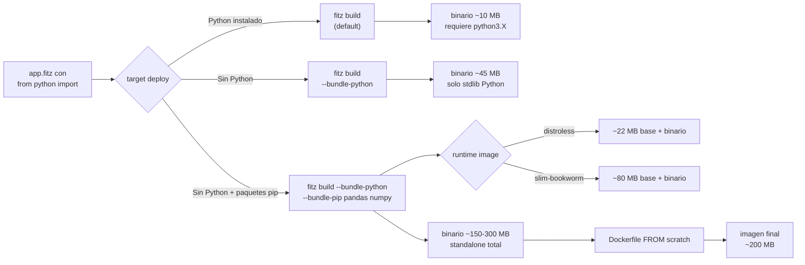

# M8.C5 — Deploy real de apps con interop Python

**Pre-requisitos**: [M8.C4 — Deploy avanzado con Docker](c4-deploy-docker-k8s.md)
**y** [M7.C3 — SQLAlchemy interop](../m7-python-interop/c3-sqlalchemy-async-vs-orm-nativo.md).
Tu app ya está dockerizada con `fitz docker init`, tenés observability
con OTel, secrets management, healthz/readyz. Si tu app usa interop
Python (numpy/pandas/SQLAlchemy/etc. del M7), todavía hay un detalle
crítico para producción.

**Objetivo**: empaquetar tu app Fitz con interop Python a un binario
standalone que **NO requiera Python instalado en el destino, NI un
`pip install`**. Cubrir `fitz build --bundle-python` (CPython 3.14.5
embebido) y `--bundle-pip` (paquetes pip embebidos), entender qué
runtime image elegir, y armar el Dockerfile correcto para apps con
interop.

**Por qué importa**: en M7 vimos que las apps con interop Python son
poderosas (acceso a numpy/pandas/SQLAlchemy sin reescribir). El costo
operacional default es serio: el destino necesita Python 3.X de la
versión correcta, un venv con tus paquetes, y un `pip install` que
puede fallar por compatibilidad de wheels (manylinux, glibc, etc.).
**`--bundle-python` + `--bundle-pip` elimina toda esa fricción**:
copiás un binario al server (~150-300 MB), lo ejecutás, listo.
**Ningún otro lenguaje moderno con interop Python ofrece esto activamente
mantenido** (PyOxidizer está ralentizado desde 2023).

**Cross-link**: [cap 21.11 — `fitz build --bundle-python`](../../guide.md#2111-fitz-build---bundle-python--binario-standalone)
y [cap 21.12 — `fitz build --bundle-pip`](../../guide.md#2112-fitz-build---bundle-pip--empaquetar-paquetes-pip).

---

## Mapa del cap



---

## Por qué Fitz es distinto

Comparemos cómo se distribuyen apps con dependencias Python en cada
ecosistema:

| Approach | Pasos para deploy | Tamaño total | Cold-start | Compatibilidad |
|---|---|---|---|---|
| **Python clásico** (FastAPI) | `pip install` venv + copy code | ~80 MB venv + tu code | <1s | Matching Python + glibc + wheels |
| **Docker Python image** | `FROM python:3.X` + `pip install -r reqs.txt` | ~150 MB image base + ~80 MB venv = ~230 MB | <1s | OK con Docker |
| **PyInstaller** | freeze de tu app | ~50-100 MB | ~2-5s | Plataforma específica, brittle |
| **PyOxidizer** | configure + build (ralentizado) | ~30-60 MB | <1s | Project ralentizado, abandono parcial |
| **Rust + PyO3 distribuido** | binario Rust + venv adyacente | ~10 MB binario + ~80 MB venv | <1s | venv requerido |
| **Fitz `fitz build` plain** | un binario + Python instalado destino | ~10 MB binario | <1s | Python 3.X en destino |
| **Fitz `--bundle-python`** | un binario standalone | ~45 MB | ~5s (extract CPython tarball) | Cualquier glibc compatible |
| **Fitz `--bundle-python --bundle-pip`** | **un binario total con paquetes** | ~150-300 MB según paquetes | ~5-10s (extract Python + paquetes) | **Idem standalone** |

El diferencial: **`fitz build --bundle-python --bundle-pip` es el
único path moderno que produce un binario único con CPython + tus
paquetes pip embebidos, activamente mantenido**. Para apps con
pandas + numpy + SQLAlchemy + asyncpg, el binario resultante es
~200-300 MB pero **NO necesitás Python ni paquetes en el destino**.
Deploy = copiar un archivo + correr.

---

## Paso 1 — Decidir tu estrategia

Tres preguntas:

1. **¿Tu app usa interop Python?** Si no, `fitz build` plain del
   M8.C1 te cubre. Saltate este cap.

2. **¿El destino tiene Python instalado y un venv con tus paquetes?**
   - Sí (sysadmin, K8s con Python image base) → `fitz build` plain.
     El binario va a buscar `python3` en el PATH y resolver paquetes
     del sistema.
   - No → necesitás bundling.

3. **¿Cuánto importa el tamaño del binario?**
   - Si el binario debe ser <50 MB (edge functions, embedded, IoT)
     → `--bundle-python` (sin `--bundle-pip`); tu app solo puede
     usar Python stdlib.
   - Si te alcanza ~200-300 MB y querés CERO setup en destino → full
     `--bundle-python --bundle-pip`.

> **Trade-off honesto**: bundling agrega ~30-40 MB (CPython base
> stripped) + el tamaño de cada paquete pip (pandas ~30 MB, numpy
> ~25 MB, sqlalchemy ~10 MB, asyncpg ~5 MB). Un caso típico con
> pandas+numpy+SQLAlchemy llega a ~200 MB. Es el precio de "un solo
> archivo, cero setup".

---

## Paso 2 — `fitz build --bundle-python` (CPython embebido sin paquetes)

Si tu app solo usa Python stdlib (json/math/datetime/re/sqlite3/...),
empezás con `--bundle-python` solo:

```bash
# Adentro de tu proyecto Fitz con `fitz.toml`.
$ fitz-python build --bundle-python
   Descargando python-build-standalone 20260510 (CPython 3.14.5)...
   ✓ cache hit (descargado previamente, ~45 MB en ~/.fitz/cache/pbs/)
   Construyendo launcher Datasette-style + tarball PBS + real binary
   Linkeando binario final
✓ binario: target/release/mi-app (~45 MB)
```

El binario embebe:

- **Real binary** (~10 MB): tu `fitz build` con feature `python`,
  linkea dinámicamente `python3.dll`/`libpython3.so` stable ABI shim.
- **PBS tarball** (~30 MB): CPython 3.14.5 base + stdlib completa,
  stripped sin debug symbols.
- **Launcher** (~5 MB): código Rust que, al primer run, extrae el
  tarball a `<TMPDIR>/fitz-py-<hash>/python/` y arranca el real
  binary contra ese intérprete embebido.

Al primer arranque:

```bash
$ ./target/release/mi-app
[fitz-bundle] extrayendo CPython a /tmp/fitz-py-a1b2c3/ (primera vez, ~5s)
{"timestamp":"...","msg":"server listo"}
```

Cold-start ~5s la primera vez (extract). Runs subsiguientes: ~50ms
(cache hit en `<TMPDIR>/fitz-py-<hash>/`).

> **Cross-platform**: Windows / Linux x64+ARM / macOS Apple Silicon
> están soportados. **Linux/macOS tienen constraint arquitectural**
> (`R.bug-pyo3-abi3-portable-link`): el bundle Python version debe
> matchear con la del builder. En Windows hay un `python3.dll` stable
> ABI shim que lo evita; en Linux/macOS NO existe. Si vas a
> distribuir cross-platform, recompilá `fitz` con el target Python
> correcto antes de bundlear.

---

## Paso 3 — `fitz build --bundle-pip` (paquetes pip empaquetados)

Para que tu app pueda usar pandas/numpy/sqlalchemy en el binario
standalone:

```bash
$ fitz-python build --bundle-python \
    --bundle-pip pandas \
    --bundle-pip numpy \
    --bundle-pip "sqlalchemy[asyncio]>=2.0" \
    --bundle-pip asyncpg
   Descargando PBS (CPython 3.14.5) — cache hit
   Construyendo venv temporal /tmp/fitz-pip-XYZ
   pip install pandas numpy "sqlalchemy[asyncio]>=2.0" asyncpg
   ✓ instalados 12 packages (incluyendo deps transitive)
   Empacando 12 paquetes en tarball secundario (~120 MB)
   Linkeando binario final
✓ binario: target/release/mi-app (~180 MB)
```

El binario ahora embebe:

- Real binary + PBS tarball (~45 MB del Paso 2).
- **Tarball secundario pip_packages** (~120 MB): pandas+numpy+
  SQLAlchemy+asyncpg + deps transitive (12 paquetes total).
- Launcher extiende su lógica: al primer run, extrae **ambos** tarballs
  a `<TMPDIR>/fitz-py-<hash>/python/Lib/site-packages/`.

**Alternativa con `requirements.txt`** (más limpia para CI/CD y
reproducibilidad):

```bash
$ cat requirements.txt
pandas>=2.0
numpy>=2.0
sqlalchemy[asyncio]>=2.0
asyncpg>=0.30

$ fitz-python build --bundle-python --bundle-pip-requirements requirements.txt
```

> **Cache key del tarball pip_packages**: el `--bundle-pip` genera un
> sidecar `<bin>_pip_packages.inputs_hash` (FNV-1a sobre los args +
> contenidos del requirements.txt). Si los inputs no cambian, el
> tarball se reusa del cache (~5-30s ahorrados según el set de
> paquetes). Esto es importante en CI donde el `build` corre seguido
> con cambios solo de código Fitz, no de deps.

---

## Paso 4 — Dockerfile para apps con interop Python

`fitz docker init` (cap M8.C4) ya detecta `from python import` y
ajusta el runtime image. Validemos:

```bash
$ fitz-python docker init
▶ fitz docker init — proyecto `mi-app` en /path
   detectado: @server(port = 3000)
   detectado: interop Python → runtime fallback a python:3.12-slim-bookworm (libpython3.12 + wget)
✓ escrito: Dockerfile
✓ escrito: .dockerignore
✓ escrito: docker-compose.yml
```

El Dockerfile resultante usa `python:3.12-slim-bookworm` (~80 MB) en
vez de `gcr.io/distroless/cc-debian12` (~22 MB) porque tu app necesita
libpython3 dinámica.

**Pero si bundlea con `--bundle-python --bundle-pip`, no necesita libpython
en el runtime**. Podemos elegir entre dos paths:

**Path A — `fitz docker init` default (runtime con Python)**:

```dockerfile
# Generado por fitz docker init
ARG FITZ_TAG=latest
FROM ghcr.io/thegreekman76/fitz:${FITZ_TAG} AS builder
WORKDIR /app
COPY fitz.toml ./
COPY src/ ./src/
RUN fitz build  # sin --bundle-python

FROM python:3.12-slim-bookworm
COPY --from=builder /app/target/release/mi-app /usr/local/bin/app
RUN pip install -r requirements.txt
EXPOSE 3000
ENTRYPOINT ["/usr/local/bin/app"]
```

Imagen final ~250 MB (slim-bookworm + venv).

**Path B — Bundling completo + runtime distroless o `scratch`**:

```dockerfile
# Custom Dockerfile (post fitz docker init + edits).
ARG FITZ_TAG=latest
FROM ghcr.io/thegreekman76/fitz:${FITZ_TAG} AS builder
WORKDIR /app
COPY fitz.toml requirements.txt ./
COPY src/ ./src/
RUN fitz build --bundle-python --bundle-pip-requirements requirements.txt

FROM gcr.io/distroless/cc-debian12
COPY --from=builder /app/target/release/mi-app /usr/local/bin/app
EXPOSE 3000
ENTRYPOINT ["/usr/local/bin/app"]
```

Imagen final ~200 MB (distroless ~22 MB + binario standalone ~180 MB).

**Diferencias prácticas**:

| Métrica | Path A (runtime slim + venv) | Path B (bundle + distroless) |
|---|---|---|
| Imagen total | ~250 MB | ~200 MB |
| Cold-start container | ~100ms | ~5s primera vez, ~50ms warm |
| Layers cacheables | ✅ pip install separable | ❌ tarball monolítico |
| Sin Python en runtime | ❌ requiere libpython | ✅ standalone |
| Re-builds incrementales | rápidos (Docker cache) | full bundle cada `fitz build` |
| Cross-platform (multi-arch) | requiere matching Python arch | requiere matching PBS target arch |

**Mi recomendación pragmática**:

- **Cloud/K8s con Docker BuildKit y multi-stage** → Path A (default
  `fitz docker init`). Tenés Docker layer cache, rebuilds incrementales
  por código vs deps son rápidos.
- **Edge functions, appliances, Fly machines** → Path B. Imagen más
  chica, sin Python en runtime, deployment más simple.
- **Distribución a usuarios finales (CLI tools con interop Python)**
  → Path B. No querés que el user instale Python ni un venv.

---

## Paso 5 — Smoke real: app pandas dockerizada

Vamos a llevar la app del M7.C2 (weather analysis con pandas) a un
Dockerfile bundleado completo. Asumo que ya hiciste el M7.C2 — tenés
`weather.py` + `app.fitz` + `clima.csv`.

Generá un `requirements.txt`:

```bash
$ cat > requirements.txt <<'EOF'
pandas>=2.0
numpy>=2.0
EOF
```

Construí el binario standalone:

```bash
$ fitz-python build --bundle-python --bundle-pip-requirements requirements.txt
   Cache hit PBS
   pip install -r requirements.txt
   ✓ pandas 2.2.3 + numpy 2.1.3 + 4 deps transitive (date-related, etc.)
   Empacando tarball pip_packages (~95 MB)
   Linkeando
✓ binario: target/release/mi-app (~160 MB)
```

Dockerfile custom:

```dockerfile
# Dockerfile.bundle
ARG FITZ_TAG=latest
FROM ghcr.io/thegreekman76/fitz:${FITZ_TAG} AS builder
WORKDIR /app
COPY fitz.toml requirements.txt ./
COPY src/ ./src/
COPY weather.py clima.csv ./

# IMPORTANTE: el weather.py y clima.csv los necesita el binario al runtime.
# El bundling NO los empaqueta automático (solo bundlea CPython + pip packages).
# Los archivos de tu app deben ir adyacentes al binario en runtime.

RUN fitz build --bundle-python --bundle-pip-requirements requirements.txt

FROM gcr.io/distroless/cc-debian12
COPY --from=builder /app/target/release/mi-app /usr/local/bin/app
COPY --from=builder /app/weather.py /app/clima.csv /app/

WORKDIR /app
EXPOSE 3000
ENTRYPOINT ["/usr/local/bin/app"]
```

Build + run:

```bash
$ docker build -f Dockerfile.bundle -t weather-bundle .
$ docker images weather-bundle
REPOSITORY        TAG     IMAGE ID       SIZE
weather-bundle    latest  abc123def456   195MB   # vs ~300 MB con path A

$ docker run -d -p 3000:3000 weather-bundle
# espera ~5s para el primer extract
$ curl localhost:3000/stats | head -c 100
[{"mes":1,"ciudad":"Bariloche","temp_promedio":9.8,"temp_desvio":5.13,"hum...
```

Funciona end-to-end **sin Python instalado en la imagen runtime**.

---

## Paso 6 — Caso real: app SQLAlchemy bundleada

Lo mismo con la app del M7.C3 (SQLAlchemy + asyncpg). El
`requirements.txt`:

```bash
$ cat > requirements.txt <<'EOF'
sqlalchemy[asyncio]>=2.0
asyncpg>=0.30
EOF
```

Dockerfile + bundling:

```dockerfile
# Dockerfile.bundle
ARG FITZ_TAG=latest
FROM ghcr.io/thegreekman76/fitz:${FITZ_TAG} AS builder
WORKDIR /app
COPY fitz.toml requirements.txt ./
COPY src/ ./src/
COPY models.py db_helpers.py models.fitz ./

RUN fitz build --bundle-python --bundle-pip-requirements requirements.txt

FROM gcr.io/distroless/cc-debian12
COPY --from=builder /app/target/release/mi-app /usr/local/bin/app
COPY --from=builder /app/models.py /app/db_helpers.py /app/

WORKDIR /app
ENV DATABASE_URL="postgresql+asyncpg://postgres:secret@db:5432/postgres"
EXPOSE 3000
ENTRYPOINT ["/usr/local/bin/app"]
```

Con compose para DB adyacente:

```yaml
# docker-compose.yml
services:
  db:
    image: postgres:16-alpine
    environment:
      POSTGRES_PASSWORD: secret
    volumes:
      - pgdata:/var/lib/postgresql/data
    healthcheck:
      test: ["CMD-SHELL", "pg_isready -U postgres"]
      interval: 5s

  app:
    build: { context: ., dockerfile: Dockerfile.bundle }
    ports:
      - "3000:3000"
    depends_on:
      db:
        condition: service_healthy
```

```bash
$ docker compose up --build -d
$ curl localhost:3000/users
[]   # esquema vacío hasta init
```

**Total**: imagen ~250 MB con SQLAlchemy + asyncpg + Postgres
adyacente, deploy = `docker compose up`. Cero `pip install` en
runtime, cero `apt-get install python3`.

---

## Paso 7 — Cuándo NO usar bundling

Honestidad: bundling tiene costos. **No siempre conviene**.

**NO uses bundling si**:

1. **Estás en CI con builds frecuentes**: cada `fitz build
   --bundle-python --bundle-pip-requirements` recompila el tarball pip
   si los inputs cambian (~5-30s). Si tu CI corre 50 builds por día,
   son 5-25 min/día solo de bundling.
2. **Tu paquete pip tiene C extensions con dependencies de sistema**
   (scipy con BLAS, opencv-python con C bindings). Bundling empaqueta
   los wheels pre-compilados, pero pueden requerir libs C del sistema
   que distroless NO tiene. Workaround: usar `python:3.X-slim` o
   `debian:bookworm-slim` con `apt-get install libblas-dev` etc.
3. **Necesitás layers cacheables en Docker**: bundling produce un
   binario monolítico. Cada cambio en código Fitz invalida el cache de
   la layer entera. Para iteración rápida en dev, Path A (Dockerfile
   default + `pip install` separable) es mejor.
4. **Tu paquete pip es enorme** (pyspark ~250 MB, tensorflow ~500 MB).
   Bundlear los lleva a binarios >1 GB que son operacionalmente
   incómodos. Para esos casos, mantenelos en un venv del runtime.

**USÁ bundling si**:

1. **Distribución a usuarios finales** (CLI tool con pandas, app
   desktop con interop). No querés que el user haga `pip install`.
2. **Deploy a edge functions** (Fly machines, Lambda con custom
   runtimes) donde controlás el binario pero no el runtime Python.
3. **Reproducibilidad estricta**: el binario embebe la versión exacta
   de CPython + cada paquete pip. Sin "cambió wheel de pandas, ahora
   no anda".
4. **Tamaño aceptable** (paquetes <100 MB total) y tu CI cachea bien.

---

## Subset compilable a binario

Lo que hicimos en este cap funciona end-to-end con la feature
`python`. Para validar:

```bash
$ fitz-python build --bundle-python --bundle-pip-requirements requirements.txt
$ ./target/release/mi-app  # corre standalone
```

Limitaciones conocidas (heredadas de Fase 8.b/8.c):

- **R.bug-pyo3-abi3-portable-link Linux/macOS**: bundling requiere
  builder Python version == bundle Python version. Cross-platform
  bundling requiere recompilar `fitz` en el target arquitectura
  primero.
- **C extensions cross-platform**: wheels específicos del builder.
  Si buildeás en Linux x64 y querés correr en Linux ARM64, los
  wheels no van a matchear. Solución: builder por arch.
- **Smoke real Docker end-to-end con sqlalchemy+psycopg2**: validado
  manualmente en v0.9.42 contra `python:3.14-slim-bookworm` (GLIBC
  compatible) → ~250 MB imagen final. Versión slim distinta puede
  romper por GLIBC mismatch.

---

## Validación

Checklist completo:

```bash
# 1. Build sin bundling — debería seguir andando (path simple).
$ fitz-python build
✓ binario: target/release/mi-app (~10 MB)

# 2. Build con --bundle-python solo (sin paquetes pip).
$ fitz-python build --bundle-python
✓ binario: target/release/mi-app (~45 MB)
$ ls -lh ~/.fitz/cache/pbs/  # verificá que el PBS tarball está cacheado
total ~30 MB cpython-3.14.5-...tar.zst

# 3. Build con --bundle-pip (paquetes empaquetados).
$ cat > requirements.txt <<'EOF'
pandas>=2.0
EOF
$ fitz-python build --bundle-python --bundle-pip-requirements requirements.txt
✓ binario: target/release/mi-app (~120 MB con pandas)
$ ls ~/.fitz/cache/pbs/*pip_packages*
pip_packages-<hash>.tar.zst   # cache de los paquetes

# 4. Run del binario standalone — primera vez con cold-start.
$ ./target/release/mi-app &
[fitz-bundle] extrayendo CPython a /tmp/fitz-py-<hash>/ (~5s)
{"timestamp":"...","msg":"server listo"}

# 5. Run del binario standalone — runs subsiguientes (cache hit).
$ kill %1; ./target/release/mi-app &
{"timestamp":"...","msg":"server listo"}  # <100ms cold-start

# 6. Docker build con bundling + distroless.
$ docker build -f Dockerfile.bundle -t mi-app:bundled .
$ docker run -d -p 3000:3000 mi-app:bundled
$ curl localhost:3000/stats  # debería responder normal

# 7. Imagen tamaño esperable.
$ docker images mi-app:bundled
mi-app    bundled    ...    195MB   # variable según paquetes
```

Si los 7 pasos pasan, dominaste el deploy de apps con interop Python.

---

## Troubleshooting

**`error: --bundle-python` requiere recompilar fitz con --features
python`**: estás invocando un binario fitz sin la feature. Recompilá
con `cargo build --release --features python`.

**`pip install failed: no matching wheel`**: el paquete que querés
bundlear no tiene wheel para la versión de CPython del PBS tarball
(3.14.5). Workaround: pin el paquete a una versión más vieja
(`pandas==2.1.x`) o esperar a que el ecosistema actualice.

**Cold-start >10s primera vez**: el bundling extract es proporcional
al tamaño del tarball. ~5s para CPython solo, ~10-15s con paquetes
medianos, ~30s con tensorflow/spark. Después del primer run, cache
hit en `<TMPDIR>/fitz-py-<hash>/` → ~50ms.

**`OSError: cannot find libpython` en el binario bundleado**: no
deberías ver esto — `--bundle-python` linkea estático. Si pasa, el
build no incluyó el PBS tarball. Verificá que `~/.fitz/cache/pbs/`
tiene el .tar.zst correspondiente.

**Imagen Docker >500 MB con bundling**: contás todos los paquetes pip
+ deps transitive. `pip install --target` te dice exactamente cuánto
ocupa cada paquete: `pip install --target=/tmp/x -r requirements.txt
&& du -sh /tmp/x`. Recortá deps innecesarias o usá paquetes "lite"
(numpy-headless en lugar de numpy con MKL).

**GLIBC mismatch en runtime**: el PBS tarball está compilado contra
glibc N. Si el container runtime tiene glibc < N, falla con
`GLIBC_2.X not found`. Soluciones:

- `FROM debian:bookworm-slim` (glibc 2.36) en lugar de `alpine` (musl).
- `FROM gcr.io/distroless/cc-debian12` (matchea PBS reciente).
- O recompilá PBS con un builder más viejo (más complejo).

---

## Cierre del módulo M8 (y del curso entero)

Felicitaciones — terminaste el curso completo de Fitz, de
"`print('hola')`" a apps production-ready con interop Python.

Repaso final:

- **M1-M3**: setup + tipos + módulos.
- **M4**: HTTP nativo con OpenAPI.
- **M5**: async + auth + WS + jobs.
- **M6**: Postgres + ORM nativo.
- **M7**: Interop Python (scipy/pandas/SQLAlchemy).
- **M8**: distribución + observability + secrets + Docker
  autogenerado + **bundling Python + pip para distribución
  standalone**.

**Diferenciales clave de Fitz que ahora dominás**:

1. Binarios standalone con/sin Python embebido.
2. Cross-compile gratis vía rustc targets.
3. Driver Postgres puro sin libpq.
4. ORM declarativo con paridad bit-a-bit run↔build.
5. Auth nativa con JWT + Argon2 + RBAC + token blacklist.
6. WebSockets tipados con AsyncAPI auto.
7. Jobs sin Celery — cron + spawn nativos, persistencia opcional.
8. Observability OTel built-in.
9. Secrets tipados con `Secret<T>` opaco.
10. Dockerfile autogenerado con smart detection.
11. **Interop Python ciudadano de primera clase** con bundling
    completo para producción.

**¿Qué sigue?**:

- **Construí algo**: tomá uno de los [boilerplates](https://github.com/Thegreekman76/fitz/tree/main/boilerplates).
- **Contribuí**: el repo está abierto. Issues etiquetados de "good
  first issue" para arrancar.
- **Compartí**: si publicaste algo con Fitz, contanos. Es
  early-stage; tu feedback moldea el lenguaje.

Gracias por hacer el curso entero. Te debo un café si nos cruzamos
en El Chaltén.

— Martin (autor de Fitz)
