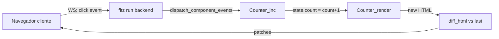

# C1 — Tu primer `.fitzv` (Counter component)

**Pre-requisitos**: M4 (HTTP first-class) cerrado — sabés
declarar `@get` handlers y correr un servidor con `fitz run`.
Si además viste M5 (WebSockets), mejor — vamos a usar un `@ws`
handler para conectar el frontend.

**Objetivo**: crear el "hola mundo" del frontend nativo: un
componente **Counter** que vive en un `.fitzv`, tiene state
(`count: Int`), 3 events (`inc`/`dec`/`reset`), y renderiza HTML
que se sirve con `fitz-liveviews`. Al hacer click en un botón
del navegador, el estado se actualiza en el servidor y el
cliente recibe un diff sobre WebSocket — cero JavaScript
manual, cero build step externo.

**Por qué importa**: Fitz post-v0.21.0 **NO es solo un lenguaje
de backend** — tiene su propia superficie de componentes
visuales, con extensión dedicada (`.fitzv`), parser + type
checker propios, LSP integrado, y dos backends de compilación
(SSR con `fitz-liveviews`, WASM opt-in). Este cap te muestra el
loop end-to-end mínimo.

---

## Qué vas a construir

Un contador clickeable — mismo caso que el "hola mundo" de Vue
o React, pero con arquitectura Fitz LiveViews:



- **`Counter.fitzv`** — el componente. State + events + template.
- **`main.fitz`** — HTTP GET `/` (sirve el shell inicial) + WS
  `/live/counter` (loop de eventos).
- **Estado autoritativo del servidor** — no hay `let count = 0`
  en el cliente. Cada click va al server, recomputa el estado,
  emite un patch.

📚 **Capítulo dedicado en la guía**: [cap 36 — Frontend nativo con `.fitzv`](../../guide.md#36-frontend-nativo-con-fitzv-sfc).

---

## Paso 1 — Setup del proyecto

Terminal:

```bash
fitz new mi-counter
cd mi-counter
```

Editá `fitz.toml` y agregá `fitz-liveviews` como dep (path
local a tu clone del repo `fitz-liveviews` — hasta que el
package registry aterrice, es dep por path):

```toml
[package]
name = "mi-counter"
version = "0.1.0"

[dependencies]
fitz_liveviews = { path = "../fitz-liveviews" }
```

Ajustá el path a donde tenés cloneado el repo. Si no lo tenés
todavía: `git clone https://github.com/Thegreekman76/fitz-liveviews.git`
al lado de `mi-counter/`.

---

## Paso 2 — Escribir `Counter.fitzv`

Creá `src/Counter.fitzv` con este contenido:

```fitzv
component Counter {
  state { count: Int = 0 }

  event inc() { count = count + 1 }
  event dec() { count = count - 1 }
  event reset() { count = 0 }

  <template>
    <div id="counter-app">
      <h1>Counter</h1>
      <p class="value">{count}</p>
      <div class="buttons">
        <button data-flv-click="dec">−</button>
        <button data-flv-click="reset">Reset</button>
        <button data-flv-click="inc">+</button>
      </div>
    </div>
  </template>

  <style scoped>
    #counter-app {
      font-family: system-ui, sans-serif;
      max-width: 20rem;
      margin: 4rem auto;
      text-align: center;
    }
    .value {
      font-size: 4rem;
      margin: 1rem 0;
      color: #CE412B;
    }
    .buttons button {
      padding: 0.5rem 1rem;
      margin: 0 0.25rem;
      font-size: 1.25rem;
      cursor: pointer;
    }
  </style>
}
```

**Anatomía del componente**:

- **`component Counter { ... }`** — bloque top-level. Un
  `.fitzv` puede declarar 1+ componentes.
- **`state { count: Int = 0 }`** — estado inicial. Tipo
  obligatorio, default obligatorio.
- **`event inc() { count = count + 1 }`** — handler de evento.
  `count` es un **bare state field name** que el emitter
  rewrite-a a `state.count` (regla de scoping — está explicada
  en cap 36 §3).
- **`<template>...</template>`** — HTML del componente.
  - `{count}` → interpolación del state field.
  - `data-flv-click="inc"` → wire el DOM click al event
    handler `inc`.
- **`<style scoped>`** — CSS scoped al componente (el emitter
  rewrite-a las class names para que no colisionen con otros
  components o CSS global).

---

## Paso 3 — Escribir `main.fitz` (HTTP + WS wire-up)

Creá `src/main.fitz`:

```fitz
from fitz_liveviews import Html, html, live_layout,
  html_response, LiveFrame, diff_html, component,
  dispatch_component_events, flv_register
from Counter import Counter, Counter_render,
  Counter_inc, Counter_dec, Counter_reset

let last_html: Str = ""

@get("/")
fn page() -> Response {
  let initial = component("Counter", "main")
  return html_response(live_layout(
    "/live/counter", "counter-app", initial
  ))
}

@ws("/live/counter")
async fn socket(ws: WsConn<LiveFrame>) {
  loop {
    let frame = ws.recv()?
    if (last_html == "") {
      last_html = component("Counter", "main").raw
    }
    let _handled = dispatch_component_events(frame)
    let new_html = component("Counter", "main").raw
    let patches = diff_html(last_html, new_html)
    ws.broadcast(LiveFrame {
      html: new_html,
      patches: patches
    })?
    last_html = new_html
  }
}

@server(3000)
fn main() => 0
```

**Anatomía del wire-up**:

- **`from Counter import Counter, Counter_render, Counter_inc,
  Counter_dec, Counter_reset`** — los nombres del type + fn
  render + una fn por cada event handler. El emitter SSR los
  sintetiza siguiendo la convención `<Component>_<name>`.
- **`component("Counter", "main")`** — runtime API de
  `fitz-liveviews`. Instancia el componente con instance ID
  `"main"` (un solo Counter global; para instancias
  per-usuario usaríamos algo como `component("Counter",
  user.id)`). Devuelve un `Html` renderizado.
- **`dispatch_component_events(frame)`** — el runtime routea
  el frame del WS al event handler correspondiente. **Cero
  event branches** en el WS handler — la lógica de events
  vive TODA en el `.fitzv`.
- **`diff_html(last, new)`** — computa un patch mínimo entre
  el HTML anterior y el nuevo. El cliente aplica el patch
  sobre el DOM local sin recargar.

---

## Paso 4 — Correr

```bash
fitz run
```

Deberías ver:

```
🏔️  Fitz HTTP escuchando en http://127.0.0.1:3000
   GET /
   WS  /live/counter
```

Abrí `http://127.0.0.1:3000/` en el navegador. Ves el contador
en `0`. Clickeá `+`, `−`, `Reset` — cada click viaja por WS,
el server actualiza el estado, y el cliente aplica el patch.

**Verificá con las DevTools**:

- Abrí la pestaña **Network** → filtro `WS`. Vas a ver un WS
  a `/live/counter` con frames por cada click.
- Cada frame tiene un payload `{"event": "inc", ...}` (el
  event fired) y como respuesta un `LiveFrame` con `patches`
  aplicables al DOM.

---

## Paso 5 — Editar en VSCode con LSP

Post-v0.21.3 (Phase 11.8), la extensión VSCode entiende
`.fitzv`. Probá:

- **Diagnostics** — cambiá `count: Int = 0` a `count: Int =
  "hola"` — VSCode subraya el default con error del type
  checker: "state field 'count' default 'hola' does not match
  declared type 'Int'". Sin correr `fitz check`.
- **Hover** — mové el cursor sobre `{count}` en el template.
  Aparece el tooltip: `count: Int — state field of Counter`.
- **Completions** — tipeá `{` dentro del template. Aparecen
  los directivas (`#if`, `#for`, ...) y los state field names
  (`count`).
- **Go-to-def** — F12 sobre `count` en `count = count + 1`
  del event body. Salta a la línea del state block donde
  está declarado.

📚 **Capítulo dedicado en la guía**: [cap 22 — Soporte para editores](../../guide.md#22-soporte-para-editores)
(sección "En archivos `.fitzv`").

---

## Validación del capítulo

Cerrá el servidor con Ctrl+C. Verificá:

- **`fitz check`** verde:

  ```bash
  fitz check
  # ✓ mi-counter/src/main.fitz — no type errors
  ```

- **Ejemplo commiteable** en `examples/curso/m9-frontend/counter/`
  (ejemplo del repo Fitz, ver el link al final del cap).

## Troubleshooting

| Síntoma | Causa probable | Fix |
|---|---|---|
| `Error — module 'Counter' not found` | El binario `fitz` es de una versión pre-v0.21.0 (no reconoce `.fitzv`) | Actualizá a `fitz --version` ≥ v0.21.0 |
| `Error — module 'fitz_liveviews' not found` | El `fitz.toml` no tiene la dep, o el path está mal | Verificá la sección `[dependencies]` |
| Click no hace nada, no aparecen frames WS | Puede haber un adblocker interceptando el WS, o el `live_layout` no está inyectando el client runtime | Abrí DevTools → Console y buscá errores JS |
| `count` no se refresh-a al hacer click | El WS handler no está en un `loop { ... }` | Verificá que `main.fitz` tenga el loop dentro del `@ws` handler |

## Qué sigue

- **[C2 — Template DSL: interpolación, directivas, composición](c2-template-dsl.md)** —
  las 5 features del template que este cap tocó por arriba: `{expr}`,
  `{#if}`, `{#for}`, `data-flv-*` attrs, `<Child prop="v" />`.

- Explorá el **ejemplo runnable oficial** en
  [`fitz-liveviews/examples/counter/`](https://github.com/Thegreekman76/fitz-liveviews/tree/main/examples/counter)
  — es el mismo pattern con detalles adicionales (favicon,
  page title, meta viewport).
