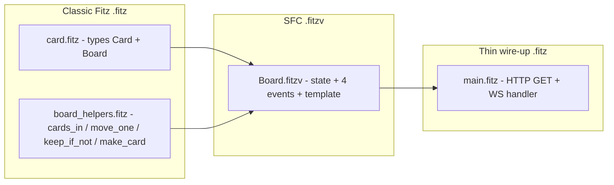

# C3 — Full-page SFC: Board.fitzv migration del kanban

**Pre-requisitos**: [C2 — Template DSL](c2-template-dsl.md) —
sabés los 5 features del template. Idealmente también M5.C2
(WebSockets tipados) para el pattern de real-time.

**Objetivo**: aplicar los `.fitzv` a una app **real y no
trivial** — la migración del kanban board a un full-page SFC.
Vas a ver el **pattern canónico** de architecture:

- **`.fitz` classic** para tipos + helpers puros (no tocan
  frontend).
- **`.fitzv`** para el componente full-page (state + events +
  template).
- **`main.fitz`** para el HTTP + WS thin wire-up (~30 LoC, ZERO
  event branches).

**Por qué importa**: los ejemplos de C1 (Counter) y C2
(TodoList) son "juguetes". El kanban es el mismo pattern
escalado — 4 event handlers, template con directivas anidadas,
state con `List<Card>` custom + `next_id` counter, y edge
cases reales (creación con auto-ID, filter por columna,
delete). Este cap es el **acceptance criterion** de que Fitz
LiveViews sirve para apps reales.

**Contexto**: la migración Board.fitzv del kanban de
`fitz-liveviews` fue el **driver concreto** para muchos de los
fixes shipped en v0.21.1 (K-3 remainder — interpolated props)
y v0.21.2 (S.1 aliases, S.2 Map static props, S.3 type-check
interpolated). Este cap te muestra el fruto de todo ese trabajo.

---

## Arquitectura del kanban



**4 archivos, cada uno con una responsabilidad clara**:

| Archivo | Responsabilidad | Tamaño |
|---|---|---|
| `card.fitz` | Tipos `Card` + `Board` (schema del dominio) | ~15 LoC |
| `board_helpers.fitz` | Helpers puros: filtro `cards_in`, mutador `move_one`, factory `make_card` | ~50 LoC |
| `Board.fitzv` | Componente full-page: state, 4 events, template con 3 columnas | ~130 LoC |
| `main.fitz` | HTTP GET (initial render) + WS handler (0 event branches) | ~30 LoC |

**Total ~225 LoC**. Compará contra la versión pre-migration
(Phase 8.5 partial) que tenía ~395 LoC en `main.fitz` solo,
con 5 helpers top-level + 4 event branches inline en el WS
handler.

---

## Paso 1 — `card.fitz` (tipos del dominio)

```fitz
type Card {
  id: Str
  title: Str
  author: Str
  column: Str
}

type Board {
  cards: List<Card>
  next_id: Int
}
```

Cero magia — es Fitz classic. Los tipos van acá (no en el
`.fitzv`) para que **ambos** el `.fitzv` Y `main.fitz` los
puedan importar.

---

## Paso 2 — `board_helpers.fitz` (helpers puros)

```fitz
from card import Card

fn cards_in(all: List<Card>, col: Str) -> List<Card> {
  return all.filter(fn(c) => c.column == col)
}

fn keep_if_not(target_id: Str, c: Card) -> Bool {
  return c.id != target_id
}

fn move_one(target_id: Str, direction: Str, c: Card) -> Card {
  if (c.id != target_id) { return c }
  let new_col = if (direction == "right") {
    next_column(c.column)
  } else {
    prev_column(c.column)
  }
  return Card {
    id: c.id, title: c.title, author: c.author,
    column: new_col
  }
}

fn next_column(current: Str) -> Str {
  if (current == "todo") { return "in_progress" }
  if (current == "in_progress") { return "done" }
  return current
}

fn prev_column(current: Str) -> Str {
  if (current == "done") { return "in_progress" }
  if (current == "in_progress") { return "todo" }
  return current
}

fn make_card(id: Str, title: Str, author: Str) -> Card {
  return Card {
    id: id, title: title, author: author, column: "todo"
  }
}
```

Cero conocimiento del frontend. **Todas las fns son puras** —
input → output, sin side effects, sin knowledge del runtime
LiveViews. Este file es 100% testeable con `fitz test` sin
mocks.

**Por qué `.fitz` classic y no dentro del `.fitzv`**: el
view parser NO acepta declaraciones `fn` top-level dentro del
`.fitzv` — solo `component { ... }` blocks + `from ... import
... `. Este es un **límite del design** que empuja a la
separación de responsabilidades — bueno.

---

## Paso 3 — `Board.fitzv` (SFC full-page)

```fitzv
from card import Card
from board_helpers import cards_in, keep_if_not, move_one, make_card

component Board {
  state {
    cards: List<Card> = []
    next_id: Int = 1
  }

  event create_card() {
    if (payload.has("title")) {
      if (payload.has("author")) {
        let id_str = "{next_id}"
        let title = payload["title"]
        let author = payload["author"]
        cards.push(make_card(id_str, title, author))
        next_id = next_id + 1
      }
    }
  }

  event move_right() {
    if (payload.has("card_id")) {
      let target_id = payload["card_id"]
      cards = cards.map(fn(c) => move_one(target_id, "right", c))
    }
  }

  event move_left() {
    if (payload.has("card_id")) {
      let target_id = payload["card_id"]
      cards = cards.map(fn(c) => move_one(target_id, "left", c))
    }
  }

  event delete_card() {
    if (payload.has("card_id")) {
      let target_id = payload["card_id"]
      cards = cards.filter(fn(c) => keep_if_not(target_id, c))
    }
  }

  <template>
    <div id="kanban-app">
      <h1>Fitz LiveViews Kanban</h1>

      <form data-flv-submit="create_card">
        <input name="title" placeholder="Title" required data-flv-clear />
        <input name="author" placeholder="Author" required />
        <button type="submit">Add Card</button>
      </form>

      <div class="board">
        <section class="column">
          <h2>To Do <span class="count">({cards_in(cards, "todo").len()})</span></h2>
          <ul>
            {#for c in cards_in(cards, "todo")}
              <li>
                <div>{c.title}</div>
                <div>- {c.author}</div>
                <button data-flv-click="move_right"
                        data-flv-value-card_id="{c.id}">→</button>
                <button data-flv-click="delete_card"
                        data-flv-value-card_id="{c.id}">×</button>
              </li>
            {/for}
          </ul>
        </section>

        <section class="column">
          <h2>In Progress <span class="count">({cards_in(cards, "in_progress").len()})</span></h2>
          <ul>
            {#for c in cards_in(cards, "in_progress")}
              <li>
                <div>{c.title}</div>
                <div>- {c.author}</div>
                <button data-flv-click="move_left"
                        data-flv-value-card_id="{c.id}">←</button>
                <button data-flv-click="move_right"
                        data-flv-value-card_id="{c.id}">→</button>
                <button data-flv-click="delete_card"
                        data-flv-value-card_id="{c.id}">×</button>
              </li>
            {/for}
          </ul>
        </section>

        <section class="column">
          <h2>Done <span class="count">({cards_in(cards, "done").len()})</span></h2>
          <ul>
            {#for c in cards_in(cards, "done")}
              <li>
                <div>{c.title}</div>
                <div>- {c.author}</div>
                <button data-flv-click="move_left"
                        data-flv-value-card_id="{c.id}">←</button>
                <button data-flv-click="delete_card"
                        data-flv-value-card_id="{c.id}">×</button>
              </li>
            {/for}
          </ul>
        </section>
      </div>
    </div>
  </template>
}
```

**Puntos clave del SFC**:

- **State compuesto** — `cards: List<Card>` + `next_id: Int`.
- **`event create_card()`** — el shape más interesante. Lee del
  payload (`payload["title"]`, `payload["author"]`), computa un
  `id_str` con string interpolation (`"{next_id}"`), llama a la
  imported fn `make_card(...)` (funciona por K-4), muta el
  state via `cards.push(...)` (funciona por §9.cc V-6 —
  bare method call on shadow-local).
- **`event move_right()`** — reasigna el state field
  (`cards = cards.map(...)`) — el emitter reconoce la
  reasignación y la lowering-a al patrón shadow-local + return
  struct literal.
- **Template con 3 columnas** — cada una usa `cards_in(cards,
  "todo")` (imported fn call INSIDE template interpolation —
  funciona por K-4). El `{#for c in ...}` binding shadow-ea
  al state field `cards` para el body.

---

## Paso 4 — `main.fitz` (HTTP + WS wire-up)

```fitz
from fitz_liveviews import Html, html, live_layout,
  html_response, LiveFrame, diff_html, component,
  dispatch_component_events, flv_register
from card import Card, Board
from Board import Board_render, Board_create_card,
  Board_move_right, Board_move_left, Board_delete_card

let last_board_html: Str = ""

@get("/")
fn kanban_page() -> Response {
  let initial = component("Board", "main")
  return html_response(live_layout(
    "/live/kanban", "kanban-app", initial
  ))
}

@ws("/live/kanban")
async fn kanban_socket(ws: WsConn<LiveFrame>) {
  loop {
    let frame = ws.recv()?
    if (last_board_html == "") {
      last_board_html = component("Board", "main").raw
    }
    let _handled = dispatch_component_events(frame)
    let new_html = component("Board", "main").raw
    let patches = diff_html(last_board_html, new_html)
    ws.broadcast(LiveFrame {
      html: new_html, patches: patches
    })?
    last_board_html = new_html
  }
}

@server(3000)
fn main() => 0
```

**Comparación pre / post migration**:

| Aspecto | Pre-migration (Phase 8.5 partial) | Post-migration (Session A + B) |
|---|---|---|
| `main.fitz` tamaño | ~395 LoC | ~30 LoC |
| Fns top-level en main | 5 helpers | 0 |
| Event branches en WS | 4 `if (frame.event == "...")` | 0 |
| State (`let board`) | Top-level en main | Adentro del SFC |
| Testeable con `fitz test` | Solo helpers | Todo (helpers + SFC via componentes de test) |

**El WS handler tiene ZERO event branches** — toda la lógica
del kanban vive en `Board.fitzv`. Cambiar UN evento del
kanban NO toca `main.fitz`. Cambiar cómo se sirve la initial
page NO toca `Board.fitzv`.

---

## Correr + probar

```bash
fitz run
# → http://127.0.0.1:3000/
```

Abrí **dos ventanas del navegador** en la misma URL. En una:

1. Escribí "Comprar leche" + tu nombre → **Add Card**.
2. La otra ventana **actualiza automático** — patches WS.
3. Movés la card a "In Progress" con `→`.
4. La otra ventana refleja el cambio.
5. Delete la card con `×`.
6. Ambas ventanas se actualizan.

Estado **compartido en el servidor**, broadcast a todos los
clientes conectados por WS. Este es el pattern de "Google
Docs" — colaboración multi-usuario sin cliente-side state.

---

## Known limitations

- **CardEditor inline** — el kanban original tenía un botón
  "edit" per card que abría un input inline para renombrar el
  título. Este pattern requiere componer `<CardEditor
  card_id="{c.id}" />` DENTRO del `{#for c in cards}` loop —
  dynamic child composition inside directives — que es
  **Phase 11.7+ scope** (memoria). Post-migration cards son
  title-immutable hasta que Phase 11.7 aterrice.

- **Drag & drop** — mover cards clickeando ← → funciona; drag
  entre columnas requiere client-side WASM (Phase 11.7+).

---

## Validación del módulo

Este cap C3 es el **entregable final del M9**. Al terminarlo
deberías poder:

- Explicar por qué el kanban split-eó en 4 archivos.
- Reconocer el pattern "types en `.fitz` + helpers puros en
  `.fitz` + SFC en `.fitzv` + wire-up thin en `main.fitz`" y
  aplicarlo a otras apps.
- Correr Board.fitzv en dos ventanas + ver el broadcast WS.

## Qué sigue

- El **repo `fitz-liveviews`** tiene 4 examples completos que
  usan patterns adicionales:
  - `counter/` — cap C1 en su forma canónica.
  - `dashboard/` — SFC con métricas en tiempo real via `@cron`.
  - `chat/` — multi-user chat con `component(name, id)` per
    usuario.
  - `kanban/` — este cap, con más CSS + detalles UX.

- **Phase 11.7 (client-side dynamic capabilities + kanban SPA
  port)** — cuando aterrice, el kanban ganará drag & drop +
  inline card editor + WASM offline. Este cap C3 se
  actualizará con el CardEditor migrado.

- **Companion UI library** (post-11.9) — components reusables
  (Button, Card, Form, Grid) con el mismo pattern del
  Board.fitzv. Anotado en el roadmap.
