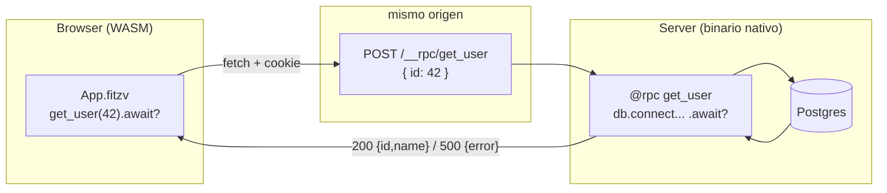

# C4 — `@rpc`: funciones de servidor fullstack

**Pre-requisitos**: [C3 — Full-page SFC](c3-full-page-sfc.md) —
sabés armar un `.fitzv` con state + events + template y compilarlo a
WASM. Idealmente también M4 (HTTP nativo) y M6 (ORM) para entender qué
puede hacer una fn del lado server.

**Objetivo**: cerrar el loop fullstack. Vas a llamar una función que
corre **en el server** (con acceso a DB, auth, secrets) **directo desde
el `.fitzv`** que corre en el navegador — como si fuera una llamada
local. Sin escribir un handler HTTP, sin `fetch`, sin marshaling JSON a
mano.

**Por qué importa**: hasta acá tu `.fitzv` era una isla en el browser.
Podía tener estado y reaccionar a clicks, pero cualquier cosa "real"
—leer la base, verificar un token— vive en el server, y el puente
clásico es plomería: un endpoint, un `fetch`, y parsear el JSON de ida
y de vuelta. Fitz borra las tres cosas con **un decorator**: `@rpc`.

**Contexto**: `@rpc` es la Fase 11.11 del roadmap, shipped en v0.30.0.
Es una feature del **compilador** (no del runtime `fitz-liveviews`): el
compilador genera las dos mitades —server + client— desde una sola
declaración, con tipos de punta a punta.

---

## El patrón "server functions"

No es una idea nueva: Next.js (Server Actions), Remix (loaders/actions),
SvelteKit (`+page.server`), tRPC y Phoenix lo popularizaron. La
diferencia es cuánta infraestructura pedís:

| Enfoque | Qué escribís vos | Deps externas | Tipos back↔front |
|---|---|---|---|
| `fetch` + handler a mano | endpoint + fetch + JSON glue | — | vos los mantenés |
| tRPC (TS) | router + procedure + client | `@trpc/*` | inferidos (mismo lenguaje) |
| Next Server Actions | `"use server"` + bundler magic | framework | inferidos |
| **Fitz `@rpc`** | **una `async fn` marcada** | **ninguna** | **el mismo `type` compartido** |

En Fitz la fn y el tipo `User` viven **una vez** en un `.fitz` classic;
el server los compila a un binario nativo, el client los compila a WASM,
y comparten la definición. Cero drift.



---

## Paso 1 — `api.fitz` (las funciones de servidor)

Cada `@rpc async fn` es una función normal de Fitz: puede tocar la DB,
llamar `jwt.decode`, leer un `secret()`. Lo único especial es el
decorator.

```fitz
type User {
  id: Int
  name: Str
}

@rpc
async fn greet(name: Str) -> Result<Str> {
  return Ok("Hello, {name}!")
}

@rpc
async fn get_user(id: Int) -> Result<User> {
  if (id == 42) {
    return Ok(User { id: 42, name: "Ada" })
  }
  return Err("no user with id {id}")
}
```

**Reglas** (las valida el checker, así que un error acá te lo marca
`fitz check`):

- `@rpc` es un decorator **pelado** — sin args ni kwargs.
- La fn debe ser **`async`** (corre I/O del lado server, y su stub del
  lado client es un `fetch` async).
- Debe devolver **`Result<T>`** — el éxito viaja como el JSON de `T`, y
  el error como `{"error": "..."}`.
- **No** se combina con `@get`/`@post`/`@ws`/`@cron`/`@background`/
  `@auth_provider` — una `@rpc` fn ya genera su propio endpoint.

> En una app real, `get_user` haría
> `User.where(fn(u) => u.id == id).first(conn).await` contra Postgres
> (M6). Acá la hardcodeamos para que el ejemplo corra sin base.

## Paso 2 — `server.fitz` (el binario del server)

Importás las `@rpc` fns y arrancás el server. Con solo importarlas se
montan las rutas `POST /__rpc/greet` y `POST /__rpc/get_user`.

```fitz
from api import greet, get_user

@server(3838) fn main() => 0
```

Eso es todo del lado server. El compilador se encarga del handler,
la deserialización del body, y el mapeo `Result<T>` → 200/500.

## Paso 3 — `App.fitzv` (el cliente que las llama)

Importás las fns desde el `.fitz` hermano y las llamás con `.await?`
dentro de un event handler, como si fueran locales.

```fitz
from api import greet, get_user, User

component App {
  state {
    who: Str = "world"
    message: Str = "(click para pedir al server)"
    user_name: Str = "(ninguno)"
  }

  event load_greeting() {
    let m = greet(who).await?
    message = m
  }

  event load_user() {
    let u = get_user(42).await?
    user_name = u.name
  }

  <template>
    <div>
      <p>{message}</p>
      <p>User: {user_name}</p>
      <button @click="load_greeting">Greet</button>
      <button @click="load_user">Cargar usuario 42</button>
    </div>
  </template>
}
```

**Detalle importante**: un tipo nominal que **cruza el cable** (acá
`User`, el return de `get_user`) se importa también en el `.fitzv`
(`from api import ..., User`), para que el cliente tenga su struct.
Los primitivos (`Str`, `Int`) no necesitan import.

## Paso 4 — `fitz.toml` (dos bins: server + web)

```toml
[package]
name = "rpc-demo"
version = "0.1.0"
edition = "2024"

[[bin]]
name = "server"
main = "server.fitz"

[[bin]]
name = "web"
main = "App.fitzv"
target = "wasm-client"
mount = "#app"
```

---

## Qué genera el compilador

Esto es lo que hace `@rpc` invisible-pero-tipado. **No tenés que
escribir nada de esto** — es el output del `fitz build`.

**Server half** (`fitz build --bin server`):

- Monta `POST /__rpc/greet` y `POST /__rpc/get_user`.
- El body es un objeto JSON con un campo por parámetro
  (`{"id": 42}`); cada param se deserializa de su campo.
- Corre la fn y mapea su `Result<T>`: Ok → `200` + el JSON de `T`,
  Err → `500` + `{"error": "..."}`.
- Reusa toda la cadena de `@post` (observability, panic-catch, ...).

**Client half** (`fitz build --bin web --target wasm-client`):

- La `@rpc` fn importada se emite como un **stub `fetch` async** — su
  cuerpo (server-side) **no** se transpila al WASM.
- El stub serializa los args a un objeto JSON, POSTea al **mismo
  origen** (la cookie de sesión viaja sola), y mapea la respuesta a
  `Result<T>`.
- El event handler que hace `.await?` se **parte automáticamente** en
  un wrapper sync + un worker async (`spawn_local`), así que el estado
  se actualiza y el componente **re-renderiza cuando llega la
  respuesta**.

---

## Correr + probar

```bash
# 1. build + arrancar el server (monta /__rpc/* en :3838)
fitz build --bin server
./target/release/rpc-demo          # (o el binario que produzca)

# 2. build del cliente a WASM
fitz build --bin web               # → target/wasm/web/{web.js, web_bg.wasm}
```

El `fetch` del stub apunta a `/__rpc/...` **relativo**, así que la
página tiene que servirse desde el **mismo origen** que el server. En
producción: que el server sirva el bundle estático, o poné los dos
detrás de un reverse proxy. En dev, un proxy chico que sirva
`index.html` + los `.wasm` y reenvíe `/__rpc/*` al `:3838` alcanza.

Abrí la página, clickeá los botones: el saludo y el nombre del usuario
llegan del server y se renderizan. Ese es el round-trip completo —
click → `fetch` → fn del server → JSON → state → re-render — sin una
línea de plomería.

> El ejemplo runnable completo está en
> [`examples/view/rpc/`](https://github.com/Thegreekman76/fitz/tree/main/examples/view/rpc)
> (`api.fitz` + `server.fitz` + `App.fitzv` + `fitz.toml`).

---

## Known limitations (MVP v0.30.0)

- **Nominales del cable se importan al `.fitzv`** — si una `@rpc` fn
  devuelve o recibe un `type`, importalo también en el cliente
  (`from api import ..., User`).
- **Auth apilable** (`@authenticated`/`@admin` sobre el endpoint
  generado) es refinamiento post-MVP. Por ahora, la cookie de sesión
  same-origin es lo que viaja con el request — verificás el token
  dentro del cuerpo de la `@rpc` fn.
- **Re-render único**: el componente se re-renderiza una vez, cuando
  llega la respuesta. Un flash de "cargando…" a mitad de camino es un
  slice posterior de reactividad fine-grained (signals).
- **`Map<K, V>` en el payload** serializa como array de pares (no como
  objeto JSON). Para el 90% de los casos (primitivos + nominales de
  campos primitivos) andás sin tocarlo.

---

## Validación del módulo

Este cap C4 es el **entregable final del M9**. Al terminarlo deberías
poder:

- Explicar qué genera `@rpc` de cada lado (endpoint POST + stub fetch).
- Escribir una `@rpc async fn` que respete las reglas del checker
  (pelada, async, `Result<T>`).
- Llamarla desde un `.fitzv` con `.await?` y entender por qué el
  handler se vuelve async (`spawn_local`).
- Reconocer que el mismo `type` compartido entre `api.fitz` y el
  `.fitzv` elimina el doble tipado back/front.

## Qué sigue

- **`examples/view/rpc/`** — el ejemplo de este cap, listo para
  `fitz build`.
- **Hidratación SSR → client (Fase 11.12)** — cuando aterrice, un mismo
  `.fitzv` rinde SSR (first paint, SEO) y el runtime client-WASM toma
  control del DOM existente en vez de re-crearlo, restaurando el estado
  que el server serializó (incluyendo resultados de `@rpc`).
- **Reactividad fine-grained (signals, Fase 11.10)** — habilita el
  flash de "cargando…" a mitad de un `@rpc` + arregla el caret de los
  inputs de texto en vivo.
