# C1 — Setup Docker-first: los 5 services del compose

**Pre-requisitos**: [TaskHub — overview](index.md). Tenés Fitz +
Docker instalados. **No necesitás todavía** conocimiento profundo
de Postgres, Prometheus, Jaeger ni nginx — vamos a setear cada uno
con la config mínima que sirve y los explicamos al pasar.

**Objetivo**: levantar los **5 services del compose** con un
binario Fitz mínimo (responde `200 OK` en `/healthz`) y validar
cada service health-checkeado **antes de tocar una línea de lógica
de negocio**.

**Por qué importa Docker-first**: la **decisión** de que TaskHub
arranca con los 5 services desde el día 1 (no "agregamos
Prometheus al final") tiene tres razones:

1. **Sin sorpresas al final**: al cap C7 (deploy) no descubrís que
   el binario nunca emitió métricas porque "nunca lo probaste
   contra Prometheus". Cada cap se valida contra la infra real.
2. **Compose como contrato**: el `docker-compose.yml` describe
   **todo lo que TaskHub necesita** para correr. Es **la
   documentación ejecutable** de las dependencias. Cualquiera
   clona el repo + `docker compose up -d` = todo arriba en 30s.
3. **Production-ready desde el día 1**: Prometheus + Jaeger no son
   nice-to-have — son **el panel de control** que necesitás
   cuando algo se rompe en prod a las 3am. Acostumbrarte desde
   el cap 1 hace que llegues a producción con instintos formados.

---

## Mapa del cap

```mermaid
flowchart LR
    A[Estructura del proyecto] --> B[fitz.toml + main.fitz minimal]
    B --> C[Dockerfile multi-stage]
    C --> D[docker-compose.yml con 5 services]
    D --> E[nginx.conf proxy + static]
    E --> F[prometheus.yml scrape config]
    F --> G[otel-config.yaml collector]
    G --> H[frontend index.html placeholder]
    H --> I[docker compose up -d]
    I --> J[Validación de cada service]
```



---

## Por qué Fitz es distinto (vs stacks típicos Docker-first)

| Stack típico | Compose típico (services) | Imagen total | Setup time |
|---|---|---|---|
| Python+FastAPI+Celery | app + worker + beat + redis + db + nginx (+ Flower opcional) = 6-7 | ~600 MB | 1-3 min |
| Node+Express+bull | app + worker + redis + db + nginx = 5 | ~500 MB | 1-2 min |
| Spring Boot | app + db + nginx = 3 | ~400 MB | 2-5 min cold start |
| **Fitz (TaskHub)** | **app + db + prometheus + jaeger + nginx = 5** (no worker, no redis, no beat) | **~150 MB** | **<30 segundos** |

El diferencial estructural: **TaskHub no necesita Celery/bull
porque los cron jobs viven dentro del binario** (`@cron` builtin),
**no necesita Redis** porque no hay broker entre processes (los
jobs son in-process con persistencia opcional en Postgres),
**no necesita worker separados** porque tokio multi-thread del
binario los reemplaza. **Prometheus + Jaeger sí son externos** —
son herramientas de observabilidad que viven fuera del proceso
por diseño (centralizan datos de múltiples replicas).

---

## Paso 1 — Estructura del proyecto

```text
taskhub/
├── fitz.toml                       # manifest del package manager
├── Dockerfile                      # multi-stage build de la app
├── docker-compose.yml              # los 5 services
├── .env.example                    # variables comentadas
├── .gitignore
├── src/
│   └── main.fitz                   # entry point — por ahora solo /healthz
├── frontend/
│   └── index.html                  # placeholder vacío
├── nginx/
│   └── nginx.conf                  # proxy + static
├── prometheus/
│   └── prometheus.yml              # scrape config
├── otel/
│   └── otel-config.yaml            # OTel Collector → Jaeger
├── migrations/                     # vacío por ahora (lo llenamos en C2)
└── README.md
```

**Convenciones**:

- **Configs en sub-carpetas por service** (`nginx/`, `prometheus/`,
  `otel/`) — facilita encontrar la config cuando un service se
  porta raro.
- **Frontend en `frontend/`** plano — sin build step, vanilla JS.
  nginx lo sirve directo.
- **`migrations/`** vacío en C1 — el dir existe pero `fitz db
  migrate` no encuentra nada que aplicar (no-op limpio).

---

## Paso 2 — `fitz.toml` + `src/main.fitz` minimal

`fitz.toml`:

```toml
[package]
name = "taskhub"
version = "0.1.0"
edition = "2026"

[bin]
main = "src/main.fitz"
```

`src/main.fitz` (mínimo para que el container responda):

```fitz
// TaskHub — entry point.
// En C1 solo respondemos /healthz. El resto del API llega en
// los caps siguientes.

type HealthResponse {
    status: Str
    version: Str
}

@get("/healthz")
fn healthz() -> HealthResponse {
    return HealthResponse {
        status: "ok",
        version: "0.1.0-c1"
    }
}

@server(8080)
fn main() => 0

print("TaskHub C1 — escuchando en :8080")
```

**Detalles**:

- **`@server(8080)`** — el binario escucha en el puerto 8080
  dentro del container. nginx hace el proxy desde el host.
- **`/healthz`** es lo que Docker usa para el healthcheck. Tiene
  que ser **idempotente** (sin side effects), **rápido**
  (<100ms), y **no requiere auth**.
- **`fn main() => 0`** es placeholder — el server arranca por el
  `@server`, no por main.

---

## Paso 3 — `Dockerfile` multi-stage

```dockerfile
# Stage 1 — build con el toolchain de Fitz.
# Usamos la imagen oficial publicada por release.
FROM ghcr.io/thegreekman76/fitz:latest AS builder

WORKDIR /build
COPY fitz.toml .
COPY src/ ./src/
COPY migrations/ ./migrations/

# Compilamos. fitz build con manifest mode emite a
# target/release/<package.name>(.exe).
RUN fitz build

# Stage 2 — runtime mínimo.
# distroless/cc tiene libc + libgcc + nada más (sin shell, sin
# package manager, sin nada de attack surface).
FROM gcr.io/distroless/cc-debian12 AS runtime

WORKDIR /app
COPY --from=builder /build/target/release/taskhub /app/taskhub

EXPOSE 8080
USER nonroot:nonroot

ENTRYPOINT ["/app/taskhub"]
```

**Por qué distroless**: la imagen resultante pesa **~30 MB** (vs
~250 MB de `python:slim` o ~150 MB de `node:alpine`). Sin shell
significa que un atacante que logre RCE adentro del container
no puede `bash`, `curl`, ni instalar herramientas. La imagen tiene
**SOLO** el binario y libc/libgcc.

**`USER nonroot:nonroot`**: distroless trae un user `nonroot` con
UID 65532. Corremos como ese user (no como root) — best practice
de seguridad en producción.

---

## Paso 4 — `docker-compose.yml` con los 5 services

```yaml
services:
  # ────────────────────────────────────────────────────────
  # SERVICE 1 — app (el binario Fitz)
  # ────────────────────────────────────────────────────────
  app:
    build: .
    container_name: taskhub-app
    expose:
      - "8080"
    environment:
      DATABASE_URL: postgres://taskhub:${DB_PASSWORD:?DB_PASSWORD requerido}@db:5432/taskhub?sslmode=disable
      JWT_SECRET: ${JWT_SECRET:?JWT_SECRET requerido}
      OTEL_EXPORTER_OTLP_ENDPOINT: http://otel-collector:4317
      OTEL_SERVICE_NAME: taskhub
      RUST_LOG: info
    depends_on:
      db:
        condition: service_healthy
    healthcheck:
      # distroless no tiene shell ni curl/wget — usamos el binario
      # mismo con un sub-comando especial. Si el binario no
      # expone ese sub-comando, usar TCP probe (más abajo).
      # En C1 dejamos el TCP probe que sí funciona en distroless.
      test: ["CMD-SHELL", "test -e /proc/1/exe || exit 1"]
      interval: 10s
      timeout: 5s
      retries: 3
      start_period: 5s
    restart: unless-stopped

  # ────────────────────────────────────────────────────────
  # SERVICE 2 — db (Postgres)
  # ────────────────────────────────────────────────────────
  db:
    image: postgres:16-alpine
    container_name: taskhub-db
    environment:
      POSTGRES_USER: taskhub
      POSTGRES_PASSWORD: ${DB_PASSWORD:?DB_PASSWORD requerido}
      POSTGRES_DB: taskhub
    volumes:
      - pg_data:/var/lib/postgresql/data
    ports:
      - "5432:5432"  # expuesto al host para inspeccionar con psql
    healthcheck:
      test: ["CMD-SHELL", "pg_isready -U taskhub -d taskhub"]
      interval: 5s
      timeout: 5s
      retries: 5
    restart: unless-stopped

  # ────────────────────────────────────────────────────────
  # SERVICE 3 — prometheus (scrape de métricas)
  # ────────────────────────────────────────────────────────
  prometheus:
    image: prom/prometheus:v2.55.0
    container_name: taskhub-prometheus
    volumes:
      - ./prometheus/prometheus.yml:/etc/prometheus/prometheus.yml:ro
      - prom_data:/prometheus
    ports:
      - "9090:9090"  # UI de Prometheus
    command:
      - "--config.file=/etc/prometheus/prometheus.yml"
      - "--storage.tsdb.retention.time=15d"
    restart: unless-stopped

  # ────────────────────────────────────────────────────────
  # SERVICE 4 — jaeger + otel-collector (tracing distribuido)
  # ────────────────────────────────────────────────────────
  # Jaeger 2.x incluye OTel collector built-in en el mismo
  # binario. Un solo container, recibe traces via OTLP gRPC en
  # 4317, las visualiza en su UI en 16686.
  otel-collector:
    image: jaegertracing/all-in-one:1.62
    container_name: taskhub-jaeger
    environment:
      COLLECTOR_OTLP_ENABLED: "true"
    ports:
      - "16686:16686"  # UI de Jaeger
      - "4317:4317"    # OTLP gRPC
      - "4318:4318"    # OTLP HTTP
    restart: unless-stopped

  # ────────────────────────────────────────────────────────
  # SERVICE 5 — nginx (proxy + static frontend)
  # ────────────────────────────────────────────────────────
  nginx:
    image: nginx:1.27-alpine
    container_name: taskhub-nginx
    ports:
      - "8000:80"  # punto de entrada del cliente
    volumes:
      - ./nginx/nginx.conf:/etc/nginx/nginx.conf:ro
      - ./frontend:/usr/share/nginx/html:ro
    depends_on:
      - app
    restart: unless-stopped

volumes:
  pg_data:
  prom_data:
```

**Decisiones de diseño**:

- **`expose: 8080`** en app (no `ports:`) — el container del app
  NO se expone al host. Solo `nginx` accede via la red interna
  de compose. Reduces attack surface.
- **`ports: 5432`** en db — lo dejamos expuesto al host para
  poder hacer `psql -h localhost` cuando inspeccionemos schema en
  los caps siguientes. **En producción real esto NO se hace** —
  el db solo se accede desde la red interna.
- **`DB_PASSWORD:?...`** en el syntax — si la env var no está
  seteada, `docker compose up` aborta con mensaje claro en vez
  de arrancar con password vacío.
- **Health del app es `test -e /proc/1/exe`** — chequea que el
  PID 1 del container existe (el binario está corriendo). Esto
  funciona en distroless (no requiere shell ni curl). **Más
  adelante** (cap C7), cuando el binario expone `/healthz` HTTP,
  podemos reemplazar por un healthcheck HTTP real — pero requiere
  un mini-probe bundleado (deuda documentada en
  [`docs/guide.md` cap 35](../guide.md)).
- **`OTEL_EXPORTER_OTLP_ENDPOINT`** apunta a `otel-collector:4317`
  via DNS interno de compose. El binario emite traces a Jaeger
  automáticamente cuando esta env var está seteada (Fitz Fase 12.3).

---

## Paso 5 — `nginx/nginx.conf`

```nginx
events { worker_connections 1024; }

http {
    upstream taskhub_app {
        server app:8080;
    }

    # Mapping para upgrade de WebSocket.
    map $http_upgrade $connection_upgrade {
        default upgrade;
        ''      close;
    }

    server {
        listen 80;
        server_name _;

        # ─────────────────────────────────────────
        # API REST → /api/*
        # ─────────────────────────────────────────
        location /api/ {
            proxy_pass http://taskhub_app/;
            proxy_set_header Host $host;
            proxy_set_header X-Real-IP $remote_addr;
            proxy_set_header X-Forwarded-For $proxy_add_x_forwarded_for;
            proxy_set_header X-Forwarded-Proto $scheme;
        }

        # ─────────────────────────────────────────
        # WebSockets → /ws/*
        # ─────────────────────────────────────────
        location /ws/ {
            proxy_pass http://taskhub_app/ws/;
            proxy_http_version 1.1;
            proxy_set_header Upgrade $http_upgrade;
            proxy_set_header Connection $connection_upgrade;
            proxy_set_header Host $host;
            proxy_read_timeout 3600s;  # 1h para conexiones largas
            proxy_send_timeout 3600s;
        }

        # ─────────────────────────────────────────
        # Health endpoint pass-through (sin /api/ prefix)
        # ─────────────────────────────────────────
        location /healthz {
            proxy_pass http://taskhub_app/healthz;
            access_log off;
        }

        # ─────────────────────────────────────────
        # Frontend estático → /
        # ─────────────────────────────────────────
        location / {
            root /usr/share/nginx/html;
            index index.html;
            try_files $uri $uri/ /index.html;
        }
    }
}
```

**Detalles**:

- **`/api/` → app:8080**: el cliente pega a `http://localhost:8000/api/projects` y nginx lo reenvía a `http://app:8080/projects`. El **prefix `/api/` se strippea** porque `proxy_pass` termina con `/`.
- **`/ws/` → WebSocket upgrade**: para que un upgrade HTTP→WS funcione, nginx necesita explícitamente los headers `Upgrade` y `Connection` con valor "upgrade" (sino devuelve 426 Upgrade Required).
- **`try_files $uri $uri/ /index.html;`** — patrón SPA: si el URL no matchea un archivo, sirve `index.html` (el frontend hace routing client-side).

---

## Paso 6 — `prometheus/prometheus.yml`

```yaml
global:
  scrape_interval: 15s
  evaluation_interval: 15s

scrape_configs:
  # Scrape del propio Prometheus (sanity check).
  - job_name: prometheus
    static_configs:
      - targets: ["localhost:9090"]

  # Scrape de TaskHub. El endpoint /metrics lo activa el binario
  # cuando @server(prometheus=true) está declarado. En C1 todavía
  # no lo activamos — el scrape va a fallar, lo arreglamos en C7.
  - job_name: taskhub
    metrics_path: /metrics
    static_configs:
      - targets: ["app:8080"]
        labels:
          service: taskhub
          env: dev
```

**Por qué falla en C1**: el endpoint `/metrics` no existe todavía
en el binario. Prometheus loguea errores tipo `connection refused
on /metrics` cada 15s. **Esto está bien** — significa que Prometheus
está corriendo correctamente, el scrape job está activo, y cuando
en C7 activemos `@server(prometheus=true)` el endpoint aparece y
los errors se vuelven datos.

---

## Paso 7 — `otel/otel-config.yaml`

Jaeger 2.x viene con OTel collector built-in. No necesitamos un
collector separado — el container `otel-collector` (que en realidad
es `jaegertracing/all-in-one`) recibe traces OTLP directo en
`:4317` (gRPC) o `:4318` (HTTP).

**No requiere config file** — todo se configura via env vars en el
`docker-compose.yml`:

```yaml
environment:
  COLLECTOR_OTLP_ENABLED: "true"
```

Eso es todo. Si en producción usás un collector separado (caso
multi-app), podés sumar un `otel-collector.yaml` con receivers/
processors/exporters customizados — pero para TaskHub el built-in
de Jaeger es suficiente.

Por eso el sub-dir `otel/` queda **vacío** en C1 (lo creamos para
mantener la estructura prevista). En C7 puede aparecer un config
file si necesitamos sampling avanzado.

---

## Paso 8 — `frontend/index.html` placeholder

```html
<!DOCTYPE html>
<html lang="es">
<head>
    <meta charset="UTF-8">
    <title>TaskHub — En construcción</title>
    <style>
        body {
            font-family: -apple-system, system-ui, sans-serif;
            max-width: 600px;
            margin: 4rem auto;
            padding: 0 1rem;
            color: #2c3e50;
        }
        h1 { color: #ce412b; }  /* naranja Rust de Fitz */
        code {
            background: #f4f4f4;
            padding: 2px 6px;
            border-radius: 3px;
        }
        .badge {
            display: inline-block;
            background: #e8f5e9;
            color: #2e7d32;
            padding: 4px 10px;
            border-radius: 4px;
            font-size: 0.85em;
        }
    </style>
</head>
<body>
    <h1>TaskHub</h1>
    <p class="badge">v0.1.0-c1 — Setup Docker-first</p>
    <p>
        El compose con los 5 services está corriendo. El frontend
        real llega en el cap C7 — por ahora este placeholder
        confirma que <strong>nginx → frontend</strong> funciona.
    </p>
    <h2>Verificá los services</h2>
    <ul>
        <li><a href="/healthz">/healthz</a> — debería devolver
            <code>{"status":"ok","version":"0.1.0-c1"}</code></li>
        <li><a href="http://localhost:9090" target="_blank">
            Prometheus UI :9090</a></li>
        <li><a href="http://localhost:16686" target="_blank">
            Jaeger UI :16686</a></li>
    </ul>
    <p>
        Cuando termines TaskHub vas a tener acá un board kanban
        con drag &amp; drop, login con JWT, y notificaciones en
        vivo por WebSocket. Por ahora — el siguiente paso es el
        <a href="https://github.com/Thegreekman76/fitz/blob/main/docs/taskhub/c2-schema-migraciones.md">
        cap C2 — Schema + workflow <code>fitz db</code></a>.
    </p>
</body>
</html>
```

---

## Paso 9 — `.env.example` + `.gitignore`

`.env.example`:

```bash
# Copialo a `.env` y rellenalos antes de `docker compose up`.
# Los nombres con `:?...` en docker-compose.yml abortan si faltan.

# Postgres password (mínimo 16 chars en producción).
DB_PASSWORD=cambiamelocal

# JWT secret (mínimo 32 chars random — `openssl rand -hex 32`).
JWT_SECRET=cambiamelocal_minimo_32_chars_random_string_aqui
```

`.gitignore`:

```text
# Build artifacts
target/
*.exe
*.pdb

# Env files (nunca commitear secrets)
.env
.env.local

# IDE
.idea/
.vscode/

# Logs locales
*.log
```

---

## Paso 10 — Primera vuelta

Tenés todo armado. **Arrancás**:

```bash
# 1. Generás secrets para .env.
cp .env.example .env
# Editá .env y reemplazá los dos `cambiamelocal` por valores
# reales. Para JWT_SECRET podés generar uno random:
openssl rand -hex 32

# 2. Arrancás los 5 services. La primera vez tarda ~30s porque
#    Docker bajará las imágenes (postgres, prometheus, jaeger,
#    nginx, fitz-toolchain) y compilará el binario.
docker compose up -d --build

# 3. Verificás que todos arrancaron.
docker compose ps

# Output esperado (todos `Up` y los con healthcheck con `(healthy)`):
#
# NAME                  STATUS                  PORTS
# taskhub-app           Up 30s (healthy)        0.0.0.0:8080
# taskhub-db            Up 35s (healthy)        0.0.0.0:5432
# taskhub-prometheus    Up 28s                  0.0.0.0:9090
# taskhub-jaeger        Up 28s                  0.0.0.0:16686, ...
# taskhub-nginx         Up 25s                  0.0.0.0:8000
```

### Validación de cada service

```bash
# A. App via nginx — el endpoint /healthz pasa por nginx.
curl http://localhost:8000/healthz
# → {"status":"ok","version":"0.1.0-c1"}

# B. App directo (puerto interno del container — solo accesible
#    via la red de compose, NO desde el host).
docker compose exec app /app/taskhub --version
# → error si el binario no acepta --version, sirve para chequear
#   que el container está vivo.

# C. Postgres responde.
docker compose exec db psql -U taskhub -d taskhub -c "SELECT version();"
# → PostgreSQL 16.x ...

# D. Prometheus UI accesible.
open http://localhost:9090  # macOS
xdg-open http://localhost:9090  # Linux
# → la UI te muestra "Targets" en Status → Targets:
#   - prometheus (UP)
#   - taskhub (DOWN porque /metrics no existe todavía — ESPERADO en C1)

# E. Jaeger UI accesible.
open http://localhost:16686
# → la UI te muestra "Services" vacío (todavía no emitimos traces
#   en C1 — esperado).

# F. Frontend via nginx.
open http://localhost:8000
# → ves el placeholder de "TaskHub — Setup Docker-first".
```

Si los 6 puntos pasan, **el setup Docker-first está completo**.

---

## Validación del cap

- [ ] `docker compose ps` muestra los 5 services como `Up`.
- [ ] `taskhub-app` y `taskhub-db` están `(healthy)`.
- [ ] `curl http://localhost:8000/healthz` → `200 OK` con JSON
      válido.
- [ ] Prometheus UI en `:9090` muestra target `taskhub` como DOWN
      (esperado).
- [ ] Jaeger UI en `:16686` carga sin error (services vacío).
- [ ] Frontend en `:8000` muestra el placeholder.
- [ ] `docker compose logs app` no muestra errores de boot.

---

## Troubleshooting

### `docker compose up` falla con `image not found`

La imagen `ghcr.io/thegreekman76/fitz:latest` debe existir y ser
accesible. Si tu cuenta GitHub no tiene auth a `ghcr.io` o la
imagen no está publicada para tu plataforma, alternativas:

1. Compilá Fitz desde el código fuente local cambiando el stage
   `builder` del Dockerfile.
2. Usá el binario local de Fitz directamente sin Docker para el
   build, y copiá el resultado en un Dockerfile más simple:

```dockerfile
FROM gcr.io/distroless/cc-debian12
COPY ./target/release/taskhub /app/taskhub
EXPOSE 8080
ENTRYPOINT ["/app/taskhub"]
```

Después corrés `fitz build` localmente y `docker compose up` toma
el binario pre-compilado.

### `taskhub-app` queda `restarting` en loop

Mirá los logs:

```bash
docker compose logs app
```

Errores típicos:

- **`DATABASE_URL parse error`** — tu `.env` no se cargó. Verificá
  que `.env` existe y tiene `DB_PASSWORD` sin espacios extra.
- **`bind: address already in use`** — algo en tu host ya está
  escuchando en el puerto 8080. Cambiá el puerto interno del
  app a otro (ej. 8081) y actualizá nginx + healthcheck.
- **`db not ready` en bucle** — `depends_on: service_healthy` no
  esperó suficiente. Aumentá `start_period: 30s` en el healthcheck
  de db.

### Prometheus dice `taskhub` target DOWN

**Esperado en C1**. El binario no expone `/metrics` todavía. Lo
activamos en el cap **C7** con `@server(prometheus=true)`. Si
querés silenciar el warning mientras tanto, comentá el job
`taskhub` en `prometheus.yml` y `docker compose restart prometheus`.

### Jaeger UI vacío

**Esperado en C1**. El binario no emite traces todavía (los
emite cuando recibe requests HTTP a handlers Fitz). Cuando
implementemos endpoints en C3+ vas a ver spans automáticos en
Jaeger.

### `docker compose down` no borra el volumen `pg_data`

Es el comportamiento esperado — los volumes son **persistentes** por
default para no perder data accidentalmente. Si querés borrar TODO
(incluso el data de postgres):

```bash
docker compose down -v
# -v = remove volumes
```

⚠️ Esto borra la DB entera. Útil cuando quieras resetear el state
de TaskHub para empezar de cero.

### `frontend` muestra "502 Bad Gateway" en `/healthz`

nginx no puede llegar al app. Causas típicas:

- El app no arrancó (`docker compose logs app`).
- El service `app` se llama distinto en tu compose (verificá que
  el nombre en `upstream` matchea).
- DNS interno de compose tarda en levantar — esperá 5s después
  de `docker compose up` y reintentá.

---

## Lo que cubriste

- Estructura del proyecto TaskHub: separación de configs por
  service en sub-dirs.
- `fitz.toml` + `main.fitz` mínimo que responde `/healthz`.
- `Dockerfile` multi-stage con distroless (~30 MB final).
- `docker-compose.yml` con los **5 services**: app, db,
  prometheus, jaeger, nginx — todos coordinados con healthchecks
  y `depends_on`.
- `nginx.conf` con proxy a `/api/*` (HTTP) y `/ws/*` (WebSocket
  upgrade) + serve estático del frontend.
- `prometheus.yml` con scrape de Prometheus mismo + del `taskhub`
  target (DOWN hasta C7).
- Jaeger via `all-in-one` con OTel collector built-in.
- Frontend placeholder validable visualmente.
- Primera vuelta: `docker compose up -d --build` arranca todo,
  cada service health-checkeado.

**El setup Docker-first está completo**. Cualquier cap futuro
arranca desde este estado.

---

## Próximo cap

**C2 — Schema + workflow `fitz db` end-to-end** (próximamente — en desarrollo)

Vamos a declarar los **4 `@table type`** del dominio (`User`,
`Project`, `Task`, `Comment`), generar la primera migration con
`fitz db new initial_schema` + `diff > file.sql` + `migrate`,
hacer un cambio de schema posterior + `rollback`, y dejar
`fitz db check` corriendo en GitHub Actions como bloqueo de
drift en CI.

Mientras tanto, **commiteá este cap** — tu repo tiene el setup
production-ready. Cualquier dev que clone el repo + corra
`docker compose up -d --build` levanta el mismo entorno
bit-a-bit.
