# C4 — CRUD + relations + WebSocket en vivo por project

**Pre-requisitos**: [C3 — Auth con RBAC custom](c3-auth-rbac.md)
cerrado. Tenés el `@auth_provider` validando bearer tokens contra
DB y el RBAC apilable funcionando end-to-end. El admin
bootstrap-eado, dos users registrados (admin + member).

**Objetivo**: implementar el **CRUD de projects + tasks + comments**
con **`@belongs_to` / `@has_many`** decorators para navigation
methods + **eager loading con `.preload(...)`**, y un canal
WebSocket **`@ws("/ws/projects/{id}")`** para broadcastear updates
en vivo de tasks entre clientes conectados al mismo board.
Scoping ownership por handler (un user solo ve sus projects o los
que un admin le compartió).

**Por qué importa**: este es el **cap donde TaskHub se siente como
una app real**. Hasta C3 solo había auth + lista vacía de users.
En C4 aparecen los **datos del dominio** (projects + tasks +
comments) con **relations en la DB** + **navigation tipada** en el
código + **updates en vivo** entre múltiples clientes mirando el
mismo board. **Es el corazón funcional de TaskHub**. Demuestra
tres diferenciales fuertes de Fitz combinados: ORM nativo con
relations declarativas, WebSockets tipados con marshaling
automático, y RBAC scope-by-ownership en cada handler — **todo
validado en compile-time por el checker**.

**Cross-link**: [Cap 17 de la guía — HTTP nativo](../guide.md#17-http-nativo) +
[Cap 29 de la guía — WebSockets tipados](../guide.md#29-websockets-tipados) +
[`docs/db-orm.md` — Relations + navigation](../db-orm.md).

---

## Mapa del cap

```mermaid
flowchart LR
    A[Sumar @has_many + @belongs_to] --> B[Tipos auxiliares]
    B --> C[POST /api/projects]
    C --> D[GET /api/projects scoped]
    D --> E[GET /api/projects/id con .preload tasks]
    E --> F[POST /api/projects/id/tasks ownership check]
    F --> G[PUT /api/tasks/id update]
    G --> H[WS /ws/projects/id con TaskEvent]
    H --> I[Limitacion MVP: HTTP no triggerea broadcast]
    I --> J[Patron canonico: cliente hace HTTP + emite WS message]
```



---

## Por qué Fitz es distinto

| Feature | Rails ActiveRecord + ActionCable | Django ORM + Channels | Sequelize + Socket.IO | TypeORM + ws | **Fitz** |
|---|---|---|---|---|---|
| Relations declarativas | `has_many :tasks` + `belongs_to :project` Ruby DSL | `models.ForeignKey(Project)` Python | `Project.hasMany(Task)` JS | `@OneToMany(() => Task, ...)` TS decorators | **`@has_many("Task", via="...", on_delete="...") tasks: List<Task>`** decorator tipado en código |
| Eager loading | `.includes(:tasks)` | `.prefetch_related("tasks")` | `include: [Task]` | `relations: ["tasks"]` | **`.preload("tasks")`** explícito + emite N queries optimizadas (paralelo al ORM) |
| Navigation methods | `project.tasks` ⚠ N+1 silencioso | `project.tasks.all()` ⚠ N+1 | `project.getTasks()` async | `project.tasks` ⚠ runtime check | **`project.tasks(db).await?`** o **`.preload("tasks")` + acceso al field** + checker compile-time |
| ON DELETE en relations | `:dependent => :destroy` | `on_delete=models.CASCADE` | `onDelete: 'CASCADE'` | `onDelete: 'CASCADE'` | **`on_delete="cascade"` kwarg del decorator**, validado en compile-time |
| WebSocket setup | ActionCable + Redis pubsub | Channels + Redis pubsub | Socket.IO + Redis adapter | manual `ws` + Redis | **`@ws("/ws/projects/{id}")` built-in**, sin broker externo |
| WS auth en handshake | `connection.identified_by :user` Ruby | `AuthMiddlewareStack` ASGI | manual `socket.handshake.headers` | manual JWT decode | **`@authenticated @ws(...)` apilado**, valida ANTES del upgrade (401 sin abrir socket) |
| Frame typing | strings + parsing manual | strings + parsing manual | strings + parsing manual | strings + parsing manual | **`WsConn<TaskEvent>` con marshaling JSON automático** validado por checker |
| AsyncAPI auto-doc | ❌ | ❌ | ❌ | ❌ | **`/asyncapi.json` autogenerado** del shape de `WsConn<T>` |
| Heartbeat / keepalive | ActionCable PING built-in | manual con asyncio.sleep | Socket.IO PING/PONG | manual `ws.ping()` | **`@server(ws_heartbeat_secs=30)`** opt-in built-in |

**Diferencial estructural**: los **types Fitz son la fuente de
verdad** para las relations (decorators apilados sobre fields del
`@table type`), el ORM las usa para emitir SQL optimizado, y el
checker valida que cada eager load + navigation method existe en
compile-time. Para WebSockets: `WsConn<TaskEvent>` con marshaling
automático del JSON — el cliente envía `{kind: "...", task_id: ...}`,
Fitz lo deserializa al type `TaskEvent`, y los typos del cliente
pasan a ser **`Result::Err` explícitos**, no panics opacos.

---

## Dos limitaciones honestas del MVP (importante)

Antes de arrancar, **hay dos limitaciones del lenguaje** que vamos
a tener que rodear con workarounds. Las menciono upfront para que
sepas qué esperar.

### Limitación 1: HTTP handlers no triggerean broadcasts WS

`conn.broadcast(msg)` **solo funciona desde dentro de un handler
`@ws`**, no desde un HTTP handler. Esto significa que el patrón
intuitivo *"PUT /tasks/{id} updateas la task y el servidor
automáticamente broadcastea a todos los clientes WS conectados"*
**no anda directamente** en el MVP del lenguaje.

**Patrón canónico hoy** — el cliente que hace la mutación
**también** envía un frame WS para que el servidor lo broadcastee
a otros clientes:

```text
Cliente A                                Servidor                Otros clientes
   │                                        │                          │
   │── HTTP PUT /api/tasks/7 ──────────────>│                          │
   │<── 200 OK ────────────────────────────│                          │
   │── WS message {kind: "updated", id: 7} ─>│                          │
   │                                        │── broadcast ──────────────>│
   │<──────── broadcast echo ───────────────│                          │
```

Es **un poco redundante** (la mutación va por HTTP + el broadcast
trigger va por WS) pero **funciona end-to-end** y es lo que vamos
a implementar. **Versiones futuras de Fitz** probablemente sumen
una API global `Ws.broadcast("/ws/events", event)` invocable
desde cualquier contexto. Cuando aparezca, este cap se actualiza.

### Limitación 2: `@ws` no acepta path params

`@ws("/path")` exige un **Str literal** — no soporta path params
estilo `@ws("/ws/projects/{id}")` como sí hacen los handlers HTTP.
Eso significa que **no podemos tener un canal WS por project**
(`/ws/projects/1`, `/ws/projects/2`, etc) sin workaround.

**Patrón canónico hoy**: un único canal global `@ws("/ws/events")`
donde **cada frame incluye `project_id`**. El cliente filtra los
eventos del board que está viendo (descarta los de otros
projects). Trade-off menor: clientes reciben eventos extra que
ignoran, pero la filtración es client-side trivial.

```text
Cliente A (mirando project 1)   Server                Cliente B (mirando project 2)
       │ ── WS /ws/events ──>      │   <── WS /ws/events ── │
       │ ── frame project_id=1 ──>  │ ── broadcast ─────────>│
       │ <── echo ──────────────── │                        │
       │                           │ (Cliente B ignora porque project_id != 2)
```

**Futuras versiones** del lenguaje probablemente sumen path params
a `@ws` o subscription tracking adentro del handler. Cuando
aparezca, este cap se actualiza.

---

## Paso 1 — Sumar `@has_many` + `@belongs_to` + companion fields

Editás `src/main.fitz`. Para C4 solo activamos las relations que
**realmente usamos** en endpoints: Project ↔ Task. Las relations
sobre User y Comment se quedan implícitas (las activamos cuando
las necesitemos).

```fitz
@table("projects") type Project {
    @primary id: Int = 0
    name: Str
    description: Str = ""
    owner_id: Int
    created_at: DateTime
    @has_many("Task", via="project_id", on_delete="cascade") tasks: List<Task> = []
}

@table("tasks") type Task {
    @primary id: Int = 0
    @belongs_to("Project", on_delete="cascade") project_id: Int
    title: Str
    description: Str = ""
    status: Str = "todo"
    priority: Int = 3
    assignee_id: Int?
    due_date: Date?
    ai_suggested_priority: Int?
    created_at: DateTime
    project: Project?           // companion para BelongsTo
}
```

**Detalles**:

- **`@has_many("Task", via="project_id", on_delete="cascade") tasks: List<Task> = []`** en `Project` declara la relación **uno-a-muchos** con Task. El kwarg `via` es la columna FK del lado Task. `on_delete="cascade"` matchea la constraint que ya pusimos en la migration del C2 (`REFERENCES "projects"("id") ON DELETE CASCADE`).
- **`@belongs_to("Project", on_delete="cascade") project_id: Int`** en `Task` declara la relación inversa. El field `project_id: Int` **ES** la FK columna en la DB.
- **`project: Project?`** es el **companion field** del BelongsTo. Es **virtual** — no tiene columna en la DB. Sirve para que el ORM pueda hacer `task.project` cuando lo cargás con `.preload("project")`. **Nullable** porque hasta que no lo cargues está vacío.
- **Compatible con la migration del C2** — las FK constraints ya están en Postgres con el mismo `ON DELETE CASCADE`. Esto es **solo cambio de código**, no requiere `fitz db diff` ni migration nueva.

---

## Paso 2 — Tipos auxiliares + TaskEvent del WS

```fitz
type CreateProjectInput {
    name: Str
    description: Str = ""
}

type CreateTaskInput {
    title: Str
    description: Str = ""
    priority: Int = 3
    assignee_id: Int?
    due_date: Date?
}

// Sentinels ("" / 0) en lugar de nullables. El handler arma el
// `changes: Map<Str, Any>` con `if (input.title != "") { ... }`
// simple, que el checker acepta sin fricción. Trade-off: no
// podés explícitamente clear `assignee_id` a null via este
// endpoint (queda como deuda menor).
type UpdateTaskInput {
    title: Str = ""
    description: Str = ""
    status: Str = ""
    priority: Int = 0
    assignee_id: Int = 0
}

// Frame del WebSocket. `project_id` permite filtración client-side
// del canal global (ver Limitación 2).
type TaskEvent {
    kind: Str          // "created" / "updated" / "deleted" / "connected"
    task_id: Int
    project_id: Int
    status: Str = ""
    user_email: Str = ""
}
```

**Por qué tipos separados** (otra vez):

- `CreateProjectInput` no tiene `id`, `owner_id`, ni `created_at` —
  esos los completa el servidor.
- `CreateTaskInput` no tiene `id`, `project_id` (viene del URL),
  `status` (default `"todo"`), `ai_suggested_priority` (cache),
  ni `created_at`.
- `UpdateTaskInput` tiene **todos los fields nullables** — el
  cliente manda solo los que quiere cambiar.

---

## Paso 3 — `POST /api/projects`

```fitz
@authenticated
@post("/projects")
async fn create_project(input: CreateProjectInput, user: User) -> Result<Project> {
    if (input.name == "") {
        return Err("name no puede estar vacío")
    }

    let conn = match db_result {
        Ok(c) => c,
        Err(_) => return Err("db no disponible"),
    }

    let new_project = Project.insert(conn, Project {
        id: 0,
        name: input.name,
        description: input.description,
        owner_id: user.id,
        created_at: DateTime.now(),
        tasks: [],     // companion virtual — el ORM lo skipea en el INSERT
    }).await?

    return Ok(new_project)
}
```

**Detalles**:

- **`@authenticated`** sin `@requires` — cualquier user puede crear projects.
- **`owner_id: user.id`** — el user actual es el dueño del project.
  El cliente NO puede setear arbitrariamente otro `owner_id`
  porque el shape del `CreateProjectInput` no lo incluye.
- **`tasks: []`** — el companion field virtual no se INSERTea, el
  ORM lo skipea. Lo tenemos que pasar por consistencia del tipo.

---

## Paso 4 — `GET /api/projects` con scope por rol

```fitz
@authenticated
@get("/projects")
async fn list_projects(user: User) -> Result<List<Project>> {
    let conn = match db_result {
        Ok(c) => c,
        Err(_) => return Err("db no disponible"),
    }

    // Admin ve todos los projects; otros roles ven solo los suyos.
    if (user.role == "admin") {
        return Project.all(conn).await
    }

    return Project.where(fn(p) => p.owner_id == user.id).all(conn).await
}
```

**Detalles**:

- **Branch por rol** dentro del handler — más simple que `@requires`
  separados porque la lógica es **scoping de data**, no
  authorization binaria.
- **Admin bypass**: `Project.all(conn)` sin filtro.
- **No-admin**: filtro `owner_id == user.id`. El SQL emitido es
  `SELECT ... WHERE "owner_id" = $1`. **El checker valida** que
  `owner_id` existe en `Project` y que matchea contra `Int`.

---

## Paso 5 — `GET /api/projects/{id}` con `.preload("tasks")`

```fitz
@authenticated
@get("/projects/{id}")
async fn get_project(id: Int, user: User) -> Result<Project> {
    let conn = match db_result {
        Ok(c) => c,
        Err(_) => return Err("db no disponible"),
    }

    // Carga el project con sus tasks eager-loaded.
    let project = Project.where(fn(p) => p.id == id)
        .preload("tasks")
        .first(conn)
        .await?

    // Scope check: admin O dueño del project.
    if (user.role != "admin" and project.owner_id != user.id) {
        return Err("no podés ver este project")
    }

    return Ok(project)
}
```

**Detalles**:

- **`.preload("tasks")`** dispara una **segunda query** al ORM:
  ```sql
  SELECT * FROM tasks WHERE project_id IN ($1);
  ```
  El ORM hace el join en memoria, popula `project.tasks` con la
  lista, y devuelve el Project con `tasks: List<Task>` listo para
  serializar. **Sin N+1** — una sola query extra independiente
  del número de tasks.
- **Scope check después del fetch** — más simple que tratar de
  incluir el scope en el WHERE original. Trade-off: una query
  extra para nada cuando el user no tiene permiso, pero cero
  complejidad ciclomática en el handler.
- **Response es `Project` con `tasks` poblado**. Cliente ve:
  ```json
  {
    "id": 5,
    "name": "Mi project",
    "description": "...",
    "owner_id": 1,
    "created_at": "2026-06-07T15:00:00Z",
    "tasks": [
      {"id": 12, "title": "...", ...},
      ...
    ]
  }
  ```

---

## Paso 6 — `POST /api/projects/{project_id}/tasks`

```fitz
@authenticated
@post("/projects/{project_id}/tasks")
async fn create_task(
    project_id: Int,
    input: CreateTaskInput,
    user: User
) -> Result<Task> {
    if (input.title == "") {
        return Err("title no puede estar vacío")
    }

    let conn = match db_result {
        Ok(c) => c,
        Err(_) => return Err("db no disponible"),
    }

    // Verificar que el project existe + ownership del user.
    let project = Project.where(fn(p) => p.id == project_id).first(conn).await?
    if (user.role != "admin" and project.owner_id != user.id) {
        return Err("no podés agregar tasks a este project")
    }

    let new_task = Task.insert(conn, Task {
        id: 0,
        project_id: project_id,
        title: input.title,
        description: input.description,
        status: "todo",
        priority: input.priority,
        assignee_id: input.assignee_id,
        due_date: input.due_date,
        ai_suggested_priority: null,
        created_at: DateTime.now(),
        project: null,    // companion virtual
    }).await?

    return Ok(new_task)
}
```

**Detalles**:

- **Validación temprana** del title vacío.
- **Verificación de ownership**: cargás el project y chequeás
  `owner_id == user.id` (o admin). El project es la **autoridad
  de scope** — controla quién puede agregar tasks adentro.
- **`assignee_id`** puede ser null o el id de cualquier user del
  sistema (en MVP no validamos que el assignee exista, podría ser
  refinamiento futuro).
- **`ai_suggested_priority: null`** — el cache lo va a llenar el
  cap C6 con el LLM. Por ahora vacío.
- **`project: null`** — companion virtual.

---

## Paso 7 — `PUT /api/tasks/{id}`

```fitz
@authenticated
@put("/tasks/{id}")
async fn update_task(
    id: Int,
    input: UpdateTaskInput,
    user: User
) -> Result<Task> {
    let conn = match db_result {
        Ok(c) => c,
        Err(_) => return Err("db no disponible"),
    }

    // Cargar la task con el project para verificar ownership.
    let task = Task.where(fn(t) => t.id == id)
        .preload("project")
        .first(conn)
        .await?

    let project: Project = match task.project {
        null => return Err("project del task no encontrado"),
        p    => p,
    }

    // Scope: admin O dueño del project O assignee.
    let is_owner = (user.role == "admin") or (project.owner_id == user.id)
    let is_assignee = match task.assignee_id {
        null    => false,
        Some(a) => a == user.id,
    }
    if (not is_owner and not is_assignee) {
        return Err("no podés modificar este task")
    }

    // Build de cambios con sentinels — solo los fields no-vacíos
    // entran en el UPDATE. Patrón paralelo al que usa el
    // boilerplate `api-orm-full`.
    let changes: Map<Str, Any> = {}
    if (input.title != "")       { changes["title"] = input.title }
    if (input.description != "") { changes["description"] = input.description }
    if (input.status != "")      { changes["status"] = input.status }
    if (input.priority != 0)     { changes["priority"] = input.priority }
    if (input.assignee_id != 0)  { changes["assignee_id"] = input.assignee_id }

    let _ = Task.where(fn(t) => t.id == id).update(conn, changes).await?

    return Task.where(fn(t) => t.id == id).first(conn).await
}
```

**Detalles**:

- **Carga la task con `.preload("project")`** para verificar ownership en un solo round-trip.
- **Patrón match para nullable `task.assignee_id`**: `null` para
  el caso vacío, `a` (bare identifier) refinado al inner `Int`.
  **NO usar `Some(a)`** — esa sintaxis es para `Result`. El
  checker tiene refinement flow-sensitive para nullables en match
  arms.
- **Tres roles permitidos**: admin, dueño del project, o assignee de la task.
- **Build incremental del `changes: Map<Str, Any>`** — el ORM
  emite `UPDATE tasks SET col1=$1, col2=$2 WHERE id=$N`
  solamente para los fields no-vacíos.
- **Re-fetch al final** para devolver el estado actualizado.

---

## Paso 8 — `@ws("/ws/events")` (canal global con filtrado por `project_id`)

Recordá la **Limitación 2**: `@ws` no soporta path params. Usamos
un canal global y dejamos que el cliente filtre por `project_id`
en el frame.

```fitz
@authenticated
@ws("/ws/events")
async fn task_events(conn: WsConn<TaskEvent>, user: User) -> Null {
    // Bienvenida solo al sender.
    let welcome = TaskEvent {
        kind: "connected",
        task_id: 0,
        project_id: 0,
        status: "",
        user_email: "system",
    }
    let _ = conn.send(welcome)

    // Loop principal: recv → broadcast con el user_email del JWT.
    loop {
        match conn.recv() {
            Ok(msg) => {
                let stamped = TaskEvent {
                    kind: msg.kind,
                    task_id: msg.task_id,
                    project_id: msg.project_id,
                    status: msg.status,
                    user_email: user.email,   // forzado server-side
                }
                let _ = conn.broadcast(stamped)
            }
            Err(_) => {
                // Conn cerrada o frame inválido — salida limpia.
                return null
            }
        }
    }
    return null
}
```

**Detalles**:

- **`@authenticated @ws("/ws/events")`** apilados — el handshake
  valida el JWT **ANTES del upgrade HTTP→WS**. Cliente sin token
  recibe **401 sin que se abra el socket**. (En el cliente JS
  pasás el token via subprotocol: `new WebSocket(url, "bearer." + token)`.)
- **`conn: WsConn<TaskEvent>`** — el tipo genérico parametriza el
  marshaling. El cliente envía JSON, Fitz lo parsea a `TaskEvent`,
  los typos del cliente caen como `Err` en `conn.recv()`.
- **Welcome message** solo al sender (no broadcast) — patrón típico
  para confirmar conexión.
- **`user_email: user.email` forzado server-side** — aunque el
  cliente mande otro `user_email`, lo reescribimos con el del JWT
  para que el broadcast diga la verdad.
- **`conn.broadcast(stamped)`** envía a **TODOS los conn vivos
  del endpoint `/ws/events`** — convención Socket.IO/Phoenix:
  incluye al sender. Cliente puede ignorar el echo si lo
  identifica como propio.
- **Filtrado client-side por `project_id`**: cuando el cliente
  recibe un broadcast, mira `msg.project_id` y descarta los que
  no son del board que está viendo. Trade-off menor (un par de
  bytes de tráfico extra por evento ajeno).

---

## Paso 9 — Patrón canónico del cliente

Reiterando la limitación del MVP: **un PUT /tasks/{id} no
triggerea automáticamente un WS broadcast**. El cliente que hizo
la mutación tiene que **emitir el frame WS** para informar a otros.

Pseudo-código del cliente JS (no parte del cap, lo cubrimos en C7):

```javascript
const projectId = 1;

// 1. Cliente abre el WS global (canal único).
const ws = new WebSocket(
    `ws://localhost:8000/ws/events`,
    `bearer.${token}`  // subprotocol auth
);

// 2. Cliente hace HTTP PUT.
async function updateStatus(taskId, newStatus) {
    await fetch(`/api/tasks/${taskId}`, {
        method: 'PUT',
        headers: {
            'Authorization': `Bearer ${token}`,
            'Content-Type': 'application/json'
        },
        body: JSON.stringify({ status: newStatus })
    });

    // 3. Cliente emite WS message para broadcastear.
    ws.send(JSON.stringify({
        kind: "updated",
        task_id: taskId,
        project_id: projectId,
        status: newStatus,
        user_email: ""   // el server lo reescribe del JWT
    }));
}

// 4. Otros clientes reciben el broadcast — filtran por project_id.
ws.onmessage = (event) => {
    const taskEvent = JSON.parse(event.data);
    if (taskEvent.project_id !== projectId) return;  // ignora otros boards
    // ... actualizar UI con el cambio ...
};
```

**Versiones futuras** del lenguaje van a sumar una API global
estilo `Ws.broadcast("/ws/projects/{id}", event)` invocable desde
HTTP handlers. **Cuando aparezca**, este cap se actualiza para
mostrar el patrón más directo. Por ahora, este es **el patrón
canónico**.

---

## Paso 10 — Rebuild + tests end-to-end

```bash
docker compose up -d --build app
```

### Tests con curl + wscat

```bash
# A. Login como admin (ya bootstrap-eado en C3).
ADMIN_TOKEN=$(curl -sX POST http://localhost:8000/api/auth/login \
  -H 'Content-Type: application/json' \
  -d '{"email":"admin@taskhub.local","password":"adminpass123"}' \
  | jq -r .token)

# B. Login como Bob (member, ya registrado en C3).
BOB_TOKEN=$(curl -sX POST http://localhost:8000/api/auth/login \
  -H 'Content-Type: application/json' \
  -d '{"email":"bob@taskhub.local","password":"bobpass123"}' \
  | jq -r .token)

# C. Bob crea un project.
curl -X POST http://localhost:8000/api/projects \
  -H "Authorization: Bearer $BOB_TOKEN" \
  -H 'Content-Type: application/json' \
  -d '{"name":"Lanzamiento Q3","description":"plan para Q3 2026"}'
# → {"id":1,"name":"Lanzamiento Q3","description":"...","owner_id":2,"created_at":"...","tasks":[]}

# D. Bob crea una task en su project.
curl -X POST http://localhost:8000/api/projects/1/tasks \
  -H "Authorization: Bearer $BOB_TOKEN" \
  -H 'Content-Type: application/json' \
  -d '{"title":"Diseñar mockups","priority":4}'
# → {"id":1,"project_id":1,"title":"Diseñar mockups",...,"status":"todo","priority":4,"assignee_id":null,...}

# E. Bob lista sus projects (scope por owner).
curl http://localhost:8000/api/projects -H "Authorization: Bearer $BOB_TOKEN"
# → [{"id":1,"name":"Lanzamiento Q3",...}]

# F. Admin lista TODOS los projects (bypass de scope).
curl http://localhost:8000/api/projects -H "Authorization: Bearer $ADMIN_TOKEN"
# → [{"id":1,"name":"Lanzamiento Q3",...}]

# G. GET con eager load — el response incluye tasks[].
curl http://localhost:8000/api/projects/1 -H "Authorization: Bearer $BOB_TOKEN"
# → {"id":1,"name":"...","tasks":[{"id":1,"title":"Diseñar mockups",...}]}

# H. Bob actualiza el status de la task.
curl -X PUT http://localhost:8000/api/tasks/1 \
  -H "Authorization: Bearer $BOB_TOKEN" \
  -H 'Content-Type: application/json' \
  -d '{"status":"doing"}'
# → {"id":1,"status":"doing",...}

# I. Otro user intenta acceder al project de Bob → 500 con mensaje
#    (workaround del MVP: el codegen serializa Err a 500 + body).
curl -X POST http://localhost:8000/api/auth/register \
  -H 'Content-Type: application/json' \
  -d '{"email":"carol@taskhub.local","password":"carolpass123"}'

CAROL_TOKEN=$(curl -sX POST http://localhost:8000/api/auth/login \
  -H 'Content-Type: application/json' \
  -d '{"email":"carol@taskhub.local","password":"carolpass123"}' \
  | jq -r .token)

curl -i http://localhost:8000/api/projects/1 -H "Authorization: Bearer $CAROL_TOKEN"
# → HTTP/1.1 500
#   {"error":"no podés ver este project"}
```

### Test WebSocket con wscat

```bash
# Terminal 1 — Bob se conecta al canal global.
wscat -c "ws://localhost:8000/ws/events" \
      -s "bearer.$BOB_TOKEN"

# Verás:
# < {"kind":"connected","task_id":0,"project_id":0,"status":"","user_email":"system"}

# Terminal 2 — Admin se conecta al mismo canal.
wscat -c "ws://localhost:8000/ws/events" \
      -s "bearer.$ADMIN_TOKEN"

# Verás:
# < {"kind":"connected","task_id":0,"project_id":0,"status":"","user_email":"system"}

# Terminal 1 (Bob) emite un evento del project 1:
> {"kind":"updated","task_id":1,"project_id":1,"status":"doing","user_email":""}

# Ambas terminales reciben el broadcast:
# < {"kind":"updated","task_id":1,"project_id":1,"status":"doing","user_email":"bob@taskhub.local"}
# (user_email reescrito server-side desde el JWT de Bob)
```

---

## Validación del cap

- [ ] `@has_many` + `@belongs_to` + companion fields agregados a
      Project y Task **sin migration** — el checker pasa limpio.
- [ ] `POST /api/projects` crea con `owner_id = user.id`.
- [ ] `GET /api/projects` devuelve solo los projects del user
      (admin ve todos).
- [ ] `GET /api/projects/{id}` devuelve project con `tasks: [...]`
      eager-loaded.
- [ ] `POST /api/projects/{id}/tasks` crea task con scope check
      contra el owner.
- [ ] `PUT /api/tasks/{id}` permite update parcial con
      `UpdateTaskInput` todos-nullable.
- [ ] User que no es owner ni admin intenta GET/PUT → 500 con
      mensaje.
- [ ] WS `/ws/projects/{id}` valida JWT antes del upgrade.
- [ ] Frame inicial `{"kind":"connected"}` llega solo al sender.
- [ ] Frame emitido por un cliente se broadcastea a todos los
      conectados al mismo project (incluido el sender).
- [ ] El `user_email` del broadcast es el del JWT, no el que
      mandó el cliente (server-side stamp).

---

## Troubleshooting

### `fitz check` aborta con `relation target 'Task' not found`

Estás declarando `@has_many("Task", ...)` antes de que el type
`Task` esté declarado en el archivo. Forward refs en `@has_many`
funcionan, pero el companion field (`tasks: List<Task>`) requiere
que `Task` exista en el scope. Solución: declará `Task` **antes**
de `Project` (o reordená los `@table type` en el archivo).

### `Err("no podés ver este project")` con un user que es owner

Verificá que el JWT tiene el email correcto + que el provider
hace lookup contra DB. Posibles causas:

- El token es de otro user (verificá decode en jwt.io).
- El email del JWT no matchea el de la DB (typo).
- El `owner_id` de la DB es distinto al `user.id` (verificá con
  `psql`).

### WebSocket cierra inmediatamente con `1006 Abnormal closure`

Causas típicas:

- El subprotocol no se pasó correctamente. wscat exige
  `-s "bearer.$TOKEN"` con el prefijo `bearer.` literal.
- El JWT está expirado.
- El path no matchea — `@ws("/ws/projects/{id}")` requiere un id
  numérico (ej. `/ws/projects/1`, no `/ws/projects/abc`).

### `conn.broadcast()` no llega a otros clientes

- ¿Están conectados al mismo `id` del path? El broadcast es
  per-endpoint instance; clientes en `/ws/projects/1` no reciben
  events de `/ws/projects/2`.
- ¿El frame que envía el cliente tiene shape válido de `TaskEvent`?
  Si falla el unmarshaling, `conn.recv()` devuelve `Err` y el
  loop sale.

### PUT /tasks/{id} no triggerea broadcast a otros clientes

**Esperado** — limitación del MVP. El cliente que hizo el PUT
tiene que **además** enviar un frame WS para que el server
broadcastee. Ver Paso 9 para el patrón.

### `.preload("tasks")` falla con `relation 'tasks' not declared`

El `@has_many("Task", via="project_id", ...) tasks: ...` no está
en el `@table type Project`. Verificá que el decorator + field
existe (Paso 1).

---

## Lo que cubriste

- **`@has_many("T", via="fk", on_delete="cascade") field: List<T>`**
  en Project + **`@belongs_to("T", on_delete="cascade") fk: Int`**
  + companion field `target: T?` en Task — relations declarativas
  sin migration nueva (las FK constraints ya estaban en la
  migration del C2).
- **`.preload("relation_name")`** para eager loading sin N+1.
- **Tipos auxiliares todos-nullables** (`UpdateTaskInput`) para
  parciales (cliente manda solo los fields que cambian).
- **Scope por rol en cada handler** — admin bypass + dueño +
  assignee como tres roles efectivos. Branch interno más simple
  que `@requires` separados cuando la lógica es **scoping de data**.
- **`@authenticated @ws("/ws/projects/{id}")` apilados** — auth
  pre-upgrade, `WsConn<TaskEvent>` tipado con marshaling JSON
  automático, broadcast simétrico con `user_email` forzado
  server-side desde el JWT.
- **Limitación del MVP documentada honestamente**: HTTP handlers
  no triggerean broadcasts. Patrón canónico actual: cliente
  emite frame WS después de la mutación HTTP. Refinamiento
  futuro del lenguaje cubre el caso.
- **Tests end-to-end** con curl + wscat validando CRUD + scope +
  broadcast.

**El CRUD + relations + WS está vivo**. TaskHub ya tiene la
mayoría del valor del producto: usuarios autenticados gestionan
projects con tasks, los cambios viajan en vivo. **El frontend
real (C7) va a consumir estos endpoints**.

---

## Próximo cap

**[C5 — Cron + background jobs con persistencia](c5-cron-jobs-persistencia.md)**.

Vamos a sumar un **cron job nocturno** que limpia tasks `done`
con más de 90 días + envía emails recordatorios de tasks con
`due_date` próxima. Demostramos **`@cron("0 0 3 * * *")` con
`tz="UTC"` + `retry={...}` + `store=db`** para persistencia entre
reinicios. El job vive en el binario, **sin Celery ni Redis** —
diferenciador fuerte vs el stack típico Python + Celery + Redis
+ Flower que pesa ~600 MB en compose.

Mientras tanto, **commiteá este cap**. Tu repo tiene CRUD + WS
funcionando end-to-end. Cualquier dev que clone + arranque puede
gestionar projects + tasks como TaskHub real.
