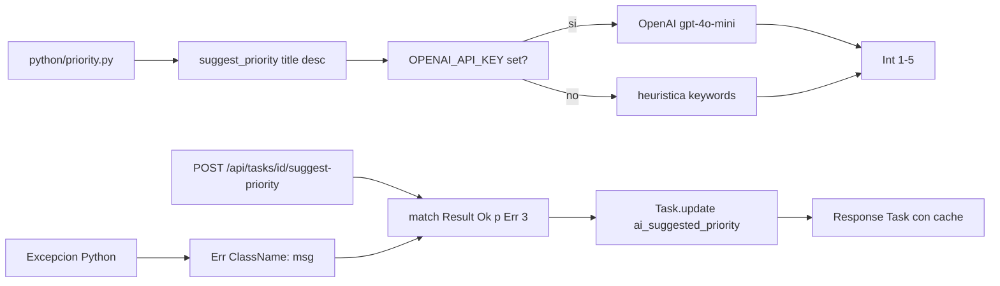

# C6 — Interop Python: priorización IA con LLM

**Pre-requisitos**: [C5 — Cron + background jobs](c5-cron-jobs-persistencia.md)
cerrado. Tenés cron + background + spawn funcionando. **Python
3.10+ instalado localmente** (para `fitz run` con interop) y un
binario `fitz` compilado con `cargo build --release --features
python` (el default standalone NO incluye libpython link).
Opcional: una **API key de OpenAI** para el LLM real (si no, el
sistema cae a una heurística local pura Python).

**Objetivo**: agregar un endpoint
**`POST /api/tasks/{id}/suggest-priority`** que invoca un módulo
Python (`priority.py`) para sugerir una prioridad 1-5 de la task.
El módulo Python **internamente** decide entre llamar al LLM real
(OpenAI) si hay API key set, o caer a una **heurística por
keywords** como fallback. El resultado se cachea en la columna
`ai_suggested_priority` (que ya existe en el `@table type Task`
desde C2). Demuestra el patrón **`from python import` + `match
Result`** para handle de errores Python en compile-time, sin que
una falla del LLM rompa el binario.

**Por qué importa**: este es **el cap más diferenciador del
ecosistema Fitz**. Stack típico Python+FastAPI ya tiene acceso
"nativo" a la lib openai (es Python). Stack típico Node+Express
usa el SDK JS oficial. Stack típico Spring/Rails depende de SDKs
maintained externamente. **Fitz hace algo único**: ejecuta
**código Python real** desde un binario nativo Rust, con
**conversión automática de excepciones Python → `Result<T>` Fitz
tipado**. Eso significa que podés **escribir la lógica de
priorización IA en Python** (donde viven las libs maduras de LLM)
y **consumirla desde Fitz** con seguridad de tipos en compile-time.

**Cross-link**: [Cap 21 de la guía — Interop Python](../guide.md#21-interop-python)
+ [Curso M7 — Interop Python](../curso/m7-python-interop/c1-setup-imports.md)
para la referencia exhaustiva del subsistema.

---

## Mapa del cap



---

## Por qué Fitz es distinto

| Feature | Python+FastAPI | Node+Express | Spring + langchain4j | Rails + ruby-openai | **Fitz** |
|---|---|---|---|---|---|
| Ecosistema de libs LLM | nativo (openai, anthropic, langchain) | SDK oficial JS | langchain4j (joven) | gems externos | **acceso al ecosistema Python nativo** vía interop |
| Llamar a una lib externa | `import openai` directo | `import { OpenAI } from "openai"` | dependency Maven + spring beans | gem + initializer | **`from python import priority`** — invoca Python real desde binario Rust |
| Manejo de excepciones de la lib | `try/except Exception` Python | `try/catch` JS | `try/catch` Java | `rescue` Ruby | **automático**: cualquier excepción Python se vuelve `Err(Str("ClassName: msg"))` Fitz tipado |
| Compile-time check del shape | runtime (Pydantic / mypy opt) | runtime (TS si lo usás) | sí pero verbose | runtime | **el checker estático conoce el tipo del retorno** (con anotación: `let p: Int = ...?`) |
| Distribución del binario | python interpreter requerido | node + node_modules | jar standalone | ruby interpreter | **`fitz build --bundle-python --bundle-pip`** (cap C7) empaqueta CPython + pip packages adentro del binario |
| Latency del call | nativo (mismo proceso) | nativo (mismo proceso) | nativo | nativo | **nativo** — comparte el GIL del proceso Fitz, sin IPC ni HTTP |
| Async support | nativo (async def) | nativo (async/await) | CompletableFuture | manual | **bridge tokio ↔ asyncio** (Fase 8.6) con patrón canónico `<py_call>?.await` |
| Fallback si la lib no anda | manual try/except | manual try/catch | manual | manual | **`match Result { Ok(v) => v, Err(_) => fallback }`** en el lenguaje, validado por el checker |

**Diferencial estructural**: el resto del stack tiene **un solo
runtime** (Python, JS, JVM, Ruby) y las libs son "nativas" a ese
runtime. Fitz es **el único que combina un binario nativo
compilado** (Rust output) **con acceso al ecosistema Python**
sin penalty de IPC. El **`Result<T>` Fitz envuelve cada llamada
Python automáticamente** — eso significa que **no podés olvidar
manejar la falla** (el checker te obliga con `match` o `?`),
algo que ningún otro stack ofrece declarativamente.

---

## Paso 1 — Pre-requisitos: Python local + binario Fitz con feature

**Local development** del cap C6 requiere:

1. **Python 3.10+** en tu PATH:

   ```bash
   python3 --version
   # → Python 3.10.x (o superior)
   ```

2. **Binario `fitz` con feature `python`** habilitada:

   ```bash
   cd <path-al-source-de-fitz>
   cargo build --release --features python
   # Esto produce un binario fitz con libpython linkeada.
   # El default `cargo build --release` SIN --features no incluye
   # interop Python (el binario default es standalone).
   ```

3. **(Opcional)** API key de OpenAI:

   ```bash
   export OPENAI_API_KEY="sk-..."
   ```

   Si no la setteás, el módulo `priority.py` cae automáticamente
   a la heurística por keywords.

**Para Docker** (deployment): la base image del container va a
cambiar de `gcr.io/distroless/cc-debian12` (sin Python) a
`python:3.12-slim-bookworm`. **El image total pasa de ~150 MB a
~250 MB**. Trade-off honesto. **El cap C7 muestra cómo bajar el
tamaño** con `fitz build --bundle-python` que embebe CPython +
pip packages adentro del binario, eliminando la dependencia
runtime del Python instalado.

---

## Paso 2 — Módulo Python: `python/priority.py`

Crear el directorio `python/` en la raíz del proyecto + el módulo
`priority.py`:

```python
# python/priority.py
"""
Sugiere una prioridad 1-5 para una task de TaskHub.

Estrategia:
1. Si OPENAI_API_KEY está set, usa GPT para sugerir (real LLM).
2. Si no, cae a una heurística por keywords (rule-based).

Fitz invoca `suggest_priority(title, description)` y recibe un Int.
Cualquier excepción Python se vuelve `Err(Str("ClassName: msg"))`
automáticamente en Fitz (Fase 8.3).
"""

import os


def suggest_priority(title: str, description: str) -> int:
    """Punto de entrada llamado desde Fitz."""
    api_key = os.environ.get("OPENAI_API_KEY")

    if api_key:
        try:
            return _llm_priority(title, description, api_key)
        except Exception:
            # Si el LLM falla (network, rate limit, parse error),
            # caemos silenciosamente a la heurística.
            pass

    return _heuristic_priority(title)


def _llm_priority(title: str, description: str, api_key: str) -> int:
    """Llama a OpenAI GPT-4o-mini para sugerir prioridad."""
    import openai  # import lazy — solo si tenemos la key

    client = openai.OpenAI(api_key=api_key)
    prompt = (
        f"Task title: {title}\n"
        f"Description: {description}\n\n"
        "Reply ONLY with a single digit 1-5 indicating priority "
        "(1=lowest, 5=highest)."
    )
    resp = client.chat.completions.create(
        model="gpt-4o-mini",
        messages=[{"role": "user", "content": prompt}],
        max_tokens=5,
        temperature=0,
    )
    text = resp.choices[0].message.content.strip()
    # Clamp 1-5 para que un LLM mal comportado no rompa el shape.
    return max(1, min(5, int(text)))


def _heuristic_priority(title: str) -> int:
    """Fallback rule-based por keywords del title."""
    lower = title.lower()

    # Critical / urgent → 5
    for kw in ("urgent", "asap", "critical", "blocker", "p0"):
        if kw in lower:
            return 5

    # Bugs y fixes → 4
    for kw in ("bug", "fix", "error", "crash", "broken"):
        if kw in lower:
            return 4

    # Refactor / cleanup / tests → 2
    for kw in ("refactor", "cleanup", "test", "docs", "comment"):
        if kw in lower:
            return 2

    # Default → 3 (medium)
    return 3
```

**Detalles**:

- **Single entry point** `suggest_priority(title, description) -> int`.
  Fitz solo conoce esta función — el resto del módulo es interno.
- **Decisión interna LLM vs heurística**: hecho en Python. **Fitz
  no se entera** de cuál estrategia se usó. Esto es clave: la
  lógica del fallback vive donde está la complejidad (Python),
  y Fitz solo consume el resultado.
- **Import lazy** de `openai` adentro de `_llm_priority` — si el
  paquete no está instalado y `OPENAI_API_KEY` no está set, NO
  intentamos importarlo. Esto evita un `ImportError` molesto en
  ambientes sin la lib.
- **`max(1, min(5, int(text)))`** clampea la respuesta del LLM a
  rango válido. Si el LLM devuelve "7" por error, queda en 5.
- **Heurística por keywords** simple pero funcional. En producción
  real refinada con tags, fecha relativa, autor, embeddings.

---

## Paso 3 — `python/requirements.txt`

```text
# python/requirements.txt
# Opcional — solo si querés que el LLM real funcione.
# Sin esto, suggest_priority cae a la heurística pura Python.
openai>=1.0,<2.0
```

Para instalar localmente:

```bash
python3 -m venv .venv
source .venv/bin/activate    # Linux/macOS
# o: .venv\Scripts\activate    # Windows PowerShell
pip install -r python/requirements.txt
```

Para el container Docker lo manejamos en el Paso 7.

---

## Paso 4 — `from python import priority` + handler Fitz

Editás `src/main.fitz`. Al principio sumás el import:

```fitz
from python import priority
```

Al final (antes del `@server`) sumás el handler:

```fitz
@authenticated
@post("/tasks/{id}/suggest-priority")
async fn suggest_task_priority(id: Int, user: User) -> Result<Task> {
    let conn: DbConn = match db_result {
        Ok(c) => c,
        Err(_) => return Err("db no disponible"),
    }

    // Cargar task + project para el scope check (mismo patrón
    // que PUT /tasks/{id} del C4).
    let task = Task.where(fn(t) => t.id == id)
        .preload("project")
        .first(conn)
        .await?

    let project: Project = match task.project {
        null => return Err("project del task no encontrado"),
        p    => p,
    }
    let is_owner = (user.role == "admin") or (project.owner_id == user.id)
    let is_assignee = match task.assignee_id {
        null => false,
        a    => a == user.id,
    }
    if (not is_owner and not is_assignee) {
        return Err("no podés sugerir prioridad para este task")
    }

    // ───────────────────────────────────────────────
    // Llamada al módulo Python.
    // priority.suggest_priority(title, desc) devuelve Result<Int>.
    // - Ok(p) si Python OK (LLM o heurística adentro de Python).
    // - Err si excepción Python no capturada o si Python no anda.
    //
    // Workaround codegen: la coerción `PyAny → Int` adentro de match
    // arms no se aplica automáticamente desde la anotación destino
    // del `let` contenedor (el intérprete sí lo hace, paridad pendiente).
    // Hacemos un `let v: Int = p` dentro del arm Ok para forzar la
    // coerción de Fase 8.4 (`__fitz_py_extract_i64`).
    // ───────────────────────────────────────────────
    let suggested: Int = match priority.suggest_priority(task.title, task.description) {
        Ok(p)  => {
            let v: Int = p
            v
        },
        Err(_) => 3,    // fallback de emergencia si Python mismo falla
    }

    // Cache en DB.
    let _ = Task.where(fn(t) => t.id == id)
        .update(conn, { "ai_suggested_priority": suggested })
        .await?

    return Task.where(fn(t) => t.id == id).first(conn).await
}
```

**Detalles**:

- **`from python import priority`** — Fitz busca `priority.py`
  en `sys.path` de Python. Localmente esto incluye el cwd y el
  `PYTHONPATH` env var; en Docker lo configuramos en el Paso 7.
- **`priority.suggest_priority(task.title, task.description)`** —
  Fitz convierte los `Str` Fitz a `str` Python automáticamente,
  invoca la función, y captura el retorno. Por la regla de
  Fase 8.3, **todo call Python se envuelve en `Result<T>`**:
  `Ok(p: Int)` si Python OK, `Err(Str("ClassName: msg"))` si
  excepción.
- **`match { Ok(p) => p, Err(_) => 3 }`** — fallback de
  emergencia. El error puede venir de:
  - Python no instalado / module path mal configurado.
  - `suggest_priority` falla en una rama no capturada por su
    propio try/except (shouldn't happen con nuestro código).
  - El LLM/heurística devuelve algo no-Int (clampeado adentro
    de Python, pero defensive coding).
- **`Task.update(conn, { "ai_suggested_priority": suggested })`** —
  partial update con Map. El ORM emite `UPDATE tasks SET
  "ai_suggested_priority" = $1 WHERE "id" = $2`.
- **Re-fetch** para devolver la Task con el cache poblado.

---

## Paso 5 — Estructura del proyecto post-C6

```text
taskhub/
├── fitz.toml
├── Dockerfile                      # ACTUALIZADO — base Python
├── docker-compose.yml
├── dev-env.sh
├── .env.example                    # ACTUALIZADO — OPENAI_API_KEY opcional
├── .gitignore                      # ACTUALIZADO — .venv/, __pycache__/
├── src/
│   └── main.fitz                   # ACTUALIZADO — from python import + handler
├── python/                         # NUEVO
│   ├── priority.py                 # módulo con suggest_priority
│   └── requirements.txt            # openai opcional
├── frontend/
├── nginx/
├── prometheus/
├── otel/
├── migrations/
│   └── 20260607130000_initial_schema.sql   # sin cambios
├── .github/
└── README.md
```

Schema **sin migration nueva** — el field `ai_suggested_priority:
Int?` ya existe desde C2 (lo declaramos previendo este cap).

---

## Paso 6 — `.env.example` actualizado

```bash
# Postgres password (mínimo 16 chars).
DB_PASSWORD=cambiamelocal

# JWT secret (mínimo 32 chars random).
JWT_SECRET=cambiamelocal_minimo_32_chars_random_string_aqui

# OpenAI API key — OPCIONAL.
# Si la dejás vacía, suggest_priority cae a heurística pura Python
# (sin costo, sin red, instantáneo).
# Si la setteás, gpt-4o-mini decide la prioridad (costo ~$0.0001
# por call, latency ~500ms-1s).
OPENAI_API_KEY=
```

---

## Paso 7 — `Dockerfile` actualizado

```dockerfile
# Stage 1 — build con el toolchain de Fitz (compilado con
# --features python).
# Asumimos que `ghcr.io/thegreekman76/fitz:latest-python` existe (variante
# con feature `python` habilitada). Si no, compilás localmente con
# `cargo build --release --features python` y copiás el binario.
FROM ghcr.io/thegreekman76/fitz:latest-python AS builder

WORKDIR /build
COPY fitz.toml .
COPY src/ ./src/
COPY migrations/ ./migrations/

RUN fitz build

# Stage 2 — runtime con Python.
# Cambio importante vs C1-C5: base con libpython linkeable
# (la binaria de C6 fue buildeada con --features python).
# Image final ~250 MB vs ~150 MB de C1-C5. Trade-off.
FROM python:3.12-slim-bookworm AS runtime

WORKDIR /app

# Instalar pip deps (openai opcional).
COPY python/requirements.txt /app/python/requirements.txt
RUN pip install --no-cache-dir -r /app/python/requirements.txt

# Copiar el módulo Python.
COPY python/priority.py /app/python/priority.py

# Copiar el binario Fitz.
COPY --from=builder /build/target/release/taskhub /app/taskhub

# Fitz busca módulos Python en sys.path. Agregamos /app/python.
ENV PYTHONPATH=/app/python

EXPOSE 8080
# Nota: NO usamos USER nonroot acá porque python:slim no trae
# ese user. Para producción real, crear un user dedicado.

ENTRYPOINT ["/app/taskhub"]
```

**Cambios respecto al Dockerfile de C1**:

- **Base image stage 1**: `ghcr.io/thegreekman76/fitz:latest-python` (con
  feature `python`). **Si esta imagen no existe**, alternativas:
  - Compilar `fitz` localmente con `cargo build --release --features
    python` y copiar el binario:
    ```dockerfile
    COPY ./fitz-with-python /app/fitz
    ```
  - Build multi-stage el toolchain en el Dockerfile (lento — agrega
    ~5min de cargo build a la primera vuelta).
- **Base image stage 2**: `python:3.12-slim-bookworm` en lugar
  de `distroless/cc-debian12`. La distroless no tiene libpython y
  rompe el binario al boot.
- **`pip install -r requirements.txt`** — opcional, solo necesario
  si querés el LLM real. La heurística pura funciona sin pip
  install (módulo `os` es stdlib).
- **`COPY python/priority.py`** + **`PYTHONPATH=/app/python`** —
  para que `from python import priority` resuelva.
- **Image size**: ~250 MB vs ~150 MB de C1-C5. El cap C7 cubre
  cómo bajarlo con `fitz build --bundle-python`.

---

## Paso 8 — `docker-compose.yml` actualizado

Solo cambio: pasar `OPENAI_API_KEY` del `.env` al container app:

```yaml
services:
  app:
    build: .
    container_name: taskhub-app
    expose:
      - "8080"
    environment:
      DATABASE_URL: postgres://taskhub:${DB_PASSWORD:?DB_PASSWORD requerido}@db:5432/taskhub?sslmode=disable
      JWT_SECRET: ${JWT_SECRET:?JWT_SECRET requerido}
      OTEL_EXPORTER_OTLP_ENDPOINT: http://otel-collector:4317
      OTEL_SERVICE_NAME: taskhub
      RUST_LOG: info
      # NUEVO en C6 — vacío = heurística pura Python.
      OPENAI_API_KEY: ${OPENAI_API_KEY:-}
    # resto igual...
```

**Default `${OPENAI_API_KEY:-}`** — string vacío si no está set.
El módulo Python detecta esto y cae a la heurística.

---

## Paso 9 — Validación local (sin Docker)

```bash
# 1. Setup venv local + instalar openai opcional.
python3 -m venv .venv
source .venv/bin/activate
pip install -r python/requirements.txt

# 2. Apuntar PYTHONPATH al dir donde vive priority.py.
export PYTHONPATH=$(pwd)/python

# 3. (Opcional) setear OPENAI_API_KEY.
# Para test sin LLM real, dejala vacía.

# 4. Correr el binario con feature python.
# Asumiendo que fitz local fue buildeado con --features python:
fitz run src/main.fitz

# El programa arranca en :8080. Probás el endpoint:
curl -X POST "http://localhost:8080/tasks/1/suggest-priority" \
  -H "Authorization: Bearer $TOKEN"
# → {"id":1,"title":"...","ai_suggested_priority":3,...}
```

**Verificá** los logs del proceso:

- **Sin `OPENAI_API_KEY`**: ningún output extra — el módulo Python
  cayó a la heurística silenciosamente. La response trae un Int
  1-5 según los keywords del title.
- **Con `OPENAI_API_KEY`**: latency ~500ms-1s del call al LLM.
  Si gpt-4o-mini falla (rate limit / network), también cae
  silenciosamente a la heurística (excepción capturada en
  `priority.py`).

---

## Paso 10 — Validación en Docker

```bash
docker compose up -d --build
```

**Primer build** tarda ~3-5min (baja `python:3.12-slim`, instala
pip deps, compila fitz). Builds posteriores son cache-friendly
(~30s).

Tests end-to-end:

```bash
# Login admin.
ADMIN_TOKEN=$(curl -sX POST http://localhost:8000/api/auth/login \
  -H 'Content-Type: application/json' \
  -d '{"email":"admin@taskhub.local","password":"adminpass123"}' \
  | jq -r .token)

# Crear project + task con título que dispare la heurística.
PID=$(curl -sX POST http://localhost:8000/api/projects \
  -H "Authorization: Bearer $ADMIN_TOKEN" \
  -H 'Content-Type: application/json' \
  -d '{"name":"Sprint actual"}' | jq -r .id)

TID=$(curl -sX POST "http://localhost:8000/api/projects/$PID/tasks" \
  -H "Authorization: Bearer $ADMIN_TOKEN" \
  -H 'Content-Type: application/json' \
  -d '{"title":"URGENT: server down","description":"prod en llamas"}' \
  | jq -r .id)

# Pedir sugerencia de prioridad.
curl -X POST "http://localhost:8000/api/tasks/$TID/suggest-priority" \
  -H "Authorization: Bearer $ADMIN_TOKEN"
# → {"id":3,"title":"URGENT: server down","ai_suggested_priority":5,...}
# La heurística detectó "urgent" y devolvió 5.

# Probar otro task con palabras de bajo priority.
TID2=$(curl -sX POST "http://localhost:8000/api/projects/$PID/tasks" \
  -H "Authorization: Bearer $ADMIN_TOKEN" \
  -H 'Content-Type: application/json' \
  -d '{"title":"Refactor user model","description":"cleanup técnico"}' \
  | jq -r .id)

curl -X POST "http://localhost:8000/api/tasks/$TID2/suggest-priority" \
  -H "Authorization: Bearer $ADMIN_TOKEN"
# → {"id":4,"title":"Refactor user model","ai_suggested_priority":2,...}
# Heurística: "refactor" → 2.
```

---

## Validación del cap

- [ ] `python/priority.py` existe con `suggest_priority(title,
      description) -> int`.
- [ ] `python/requirements.txt` declara `openai>=1.0` opcional.
- [ ] `src/main.fitz` empieza con `from python import priority`.
- [ ] Handler `POST /api/tasks/{id}/suggest-priority` con scope
      check (admin / owner / assignee).
- [ ] Match sobre `priority.suggest_priority(...)` con `Ok(p)` y
      `Err(_)` fallback a 3.
- [ ] Task updated con `ai_suggested_priority` poblado en DB.
- [ ] Dockerfile usa `python:3.12-slim-bookworm` en runtime stage
      con `PYTHONPATH=/app/python`.
- [ ] `docker-compose.yml` pasa `OPENAI_API_KEY` con default
      vacío.
- [ ] Sin `OPENAI_API_KEY`: heurística por keywords funciona, no
      hay errores en logs.
- [ ] Con `OPENAI_API_KEY` válida: LLM real responde con priority
      1-5.

---

## Troubleshooting

### `fitz check` aborta con `from python import` solo funciona con feature python

Tu binario `fitz` fue buildeado sin `--features python` (el
default). Recompila:

```bash
cd <path-fitz>
cargo build --release --features python
```

O usá `fitz run --features python` si el subcomando lo soporta.

### `docker compose up` falla con `image not found ghcr.io/thegreekman76/fitz:latest-python`

La imagen pre-built con feature python puede no existir todavía.
Workaround: build local de fitz con `--features python` + copy
del binario al Dockerfile (skipea el stage builder).

### `Err("ModuleNotFoundError: priority")` en el call

Python no encuentra `priority.py`. Verificá:

- `PYTHONPATH` env var apunta al dir correcto (`/app/python` en
  Docker, `$(pwd)/python` local).
- El archivo `priority.py` realmente está en ese dir.
- `from python import priority` (no `from python import python.priority`
  ni `from python.priority import ...`).

### `Err("ImportError: openai")` en logs cuando hay API key

`openai` package no está instalado. Tres opciones:

1. **No instalar openai** — `priority.py` cae a heurística (ok si
   no necesitás LLM real).
2. **Instalar local**: `pip install -r python/requirements.txt`.
3. **Instalar en Docker**: el Dockerfile ya lo hace via
   `RUN pip install --no-cache-dir -r /app/python/requirements.txt`.
   Verificá que el `requirements.txt` esté en el COPY.

### El LLM devuelve valores fuera de rango 1-5

`priority.py` clampea con `max(1, min(5, int(text)))`. Si igual
ves valores raros, gpt-4o-mini está respondiendo en formato
inesperado (text que no parsea a int). Refiná el prompt o subí
el modelo a `gpt-4o`.

### Image size de Docker creció de ~150 MB a ~250 MB

**Esperado**. La base image `python:3.12-slim-bookworm` trae
Python runtime + libpython. **El cap C7** muestra cómo bajarlo
con `fitz build --bundle-python` que embebe CPython adentro del
binario, permitiendo volver a usar `distroless` u otra imagen
mínima sin Python instalado.

### Latency alta del endpoint suggest-priority

Si tenés `OPENAI_API_KEY` set, cada call al LLM tarda ~500ms-1s.
**Patrón canónico**: usar `spawn(...)` (Fase C5) para hacer el
LLM call en background — el endpoint devuelve `{cached: false}`
inmediato, y la sugerencia se popula en `ai_suggested_priority`
async. Refinamiento dejado como ejercicio.

---

## Lo que cubriste

- **`from python import <module>`** — importa un módulo Python
  arbitrario que vive en `sys.path` (PYTHONPATH).
- **Auto-coerción primitiva** Fitz ↔ Python: `Str` → `str`, `int`
  → `Int`, etc. Sin marshaling manual.
- **`priority.suggest_priority(...)` devuelve `Result<T>`
  automático**: éxito → `Ok(value)`, excepción → `Err(Str(
  "ClassName: msg"))`. **El checker te obliga a manejar la falla**.
- **Patrón canónico de fallback** `match { Ok(v) => v, Err(_) =>
  emergency_default }` para que el endpoint nunca rompa por una
  falla del LLM.
- **Decisión LLM vs heurística adentro de Python** — la
  complejidad del fallback vive donde están las libs (Python),
  Fitz solo consume el resultado.
- **Dockerfile actualizado** a `python:3.12-slim-bookworm` con
  `PYTHONPATH=/app/python` + `pip install -r requirements.txt`.
  Trade-off de image size ~150 MB → ~250 MB documentado, con
  referencia al C7 para optimizar con `--bundle-python`.
- **Cache en `task.ai_suggested_priority`** — el field ya estaba
  en el schema desde C2.

**TaskHub ahora integra IA real**. El stack pedagógico está
completo: HTTP + auth + ORM + WS + cron + background + interop
Python. **Solo falta el deploy production** (C7).

---

## Próximo cap

**[C7 — Observability completa + frontend + deploy production](c7-observability-frontend-deploy.md)**.

El cap final. Vamos a:

1. **Activar observability completa**: `@server(prometheus=true)`
   para exponer `/metrics`, spans OTel a Jaeger automáticos (ya
   los tenés desde C1 — los confirmamos con dashboards), métricas
   custom con `@trace`/`@metric` builtins.
2. **Frontend real**: reemplazar el `index.html` placeholder con
   un kanban vanilla JS funcional (login → board con drag&drop
   → WS live updates).
3. **`/healthz` + `/readyz` + SIGTERM drain** — patrón canónico
   de K8s deployment.
4. **`fitz build --bundle-python --bundle-pip openai`** — empacar
   CPython + openai adentro del binario, volver a base `distroless`,
   image final ~50 MB.
5. **Publicar TaskHub como boilerplate descargable** en
   `boilerplates/taskhub/` para que cualquiera lo pruebe con
   `git clone + docker compose up -d --build`.

Mientras tanto, **commiteá este cap**. Tu repo tiene **el stack
único de Fitz completo**: HTTP + auth + RBAC + ORM + relations +
WS + cron + background + interop Python — todo en **un binario**
de TaskHub. **Sin Celery, sin Redis, sin SDK SaaS para auth, sin
ORM externo, sin lib WS**.
