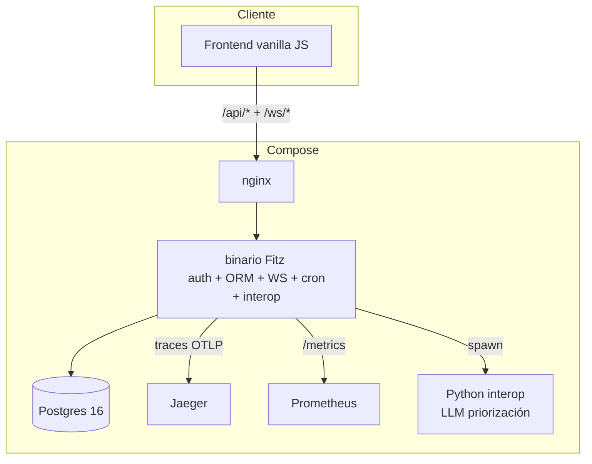

# Construyendo TaskHub

> Proyecto integrador post-curso. Una app real, production-ready,
> Dockerizada desde el día 1, que demuestra **todo el stack único
> de Fitz** trabajando junto en un solo binario.

**TaskHub** es un Trello colaborativo en vivo: usuarios con roles
(admin / owner / member) gestionan **projects** con **tasks** y
**comments**, las actualizaciones se broadcastean por WebSocket a
todos los conectados al mismo board, un cron job nocturno limpia
tasks completadas hace más de N días, un endpoint de IA sugiere
prioridad usando un LLM via interop Python, y todo corre con
Prometheus + Jaeger en producción. **El binario Fitz pesa ~30 MB**.

---

## ¿Por qué este proyecto existe?

El [curso `Fitz de 0 a experto`](../curso/index.md) cubre cada
feature aisladamente a lo largo de 42 capítulos. El
[capstone del módulo M6](../curso/m6-postgres-orm/c7-capstone-crud-completo.md)
("Notas con tiempo real") ya integra **una parte importante** del
stack: auth + ORM + WS + cron + Docker compose.

Pero hay piezas que el curso entero no integra todas juntas:

| Feature | Cubierto en el curso aislado | Integrado en M6.C7 capstone | Integrado en TaskHub |
|---|---|---|---|
| Auth con JWT + Argon2id | M5.C2 | ✅ | ✅ |
| ORM nativo Postgres | M6.C1-C5 | ✅ | ✅ |
| **Workflow `fitz db diff/migrate/rollback`** | M6.C6 | ❌ (usa `CREATE TABLE IF NOT EXISTS`) | ✅ end-to-end con cambios reales de schema |
| **RBAC custom con `@requires("role")`** | M5.C2 (mención) | ❌ (solo `@authenticated`) | ✅ 3 roles: admin / owner / member |
| WebSocket tipado | M5.C3 | ✅ | ✅ |
| Cron + `@background` + persistencia | M5.C4 | ⚠ (cron memoria) | ✅ con `store=db` |
| **Interop Python en producción** | M7 | ❌ | ✅ priorización IA con LLM |
| **Observability completa (OTel + Prometheus + Jaeger)** | M8.C2 | ❌ (logs básicos) | ✅ desde día 1 en compose |
| `fitz docker init/build` | M8.C4 | ⚠ (Dockerfile a mano) | ✅ generado por el subcomando |
| `healthz` + `readyz` + SIGTERM drain | M8.C4 | ❌ | ✅ |
| **Frontend integrado (vanilla JS)** | — | ❌ | ✅ con nginx como proxy a `/api/*` + `/ws/*` |
| **Docker compose con 5 services real** | — | ⚠ (2: app + db) | ✅ (5: app + db + prometheus + jaeger + nginx) |

TaskHub no es **otro tutorial** — es **una app real que podrías
deployar** en producción mañana. Sirve para tres audiencias:

- **Quien terminó el curso**: ver cómo el stack se integra en una
  app más ambiciosa que el capstone de M6.
- **Quien ya conoce Fitz**: salta directo a "muestrame un proyecto
  serio end-to-end" sin pasar por 42 caps pedagógicos.
- **Quien evalúa Fitz para producción**: ver el peso real de un
  deploy completo (~30 MB binario + 5 services en compose).

---

## ¿Qué hace TaskHub?

App de **gestión colaborativa de tareas**, estilo Trello/Asana
chico. Dominio mínimo pero suficiente para demostrar el stack:

**Modelo de datos** (ORM nativo):

- **User**: id, email, password_hash, role (admin/owner/member),
  created_at.
- **Project**: id, name, description, owner_id (FK → User).
- **Task**: id, project_id (FK), title, description, status
  (todo/doing/done), priority (1-5), assignee_id (FK → User?),
  due_date, ai_suggested_priority (cache), created_at.
- **Comment**: id, task_id (FK), user_id (FK), body, created_at.

**Funcionalidades end-to-end**:

- Register + login con JWT + Argon2id (M5.C2 del curso).
- CRUD de projects + tasks + comments con relations (M6.C2-C4).
- **RBAC con 3 roles**: admin ve todo, owner gestiona sus
  projects, member solo ve projects donde está asignado a alguna
  task.
- **WebSocket en vivo** por project: cuando alguien cambia status
  de una task, todos los conectados al mismo `/ws/projects/{id}`
  reciben el evento (M5.C3 + extensión).
- **Cron job nocturno**: limpia tasks `done` con más de 90 días
  + envía emails recordatorios de tasks `todo` con `due_date`
  próxima (M5.C4 + persistencia).
- **Endpoint IA**: `POST /api/tasks/{id}/suggest-priority` invoca
  un LLM via interop Python (OpenAI/Anthropic compatible o
  heurística local), devuelve `Result<Int>` (1-5), cachea el
  resultado en la columna `ai_suggested_priority` (M7.C1-C3).
- **Frontend vanilla JS**: index login → lista de projects →
  vista de un project con board kanban (drag & drop de tasks
  entre columnas) → tasks con comments. Sin frameworks (mismo
  patrón que `boilerplates/api-orm-full-fullstack`).
- **Producción**: `/healthz` + `/readyz` + SIGTERM drain de 30s +
  spans OTel hacia Jaeger + métricas hacia Prometheus + tabla de
  monitoring custom (M8.C2-C4).

**Lo que NO hace TaskHub** (para mantener el scope manejable):

- Multi-tenant con organizations. (Cada user ve sus propios
  projects vía el RBAC.)
- File uploads / attachments.
- OAuth con providers externos (Google/GitHub).
- Notificaciones push o email transaccional real (mockeamos el
  envío de email en el cron, sin Mailgun/SES).
- Mobile app o PWA.

Si querés alguna de esas features, son **extensiones naturales**
post-TaskHub.

---

## Roadmap de capítulos

| Cap | Título | Cubre |
|---|---|---|
| **[C1](c1-setup-docker-first.md)** | Setup Docker-first: los 5 services del compose | `docker compose up -d` levanta app vacía + Postgres + Prometheus + Jaeger + nginx. Tour de qué hace cada uno. Validación con healthchecks. |
| **C2** | Schema + workflow `fitz db` end-to-end | Declarás `@table type` para User/Project/Task/Comment + workflow real: `fitz db new initial` → `diff > file.sql` → `migrate`. Cambio de schema posterior + `rollback`. `fitz db check` en CI. |
| **C3** | Auth con RBAC custom: 3 roles apilables | Register + login con JWT + Argon2id. `@auth_provider` + `@authenticated` + `@requires("admin"\|"owner"\|"member")`. Endpoints protegidos. Tests de cada rol. |
| **C4** | CRUD + relations + WebSocket en vivo | Handlers `@get/@post/@put/@delete` para projects + tasks + comments. Relations + eager loading. `@ws("/ws/projects/{id}")` para broadcast de cambios. |
| **C5** | Cron + background jobs con persistencia | `@cron("0 0 3 * * *")` para cleanup nocturno + envío de reminders. `@background` para tareas largas. `store=db` para persistencia entre reinicios. |
| **C6** | Interop Python: IA para priorización | `from python import` LLM client (OpenAI o local). Bridge async con `<py_call>?.await`. Cache del resultado en columna. Fallback heurístico si Python falla. |
| **C7** | Observability + frontend + deploy production | OTel spans → Jaeger. Métricas → Prometheus. Frontend vanilla JS conectado via nginx (`/api/*`, `/ws/*`). `/healthz` + `/readyz` + SIGTERM drain. `fitz docker build` final. |
| **Post-C7** | **TaskHub publicado como boilerplate descargable** | Extracción del estado final del C7 a [`boilerplates/taskhub/`](https://github.com/Thegreekman76/fitz/tree/main/boilerplates) (al lado de los 9 boilerplates existentes). Clonás + `docker compose up -d --build` + listo. Sin pasar por los 7 caps. |

**Cada cap tiene su entregable commiteable** en
[`examples/taskhub/cX-tema/`](https://github.com/Thegreekman76/fitz/tree/main/examples/taskhub).
La app crece capítulo a capítulo — al terminar tenés un proyecto
que podés extender. **Después del C7**, el estado final se publica
como **boilerplate descargable** en
[`boilerplates/taskhub/`](https://github.com/Thegreekman76/fitz/tree/main/boilerplates)
con un README dedicado — para que cualquiera que quiera **probar
TaskHub sin leer los 7 caps** lo pueda clonar y arrancar en
~30 segundos.

---

## Pre-requisitos

**Conocimiento**:

- **[Curso de 0 a experto](../curso/index.md) cerrado** (M1-M8) o
  experiencia equivalente con Fitz. TaskHub asume que ya:
  - Sabés escribir handlers HTTP con `@get/@post/...` (M4).
  - Conocés `async fn` + `.await` + `@auth_provider` + `@ws` +
    `@cron` (M5).
  - Manejás el ORM con `@table` + relations + `.where(closure)`
    (M6).
  - Probaste interop Python con `from python import` (M7).
  - Sabés qué hace `fitz docker init`/`build`, observability
    básica + `Secret<T>` (M8).

Si te faltan piezas, hacé los caps puntuales del curso primero —
TaskHub no los re-explica desde cero.

**Software local**:

- **Fitz** instalado (`fitz --version` debería responder).
- **Docker Desktop** (Windows/Mac) o **Docker Engine** + **Docker
  Compose v2** (Linux).
- **`psql`** opcional (para inspeccionar la DB a mano).
- **`curl`** o `httpie` para probar endpoints.
- **`wscat`** para probar WebSockets (`npm i -g wscat`).
- Editor con extensión Fitz instalada (VSCode).

**Cuentas externas** (opcionales — solo para C6 con LLM real):

- API key de OpenAI **o** Anthropic. Si no, el cap C6 cae a
  fallback heurístico (priority basada en keywords del título).

---

## Cómo seguir TaskHub

- **Lineal** (recomendado primera vez): C1 → C2 → ... → C7. Cada
  cap arranca del estado del cap anterior + suma una capa.
- **Saltado**: cada cap tiene un README en
  `examples/taskhub/cN/` con `git checkout` del estado inicial.
  Saltás al cap que te interesa.
- **Para evaluar Fitz para producción**: leé este index + el cap
  **C7** (deploy production) directo. Te da el peso real del
  binario, la imagen Docker, métricas, tracing.

---

## Comparativa final (TaskHub vs stack típico)

| Stack | Deploy | Boot | Memory idle | Image | Deps en el binario |
|---|---|---|---|---|---|
| **Fitz (TaskHub)** | 1 binario standalone | 50-100ms | 20-40 MB | ~150 MB compose total | auth + ORM + WS + cron + axum + serde + jwt + argon2 + tokio multi-thread |
| Python+FastAPI+SQLAlchemy+Celery+Redis | `pip install ×20+` + workers + redis + db | 3-5s | 120-180 MB | ~600 MB compose | requirements.txt |
| Node+Express+TypeORM+bull+Redis | `npm install ×100+` + workers + redis + db | 1-3s | 80-120 MB | ~500 MB compose | package.json |
| Spring Boot + Hibernate + Quartz | jar + db | 10-30s | 250-400 MB | ~400 MB compose | pom.xml |

**Diferenciador estructural**: TaskHub **no tiene Celery porque
los cron jobs viven en el binario**, **no tiene Redis porque no
hace falta broker**, **no tiene workers separados porque tokio
multi-thread los reemplaza**, y **no tiene serializadores
externos porque el ORM + auth + WS están integrados al lenguaje**.

---

## Próximo paso

**[Cap 1 — Setup Docker-first: los 5 services del compose →](c1-setup-docker-first.md)**

Empezamos arrancando los 5 services del compose con un binario
Fitz vacío que responde `200 OK` en `/healthz`. Validamos cada
service health-checkeado antes de tocar una línea de lógica de
negocio.
